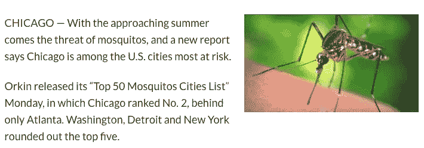
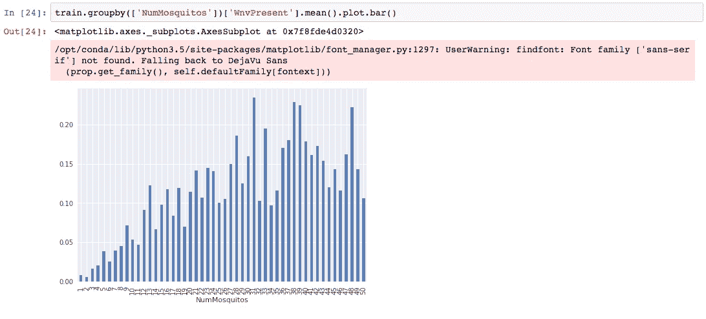
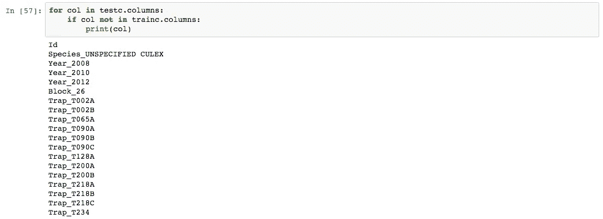
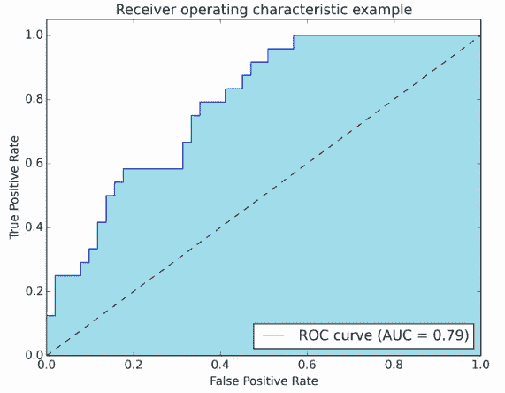
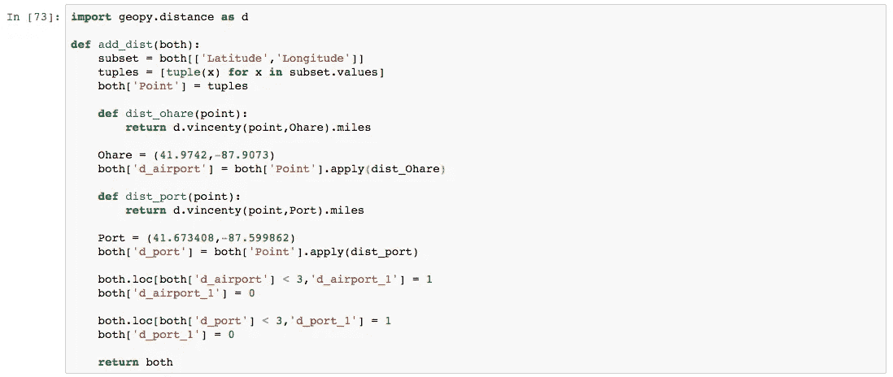
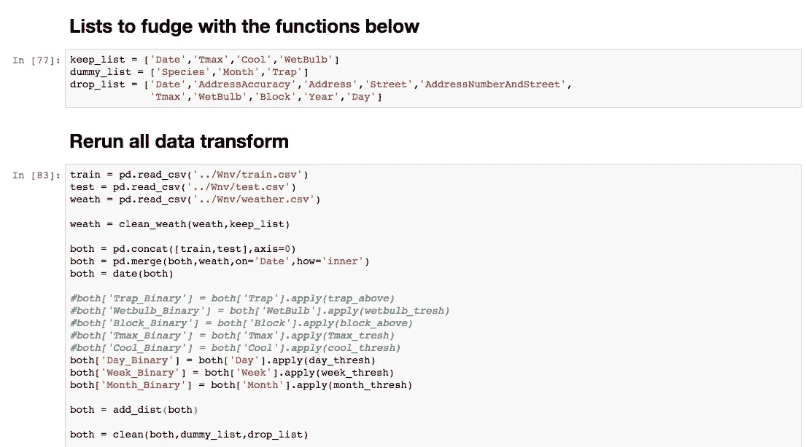

# 芝加哥西尼罗河病毒

> 原文：<https://towardsdatascience.com/a-go-at-kaggle-723447f8d95f?source=collection_archive---------3----------------------->

我刚刚学到了一些令人沮丧的教训——作为对卡格尔西尼罗河病毒竞赛的敬意。[https://www.kaggle.com/c/predict-west-nile-virus](https://www.kaggle.com/c/predict-west-nile-virus)。这不是我们有过的最大或最棘手的项目，但它让我很困惑。我的方法过于草率，陷入了竞争的心态，这让我陷入了许多兔子洞，所有这些都是可以避免的。这些都是糟糕的流程和代码混乱的症状。我很高兴我得到了教训，因为我不会让它再次发生！至少这是希望..有了这些经验教训。

*   **不要混淆你的笔记本进度**。*没有什么比从头开始运行单元并失败更糟糕的了，因为一部分 EDA 是在未来的数据帧上执行的*
*   **制作函数并使其动态化**。*这不仅允许添加功能，也允许省略功能；允许您操作数据以快速迭代，通常是朝着更好的先前数据集进行多次迭代。*
*   **保存表现良好的提交数据/模型。** *这个数据集仍然是小规模的，可以在几秒钟内重新运行，但没有理由忘记哪些功能让你获得了 0.73 的 Kaggle 分数！*
*   **确认训练/测试集具有相同的列。** *您对测试数据的预测最终取决于它提供的列/值——当然您也可以对其进行特征工程——但是确保您可以将测试集传递到您的训练数据转换函数中是关键。*

有了这个数据集，对数据有个概念是相当容易的。我们正在查看芝加哥的一些捕蚊器，以及一些关于它们的位置、捕捉的蚊子类型、日期和一些其他琐碎特征的数据。训练集约为 12k 行；测试约 112k。Kaggle 对提交的内容进行评分的标准是 AUC。更多内容请见下文。

因为我们在看一个分类问题，EDA 之后的第一步实际上是获得基线分数:就准确性而言，最简单的预测会给你多少分。在这种情况下，目标变量是 WnvPresent，由于西尼罗病毒的罕见性质，如果我们猜测一只蚊子没有西尼罗病毒，我们 94.8%的时间都是正确的！这是一个简单但** *关键*** 的概念。

我的下一步是向 Kaggle 发送一个示例提交，这样我就可以确认格式。你知道，登上排行榜。有了这个剪刀，我就在那里。

从这里开始，最初的 jupyter 笔记本是这样的。调查分类数据预测西尼罗河的可能性。看看这些数字，找出它们之间的关系。假设。重复一遍。它很乱，我忽略了让它容易重复。第二天我非常后悔。

很明显，很多陷阱都是惯犯。此外，NumMosquitos 特性似乎会使预测变得容易。记住，任何高于 0.0525 的预测西尼罗河的机会都是值得研究的。这是我们的基线谈话。所以这些落在 0.09 以上的陷阱看起来是很好的预测。

捕获的蚊子越多，蚊子数量就越多。

因此，我创建了一个快速而肮脏的虚拟变量函数，将陷阱和块数据放入一些数字中，删除了其他大部分列，然后将我的测试集放入模型中，然后嘎然而止。在我对它进行变换后，会有更多的列。为什么？该死。没想到会这样。你看，我们的课程往往有非常干净的数据。嗯，并不是说这很混乱，但它与我的假设 test.columns = train.columns 不同。测试集中也有新的数据。看不见的陷阱。和一个新物种。这就是大多数额外栏目的来源。

所以，我不完全确定在这种情况下什么是正确的决定。大多数其他学生都在用相反的方法运行，即找出几个最有可能感染西尼罗河病毒的关键特征，然后用它们运行他们的模型。我喜欢快速迭代替代方案，这意味着我需要弄清楚如何手动修复大约 200 个特性列*而不是*。我能想到的最好的办法是从一开始就连接测试和训练，并重复虚拟预处理。我想，这将确保它们具有相同数量的列，并且我可以将它们从 Id 列中分离出来，Id 列是测试集的数字，NaN 是火车的数字。

这意味着测试集中的新列与可预测性无关。尽管他们不会，除非我们能以某种方式概括他们。比如把陷阱按 10 个一组分组之类的。我也不确定是否使用了年份数据——因为我添加了虚拟值，但是从测试到训练的年份不同。我决定下次再考虑这个问题。

经过一两个小时的忙碌，我提交了下一套，很高兴地发现在 Kaggle 上获得了 70 AUC。AUC 指标在这里也很重要，但要理解它，我们首先需要理解什么是混淆矩阵。

在像西尼罗河病毒这样的二元分类中，有 4 种可能的结果:

*   **TP** —真阳性:WNV 出现，WNV 被预测。
*   **FP** —误报:*(第一类错误)* WNV 不存在而 WNV 却被预测到了。
*   **TN**——真正的否定:WNV 不在，WNV 没有被预测到。
*   **FN** —假阴性:*(第二类错误)* WNV 是存在的，但 WNV 却没有被预测到。

这些是我们判断分类器的依据。混淆矩阵有许多最常用的评估指标:

*   准确度= (TP + TN) / (TP + FP + TN + FN)
*   精度= TP / (TP + FP)
*   召回率(TPR)= TP/(TP+FN)-正确预测的阳性数据点占全部阳性数据点的比例。
*   脱落(FPR)= FP/(FP+TN)-被错误预测的负数据点占负数据点总数的比例。

AUROC 或通常称为 AUC，是真阳性率和假阳性率之比的曲线下面积。理想的分类器是 AUC 为 1 的分类器；其中 TPR = 1，而 FPR = 0。AUC 讲述了在我们可以选择的阈值范围内，我们的分类器的 TPR 如何与其 FPR 相关的整体情况。在下面的例子中，TPR 在大约 0.6 FPR 时达到最大值。意思是要正确分类所有的正面事例，我们会错误地把 6/10 的负面事例分类为正面。

The AUROC commonly referred to as the AUC is the ratio of the TPR over the FPR

很好地解释了这一切是如何运作的:[https://www.youtube.com/watch?v=OAl6eAyP-yo&t = 6s](https://www.youtube.com/watch?v=OAl6eAyP-yo&t=6s)

我能够添加的一些最好的功能是基于位置和天气的。两者都是在数据中发现更高概率的 WNV 聚类的例子。在地理位置方面，我在奥黑尔机场附近找到了 WVN 的一个热点。通过将距离< 3 英里归类为 1，我能够创建一个二进制列，使样本中存在 WNV 的几率为 0 . 1。

另一种是使用湿球值作为高于某一阈值的二元指标。

最后，我太沉迷于添加和删除功能以及重新训练我的模型，以至于失去了我最初的最好成绩。在我对自己感到相当沮丧之后，我重新构建了许多代码，并且有条不紊地修改了我的解决方案。结果是能够获得更高的分数，并且能够在不失去我的位置的情况下快速迭代。

这个故事的寓意是，获得最快最好的结果不应该以不可复制的数据为代价。你的流程越有条理，你在函数中构建的自由度越大，你就越有能力改变你的数据和模型。