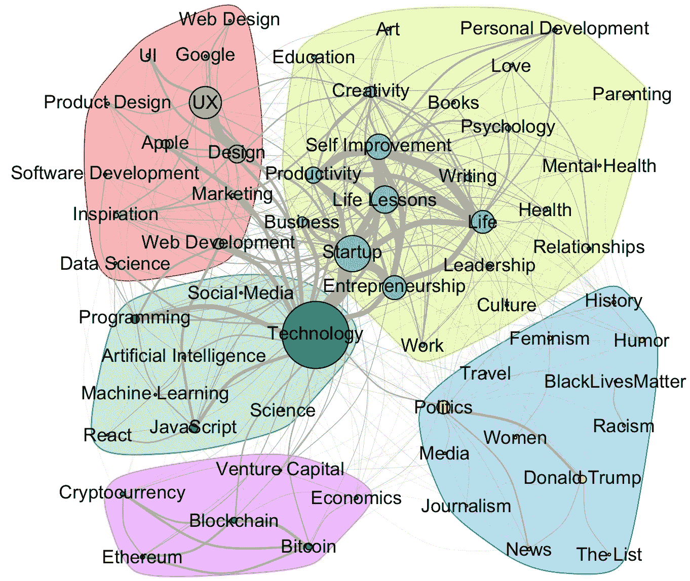

# 媒体标签图

> 原文：<https://towardsdatascience.com/a-graph-of-mediums-tags-8e3cf6cad1d9?source=collection_archive---------5----------------------->

热门帖子涵盖的 5 大主题

正如在[之前的一篇文章](https://medium.com/towards-data-science/men-vs-women-comparing-mediums-most-popular-stories-by-gender-23e0767252d)中所描述的，我收集了 1000 个媒体最受欢迎的故事的数据。这是他们最常见的标签的可视化。我冒昧地将同义标签映射到它们的规范名称。比如“Tech”→“Tech”，还有“Trump”→“Donald Trump”。



节点的大小与标签的使用次数成正比。技术是媒体的宠儿。

连接两个标签的灰线表示它们都在同一个帖子中使用。一对标签之间的线条越粗，它们并排出现的频率就越高。

彩色聚类是一组标签，这些标签内部有密集的连接，而它们之间的连接则比较稀疏。这五个集群总结了流行媒体帖子的主要主题。

*   **设计:**设计，UX，网页开发，软件开发，苹果，营销，谷歌，数据科学，灵感，产品设计，网页设计
*   **个人发展:**生产力、人生经验、自我提升、创业、商业、教育、书籍、心理学、个人发展、创造力、健康、爱情、生活、创业、人际关系、养育、心理健康、领导力、工作、写作、艺术、文化
*   **编程:** JavaScript，编程，科学，人工智能，社交媒体，技术，机器学习，React
*   **政治:**女权主义，政治，榜单，女性，新闻，幽默，唐纳德·特朗普，旅游，种族主义，黑人问题，历史，新闻，媒体
*   **加密货币:**区块链、比特币、以太坊、加密货币、风险投资、经济学

用 R 绘制图形出奇的容易。我创建了一个[文档术语矩阵](https://en.wikipedia.org/wiki/Document-term_matrix)，其中行是文章，列是标签，值为 0 或 1，表示文章是否有标签。它的叉积给出了一个邻接矩阵，这是一个所有帖子中标签共现计数的对称矩阵。r 的 igraph 软件包绘制了这样的邻接矩阵。通过调用 tkplot，可以在 GUI 中交互式地调整节点的布局。

```
g = graph.adjacency(adjMatrix, mode="upper", weighted=T, diag=F)plot(cluster_leading_eigen(g), g, edge.width=E(g)$weight*.1, 
layout=l, vertex.size=25*counts[-removed]/max(counts[-removed]), vertex.label.family="Arial", edge.color=NULL, vertex.label.color="black", edge.curved=.5)
```