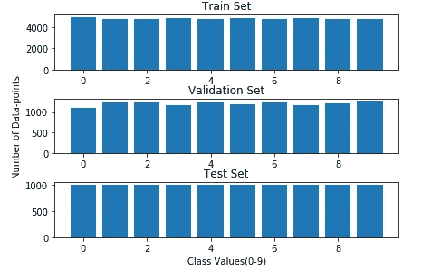
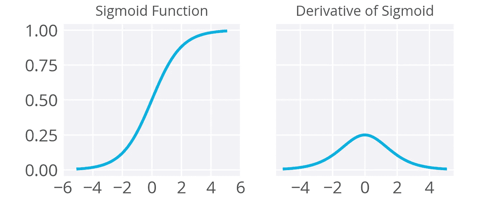

# 建立神经网络结构的有效方法指南——第一部分:用 Hyperas 对密集网络进行超参数选择和调整——MNIST

> 原文：<https://towardsdatascience.com/a-guide-to-an-efficient-way-to-build-neural-network-architectures-part-i-hyper-parameter-8129009f131b?source=collection_archive---------1----------------------->


# 介绍

> “如果你听从你的直觉，你将永远知道什么是最适合你的”

这是人们在讲授生活时所说的，对生活来说可能是真的，但对训练神经网络来说，这是我所相信的

> “相信你的直觉，但也要相信你的逻辑，不要为了弥补一个而忽略另一个”

这源于这样一个事实，即我遇到的许多人在被问到为什么在他们的神经网络架构中选择某些值时，他们通常回答说“嗯，只是直觉和一点点尝试”，这似乎不太合适，因为这不能帮助我们知道我们的模型实际上有多有效，以及是否有任何架构组合可以帮助我们实现更好的概括结果。

因此，通过这个博客，我想分享我在修补深度学习模型时学到的一些旅行和技巧，以及我遵循的一条铺设好的道路，以帮助我实现最佳架构，获得最佳结果

这里显示的所有结果都是我在 appliedaicourse.com 大学 ML/AI 课程中对时尚 MNIST 数据进行的一个案例研究的结果。感谢 AppliedAICourse 团队在撰写本博客时提供的宝贵建议。

更多的数据可以从[https://www.kaggle.com/zalando-research/fashionmnist](https://www.kaggle.com/zalando-research/fashionmnist)、[https://github.com/zalandoresearch/fashion-mnist](https://github.com/zalandoresearch/fashion-mnist)了解。帮助我们开始工作的数据的重要细节如下

-包含 28x28 件衣服的图像
-包含训练集的 60，000 幅图像和测试集的 10，000 幅图像
-我们的任务是将图像分为 10 个不同的类别，如 t 恤/上衣、裤子、套头衫、连衣裙等。

必要的函数库或软件包有:-
-tensor flow
-Keras
-Numpy
-Hyperas，Hyperopt
- Matplotlib

您将需要一个 IPython 笔记本来在您的项目中尝试这一点或跟随它。

博客中遵循的程序是从一个基本的基线模型开始，找出我们可以调整的超参数，以及它们对提高我们的架构效率的影响，最后是如何调整超参数，以获得最佳架构，从而实现架构的最佳可能结果。

本文讨论密集网络中的超参数调整，并奠定基础。第二部分进一步学习了这篇文章，并给出了如何训练 CNN 的技巧。请务必在完成这篇文章时也阅读下面的链接。

[](https://medium.com/@shashank.ramesh2396/a-guide-to-an-efficient-way-to-build-neural-network-architectures-part-ii-hyper-parameter-42efca01e5d7) [## 建立神经网络结构的有效方法指南-第二部分:超参数…

### 介绍

medium.com](https://medium.com/@shashank.ramesh2396/a-guide-to-an-efficient-way-to-build-neural-network-architectures-part-ii-hyper-parameter-42efca01e5d7) 

> 超参数是一个可配置的值，在学习过程开始前设置。这些超参数值决定了训练算法的行为以及它如何从数据中学习参数。

# 选择正确的指标

在我们开始之前，我们需要清楚地了解我们手头的问题，然后选择一个指标来衡量我们的模型和损失函数的性能，我们打算对其进行优化。我们的问题是一个一般的图像分类任务，我们选择精度作为度量，分类交叉熵作为我们的损失函数

> 稀疏分类交叉熵和分类交叉熵之间的区别在于，当输出不是一次性编码(1，2，3 等)时，使用稀疏分类交叉熵。)和分类交叉熵(当输出是一位热编码时([1，0，0]或[0，1，0])。稀疏分类交叉熵和分类交叉熵可以被认为是对数损失的多类变体。



Distribution of data-points among all classes

从图中可以推断出，数据集是平衡的，因为我们在每个类中都有几乎相同数量的数据点。这种检查对于选择准确性作为度量是必要的。其他选择可以是 F1-score。选择 Log-loss 是因为最小化它不仅有助于最小化不正确的分类，而且确保我们以高概率预测正确的类别。

# 预处理数据

我们从 keras.datasets 加载数据

```
from keras.datasets import fashion_mnist
(X_train, y_train), (X_test, y_test) = fashion_mnist.load_data()
```

我们只提供了一个训练和测试集，因为我们还需要一个验证集。我们使用 scikit-learn 的训练-测试拆分将获得的训练数据拆分为 80%训练和 20%验证

```
from sklearn.model_selection import train_test_split
X_train, X_val, y_train, y_val = train_test_split(X_train, y_train, test_size=0.2, random_state=12345)
```

> 训练集是模型学习/训练的数据点集，验证集用于比较模型和测试集，以查看我们的模型对未知输入(我们没有训练过的输入)的概括程度

由于我们将首先使用密集的神经网络，因此在将数据输入网络之前，我们需要对数据进行一些预处理。这包括:-

-将列车验证和测试数据的形状从 28x28 格式更改为 784 个值的列表
-标准化我们的输入，使输入值的范围从 0 到 1，而不是从 0 到 255，标准化也可以完成

> 标准化/规范化输入可以使训练更快，并减少陷入局部最优的机会，因此强烈建议在将数据输入网络进行训练之前进行

```
X_train = X_train.reshape(48000, 784)
X_val = X_val.reshape(12000, 784)
X_test = X_test.reshape(10000, 784)
X_train = X_train.astype(‘float32’)
X_val = X_val.astype(‘float32’)
X_test = X_test.astype(‘float32’)
X_train /= 255
X_val /= 255
X_test/= 255
```

此外，由于我们已经使用了分类交叉熵，我们需要将我们的输出转换为独热编码形式，这可以很容易地做到如下

```
# np is numpy
nb_classes = 10 
Y_train = np_utils.to_categorical(y_train, nb_classes)
Y_val = np_utils.to_categorical(y_val, nb_classes)
Y_test= np_utils.to_categorical(y_test, nb_classes) 
```

# 基础模型

首先从一个基本模型开始，然后在每一步中不断尝试改进它，这是一个很好的做法。我们的基线模型将是一个 softmax 分类器，它将像素值列表作为输入，并将输出 class-label

```
model = Sequential([
 Dense(10,input_shape=(784,),activation=’softmax’)
])
model.compile(optimizer=keras.optimizers.SGD(lr=0.1),
 loss=’categorical_crossentropy’,
 metrics=[‘accuracy’])
```

对于上述模型，损失和精度值如下所示

```
Train loss: 0.4080537739445766
Train accuracy: 0.8587291666666667
-------------------------------
Validation loss: 0.4190353289047877
Validation accuracy: 0.8551666666666666
-------------------------------
Test loss: 0.4566255069732666
Test accuracy: 0.8375
```

为了进一步改进模型，我们需要知道在我们的密集网络中哪些是我们可以调整的超参数，接下来的部分将向您简要介绍超参数以及它们如何影响学习，但在此之前，让我们了解为什么我们需要超参数调整。

# 需要超参数调整

1.  在偏差和方差之间找到正确的平衡:-在使用密集神经网络训练我们的数据时，很容易实现非常高的精度，但是这些可能不能很好地推广到我们的验证和测试集。此外，如果我们尝试并抑制自己使用深度/复杂的架构，则我们的数据集总是有可能具有低精度，因此我们需要找到推广良好且具有高精度的最佳点。每个超参数都会影响偏差方差。
2.  为了防止我们自己陷入消失/爆炸梯度问题:-反向传播步骤可能涉及许多梯度值的相乘，并且如果梯度值很小(<1) we may suffer from the vanishing gradient problem and if they are large(> 1)，我们可能遭受爆炸梯度问题。我们可以通过在学习率、激活函数和层数的超参数调整时进行必要的调整来避免这一点
3.  遇到鞍点和局部最优:-一些模型可能会陷入梯度接近零的鞍点和局部最小值，因此我们需要调整学习率等超参数，并将优化器更改为 Adam 或 RMSProp，以避免陷入困境并停止进一步学习。


Optimizers on encountering saddle points

4.没有收敛:-众所周知，较大的学习速率可以防止收敛到最小值，如下所示，但同时，如果学习速率太慢，我们可能无法收敛到最小值，因为我们向它迈出了非常小的步伐。为了克服这个问题，我们可以选择 Adam 这样的自适应学习率优化器，或者在优化器中使用 decay。


Effect of learning rate

5.Sigmoid 和 tanh 激活函数问题:-sigmoid 和 tanh 函数在其末端是弯曲的，导致这些点处的梯度非常低，因为即使当应用 sigmoid 激活之前的值显著增加时，应用之后的值也不会增加，因此即使梯度也不会增加很多，从而影响学习。但是 Sigmoid 和 tanh 可能是浅层网络(最多 2 层)的好选择。



6.为了加速学习:-通过获得正确的超参数集，与更复杂且需要更多时间训练的模型相比，我们可以获得更好的结果。

7.所有超参数的无数组合:-超参数的数量和它们可以取的值在深度学习中相当高，因为它们在计算可能的组合时共存，我们可以很容易地达到一个非常大而令人生畏的数字。因此，本文将尝试使用我在训练深度神经架构方面的经验，向您提供一些应对这一问题的提示和技巧。

8.事半功倍:-更多元件和复杂架构并不总是降低损耗、提高精度的最佳选择，相反，要确保充分利用现有架构，并在需要时慢慢增加复杂度和元件。

# 超参数:密集网络

1.  层数:-必须明智地选择层数，因为很高的层数可能会引入过拟合、消失和爆炸梯度问题等问题，而较低的层数可能会导致模型具有高偏差和低潜力模型。在很大程度上取决于用于训练的数据量
2.  每层隐藏单元的数量:-这些也必须合理选择，以便在高偏差和方差之间找到一个最佳点。再次取决于用于训练的数据大小
3.  激活函数:-这方面的流行选择是 ReLU、Sigmoid & Tanh(仅适用于浅层网络)和 LeakyReLU。一般来说，选择 ReLU/LeakyReLU 做得同样好。Sigmoid/Tanh 可能适用于浅层网络。同一性在回归问题中有帮助。
4.  优化器:-它是模型使用的算法，用于在每次迭代后更新每一层的权重。比较受欢迎的选择是 SGD，RMSProp 和 Adam。SGD 适用于浅层网络，但无法避开鞍点和局部最小值。在这种情况下，RMSProp 可能是更好的选择，AdaDelta/AdaGrad 适用于稀疏数据，而 Adam 是最受欢迎的方法，可用于实现更快的收敛。进一步参考[https://towardsdatascience . com/types-of-optimization-algorithms-used-in-neural-networks-and-ways-to-optimization-gradient-95 ae5d 39529 f](/types-of-optimization-algorithms-used-in-neural-networks-and-ways-to-optimize-gradient-95ae5d39529f)
5.  学习率:-它负责核心学习特性，并且必须以这样的方式选择，即它不能太高而不能收敛到最小值，也不能太低而不能加速学习过程。建议以 10 的幂尝试，具体为 0.001，0.01，0.1，1。学习率的值在很大程度上取决于所使用的优化器。对于 SGD - 0.1 通常工作良好，而对于 Adam - 0.001/0.01，但建议总是尝试上述范围内的所有值。你也可以使用衰减参数，以减少你的学习与迭代次数，以达到收敛。一般来说，使用 Adam 这样的自适应学习率算法比使用衰减学习率要好。
6.  初始化:-没有发挥很大的作用，因为默认值工作得很好，但仍然首选使用 He-normal/uniform 初始化，同时为 Sigmoid 使用 ReLUs 和 Glorot-normal/uniform(默认为 Glorot-uniform)以获得更好的结果。必须避免使用零或任何恒定值(所有单位相同)的重量初始化
7.  批量大小:-它表示在更新权重矩阵之前向网络显示的模式数量。如果批量较小，模式的重复性会降低，因此权重会到处都是，收敛会变得困难。如果批量很大，学习将变得很慢，因为只有在多次迭代之后批量才会改变。建议根据数据大小以 2 的幂尝试批量大小(以便更好地优化内存)。
8.  时期数:-时期数是整个训练数据显示给模型的次数。它在模型与训练数据的拟合程度上起着重要的作用。大量的历元可能会过度拟合数据，并可能在测试和验证集上产生泛化问题，还可能导致消失和爆发梯度问题。较少的历元数可能会限制模型的潜力。根据您拥有的时间和计算资源尝试不同的值。
9.  漏失:-漏失层的保持概率可以被认为是超参数，其可以作为正则化器来帮助我们找到最佳偏差变化点。这是通过在每次迭代中移除某些连接来实现的，因此隐藏的单元不会太依赖于任何特定的特征。它可以取 0-1 之间的任何值，完全取决于模型过度拟合的程度。
10.  L1/L2 正则化:-充当另一个正则化器，其中非常高的权重值被抑制，使得模型不依赖于单个特征。这通常会以增加偏差(即降低精度)为代价来降低方差。当模型继续过度拟合时，甚至在大幅增加压差值后也应使用

# 简介 Hyperas

现在，我们已经了解了超参数调整的必要性，并了解了在调整我们的密集网络时要考虑的超参数，我们现在继续讨论如何进行调整。

我们有两种选择，一种是 scikit-learn GridSearchCV 方法，可以通过 Keras 中的 scikit-learn API 包装器来使用，这种方法不利用 GPU 加速，因此即使在并行化后也无法实现很高的速度，我们将在这里讨论的另一种方法是 Hyperas，它使我们能够利用 GPU 加速，使您训练模型的速度至少提高 10 倍，也是一种接近超参数调整的简单方法。如果你没有 GPU，选择任何一个选项都会给你几乎相同的速度。

这里使用的 Hyperas 模块是指位于[https://github.com/maxpumperla/hyperas](https://github.com/maxpumperla/hyperas)的模块。要使用 Hyperas，您首先需要使用 pip 安装包

```
pip install hyperas
```

然后，在您的项目中，您将需要添加以下导入语句

```
from hyperopt import Trials, STATUS_OK, tpe
from hyperas import optim
from hyperas.distributions import choice, uniform
```

如果遇到任何错误，请参考位于[https://github.com/maxpumperla/hyperas](https://github.com/maxpumperla/hyperas)的常见问题部分

# 使用 Hyperas:密集网络

一旦你完成了上面的工作，要进行超参数优化，你需要 3 个代码片段

1.  数据功能

您需要创建一个从源直接加载训练和验证数据的函数，或者如果您已经进行了任何预处理，建议将预处理后的数据存储在 pickle/numpy/hdf5/csv 文件中，并在数据函数中编写代码以从该文件中访问数据。

以这种方式加载数据是必要的，因为 Hyperas 将数据加载函数缓存到 pycache 上，该 py cache 与您的项目位于同一文件夹中，并且它不能访问您在程序中使用的全局变量，因此有了上面的解决方法。

在我的例子中，我直接从数据源加载数据，并重复所有的预处理步骤，如下所示。我还可以在预处理后将训练和验证数据存储到一个 hdf5 文件中，并在数据函数中从那里检索它，无论如何它都会工作，除非我不希望在我的程序中访问任何全局变量的值。

该函数返回 X_train、Y_train、X_val、Y_val，它们是保存训练数据及其对应的类标签以及验证数据及其对应的类标签的变量

```
def data():
    (X_train, y_train), (X_test, y_test) = fashion_mnist.load_data()
    X_train, X_val, y_train, y_val = train_test_split(X_train,    y_train, test_size=0.2, random_state=12345)
    X_train = X_train.reshape(48000, 784)
    X_val = X_val.reshape(12000, 784)
    X_train = X_train.astype('float32')
    X_val = X_val.astype('float32')
    X_train /= 255
    X_val /= 255
    nb_classes = 10
    Y_train = np_utils.to_categorical(y_train, nb_classes)
    Y_val = np_utils.to_categorical(y_val, nb_classes)
    return X_train, Y_train, X_val, Y_val
```

> 调试提示:-如果您遇到任何与数据函数相关的错误，请尝试在函数的开头再次添加函数或数据函数中使用的包的导入语句

2.模型函数

这是我们定义我们的架构价值的一般框架和我们想要调整的超参数的地方。模型函数包含我们的模型的 Keras 体系结构，用{ { choice([<values>])} }或{ { uniform(<from>，<to>)} }代替我们希望调整的超参数值。用于优化时尚 MNIST 架构的模型函数示例如下所示</to></from></values>

```
def model(X_train, Y_train, X_val, Y_val):

    model = Sequential()
    model.add(Dense({{choice([128, 256, 512, 1024])}}, input_shape=(784,)))
    model.add(Activation({{choice(['relu', 'sigmoid'])}}))
    model.add(Dropout({{uniform(0, 1)}}))
    model.add(Dense({{choice([128, 256, 512, 1024])}}))
    model.add(Activation({{choice(['relu', 'sigmoid'])}}))
    model.add(Dropout({{uniform(0, 1)}}))

    if conditional({{choice(['two', 'three'])}}) == 'three':
        model.add(Dense({{choice([128, 256, 512, 1024])}}))
        model.add(Activation({{choice(['relu', 'sigmoid'])}}))
        model.add(Dropout({{uniform(0, 1)}}))
            model.add(Dense(10))
    model.add(Activation('softmax')) adam = keras.optimizers.Adam(lr={{choice([10**-3, 10**-2, 10**-1])}})
    rmsprop = keras.optimizers.RMSprop(lr={{choice([10**-3, 10**-2, 10**-1])}})
    sgd = keras.optimizers.SGD(lr={{choice([10**-3, 10**-2, 10**-1])}})

    choiceval = {{choice(['adam', 'sgd', 'rmsprop'])}}
    if choiceval == 'adam':
        optim = adam
    elif choiceval == 'rmsprop':
        optim = rmsprop
    else:
        optim = sgd

    model.compile(loss='categorical_crossentropy', metrics=['accuracy'],optimizer=optim) model.fit(X_train, Y_train,
              batch_size={{choice([128,256,512])}},
              nb_epoch=20,
              verbose=2,
              validation_data=(X_val, Y_val))
    score, acc = model.evaluate(X_val, Y_val, verbose=0)
    print('Test accuracy:', acc)
    return {'loss': -acc, 'status': STATUS_OK, 'model': model}
```

以上说明了我们如何制作一个我们希望我们的模型是什么样子的一般框架，以及我们希望调整的超参数是什么。

***model . add(Dense({ { choice([128，256，512，1024])} })***-此行用于传达我们希望调整层中隐藏单元的数量，并在 128、256、512 和 1024 中找到最佳匹配。

***model . add(Activation({ { choice([' relu '，' sigmoid ')} })***-该行用于传达我们希望调整激活函数参数并在 ReLU 和 Sigmoid 之间找到最佳匹配的事实

***model . add(Dropout({ { uniform(0，1)} })***-这一行用于传达这样一个事实，即我们希望调整保持丢失概率的值，并在 0 和 1 之间的实数范围内找到最佳匹配。

“选择”中包含的值是我们希望用来调整超参数的值,“统一”中包含的范围是我们期望超参数的最佳值所在的实数范围

> **Hyperas 模块运行许多不同的模型，每次从每个值池中取一个值，通过我们希望调整的所有超参数值的“选择”和“统一”给出。最后，它给出了在验证集上运行时获得最低损失值的值的组合。可以认为是在做类似于 sklearn 中的 RandomSearchCV 的事情。**

```
if conditional({{choice(['two', 'three'])}}) == 'three':
        model.add(Dense({{choice([128, 256, 512, 1024])}}))
        model.add(Activation({{choice(['relu', 'sigmoid'])}}))
        model.add(Dropout({{uniform(0, 1)}}))
```

上面的代码片段用于调整层数，以了解两层或三层密集网络架构是否是一个好的选择。这里，在迭代期间，从{{choice(['two '，' three'])}}中选择一个值。

```
if conditional({{choice(['two', 'three'])}}) == 'three':
```

如果值为“2 ”,则不满足 If 条件中的条件，因此不执行 if 块中的代码，只给我们留下两层架构，或者如果选择的值为“3 ”,则条件满足，并且执行 if 块，给我们一个三层架构来测试当前迭代。

```
 adam = keras.optimizers.Adam(lr={{choice([10**-3, 10**-2,  10**-1])}})
    rmsprop = keras.optimizers.RMSprop(lr={{choice([10**-3, 10**-2, 10**-1])}})
    sgd = keras.optimizers.SGD(lr={{choice([10**-3, 10**-2, 10**-1])}})

    choiceval = {{choice(['adam', 'sgd', 'rmsprop'])}}
    if choiceval == 'adam':
        optim = adam
    elif choiceval == 'rmsprop':
        optim = rmsprop
    else:
        optim = sgd
```

上面的代码片段用于调优优化器和学习率。在迭代上述部分时，从每个优化器的学习率的值池中选择一个值，随后从 **{{choice(['adam '，' sgd '，' rmsprop'])}}** 中选择一个值。如果选择的值是“adam”，则对于当前迭代，Adam 优化器连同从**Adam = keras . optimizer . Adam(lr = { { choice([10 * *-3，10**-2，10 * *-1])})**中的值池中选择的学习率被用作模型的优化器，这是下面的 If 块中传达的内容

```
 if choiceval == 'adam':
        optim = adam
    elif choiceval == 'rmsprop':
        optim = rmsprop
    else:
        optim = sgd
```

3.执行

```
X_train, Y_train, X_val, Y_val = data()best_run, best_model = optim.minimize(model=model,
                                      data=data,
                                      algo=tpe.suggest,
                                      max_evals=30,
                                      trials=Trials(),
                                      notebook_name='Fashion_MNIST')
```

该代码片段将使用数据函数中给出的训练和验证数据，开始对模型函数中给出的框架进行超参数优化。

**optim . minimize 函数中的所有值必须保持相同，除了 notebook_name 参数、**和 **max_evals 参数**之外，Notebook _ name 参数用于输入您的 IPython 笔记本的名称，而**max _ evals 参数用于输入在为您的架构选择正确的超参数集之前您希望训练的模型的最大数量。该值取决于您拥有的资源和时间，一般来说，30-50 之间的值就足够了。**

上述代码片段必须在数据和模型函数之后编写，并将开始执行 Hyperas 模块，该模块将返回 best_model 变量中的最佳模型配置和 best_run 中的最佳超参数集。

可以使用***print(best _ model . evaluate(X _ test，Y_test))*** 使用测试集中的最佳模型进行预测或者 ***print(best_run)*** 了解最佳模型中有哪些参数选择。在执行***print(best _ run)***时，您将得到如下所示的输出

```
{'Activation': 0, 'Activation_1': 0, 'Activation_2': 0, 'Dense': 3, 'Dense_1': 3, 'Dense_2': 1, 'Dropout': 0.6346993188487943, 'Dropout_1': 0.3471522714859784, 'Dropout_2': 0.42208889978571484, 'batch_size': 1, 'choiceval': 0, 'conditional': 1, 'lr': 0, 'lr_1': 1, 'lr_2': 1}
```

为了解释上述内容，您需要查看包含运行代码的执行部分时的输出的部分，如下所示。


Output of the execution section and print(best run)

```
model = Sequential()
model.add(Dense(space['Dense'], input_shape=(784,)))
model.add(Activation(space['Activation']))
model.add(Dropout(space['Dropout']))
model.add(Dense(space['Dense_1']))
model.add(Activation(space['Activation_1']))
model.add(Dropout(space['Dropout_1']))

if conditional(space['conditional']) == 'three':
    model.add(Dense(space['Dense_2']))
    model.add(Activation(space['Activation_2']))
    model.add(Dropout(space['Dropout_2']))model.add(Dense(10))
model.add(Activation('softmax'))
adam = keras.optimizers.Adam(lr=space['lr'])
rmsprop = keras.optimizers.RMSprop(lr=space['lr_1'])
sgd = keras.optimizers.SGD(lr=space['lr_2'])
choiceval = space['choiceval']
if choiceval == 'adam':
     optim = adam
elif choiceval == 'rmsprop':
     optim = rmsprop
else:
     optim = sgd
model.compile(loss='categorical_crossentropy', metrics=['accuracy'],
                 optimizer=optim)
model.fit(X_train, Y_train,batch_size=space['batch_size'], nb_epoch=20, verbose=2, validation_data=(X_val, Y_val))
```

如图所示，输出包含模型框架，每个空间/值池的名称作为模型函数中的输入给出。要了解所选的确切值，我们可以参考我们在模型函数中任何空间变量位置处提供的空间/值池。

'密集':3 表示对于第一层中隐藏单元的数量，最佳模型使用列表中索引 3 处的值 1024。请注意:-使用的索引值从 0 开始。

' Activation_1':0 表示对于第二层，最佳模型具有 ReLU 作为它的激活函数。

' conditional': 1 表示最佳模型由 3 层组成。

' choiceval':0 表示最佳模型使用 Adam 作为优化器，学习率为 0.001(由 lr:0 给出)。

Dropout_2':0.42…表示隐藏单元的第三层使用 0.42 的 keep-prob 后的丢弃层。

如上所示解码所有参数值后的最佳模型的最终模型配置为

```
model = Sequential([
    Dense(1024, input_shape=(784,), activation='relu'),
    Dropout(0.63),
    Dense(1024, activation='relu'),
    Dropout(0.35),
    Dense(256, activation='relu'),
    Dropout(0.42),
    Dense(10, activation='softmax')
])
```

运行 40 个时期的该模型给出以下结果

```
Train loss: 0.23121074857314428
Train accuracy: 0.9159583333333333
-------------------------------
Validation loss: 0.28158413629730544
Validation accuracy: 0.9024166666666666
-------------------------------
Test loss: 0.3213586136817932
Test accuracy: 0.8871
```

我们已经实现了 88%的测试准确度，而之前在基线模型中为 83%。这是一个好的开始，但我们将在下一部分使用卷积神经网络继续这一探索。

# 提示和技巧

1.不要用测试数据代替验证集。始终将手头的数据集分为 3 组:训练、验证和测试。使用 train 来学习数据中的各种模式，使用 validation 来学习超参数的值，并测试模型是否概括良好。

2.确保您在优化时仅针对最重要的超参数进行训练，即，始终尝试减少超参数的数量及其值，我们使用文章中所述的经验法则进行调整。这是因为超参数和它们的值越多，需要训练的模型的数量就越多，以便在优化时实现公正。

例如，在上述情况下，在激活函数的值中，我们没有使用 LeakyReLU，这是因为 LeakyReLU 的性能总是等于或略好于 ReLU。类似地，我没有优化初始化超参数，因为我们知道，如果是重新激活，我们需要使用 He-normal 和 glrot-normal if Sigmoid 作为经验法则。时段数尚未优化，因为我们不希望我们的模型通过设置较大的时段数值来花费很长时间来查找超参数。我们还希望模型能够快速学习，因此时段数设置为 20。在模型选择之后，我们可以运行模型更多的时期。

> 正如您可能已经观察到的，我们只优化那些对学习有很大影响的组合，如层数、隐藏单元、学习速率等。

3.调试提示:-当您必须在上次执行后更改模型函数时，建议总是删除 pycache 文件夹，因为即使您更改了模型函数，模块也可能使用 pycache 中的旧版本进行优化。如果您仍然面临更新模型函数的问题，请在删除 pycache 后重启您的内核。

> pycache 文件夹位于项目运行所在的笔记本所在的文件夹中。

希望这篇文章能帮助你为你的密集网络找到合适的架构，并且你能做出更多的超参数优化模型而不是直觉模型。感谢您的阅读！

# **参考文献**

1.  [https://towards data science . com/what-is-hyperparameters-and-how-to-tune-the-hyperparameters-in-a-deep-neural-network-d 0604917584 a](/what-are-hyperparameters-and-how-to-tune-the-hyperparameters-in-a-deep-neural-network-d0604917584a)
2.  【https://github.com/maxpumperla/hyperas 
3.  [https://medium . com/machine-learning-world/neural-networks-for-algorithm-trading-hyperparameters-optimization-CB 2 B4 a 29 b 8 ee](https://medium.com/machine-learning-world/neural-networks-for-algorithmic-trading-hyperparameters-optimization-cb2b4a29b8ee)
4.  [https://medium . com/@ jrod thoughts/knowledge-tuning-hyperparameters-in-machine-learning-algorithms-part-I-67a 31 B1 f 7 c 88](https://medium.com/@jrodthoughts/knowledge-tuning-hyperparameters-in-machine-learning-algorithms-part-i-67a31b1f7c88)
5.  [https://www.appliedaicourse.com/](https://www.appliedaicourse.com/)