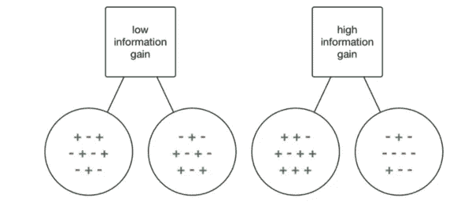
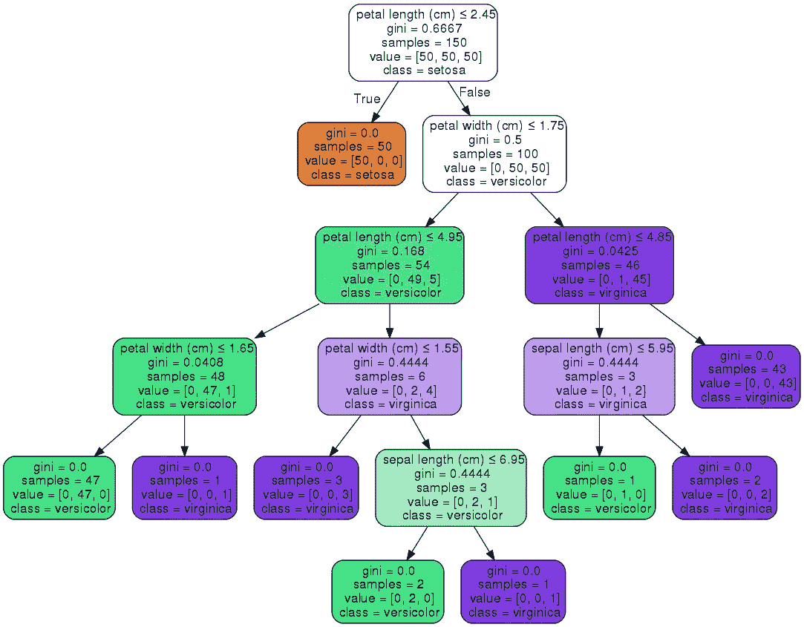

# 机器学习和数据科学决策树指南

> 原文：<https://towardsdatascience.com/a-guide-to-decision-trees-for-machine-learning-and-data-science-fe2607241956?source=collection_archive---------0----------------------->

> 想获得灵感？快来加入我的 [**超级行情快讯**](https://www.superquotes.co/?utm_source=mediumtech&utm_medium=web&utm_campaign=sharing) 。😎

决策树是一类非常强大的机器学习模型，能够在许多任务中实现高准确性，同时具有高度的可解释性。决策树在 ML 模型领域中的特殊之处在于它们清晰的信息表示。决策树通过训练学习到的“知识”被直接公式化为层次结构。这种结构以一种即使非专家也能容易理解的方式保存和显示知识。

# 现实生活中的决策树

你可能在自己的生活中使用过决策树来做决定。以关于你这个周末应该做什么活动的*决定*为例。这可能取决于你是否想和你的朋友出去或者独自度过周末；在这两种情况下，你的决定也取决于天气。如果天气晴朗，你的朋友有空，你可能想踢足球。如果最后下雨，你就去看电影。如果你的朋友根本不出现，那么无论天气如何，你都喜欢玩电子游戏！

这是一个*现实生活中决策树*的明显例子。我们已经建立了一个树来模拟一组**顺序的、** **层次的** **决策**，这些决策最终导致一些最终结果。请注意，我们还选择了相当“高层次”的决策，以保持树小。例如，如果我们为天气设置了许多可能的选项，比如 25 度晴天、25 度雨天、26 度晴天、26 度雨天、27 度晴天…等等，我们的树会很大！确切的温度真的不太相关，我们只是想知道在室外是否可以。

这个概念对于机器学习中的决策树也是一样的。我们希望构建一个包含一组分层决策的树，这些决策最终会给我们一个最终结果，即我们的分类或回归预测。将选择决策，使得树尽可能小，同时以高分类/回归准确度为目标。

# 机器学习中的决策树

决策树模型是使用 2 个步骤创建的:归纳和修剪。归纳是我们实际构建树的地方，即根据我们的数据设置所有的层次决策界限。由于训练决策树的性质，它们很容易过度拟合。修剪是从决策树中删除不必要的结构的过程，有效地降低了复杂性，以防止过度拟合，并使其更容易解释。

## 感应

从高层次来看，决策树归纳通过 4 个主要步骤来构建树:

1.  从训练数据集开始，它应该有一些特征变量和分类或回归输出。
2.  确定数据集中分割数据的“最佳特征”；稍后将详细介绍我们如何定义“最佳特性”
3.  将数据分割成包含此最佳特征的可能值的子集。这种分割基本上定义了树上的一个节点，即每个节点都是基于我们数据的某个特征的分割点。
4.  使用步骤 3 中创建的数据子集递归生成新的树节点。我们不断分裂，直到我们达到某一点，在这一点上，我们通过某种措施优化了最大精度，同时最小化了分裂/节点的数量。

第 1 步很简单，只需获取您的数据集！

对于步骤 2，通常使用贪婪算法来选择使用哪个特征和具体的分割，以最小化成本函数。如果我们想一想，在构建决策树时执行分裂相当于划分特征空间。我们将反复尝试不同的拆分点，然后最终选择成本最低的一个。当然，我们可以做一些聪明的事情，比如只在数据集中的值范围内进行拆分。这将使我们避免浪费计算来测试非常差的分割点。

对于回归树，我们可以使用简单的平方误差作为成本函数:

其中 Y 是我们的基本事实，Y-hat 是我们的预测值；我们对数据集中的所有样本求和，以获得总误差。对于分类，我们使用*基尼指数函数:*

其中 pk 是特定预测节点中类别 k 的训练实例的比例。一个节点应该*理想情况下*有一个零错误值，这意味着每次分割都 100%输出一个类。这正是我们想要的，因为这样我们就知道，一旦我们到达那个特定的决策节点，无论我们是在决策边界的一边还是另一边，我们的输出到底是什么。

在我们的数据集中每次分割一个类的概念被称为*信息增益*。看看下面的例子。

如果我们选择一个拆分，其中每个输出都有一个取决于输入数据的混合类，那么我们真的没有得到任何信息；我们不知道某个特定的节点(即特征)是否对我们的数据分类有任何影响！另一方面，如果我们的分割对于每个输出有很高的百分比，那么我们*获得了*信息，即在特定的特征变量上以特定的方式分割给了我们特定的输出！

现在我们当然可以继续分裂，分裂，分裂，直到我们的树有成千上万的分支…..但是这真的不是一个好主意！我们的决策树会很大，很慢，并且过度适应我们的训练数据集。因此，我们将设置一些预定义的停止标准来停止树的构建。

最常见的停止方法是对分配给每个叶节点的训练样本数量使用最小计数。如果计数小于某个最小值，则分割不被接受，并且该节点被作为最终叶节点。如果我们所有的叶子节点都变成最终节点，训练就停止了。较小的最小计数将为您提供更精细的分割和潜在的更多信息，但也容易使您的训练数据过度拟合。分钟数太大，你可能会过早停下来。因此，最小值通常是基于数据集设置的，取决于每个类中预期有多少个示例。

## 修剪

由于训练决策树的性质，它们很容易过度拟合。为每个节点的最小实例数设置正确的值是一项挑战。大多数时候，我们可能只是进行一个安全的打赌，并使最小值非常小，导致有许多分裂和一个非常大，复杂的树。关键是，这些分割中的许多将是多余的，对增加我们模型的准确性是不必要的。

树修剪是一种利用分裂冗余来移除的技术，即*修剪*我们树中不必要的分裂。从高层次来看，修剪将树的一部分从严格和僵化的决策边界压缩到更平滑和更一般化的边界，有效地降低了树的复杂性。决策树的复杂度被定义为树中分裂的数量。

一种简单而高效的剪枝方法是遍历树中的每个节点，并评估删除它对成本函数的影响。如果变化不大，那就修剪掉！

# Scikit Learn 中的一个示例

用于分类和回归的决策树在 Scikit Learn 中非常容易使用，内置了一个类！我们将首先加载我们的数据集，并初始化我们的决策树进行分类。跑步训练是一个简单的小程序！

Scikit Learn 还允许我们使用 graphviz 库可视化我们的树。它附带了一些选项，将有助于可视化模型学习到的决策节点和分割，这对理解它是如何工作的非常有用！下面我们将根据特性名称给节点着色，并显示每个节点的类别和特性信息。

您也可以在 Scikit Learn 中为您的决策树模型设置几个参数。以下是一些更有趣的方法，可以尝试使用，并获得更好的结果:

*   **max_depth:** 树的最大深度，在这里我们将停止分割节点。这类似于控制深度神经网络中的最大层数。较低会使你的模型更快，但不准确；更高可以给你准确性，但风险过度拟合，可能会很慢。
*   **min_samples_split:** 分割一个节点所需的最小样本数。我们在上面讨论了决策树的这一方面，以及将其设置为更高的值将如何有助于减轻过度拟合。
*   **max_features:** 寻找最佳分割时要考虑的特征数量。更高意味着潜在的更好的结果，代价是训练时间更长。
*   **min _ infinity _ split:**树生长提前停止的阈值。如果节点的杂质高于阈值，则节点将分裂。这可用于权衡防止过度拟合(高值，小树)与高精度(低值，大树)。
*   **预排序:**是否对数据进行预排序，以加快拟合中最佳分割的发现。如果我们事先对每个特征的数据进行分类，我们的训练算法将更容易找到好的值进行分割。

# 实际应用决策树的技巧

这里有一些决策树的优点和缺点，可以帮助您决定它是否是您的问题的正确模型，以及如何有效应用它们的一些提示:

## 赞成的意见

*   **容易理解和解释的。**在每一个节点上，我们都能够看到*确切地说*我们的模型正在做出什么决定。在实践中，我们将能够充分了解我们的精度和误差来自哪里，模型适合什么类型的数据，以及输出如何受要素值的影响。Scikit learn 的可视化工具是可视化和理解决策树的绝佳选择。
*   **需要很少的数据准备。**许多 ML 模型可能需要大量的数据预处理，例如标准化，并且可能需要复杂的正则化方案。另一方面，在调整了一些参数之后，决策树在开箱即用的情况下工作得相当好。
*   **使用树进行推理的成本是用于训练树的数据点数量的对数。这是一个巨大的优势，因为这意味着拥有更多的数据并不一定会大大降低我们的推理速度。**

**缺点**

*   由于决策树训练的性质，过度拟合在决策树中很常见。人们经常建议进行某种类型的降维，比如 [PCA](/principal-component-analysis-your-tutorial-and-code-9719d3d3f376) ，这样树就不必学习这么多特征的分裂
*   出于与过度拟合类似的原因，决策树也容易偏向于在数据集中占多数的类。做一些种类的[类平衡](/handling-imbalanced-datasets-in-deep-learning-f48407a0e758)总是一个好主意，比如类权重、采样或者专门的损失函数。

# 喜欢学习？

在 twitter 上关注我，我会在这里发布所有最新最棒的人工智能、技术和科学！也在 LinkedIn 上与我联系！