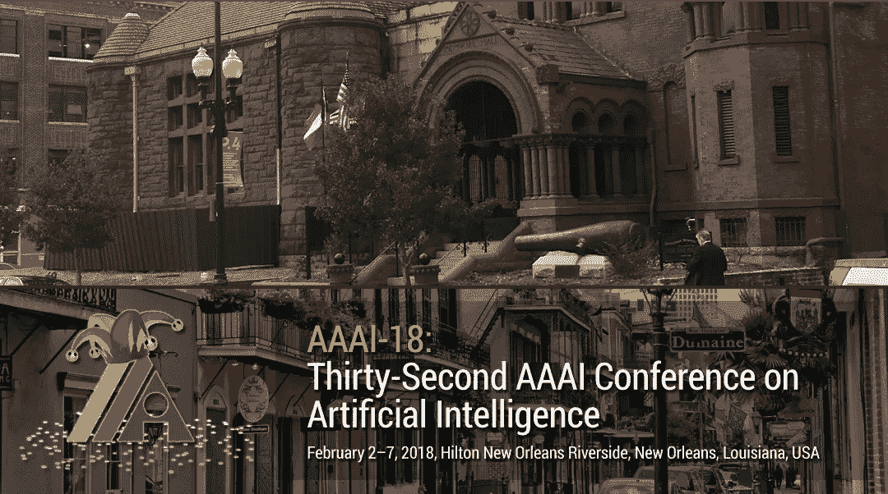
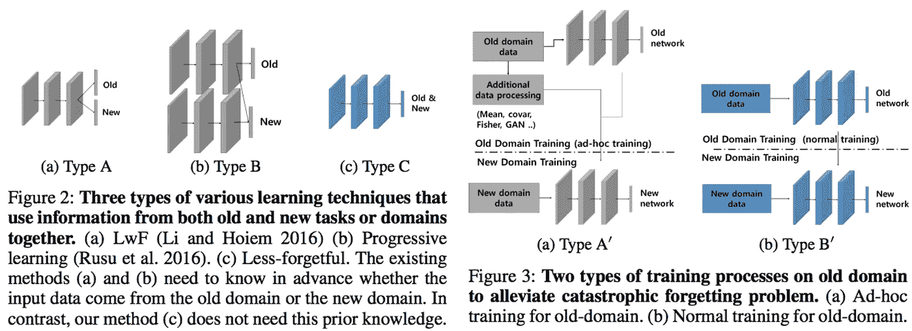
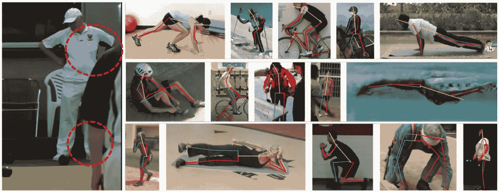
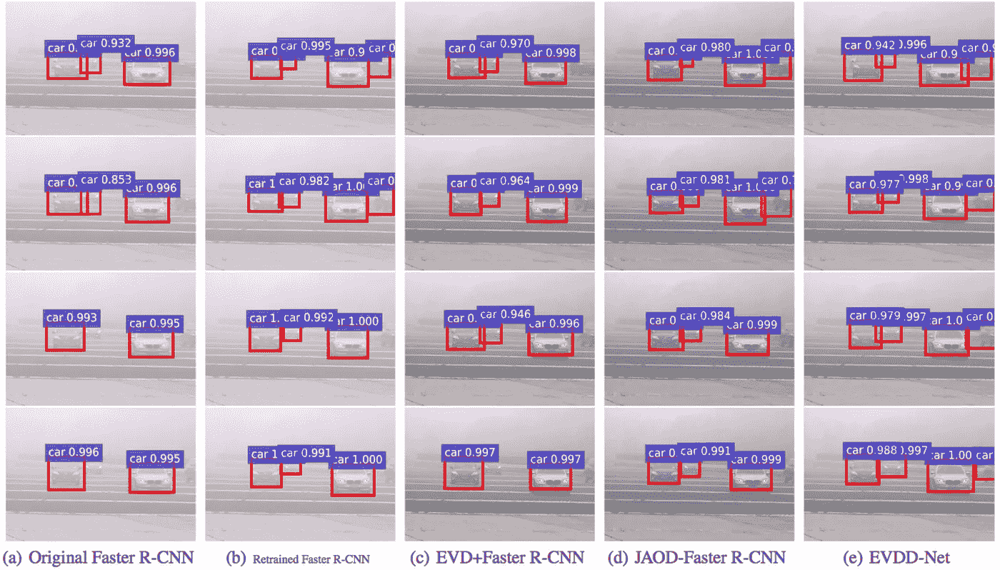
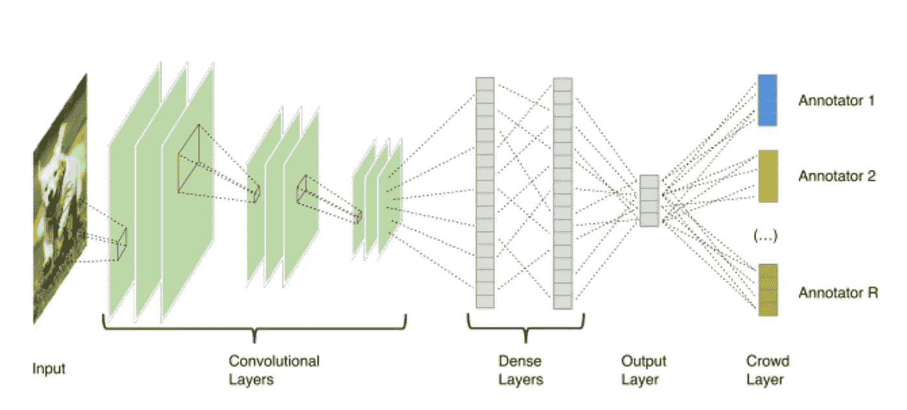
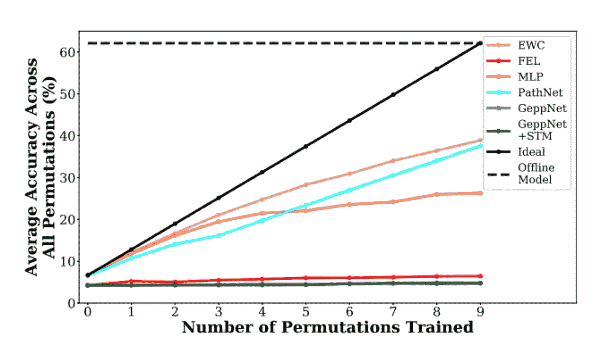
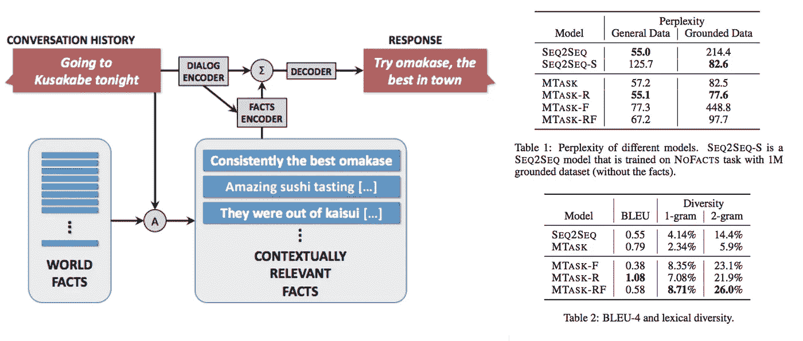
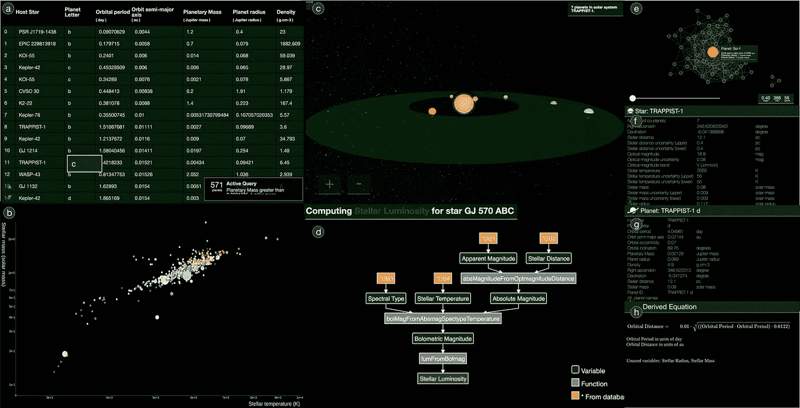

# 一位 HCI 研究员对 AAAI 2018 大会的总结！

> 原文：<https://towardsdatascience.com/a-hci-researchers-summary-on-aaai-2018-conference-6496d6328aa4?source=collection_archive---------8----------------------->

AAAI18 的演讲摘要，涵盖了计算机视觉、机器学习/深度学习(灾难性遗忘)、学习表示、知识图和应用人工智能等主题。

这篇帖子包含我在刚刚结束的人工智能大会( [AAAI 2018，路易斯安那州新奥尔良](http://aaai.org/Conferences/AAAI-18/))上参加的会议的笔记。演讲的选择是基于我对人机交互和应用人工智能的兴趣。这些包括人工智能的人类方面，视觉，机器学习/深度学习(灾难性遗忘)，学习表示，知识图和一般的应用人工智能。欢迎反馈，指正(错别字！)和讨论——请联系( [@vykthur](https://twitter.com/vykthur) [)](mailto:dibiavc@us.ibm.com)) 。对于那些对 AAAI 有兴趣的人来说， [David Abel 也写了一份 AAAI 2018 的详细摘要](https://cs.brown.edu/~dabel/blog/posts/misc/aaai_2018.pdf)，涵盖了一些我没有参加的会议。
TLDR——我的一些笔记可能缺乏细节。

# 2 月 3 日星期六

## 教程—从网络语料库构建知识图—马扬克·凯杰里瓦尔、克雷格·克诺布洛克、佩德罗·策克利[ [幻灯片](http://usc-isi-i2.github.io/AAAI18Tutorial/)

本教程概述了使用从网站上搜集的数据创建知识图表的过程，由南加州大学信息科学研究所的研究人员演示。

## 动机

*   为什么是领域特定知识图(DSKG)？
    人类行为表明我们已经执行了特定领域搜索(DSS。例如，人们去亚马逊上的部分搜索商品，或者去 YouTube 上搜索视频，而不是执行一般的谷歌搜索。
*   DSKGs 在回答特定领域的问题方面做得更好。
*   DSS >关键字搜索；它编纂了许多文档中的领域知识。
*   人们对国防高级研究计划局赞助的项目越来越感兴趣

**知识图构建**

*   知识图是一组三元组( ***H*** ead， ***R*** elationship， ***T*** ail)。巴拉克·奥巴马出生在夏威夷。
*   从网站抓取的数据生成知识图可能会很复杂。解决这一问题的手动方法是不可扩展的，因此需要自动化这一过程的系统。从*表格*、*图形、地块图像*甚至 *excel 文件*中提取数据和实体可能会面临特定的挑战。
*   大多数自动化方法包括*语法归纳方法*，其中系统试图学习爬行数据中的底层结构。这些算法的例子包括 RoadRunner、Disjoint Regex 等。

**知识图构建的示例工具**。
本教程的最后一部分展示了作者在实验室开发的一些知识图生成工具——Karma 和 DIG 。他们还展示了一个有趣的用例，其中他们构建了一个知识图表来帮助[追踪人口贩运](https://news.usc.edu/81360/internet-search-tool-takes-on-human-traffickers/)。

> 我的想法:这个教程有助于理解抓取网站的流程。它比我预期的有更多的手动方面(提取的实体需要手动标记，结果可能非常嘈杂)。我还想了解更多关于问答的知识，这在这次演讲中并没有涉及太多。

# 2 月 4 日星期日

## [总统演讲]人类感知人工智能系统的挑战[ [视频](https://youtu.be/Hb7CWilXjag)，[幻灯片](http://rakaposhi.eas.asu.edu/haai-aaai/AAAI-Presidential-Address-final.pdf)

该演讲由 AAAI 主席(Subbarao Kambhampati)主讲，提供了一些关于人类感知人工智能(HAAI)的观点——动机、研究挑战和开放问题。

**动机**

*   今天的艾对人类有一种奇怪的矛盾心理。
*   但是人工智能可以应用的许多领域都需要人类。智能辅导系统、社交机器人、助手(个人、医疗)以及人机团队。
*   我们应该追求人类感知的人工智能，因为它拓宽了人工智能的范围和前景。

**研究挑战和问题**

*   人机合作需要对人类建模:让机器人/人工智能代理维护与其交互的人类的*精确模型是一个挑战。该模型的准确性对于创建对机器人和人类都优化的计划是必要的。对人-人团队的研究可以为这个问题的解决方案提供信息。*
*   机器人/人工智能代理可以通过牺牲它们的最佳模型来满足人类或者提供/请求有助于解决差异的信息(可解释性)来从这些不准确性中恢复。[更多参考见[幻灯片](http://rakaposhi.eas.asu.edu/haai-aaai/AAAI-Presidential-Address-final.pdf)。来自代理的可解释性是*产生信任的必要条件*。
*   伦理挑战——如果/当人工智能代理能够正确地模拟人类，它可能会给他们“说谎”的能力。

> 我的想法:我发现这个演讲很有趣，因为它有助于提供人工智能规划领域正在进行的工作的概述，以改善人与机器人的互动——努力模拟人类，制定可解释的计划和权衡的观点。

## 【技术谈】多连体嵌入学习的极低分辨率活动识别**。【** [**论文**](https://arxiv.org/pdf/1604.03196.pdf)**】**

Example videos of the HMDB and DogCentric datasets. The upper rows show the original HR videos and the lower rows show the 16x12 extreme low resolution videos used in the paper experiments. The first two videos are from HMDB and the other two videos are from DogCentric. [Source](https://arxiv.org/pdf/1708.00999.pdf)

这个演讲(由印第安纳大学的 Michael S. Ryo 主持)介绍了一种神经网络方法来识别低分辨率图像中的活动——低至 16 * 12 像素！！

**动机**

*   低分辨率处理帮助我们理解远处的活动(远场识别)。例如，视频片段中的背景中正在发生什么(人行走、挥手等)。
*   低分辨率识别提供了**隐私(脸很小，变得无法识别)**和**节省电池**的好处。

**贡献**

*   这项工作贡献了一个新的双流多连体卷积神经网络。在**低分辨率** (LR)视频中，源自完全相同场景的两幅图像通常具有完全不同的像素值，这取决于它们的 LR 变换。
*   该方法学习将具有相同内容的 LR 视频映射到相同位置的共享嵌入空间，而不管它们的变换。
*   当在 LR 视频上进行活动识别时，这种映射被用于改进推断。

> **我的想法:**这篇文章提供了一些关于处理低分辨率图像的有趣见解——常规 CNN 需要 200 * 200 的图像！！他们讨论了从多个 LR 到 HR 图像变换学习映射的技术，并利用该知识来提高推理的准确性。我发现这很有趣，因为像这样的方法可以通知**在边缘**执行人工智能的努力(允许我们使用更小的图像，提高推理速度和电池寿命)。报告的准确性不是很高(37.70%)，他们在运行 Tensorflow 的 Jetson TX2 上实现了 50fps。

## 【技术演讲】深度神经网络领域扩展的少遗忘学习[ [论文](https://arxiv.org/pdf/1711.05959.pdf)

[Source](https://arxiv.org/pdf/1711.05959.pdf)

这篇论文提供了一种方法来处理神经网络中灾难性遗忘的扩展(他们称之为*域扩展*)。

**动机。**
域扩展问题，即创建一个在旧域和新域上都工作良好的网络的问题，即使是在仅使用来自新域的数据而不访问来自旧域的数据的监督方式下对其进行训练之后。他们指出了域名扩张面临的两大挑战。

*   首先，即使学习了新域数据而没有看到旧域的数据，旧域上的网络性能也不应降低。
*   第二，DNN 应该能够很好地工作，而不需要事先知道输入数据来自哪个域。

**灾难性遗忘的方法**

*   **微调 Softmax** :冻结下层并微调最终的 Softmax 分类器层。该方法将下层作为特征提取器，更新线性分类器以适应新的领域数据。换句话说，特征提取器在新旧领域之间共享，并且该方法似乎保留了旧的领域信息。
*   **权重约束方法**:在学习新数据时，使用 l2 正则化获得新旧网络之间相似的权重参数。
*   **论文**提出的模型:使用旧网络的训练权值作为新网络的初始权值，同时最小化两个损失函数。

> **我的想法:**我希望了解更多关于灾难性遗忘的知识，这个演讲(以及相关参考资料)对于了解这个主题的研究状况非常有用。我注意到，这里的评估(以及大多数其他论文中的评估)通常使用小型数据集(例如 CIFAR 10)来评估他们的解决方案在新领域中经过培训后的表现。尚不清楚这是否能很好地适应更大的数据集。灾难性遗忘仍然是一个重要的、公开的和 T21 难题。

## 【用于人体姿态估计的具有注意力调制特征融合的初始网络的级联初始技术】[论文](https://www.cs.rochester.edu/u/jchen121/resources/aaai2018_pose_estimation.pdf)

Results of our the paper on the MPII datasets. It is shown that the method is able to handle non-standard poses and resolve ambiguities when body parts are occluded. [Source](https://www.cs.rochester.edu/u/jchen121/resources/aaai2018_pose_estimation.pdf).

**动机**

*   姿势估计——需要对身体部位的关键点进行精确定位，以分析图像和视频中的行为。它需要多样化的特性:高层次的上下文依赖和低层次的关节细化。
*   定位人体关节很难。由于人体的变形、外观的变化和遮挡，存在一些挑战。
*   现有方法在保留低级特征、自适应地调整不同级别特征的重要性以及模拟人类感知过程方面存在局限性。

**贡献。**

本文提出了三个新的技术，逐步有效地利用不同层次的特征，以改善人体姿态估计。

*   首先,《盗梦空间》( IOI)模块的设计是为了强调**低级功能**。
*   其次，提出了一种注意机制来根据上下文调整**个体层次的重要性。**
*   第三，提出了一个级联网络来顺序定位关节，以**加强从独立部分(如头部和躯干)的关节到远程关节(如手腕或脚踝)的消息传递**。

> **我的想法:**本文提供了关于调整网络以解决特定问题的方法的见解(在这种情况下，对由遮挡和变形引起的姿态估计误差具有鲁棒性)。

## 【技术讲座】人员再识别的图形对应传递[纸](https://pdfs.semanticscholar.org/ea00/489323104d70dd43bac5e15390ec4d6dfe8f.pdf)

(a) shows misalignment among local patches caused by viewpoint changes. The proposed GCT model can capture the correct semantic matching among patches using patchwise graph matching, as shown in image (b). [Source](https://pdfs.semanticscholar.org/ea00/489323104d70dd43bac5e15390ec4d6dfe8f.pdf)

**动机**

*   人物再识别(ReID)是将不同的非重叠摄像机视图中具有相同身份的图像关联起来。视频分析、监控等领域的大量应用。
*   ReID 很难，因为不同摄像机视图中的外观变化很大，身体遮挡严重，探针组中的许多其他图像相似。空间未对准，其中补丁在不同的视图/帧中具有不同的外观。

**贡献**

提出了一种用于身份识别的图对应转移(GCT)方法。

*   与现有方法不同，GCT 模型**将人物再识别**归结为一个 ***离线*** 图匹配和 ***在线*** 对应转移问题。
*   在训练期间，GCT 模型旨在离线学习，即通过逐块图匹配从具有各种姿态对配置的正训练对中学习一组对应模板。
*   在测试过程中，对于每一对测试样本，他们选择几个具有最相似姿态对配置的训练对作为参考，并将这些参考的对应关系传递给测试对用于特征距离计算。匹配分数是通过合计来自不同参考的距离而得到的。对于每个探测图像，具有最高匹配分数的图库图像是重新识别结果。与现有算法相比，GCT **可以处理由于视角和人类姿态的巨大变化引起的空间错位，这是由于逐片图形匹配**的好处。

> **我的想法**:在任务中利用离线知识的有趣方式。他们为具有特定姿态对的图像学习正确的面片对应，并在测试时在具有相似姿态对配置的图像中重用该知识！

## 【技术讲座】端到端联合视频去雾(EVD)和检测[ [论文](https://arxiv.org/abs/1709.03919)

Comparisons of detection results on real-world hazy video sample frames. Note that for the third, fourth and fifth columns, the results are visualized on top of the (intermediate) dehazing results. [Source](https://arxiv.org/pdf/1709.03919.pdf)

微软中国研究院的研究人员在创建一个端到端模型方面做了一些工作，该模型既可以去雾，也可以进行下游操作，如对象检测。

**动机**

*   由于在户外视频监控、交通监控和自动驾驶等领域具有深远的应用价值，去除野外获取的视觉数据中的雾霾一直吸引着人们极大的研究兴趣。
*   CNN 已经应用于具有 SOTA 结果的去雾图像(去雾网，AOD 网)。
*   传统统计方法或 CNN 在探索视频去雾方面的努力有限

**贡献**

*   端到端模型(李等 2017aWang et al. 2016)，直接从模糊输入中回归出清晰图像，无需任何中间步骤。该模型优于多级流水线
*   通过明确考虑在恢复当前帧时如何嵌入相邻视频帧之间的时间一致性，接受视频设置。
*   作者表明，用于视频去雾和视频对象检测的**联合优化的流水线比在已经独立去雾的视频流上运行检测的性能更好**。除了去雾部分，检测部分还必须考虑时间相干性，以减少闪烁检测结果。

> **我的想法:**研究人员确定了一种联合优化管道，有助于提高模糊图像的对象检测精度。这项工作有助于阐明联合优化和端到端模型的效用。

# 2 月 5 日星期一

## 【特邀演讲】**交互式机器学习**【查尔斯·伊斯贝尔和迈克尔·利特曼】

这次演讲由佐治亚理工学院的[查尔斯·伊斯贝尔](https://www.cc.gatech.edu/~isbell/)和布朗大学的[迈克尔·利特曼](http://cs.brown.edu/~mlittman/)主持。这是一个有趣的，引人入胜的(有时很机智)和互动的演示。它以 Charles 关于强化学习(RL)的讨论开始，用户在 RL 中扮演的角色，然后是生动的来回辩论式互动，Michael 向我们介绍了他的研究，该研究告知*如何在 RL 中使用*人类反馈。以下是一些注意事项:

**强化学习(查尔斯·伊斯贝尔)**

*   强化学习:假设有一个代理可以与环境交互，并得到一些可以用来修改未来交互的响应。建模为序列马尔可夫模型。允许我们从小数据集中学习。
*   交互式强化学习:利用并从人类身上提取*好的*数据。
*   我们为什么要信任用户？人民是最终的仲裁者；他们最清楚目标。
*   人类有时是愚蠢的:有时忽略人类的输入(或避免对其进行字面解释)以获得最佳结果是很重要的。考虑一个模拟，其中一个代理可以在一个包含辐射区域的领域中拯救人类。一个简单的“去人类，避免辐射”会导致更少的人类被拯救。此外，人类在某个时间点后会停止提供反馈，之后他们只会提供反馈。例如，成年人不会因为学骑自行车而得到补偿，但孩子会。

**交互式机器学习(迈克尔·利特曼)**

*   有时候，特工会学错东西。例如，模拟中的一只狗会走进一个花园，这样它就可以因为从花园出来**而获得积极的奖励。这表明我们应该重新审视我们使用奖励的方式。**
*   反馈应该是一个*梯度信号*，作为对代理人政策/行为的评论。我们没有把反馈插入代理的奖励系统，而是把它作为一个等式的输入，这个等式模拟代理的行为/政策(优势函数)。这种方法更好地支持收益递减、差异反馈和政策制定。
*   人类并不愚蠢:我们只需要更好地解释人类的输入，以及如何使用它来更新代理参数。我们不能外包我们对人类的理解。**人类是一个循环，人工智能研究人员应该更多地与人类行为研究人员合作**。

## 【特邀演讲】【人类人工智能协作】**走向人工智能思维理论..Devi Parikh [** [**纸张**](https://arxiv.org/abs/1704.00717)

****

**(a) These montages an agent’s quirks. For a given question, it has the same response to each image in a montage. (b) Human subjects predict the success or failure and output responses of a VQA agent (called Vicki). [Source](https://arxiv.org/pdf/1704.00717.pdf)**

**乔治亚理工学院的 Devi Parikh 做了一个有趣的演讲，她主张进行更多的研究来量化用户对人工智能局限性的理解。**

*   **我们越来越多地与能够接收图像并理解物体、活动、场景、对话、描述物体等的人工智能代理合作。参见 cloudcv 上的演示( [visualChatbo](http://visualchatbot.cloudcv.org/) t， [VisualQA](http://vqa.cloudcv.org/) )。**
*   **自然语言很重要，因为人类是机器推理的消费者。**
*   **人类人工智能团队是未来。代理应该有一个很好的人类需求、意图、信念等模型，对用户的想法有一个理论。人类还必须对机器的能力、极限、信念等有所了解**——人工智能的思维理论**。**
*   **人类如何理解 AI？人类如何逼近神经网络？可解释性努力在多大程度上帮助人类理解 AI 极限？**
*   **特工都很古怪。
    大多数代理不会计数、推理、一致性，也不会查阅外部知识库。不知道 3 离 4 有多近。他们视野有限，语言能力有限，不会推理，看不到世界上的先验知识(例如，香蕉主要是黄色的)，从有偏见的数据集学习，并试图回答所有的问题。**
*   **特工的古怪是可以预见的。**我们要量化这个**。她与一名接受过 VQA 训练的代理进行了一项实验(参见[视觉问题回答的分层问题-图像共同关注](https://arxiv.org/abs/1606.00061))。给定一幅图像，参与者被要求估计代理是否会正确回答问题。
    — 60%的人正确预测了代理人的表现。
    —解释模态增加预测…显著图和其他模态导致预测增加。**
*   **她建议使用监督学习来训练代理，并使用强化学习来微调它们。**
*   **下一步和一些重要的论文:合作游戏，人类描述一个图像，代理人试图猜测图像。两人分享正确猜测的奖励。关于这项工作的一些论文。-[https://visualdialog.org/](https://visualdialog.org/)
    -【HCOMP 2017】[通过人机合作游戏评估视觉对话智能体](https://arxiv.org/abs/1708.05122)。
    -【ICCV 2017】[学习合作视觉对话具有深度强化学习的智能体](https://arxiv.org/abs/1703.06585)
    -【CVPR 2017】[视觉对话](https://arxiv.org/abs/1611.08669)。**

> **作为一名人机交互研究员，我发现 Devi 的演讲是会议上最有趣的演讲之一。我特别欣赏为开发推进 SOTA 的系统所做的努力(例如 VQA 在她的工作中)以及探索与这些系统相互作用的人为因素的实验。我的感觉是，Devi 的工作为成功结合人工智能和人机交互的研究提供了一个很好的例子。**

# **2 月 6 日星期二**

## **[邀请谈话]公平的问题，辛西娅·德沃克**

**辛西娅提供了她在差分隐私、算法公平和偏见方面丰富工作的想法。**

*   **偏见会影响算法的公平性
    数据、算法和系统都有偏见，反映了设计者的显性和隐性选择、历史偏见和社会优先考虑。它们不折不扣地形成了价值观的法典化。算法的不公平——从广告到累犯预测——最近在大众媒体上引起了相当大的关注。[(德沃克、哈特、皮塔西、莱因戈尔德和泽梅尔，2012 年)](https://arxiv.org/abs/1104.3913)。**
*   **分类中的公平概念
    —统计均等:那些接受正(或负)分类的人口统计数据与整个人口的人口统计数据相同的性质
    —相似地对待相似的个体:任何两个在特定任务方面相似的个体都应该被相似地分类
    —组成对个体和群体公平的影响。**

**辛西娅最后做了一些笔记**

*   **教育有两种用途…扶老携幼和传授知识的主要任务。教育越进步，补偿越少。**
*   **如果人工智能使现有问题复杂化，它的负面影响将变得更加深远。例如，增加面临风险的母亲(她们最需要经济支持)的保险费**
*   **需要描述数据集“公平性”的指标。**

## ****【技术谈】终身学习的选择性经验回放。****

**来自宾夕法尼亚大学 Grasp 实验室的 David Isele 和 Akansel Cosgun 的演讲。**

****动机****

*   **我们通常希望在一个受控的环境中训练一个模型，并希望它在野外有优雅的表现(适应新环境的能力)。**
*   **在许多情况下，所学习的模型可能不是立即适合的，但是可以代表极好的*初始化*点。然后，我们可以基于这种初始化来启动某种形式的学习。**
*   **然而，当我们尝试这种“在线”学习时，灾难性遗忘带来了复杂性。需要支持在线学习而不会遗忘的方法。**

****贡献****

*   **这项工作采用了来自生物学的灵感和类比，并建议*选择性体验回放*。为了对连续学习者有用，经验重放必须被修改以允许适应变化的环境，同时保持过去的经验仍然相关。深度强化神经网络和经验回放见 [Mnih 等 2015](https://www.nature.com/articles/nature14236) 。**
*   **经验回放利用长期和短期记忆。然而，我们不能把所有的经历都保存在记忆中，我们需要策略来选择保存哪一段记忆。**
*   **这项工作评估了经验选择策略(包括他们的)以及它们如何影响终身学习绩效——惊喜、奖励、最大化覆盖和匹配分布。**

> ****我的想法**:本文讨论了在终身学习的背景下解决灾难性遗忘的另一种方法。这是一个更有趣的用例(与“离线”模型相比，后者可能不需要在约束条件下频繁“学习”新信息)。期待着在报纸出版时阅读它。**

## **用于跨领域情感分类的分层注意力转移网络**

**有趣的应用人工智能论文，探索跨领域情感分类的问题。**

****动机****

*   **当训练集和测试集存在差异(分布)时，我们通常会观察到准确性的降低。例如，如果我们训练一个模型来检测书籍/小说文本中的情感，如果我们将该模型应用于不同的领域，例如餐馆评论文本，我们会观察到较低的分类性能。考虑一下例子**【小说正文**】《一个令人清醒的故事》**【餐厅评论正文】**“饭后我感到清醒”。 ***清醒*** 这个词可能会有不同的情绪(和含义)。**
*   **显然，我们需要可扩展的、端到端可训练的方法来改进跨领域分类并解决上面举例说明的问题。**

****贡献****

*   **这项工作利用文本的语言特征，识别两种类型的词——中枢和非中枢。**支点**是传达情感但不随领域变化的词。在大多数领域，厌恶这个词可能是负面的。**非中枢**:与中枢共现的特定领域词汇。**
*   **了解中枢和非中枢之间的比对以及它们与分类的关系，然后将这种比对跨多个域进行转移。为了学习这种排列，他们提出了两个层次化的注意力转移网络(HATNs)，它们学习中枢(P-Net)和非中枢(NP-Net)。**
*   **作者在 5 个不同的领域测试了他们的方法，并显示了从基线开始的准确性的提高。**

> ****我的想法:**有趣实用的应用 AI 演示。这项工作也是深入领域的专业知识(在这种情况下是语言学)可以为神经网络架构的设计提供信息的方式的一个例子。有趣的是，随着独立学习正确架构的网络取得更多进展(例如[谷歌与 AutoML](https://research.googleblog.com/2017/11/automl-for-large-scale-image.html) 合作)，看看他们如何与基于深层领域专业知识的解决方案进行比较将是有趣的。**

## **【技术讲座】从人群中深度学习[ [论文](https://arxiv.org/abs/1709.01779) ]**

****

**: Bottleneck structure for a CNN for classification with 4 classes and R annotators. [Source](https://arxiv.org/pdf/1709.01779.pdf)**

****动机****

*   **深度学习使 SOTA 在各个领域取得了成果，并从标记的数据集中受益。但是对于许多问题，这种数据是不可用的。**
*   **为了解决这个问题，我们使用了群体，有时我们需要专家群体(例如医学诊断)。虽然这种方法可行，但通常需要从多个具有不同专业水平的嘈杂贡献者那里收集标签。**
*   **几种可能的聚合策略:
    ——多数投票(天真地假设所有注释者都是同等可靠的)。
    -使用期望最大化(EM)式算法，将公证人及其答案的未知偏差联合建模为一些潜在事实的嘈杂版本**

****投稿****

*   **作者提出了一种新颖的**人群层**，这使他们能够直接从多个标注者的嘈杂标签中**训练端到端的神经网络，仅使用反向传播。****
*   **这种变通的方法不仅避免了 EM 的额外计算开销，而且导致了一个通用的框架，该框架除了分类问题之外还可以进行一般性的推广。**
*   **从经验上看，所提出的人群层能够自动区分好的和不可靠的注释者，并捕捉他们的个体偏见，从而在来自 Amazon Mechanical Turk 的真实数据中实现新的最先进的结果，用于图像分类、文本回归和命名实体识别**

> ****我的想法**:异常简单(概念和实现)但有效且有见地的问题解决方案。这些结果也可能对可以被公式化为聚合或投票问题的用例的一般集合有影响。**

****【技术谈】测量神经网络中的灾难性遗忘** [**论文**](https://arxiv.org/abs/1708.02072)**

********

****As a network is incrementally trained (solid lines), ideally its performance would match that of a model trained offline with all of the data upfront (dashed line). Experiments show that even methods designed to prevent catastrophic forgetting perform significantly worse than an offline model. Incremental learning is key to many real-world applications because it allows the model to adapt *after* being deployed. [Source](https://arxiv.org/pdf/1708.02072.pdf)****

******动机******

*   ****一旦网络被训练来完成特定的任务，例如鸟类分类，它就不能容易地被训练来完成新的任务，例如递增地学习识别额外的鸟类或学习完全不同的任务，例如花的识别。当增加新任务时，典型的深度神经网络容易灾难性地忘记以前的任务。****
*   ****然而，增量学习很重要。希望有一种网络能够适应测试中的各种扰动。
    —略有变化的已知数据(例如天气、驾驶中的振动等)
    —新的数据类型(图像和音频)
    —新的对象类别(例如 MNIST 的新数字)****
*   ****能够逐渐吸收新信息的网络，就像人类如何随着时间的推移形成新的记忆一样，将比每次需要学习新任务时从头开始重新训练模型更有效。****
*   ****已经多次尝试开发减轻灾难性遗忘的方案，但是这些方法没有被直接比较，用于评估它们的测试变化很大，并且这些方法仅在小规模问题上被评估。****

******贡献******

*   ****作者引入了**新的度量**和**基准**来直接比较五种不同的机制，这些机制旨在减轻神经网络中的灾难性遗忘:正则化、集合、预演、双记忆和稀疏编码。****
*   ****指标
    稳定性…它对基础知识的记忆有多好
    可塑性…它还在学习新材料吗？总体表现…稳定塑性比。****
*   ****对真实世界图像和声音的实验表明，对最佳性能至关重要的机制因增量训练范式和所用数据类型而异，但它们都表明**灾难性遗忘问题尚未解决**。****
*   ****下一步:作者提出了他们解决灾难性遗忘问题的方法。****

> ******我的想法**:我非常喜欢这个演示，觉得它很有教育意义，并且相信它们提供的度量、实验和见解有助于我们理解灾难性遗忘问题。该论文还强调了当前灾难性遗忘方法的一些难以处理的性质(例如，稀疏方法导致了**40 倍的内存开销**)以及为什么它们可能无法用于现实世界的部署。他们还表明，许多这些方法的性能不能很好地推广到更大的数据集。****

# ****2 月 7 日星期三****

## ****【特邀演讲】**我们如何评价斯坦福不良贷款集团 AI —** [Percy Liang](https://cs.stanford.edu/~pliang/papers/))****

********

****Screenshot from Percy’s slide on future directions in crafting test sets.****

****在这个演讲中，Percy 主张改进我们评估 ML 算法的方式，以确保它们**编码有意义的信息**(没有廉价的技巧)并且**很好地外推**到新的发行版。****

******需要更好的指标******

*   ****ML 已经成功了。然而，最大似然算法容易受到(敌对的)干扰，并且**会犯人类不会犯的错误**。
    —阅读理解也容易受到对抗性攻击([小队数据集](https://arxiv.org/abs/1606.05250))。遭受同样的问题。移动互联网。
    ——这些问题表明我们正在做错事。我们如何缩小人类和机器之间的差距？
    —解决方案… [杰夫·辛顿—胶囊网络](https://arxiv.org/abs/1710.09829)？….Yosua bengi 的意识先验？概率编程( [Kolter and Wong 2017](https://arxiv.org/abs/1711.00851) )？Hector levesque 2103 …除了小抄，我们还需要更难的 ML/AI 系统测试。
    — Winograd 模式。考虑“狗追猫上树”这个例子。 ***它*** 在底部等待”。一个算法是否理解我们所说的 ***it*** ？
    —插值不充分
    —外推更难…测试域不同于训练域。我们需要跨领域推断的算法。****

******关于更难的测试和对立的例子******

*   ****【[阅读理解的对抗性例子— EMNLP 2017](https://arxiv.org/abs/1707.07328) 】在对抗性的设定下，十六个已发表模型的准确率从平均 75%的 F1 分下降到 36%；当对手被允许添加不合语法的单词序列时，四个模型的平均准确率进一步下降到 7%****
*   ****对对立例子的易感性(例如，对人类来说看起来正常的停车标志，但可以欺骗网络进入错误的分类)可能表明网络**在表示停车标志时学到了错误的东西**。****
*   ****另一个更好的测试基准的例子:[更深入理解常识性故事的语料库和评估框架，ACL 2016](https://arxiv.org/abs/1604.01696) 。
    该语料库在两个方面是独特的:(1)它捕获了日常事件之间的一组丰富的因果和时间常识关系，以及(2)它是日常生活故事的高质量集合，也可用于故事生成。实验评估表明，许多基于浅层语言理解的基线和最先进的模型都难以在故事完形填空中获得高分。****
*   ****Codalab — Percy 的团队创建了 Codalab，作为管理模型和促进可复制计算研究的工具。这有助于他们进行一些基准测试和评估实验。****

******关于防御对抗性攻击**
Percy 提供了一种方法— [针对数据中毒攻击的认证防御](https://arxiv.org/pdf/1706.03691.pdf)****

*   ****为了防止攻击，我们可以尝试创建一个模型性能的上限保证。这是防御方在一系列攻击中最糟糕的防御损失的概念，防御方首先执行异常值删除，然后执行经验风险最小化。****
*   ****创建一个捕捉这个界限的证书，如果我们将它添加到训练目标函数中，它允许更好的防御。****

******学习评价******

*   ****模特能把负面评价转化成正面评价吗？这可能意味着它已经学到了一些对文本有意义的东西。****
*   ****经验评估仍然是一个好方法。与图灵测试和 Winograd 模式的传统保持一致。****
*   ****如果训练集和测试集具有相同的分布，我们就不能确切地确定我们的网络已经学到了深刻的东西。****
*   ******当一项措施成为目标时，它就不再是一项好的措施**。古德哈特定律。****

## ****[技术演讲]使用递归神经网络的句子排序和连贯性建模[ [论文](https://arxiv.org/abs/1611.02654)****

********

****Model Overview: The input set of sentences are represented as vectors using a sentence encoder. At each time step of the model, attention weights are computed for the sentence embeddings based on the current hidden state. The encoder uses the attention probabilities to compute the input for the next time-step and the decoder uses them for prediction. [Source](https://arxiv.org/pdf/1611.02654.pdf)****

******动机******

*   ****如何才能以连贯的方式排列文本？连贯指的是让读者理解和吸收信息的文本属性。他们的缺席*限制了*理解。****
*   ****连贯建模:区分连贯和不连贯文本的任务。如果我们能模拟连贯性，那么我们就能完成句子排序这项有价值的任务。****
*   ****案例示例:在多文档摘要中，我们想知道如何从每个不同文档中组合提取的文本来生成连贯的摘要。****

******贡献******

*   ****作者提出了基于 set-to-sequence 框架的端到端无监督深度学习方法。****
*   ****可视化所学习的句子表示表明，该模型捕捉段落中的高级逻辑结构。****

> ****我的想法:提供一些关于一致性建模方法的有趣想法。在学习生成连贯故事、对话或闲聊的 GAN 时，这可能有作为自动鉴别器的应用。****

******【技术谈】意象如何激发诗歌:用记忆网络从意象中生成中国古典诗歌
。******

******动机******

*   ****中国古典诗歌结构简洁，节奏优美，内容丰富。中国诗歌最常见的体裁是绝句(四行诗)。****
*   ****目标:给定一幅图像，我们如何生成一首既遵循四行诗的规则，又能描述图像的四行诗。****
*   ****现有的工作有几个局限性——它们表现出主题漂移(系统生成与电子邮件无关的材料)，无法覆盖图像，以及覆盖关键字。****

******贡献******

*   ****作者提供了一个管道，首先提取关键字和特征(语义)，逐行生成诗歌，整合语义关键字，忽略不重要的信息。****
*   ****注意力层允许模型关注图像的重要部分和前面几行的内容。支持无限数量的关键字。****
*   ****他们开发了一些有趣的评估实验来验证他们的工作。****

## ******【技术谈】一个基于知识的神经对话模型** [**论文**](https://arxiv.org/abs/1702.01932)****

************

******Knowledge-grounded model architecture and evaluation metrics. [Source](https://arxiv.org/pdf/1702.01932.pdf)******

********动机********

*   ******神经网络模型能够生成极其自然的声音对话交互。然而，这些模型还没有证明它们**能够以事实信息或基于实体的观点**的形式整合内容，这将使它们能够服务于更面向任务的对话应用。如果用户提到一个不在数据集中的实体，就没有办法正确处理它。******
*   ******目标:一个端到端的可训练管道，完全由数据驱动，学习使用数据集中的基础信息进行对话。******

********贡献********

*   ******提出了一种新颖的、完全数据驱动的、基于知识的神经对话模型，旨在产生更有内容的响应，而无需填充缝隙。******
*   ******将广泛使用的序列对序列(Seq2Seq)方法一般化，根据对话历史和外部“事实”来调节响应，使模型在开放领域设置中通用和适用。将非对话数据注入对话。******
*   ******该方法相对于竞争性 Seq2Seq 基线有显著改善。人类法官发现，模型输出的信息量要大得多。******
*   ******实验:数据收集自 Foursquare，23M 通用域 twitter 会话。基础:与 foursquare 实体的 100 万次 twitter 对话。******
*   ******多任务学习和参数共享解决泛化问题。******

## ******【特邀演讲】从朴素物理学到内涵:用语言学习和推理世界——[叶筋·崔](https://homes.cs.washington.edu/~yejin/)******

******这是一个比较有趣的演讲，叶筋从丰富的角度介绍了她在自然语言处理方面的工作。她从她的团队赢得[亚马逊 Alexa Alexa 奖](https://developer.amazon.com/alexaprize/2017-alexa-prize)开始——创造了一个社交机器人，在 **10 分钟**内进行自然对话。******

> ******入选 Alexa 奖的团队在创造社交机器人方面展开竞争，这些机器人可以就一系列时事和热门话题(如娱乐、体育、政治、技术和时尚)与人类进行连贯而生动的对话。******

******为了感受一场精心设计的社交机器人对话有多令人满意，我建议看看关于 2017 年 Alexa 奖 结果的 [**视频。这些机器人可以被中断，在多个域上生成对话，似乎保持上下文等。**](https://www.youtube.com/watch?time_continue=97&v=WTGuOg7GXYU)******

******上面的幻灯片是叶筋在 AAAI 演讲的浓缩版。******

# ******我们的解决方案优于 SOTA！******

******一件有趣的事情是，在所有的技术讲座中，每一个演讲者都用这句台词来宣告他们的胜利******

> ******“我们的解决方案超越了最先进的技术(SOTA)”。(附有这方面的表格)******

******人工智能的研究进展非常非常快，我想研究人员展示进展的一种客观方式是展示他们报告的性能分数超过之前 SOTA 基准的指标(有时是 0.1 或 0.2)。一些人已经观察到这些比较是如何被操纵的，并在[发布过程](https://twitter.com/goodfellow_ian/status/961313703084703744)中产生瑕疵。******

******另一个有趣的术语是“[端到端可训练的](https://www.quora.com/What-does-it-mean-by-%E2%80%9Cend-to-end-trainable-neural-network%E2%80%9D)”——指的是使用单/联合损失函数训练所有模型的 ML 管道。拥有*这样一个端对端可训练的模型，当然胜过 SOTA* ，这是既令人向往又时髦的！******

# ******结论******

******AAAI 2018 是一次组织得非常好的会议，很棒的场地(纽奥良被点亮了)，我学到了很多！更重要的是，它帮助我确定了人工智能中我需要投入更多时间理解的领域和概念。与同事一起展示我在一个用于分析和可视化系外行星数据的[认知助手上的工作也很棒。这个项目的视频描述可以在](http://jellis.org/work/exoplanets-aaai2018-demo.pdf)[这里](http://vimeo.com/243536185)找到。******

************

******感谢阅读(原来是一篇冗长的帖子！).你可以随时联系 Twitter、Github 或 Linkedin。******