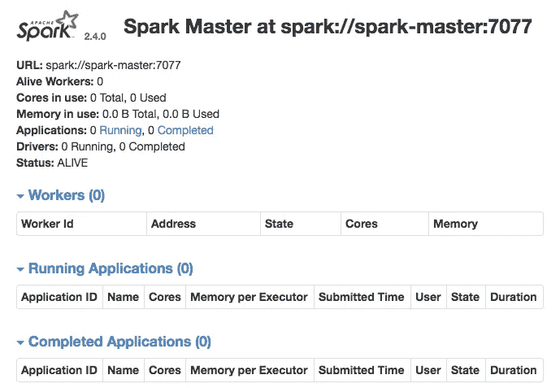
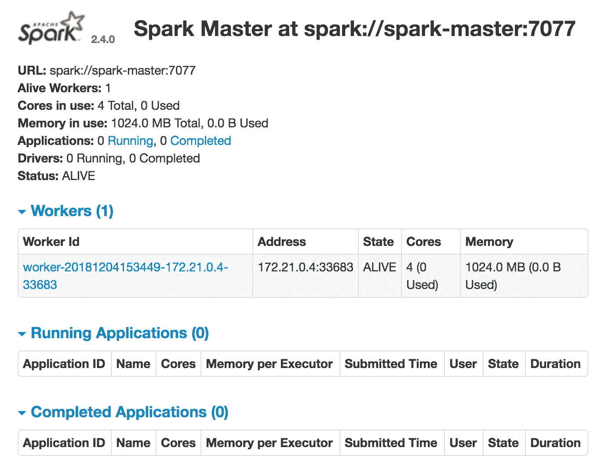
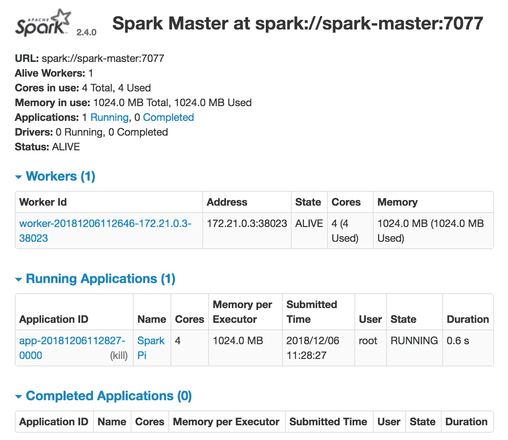
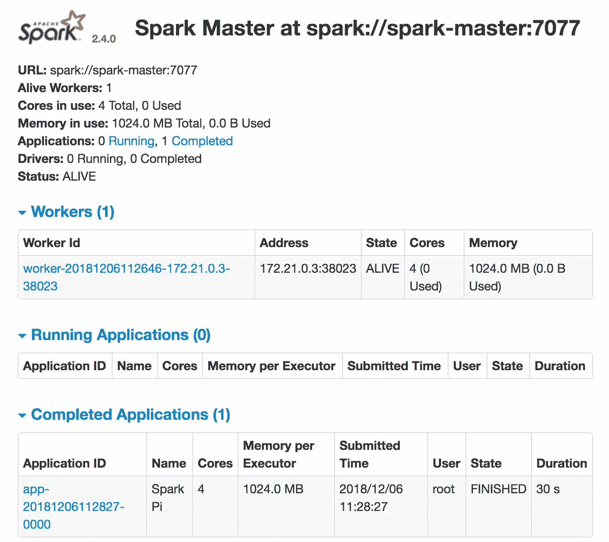

# Apache Spark 大数据之旅:第 1 部分

> 原文：<https://towardsdatascience.com/a-journey-into-big-data-with-apache-spark-part-1-5dfcc2bccdd2?source=collection_archive---------3----------------------->

## 关于了解 Apache Spark 用于大数据处理的系列文章的第一篇。

我的大数据之旅始于 2018 年 5 月。十多年来，我一直是一名软件工程师，参与并领导了一些 Sky Betting & Gaming 最大的产品和服务的开发。在此期间，我学到了很多关于如何构建和操作可扩展应用程序的知识——从对日志和指标的需求，到性能优化和可维护性。当我被要求成为我们数据部落的工程经理时，我既兴奋又极度紧张——我以前领导过小团队，但对大数据一无所知。所以我决定学！

“你从哪里开始做这样的事情？”这是我经常问自己的问题。大数据生态系统非常庞大。所以我问我团队中的一位首席工程师他们会推荐什么，Apache Spark 是他们的首选。

## 什么是火花？

从 Apache Spark 网站:

> **Apache Spark**是用于大规模数据处理的统一分析引擎。

用人类的话来说，Spark 是一个分布式计算框架，当查询内存数据集时，它有一个跨多种语言的通用接口，用于 SQL 和 MapReduce 之类的东西。由于是分布式的，Spark 可以在一个机器集群上处理非常大的数据集。

## 为什么是火花？

从工程角度来看，Spark 有多种语言版本:Scala、Java、Python 和 r。这看起来是一个相当大的胜利，因为它没有限制我们可以租用特定语言的内容。Spark 有自己的 DSL ( [领域特定语言](https://en.wikipedia.org/wiki/Domain-specific_language))，这在所有实现中都是相同的，这意味着尽管选择了不同的实现语言，但还是有一种通用语言。我们的数据科学团队使用 PySpark 和 Spark 的组合，更广泛的团队使用 Scala——我们让团队(大部分)选择他们自己的工具。

Spark 对数据框架的使用非常适合通常的软件工程和应用程序设计原则，例如单元测试、数据建模、单一责任原则等等。又一次大获全胜。我可以像以前一样继续构建应用程序(我是[12 因子](https://12factor.net)原则的忠实粉丝)。

Spark 还附带了一个 SQL 接口，对于大多数曾经需要在某个地方存储和查询数据的程序员/工程师来说，这通常是很熟悉的。

如果你感兴趣的话，Spark 甚至有一个流媒体库。虽然我不会马上这么做(虽然我是 Apache Kafka 的超级粉丝)，但它对未来的学习(我想也是商业用例)很有吸引力。

## 我们开始吧

Apache Spark 似乎令人望而生畏(就像任何新事物一样)，我发现自己又在问*“我从哪里开始？”我坚信从头开始理解事物会让你成为更好的工程师。这一点，加上在某个地方实际练习使用 Spark 的需要，引导我构建一个小型本地 Spark 独立集群。*

*注:我是 Docker 的忠实粉丝。它为你提供了一种打包方式，并以一种非常便携的方式分发。我需要在自己的机器上安装的惟一依赖项是 Docker 本身。我将在我所有的例子中使用 Docker，所以你可能想从这里的*[](https://www.docker.com/get-started)**中得到它。我还在运行 OSX，它对 Docker 有一些小的限制，但我们可以解决它们。**

*我们的首要任务是找到一个合适的包含 Java 版本的 Docker 映像。作为开源软件的粉丝，我选择了使用 OpenJDK。我不是一个膨胀的粉丝，并决定 Alpine Linux 是正确的选择。幸运的是，我们可以使用已经可用的图片。让我们开始创建我们的*docker 文件。**

*在一个名为 *Dockerfile* 的空目录下创建一个新文件。在顶部添加以下一行:*

```
*FROM openjdk:8-alpine*
```

*现在我们可以构建我们的映像，它使用 OpenJDK 映像作为基础。通过运行以下命令构建映像:*

```
*docker build .*
```

*这将提取基础图像并创建我们自己的图像版本。您将看到类似于以下输出的内容:*

```
*Successfully built 68ddc890acca*
```

*我们不再在每次构建图像时记录输出散列，这一次我们将*标记*图像，给它命名以便更容易使用(当然，用您自己的名字替换$MYNAME)。这是对上面的构建命令的一个小小的调整:*

```
*docker build -t $MYNAME/spark:latest .*
```

*现在，我们可以使用我们给它的标签来引用它，而不是使用生成的散列来引用构建的映像。通过使用标签名运行容器进行测试，如下所示:*

```
*docker run -it --rm $MYNAME/spark:latest /bin/sh*
```

*这个图像还没有多大用处，因为它只包含 Java。让我们安装一些实用程序，我们将需要下载和安装 Spark。我们将需要`wget`来下载包含 Spark 的归档文件，并需要`tar`来从该归档文件中提取文件。我们还需要`bash`来管理一些事情。在 *Dockerfile* 中的新行上，添加以下内容(我们需要包含`--update`，这样 Alpine 就有了一个新的存储库列表，可以从中下载二进制文件):*

```
*RUN apk --update add wget tar bash*
```

*现在重建图像并观察`wget`、`tar`和`bash`的安装。*

*我们现在可以下载并安装 Spark。我们将使用基于 Scala 2.11 和 Hadoop 2.7 的 Spark (2.4.0)的最新版本(不要担心 Hadoop，我们对此不感兴趣…还没有)。将以下内容添加到您的*docker 文件*中的新行，并进行编译:*

```
*RUN wget [http://apache.mirror.anlx.net/spark/spark-2.4.0/spark-2.4.0-bin-hadoop2.7.tgz](http://apache.mirror.anlx.net/spark/spark-${SPARK_VERSION}/spark-${SPARK_VERSION}-bin-hadoop2.7.tgz)*
```

*Docker 非常聪明，它将重用我们之前构建的*层*，所以现在它所要做的就是下载 Spark 归档文件。一旦构建完成，映像将包含 Spark 归档文件，供我们安装。安装就是简单地从档案中提取 Spark 并把它放在一个合适的地方。将另一行添加到 *Dockerfile* 中，这样做(为了可读性，我将命令分成多行。`rm`是简单地清理下载的归档文件)然后构建:*

```
*RUN tar -xzf spark-2.4.0-bin-hadoop2.7.tgz && \
    mv spark-2.4.0-bin-hadoop2.7 /spark && \
    rm spark-2.4.0-bin-hadoop2.7.tgz*
```

*恭喜你！现在，您已经在 Docker 映像上下载并安装了 Spark。是时候测试一下了！让我们开始一个容器，并得到一个外壳。注意构建图像结束时的 ID 输出，因为我们现在将使用它。在您的 shell 中运行以下命令:*

```
*docker run --rm -it $MYNAME/spark:latest /bin/sh*
```

*然后我们将在容器内部运行的外壳中结束，用它来启动 Spark *Master* 。当开始成功启动时，Spark 需要几个选项。这些是主服务器监听的端口、WebUI 的端口和主服务器的主机名:*

```
*/spark/bin/spark-class org.apache.spark.deploy.master.Master --ip `hostname` --port 7077 --webui-port 8080*
```

*希望您应该看到一堆日志输出！如果有，恭喜你！您已经成功开始运行 Spark Master。*

*下一步是将一些 Worker 添加到集群中，但是首先，我们需要在 Master 上设置一些配置，以便 Worker 可以与它对话。为了使事情变得简单，我们将为 Master 提供一个合适的名称，并公开 Master 端口(最后一个命令中的`--port`选项),同时使 WebUI 对我们可用。通过使用 CTRL+C 和 CTRL+D 停止主 shell 并退出容器。现在您应该在本地 shell 中了。只需调整`docker run`命令，添加`--name`、`--hostname`和`-p`选项，如下所示，然后运行:*

```
*docker run --rm -it --name spark-master --hostname spark-master \
    -p 7077:7077 -p 8080:8080 $MYNAME/spark:latest /bin/sh*
```

*运行`docker ps`,您应该看到容器运行时的输出如下(我已经删除了一些输出，以使其适合代码块):*

```
*CONTAINER ID  PORTS                                NAMES
3dfc3a95f7f4  ..:7077->7077/tcp, ..:8080->8080/tcp spark-master*
```

*在容器中，重新运行命令来启动 Spark Master，一旦启动，您应该能够浏览到 [http://localhost:8080](http://localhost:8080) 并看到集群的 WebUi，如下图所示。*

**

*Spark Master WebUI*

## *添加工作节点*

*正如我提到的，我正在使用 Docker for Mac，这使得 DNS 很麻烦，并且如果不运行本地 VPN 服务器或其他东西来解决这个问题，通过 IP 访问容器几乎是不可能的——这超出了本文的范围。幸运的是，Docker 有自己的网络功能(具体细节也不在本文讨论范围之内)，我们将用它来为本地集群创建一个网络。创建网络非常简单，只需运行以下命令:*

```
*docker network create spark_network*
```

*我们不需要指定任何特定的选项，因为默认选项对我们的用例来说已经很好了。现在，我们需要重新创建我们的主服务器，以将其连接到新网络。运行`docker stop spark-master`和`docker rm spark-master`删除当前运行主机的*实例*。要在新网络上重新创建主服务器，我们可以简单地将`--network`选项添加到`docker run`，如下所示:*

```
*docker run --rm -it --name spark-master --hostname spark-master \
    -p 7077:7077 -p 8080:8080 --network spark_network \
    $MYNAME/spark:latest /bin/sh*
```

*这与我们第一次运行 Spark Master 时没有什么不同，只是它使用了一个新定义的网络，我们可以使用这个网络来连接工作人员，以使集群工作👍。现在主节点已经启动并运行，让我们向它添加一个 Worker 节点。这就是 Docker 的魔力真正闪耀的地方。要创建一个 Worker 并将其添加到集群中，我们只需*启动同一个 docker 映像的新实例*并运行命令来启动 Worker。我们需要给这个工作者一个新的名字，但是除了这个命令之外，其他的基本保持不变:*

```
*docker run --rm -it --name spark-worker --hostname spark-worker \
    --network spark_network \
    $MYNAME/spark:latest /bin/sh*
```

*要在容器上启动 Spark Worker，我们只需运行:*

```
*/spark/bin/spark-class org.apache.spark.deploy.worker.Worker \
    --webui-port 8080 spark://spark-master:7077*
```

*当它启动并连接到主机时，您应该看到输出的最后一行:*

```
*INFO  Worker:54 - Successfully registered with master spark://spark-master:7077*
```

*主服务器将输出以下行:*

```
*INFO  Master:54 - Registering worker 172.21.0.2:37013 with 4 cores, 1024.0 MB RAM*
```

*恭喜你！您已经使用 Docker 设置了一个 Spark **集群**！*

## *但是这有用吗？*

*为了检查它是否工作，我们可以加载主 WebUI，我们应该看到 Worker 节点列在“Workers”部分下，但这实际上只是确认了将 Worker 连接到主 WebUI 的日志输出。*

**

*Spark Master WebUI with Worker*

*为了进行真正的测试，我们需要在集群中实际运行一些 Spark 代码。让我们运行 docker 映像的一个新实例，这样我们就可以运行安装 Spark 时提供的一个示例。同样，我们可以重用现有的 docker 映像，并简单地启动一个新的实例，用作驱动程序*(向集群提交应用程序的东西)。这个不需要`--hostname`、`--name`和`-p`选项:**

```
**docker run --rm -it --network spark_network \
    $MYNAME/spark:latest /bin/sh**
```

**在容器中，我们可以通过运行以下命令向集群提交应用程序:**

```
**/spark/bin/spark-submit --master spark://spark-master:7077 --class \
    org.apache.spark.examples.SparkPi \
    /spark/examples/jars/spark-examples_2.11-2.4.0.jar 1000**
```

**提供的示例计算出哪个 Pi 正在使用集群。**

**当应用程序运行时，您应该能够在 Spark Master WebUI 中看到:**

****

**Spark Master WebUI — Running Application**

**完成后，您将在日志中看到 Pi 输出的值:**

```
**Pi is roughly 3.1414459514144597**
```

**您还会在 WebUI 中看到完整的应用程序报告:**

****

**Spark Master WebUI — Completed Application**

## **用 Docker Compose 把它钩在一起**

**Docker Compose 是 Docker 提供的一个简洁的工具，我们可以将其用作编排工具，这样我们就不必自己在许多终端窗口中运行命令了。我们本质上是将各种命令缝合在一起，并将一些东西参数化，这意味着我们可以简单地运行`docker-compose up`，集群就开始运行了。**

**为了实现这一点，我们可以创建一些脚本来复制到映像并在容器启动时运行。我们将创建的第一个是设置 Spark Master。创建一个名为`start-master.sh`的新文件，并添加以下命令:**

```
**#!/bin/sh/spark/bin/spark-class org.apache.spark.deploy.master.Master \
    --ip $SPARK_LOCAL_IP \
    --port $SPARK_MASTER_PORT \
    --webui-port $SPARK_MASTER_WEBUI_PORT**
```

**我们没有在脚本中直接指定 IP、Master 和 WebUI 端口，而是将它们参数化，这意味着我们可以将它们作为环境变量提供。从而在主设备监听的配置(端口)方面提供了更大的灵活性。要将脚本放到图像上，我们需要复制它。然而，在此之前，我们需要确保脚本是可执行的。只要运行`chmod +x start-worker.sh`就可以了。现在将脚本添加到图像中，在最后一个`RUN`命令下面的 *Dockerfile* 中，添加以下内容:**

```
**COPY start-master.sh /start-master.sh**
```

**在我们重新构建映像之前，我们也将为 Worker 创建一个类似的脚本。创建一个名为`start-worker.sh`的新文件，并添加以下命令:**

```
**#!/bin/sh/spark/bin/spark-class org.apache.spark.deploy.worker.Worker \
    --webui-port $SPARK_WORKER_WEBUI_PORT \
    $SPARK_MASTER**
```

**同样，我们已经对配置进行了参数化，以提供更大的灵活性。使新脚本可执行(`chmod +x start-worker.sh`)，并在 *Dockerfile* 中添加另一个`COPY`行，以将脚本添加到图像中:**

```
**COPY start-worker.sh /start-worker.sh**
```

**重建并运行。如果一切顺利，您将进入容器中的一个 shell，该容器中的脚本位于文件系统的根目录中:**

```
**bash-4.4# pwd
/
bash-4.4# ls -l
total 72
...
-rwxr-xr-x    1 root   root   357 Dec 6 11:56 start-master.sh
-rwxr-xr-x    1 root   root   284 Dec 6 17:10 start-worker.sh
...**
```

**回来后，我们将使用`docker-compose`来编排集群。**

**创建一个名为`docker-compose.yml`的新文件，并输入以下内容:**

```
**version: "3.3"
services:
  spark-master:
    image: $MYNAME/spark:latest
    container_name: spark-master
    hostname: spark-master
    ports:
      - "8080:8080"
      - "7077:7077"
    networks:
      - spark-network
    environment:
      - "SPARK_LOCAL_IP=spark-master"
      - "SPARK_MASTER_PORT=7077"
      - "SPARK_MASTER_WEBUI_PORT=8080"
    command: "/start-master.sh"
  spark-worker:
    image: $MYNAME/spark:latest
    depends_on:
      - spark-master
    ports:
      - 8080
    networks:
      - spark-network
    environment:
      - "SPARK_MASTER=spark://spark-master:7077"
      - "SPARK_WORKER_WEBUI_PORT=8080"
    command: "/start-worker.sh"
networks:
  spark-network:
    driver: bridge
    ipam:
      driver: default**
```

**我们在这里所做的就是指定要使用的映像名，设置主机名和容器名，显示正确的端口并连接到我们在底部创建的网络，设置一些环境配置和启动时要运行的命令。我们还将 Worker 设置为依赖于正在运行的主服务器。**

**要启动集群，我们只需运行`docker-compose up`。Docker Compose 的一个优点是，我们可以通过简单地在 Compose 命令中添加一个`--scale`选项来扩展 Workers。假设我们需要 3 个工作节点，我们运行:**

```
**docker-compose up --scale spark-worker=3**
```

**就这样。我们完了。下次我们开始学习在 Scala 中构建我们自己的应用程序时，请继续收听。**