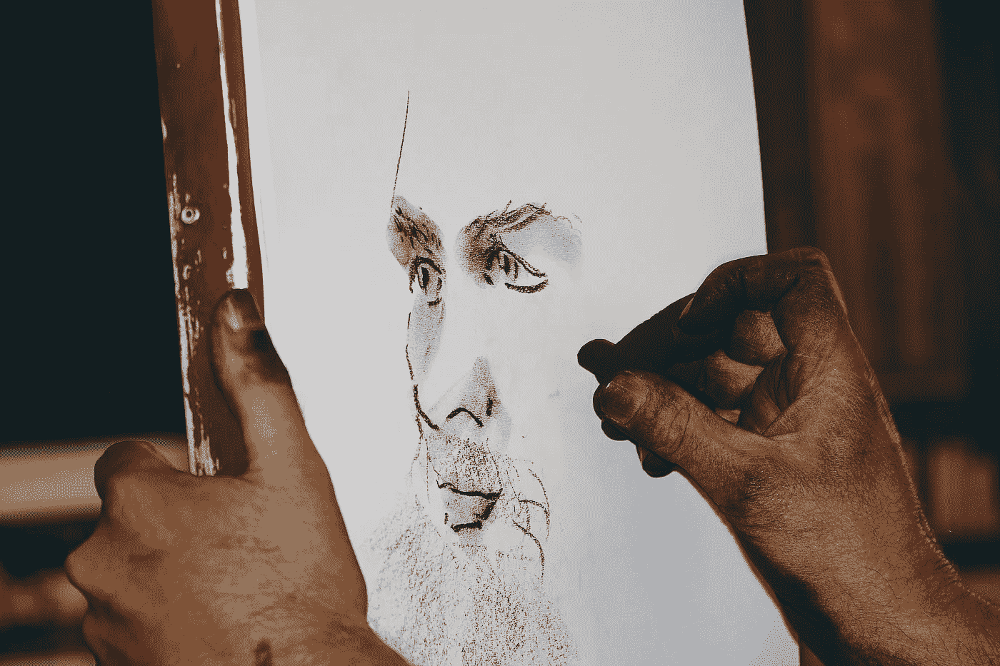
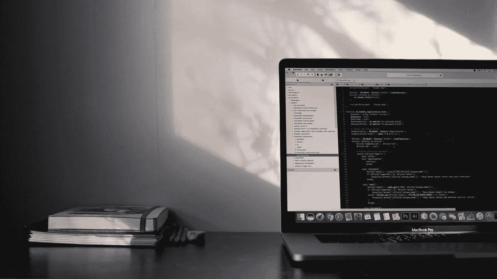

# 生产力例行程序之旅

> 原文：<https://towardsdatascience.com/a-journey-of-productivity-routines-towards-data-science-59a8ccc53690?source=collection_archive---------13----------------------->

这一切都是从我搬到马德里开始的。

“Downtown”, Puebla, Mex. Image credit: [Sheila Montes](https://twitter.com/sheila_montes)

# 零点

我从小就渴望知识。学习我感兴趣的东西给了我一种完整的感觉。然而，碰到我对一个主题的理解的极限是许多深刻的内部反思的原因。

我决定攻读“大数据和商业智能”硕士学位，因为我来自一个完全不同的非技术领域。这是一个巨大的挑战。

> 我心中只有一个明确的目标: ***强势完成我的程序。我*** 几乎感觉自己像一匹眼睛被半遮着的赛马；刚好能看清前面是什么。因为当你下定决心要冲过终点线的时候，其他事情都不重要。

## 一些灵感

就像重力一样。拥有一个包罗万象的动机变得显而易见，最终，就像重力一样，对像你一样的人有一种明显的吸引力。在那里，我与一位巴拉圭软件工程师合作，他的友谊我至今仍珍视。

***黄金法则:找到和你一样的人..或者有引力*或者**

# **第一次常规尝试。**

*拼命学习，爱上田野。*

新的国家，新的习惯，新的人，新的旅程开始了。

随着日子一天天过去，你会开始有时间感；日常活动、周末、天气、你什么时候做饭、你什么时候买杂货、锻炼或者给家人打电话。这个清单可以一直列下去，所以我的第一课是:

> **试错:**好的套路是在几次尝试之后出现的

我有一份兼职工作，所以时间优化是关键。

冬天的时候，我在早上 8 点左右醒来，刚好够早喝上一杯咖啡。我可以带着我的 iPad 在上班的路上学习。幸运的是，我的工作是在商学院关注学生的需求，并为即将到来的学术课程提案做研究。第二部分很美好，我可以研究我的笔记，阅读与我的领域相关的论文和文章。

午餐结束后，我返回火车去上课，在那 40 分钟的旅途中，更多的是同样的事情；Ipad 和 10 多张幻灯片。多亏了至少 3 杯咖啡，有时还有红牛，还有溅在我脸上的冷水，我总能在 7 个小时的讲座中保持专注。我在课堂上喝饮料，这样当休息时间开始时，我可以学习，和我的教授交谈，或者和我的同事讨论课程。

夜幕降临时，他们得到了应得的休息。我只是在回家的路上欣赏我的音乐，健身，为第二天做饭，给家人打电话。

## **环境决定一切**

My temple of study in my 4x4 room

# 第二次常规尝试。

*实习，SQL 和绘图。*

夏天敲响了我们的门，人们向南方迁移，去西班牙最美丽的地中海海滩。我也在打包行李，但我的目的地是北方，比利牛斯山附近的一个小城市，在那里我在一家小型科技咨询公司实习了 4 个月。

我早上 6 点左右醒来，天气非常适合跑步，城市空无一人。一顿丰盛的早餐，洗个冷水澡，然后去上班。

这些是我学到的最有价值的经验:

1.  **。通常会有很多工作要做，因此保持高效率很有价值**
2.  ****时间管理至关重要。*** 我看到项目经理在开 3 分钟的会！*
3.  ****宁静高于一切*** *。*有一天，我陪着首席运营官去拜访一个客户。总经理和其他 4 名高级员工开始对该项目提出许多抱怨和质疑。他认真听取了每个人的意见，然后开始以更健康、更有成效的方式引导会议。每个人都微笑着离开了房间*
4.  ****SQL，你只要学会就行了。*** 你懂 SQL？我被问到的第一个问题。然后我意识到它可以成为你完成第一课的最好的朋友。*

*当我到家的时候，已经快 8 点了，仍然是晴朗无云的天空，正准备进行另一次跑步。我在工作中投入了很多精力，但我想做得更多，所以我重拾了童年时擅长的一个老习惯，画画。我买了一个全新的笔记本和木炭，开始在我的工作室画画。周末的时候，我会去公园阅读佩德罗·多明戈斯的《大师算法》。这本书给了我继续学习的力量。佩德罗采用故事的方式来谈论机器学习，指出它的历史、未来以及它如何影响我们的生活。*

**

*Image source: [Pixabay](https://pixabay.com/en/charcoal-drawing-charcoal-pencil-1558887/)*

# *第三次常规尝试*

*课本、MOOCS、播客、Python、SAS 和我缺乏编程技能。*

*这是 2017 年初，回到马德里，另一场冒险即将开始。这个叫做风险管理。*

*是的，我在银行工作。*

*事实证明，这是我经历过的最长的通勤时间，每天坐地铁两个小时甚至更多。*

> *是时候想想如何以富有成效的方式度过这 10 个小时了！*

*我早上 6:30 左右醒来，去喝咖啡吃早餐。我不得不在 7:45 离开家，这样我可以在 9:00 到达。在我上班的路上，我混合阅读和播客，主要是中型和 KDnuggets 文章。在播客中找到大量与数据科学相关的内容真是太棒了。奇怪的是，除了音乐之外，我从来没有消费过音频内容，所以坐上地铁开始听确实非常令人兴奋，我最喜欢的播客是:*

1.  *我和克里斯和维迪亚一起笑得很开心。[学习机器学习](http://partiallyderivative.com/podcast/2017/03/28/learning-machine-learning)给我留下了印象，除了被介绍到一个精选的学习机器学习的书籍列表。我认同克里斯的个人经历。*
2.  *[机器学习指南](http://ocdevel.com/podcasts/machine-learning)ML 算法的一些严肃音频学习*
3.  *[O'Reilly 数据显示](https://www.oreilly.com/topics/oreilly-data-show-podcast)与像 [Paco Nathan](https://twitter.com/pacoid?lang=es) 这样的高级嘉宾进行超级有趣的谈话。*

*SAS 是我在工作中第一次真正接触编程。了解 SQL 的基础知识对我帮助很大。我不想撒谎，每次我在 SAS 编辑器里写东西的时候，我都觉得自己是个坏蛋。我主要做的是编写脚本来自动化报告、风险研究的数据挖掘，以及其他一些很酷的事情，比如试图解决金融世界中的数学悖论。*

**

## *为什么*

> **我编程的所有这些分析。它们是干什么用的？他们给公司带来价值了吗？可视化足够简单来解释数据吗？**

*在我进入银行的早期，我的老板找到我，告诉我要阅读大量的文档，主要是为了理解风险管理背后的艺术以及我们做事的原因。他告诉我“为什么”比“如何”重要得多，换句话说，首先要了解业务逻辑，编程可以在过程中学习。*

*黄金教训:从那以后，我在工作时总是问自己同样的问题。*

*经过几个月的锻炼和每天的学习后，只剩下非常有限的时间来做基础训练；洗衣服，打扫卫生，吃饭，准备第二天的饭菜。所以我决定减少一点日常活动的强度，一周锻炼两三天，其余时间直接回家学习。*

*有几天，我呆在办公室里，预订了一间会议室，主要是学习认知课程，阅读福斯特教务长汤姆·福西特的《T2 商业数据科学:你需要了解的数据挖掘和数据分析思维》。*

*当我深入 DS 时。我意识到 Python 在社区中是多么强大。自从我在硕士时学习 R，我就决定一直学习 Python。*

**

*Image credit: Emlie Perron*

*我从 Udemy 的课程和教材开始，这些帮助我理解了基本原理。虽然我对 Python 代码的美丽感到高兴，但它变得难以理解，可能是因为我的注意力集中在机器学习上。我认为，如果我想掌握 ML 代码，我首先必须真正精通 Python。我猜这只是我太固执了，但是一旦我学会了最基本的，我就直接去买了塞巴斯蒂安·拉什卡的 [Python 机器学习](https://sebastianraschka.com/books.html)。*

> *一本成为我生命中真正宝藏的书。感谢塞巴斯蒂安。*

**“Python 机器学习”在这篇文章中值得一提。这是一本写得很好的漂亮的书，指导你通过机器学习工作流程的每个方面。方程令人惊讶地解释到最后的细节，所以你可以欣赏数学和代码之间的共生关系。在比你想象的更短的时间内，你将对复杂的算法有深刻的理解**

# **机器学习的夏天。**

**这是我从克里斯·阿尔邦那里得到的一个想法。关于我的学习，这基本上是我给自己提出的一系列目标。除此之外，我还建立了一些不同的目标，比如 80 小时的游泳和跑步，以更健康的方式改善我的生活。**

**我有一个很酷的学习组合；阅读“Python 机器学习”和 Coursera 吴恩达课程。这种方法给了我宝贵的见解。我终于开始学习 Python 中的 ML 代码，并将其与 Andrew 完美的教学方式相结合。而且，因为我对数学充满了冒险精神，所以我抓住了统计学习的要素。如果我不理解代码的逻辑，我会回到那些 Udemy 课程和 Python 教科书。**

**2017 年夏天，我就在那里。在 Google Drive 电子表格中记录我的进展，并记下这样的笔记:**

> ****2017 年 6 月 26 日*。****与吴恩达一起复习线性代数。抽认卡很有帮助！***
> 
> ******2017 年 12 月 7 日*。*** “开始领悟感知机背后的数学。对向量和矩阵感到舒适”****
> 
> *****2017 年 7 月 23 日。**“周末休息。跟我姑娘吃印度菜！”***
> 
> *****2017 年 7 月 31 日**。“决策树和随机森林。40 分钟游泳，需要改善身材！”***
> 
> *****2017 年 8 月 3 日。**“神经网络，迄今为止最复杂的算法。旧笔记学习；EDA、二维分析、正态性检验和假设对比”***
> 
> *****2017 年 12 月 8 日。**“去巴塞罗那！”***

*****我现在在哪里？*****

***我是一家大型电信公司的全职数据分析师。***

***一路上，我生活中的事情发生了变化，有更多的时间做这个，更少的时间做那个。***

******我的学习永远不会停止。******

***我正在做我自己的数据科学作品集。***

***“Python 机器学习”依然是我每次有项目的左右手。***

***总是阅读数据科学***

***现在我是一个新播客的忠实粉丝；[数据框](https://soundcloud.com/dataframed)***

***我最近偶然发现了罗伯特·张和他的博客。太棒了！***

***我总是知道这些人要说些什么:塞巴斯蒂安·拉什卡、克里斯·阿尔邦、弗朗索瓦·乔莱、法维奥·瓦斯奎兹、西拉杰·对手、克里斯·奥拉赫、吴恩达、艾伦·唐尼、李飞飞、伊恩·古德菲勒***

***我仍然尽可能参加每一个数据科学聚会***

***现在，我开始写作了。希望一切顺利。***

****我想感谢 Amy Kelly 审阅我的帖子并给我反馈****