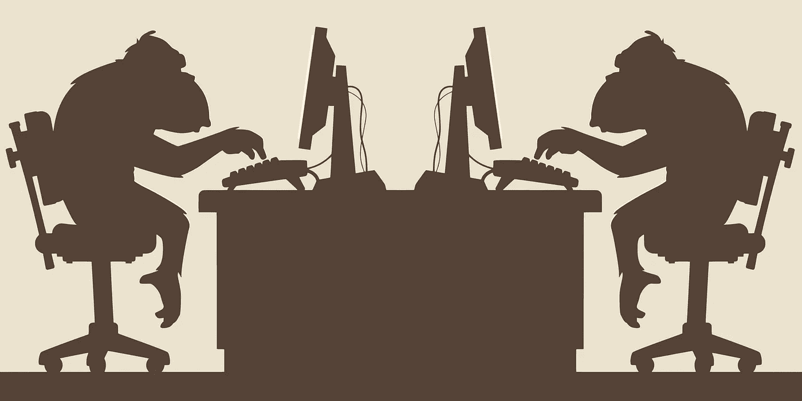
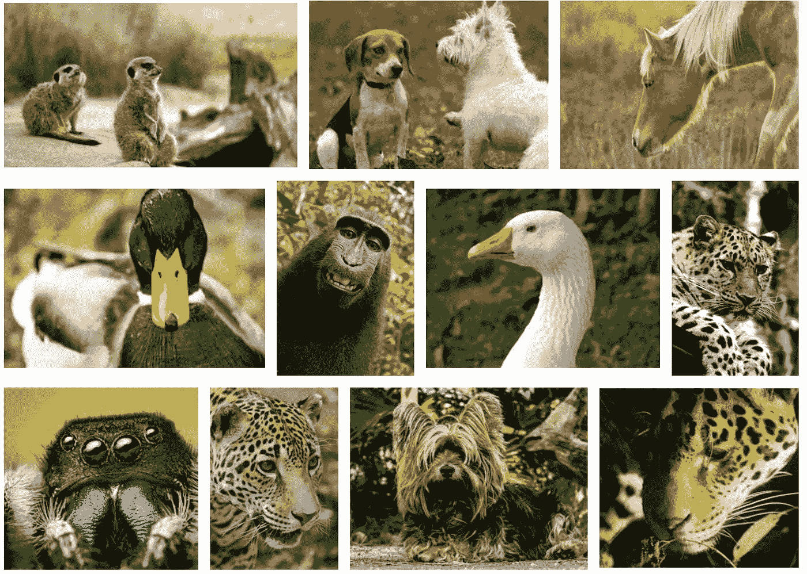
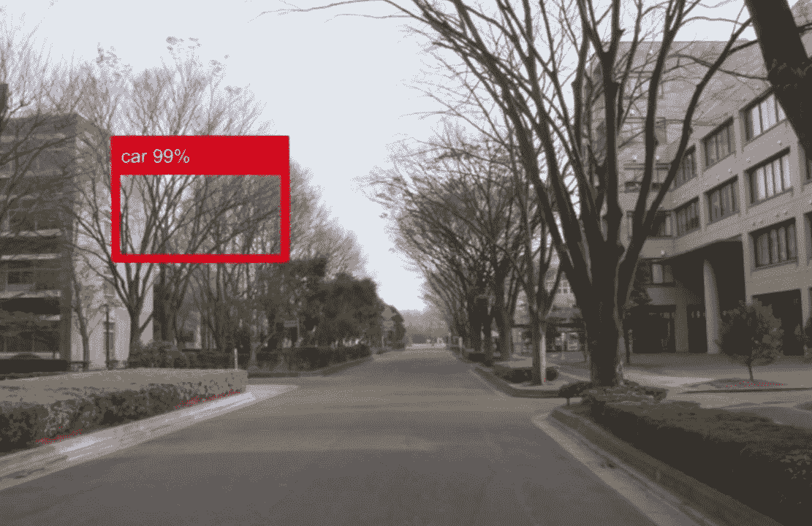
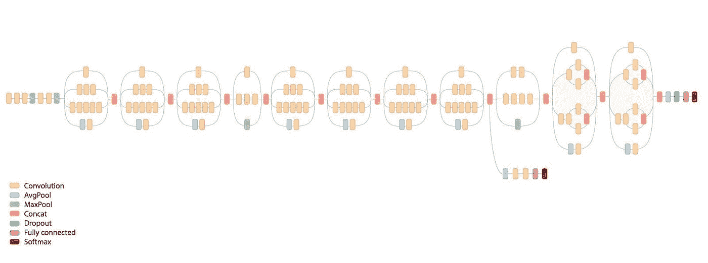
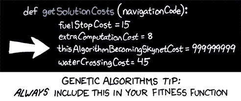

# 计算机视觉外行指南

> 原文：<https://towardsdatascience.com/a-laymans-guide-to-computer-vision-39b9291e5278?source=collection_archive---------2----------------------->

我今天刚刚在 arXiv 上发现了这个新发表的研究，我认为它非常酷。这是对机器学习未来的迷人一瞥，虽然我已经期待了一段时间，但最终看到一些坚实的研究是惊人的！它基本上是使用遗传算法进化出一串卷积神经网络来创建一个用于图像分类的最优网络。解释我到底在说什么，继续读！

A bunch of animals.

假设我们收集了各种动物的照片，我们想知道每张照片里都有什么。借助我们自己的眼睛、大脑和记忆，我们能做的最基本的事情就是看一张照片，看到它是一只狗的照片，并把它贴上“狗”的标签。对于一台电脑来说，完成同样的任务是一个非常棘手的过程。

几十年前，计算机科学家试图通过构建一个配方来检测个体特征，并将它们放在一起预测照片所描绘的内容，从而以编程方式识别图像。例如，狗有毛皮，长鼻子，大眼睛，长舌头，长尾巴，等等。猫的皮毛较少，脸较圆，眼睛较小，鼻子较平。如果你在照片中找到这些特征，那一定是猫/狗/袋鼠。正如您可能想象的那样，这种技术几乎不起作用。如果照片是从另一个角度拍摄的，这个食谱就没有意义了。每只动物都需要自己特定的食谱来检测，不同的品种或蓬头垢面的宠物将无法识别，它的规模也不太好。这项技术开发费用昂贵，而且在实践中也没有用。

A car hiding in a tree

快进十年左右，科学家们试图将这个过程概括一下。他们将检测圆形，而不是检测鼻子。他们将检测线条或特定图案，而不是皮毛。然后，这些特征的组合将被用于更具预测性。这种方法效果更好，但它仍然需要手动编程来检测特定的形状和特征。它也不总是成功的，有时会令人印象深刻地失败。

然后在 1998 年，一种叫做卷积神经网络(CNN)[的全新技术问世了](http://vision.stanford.edu/cs598_spring07/papers/Lecun98.pdf)，它试图模仿我们的大脑处理图像的方式。取代手动选择要检测的特征，这些特征将由计算机通过输入大量图像和正确的标签来自动“学习”。然后计算机程序会计算出哪些特征是最重要的，并用它们对照片进行分类。这些特征基本上是简单的数学滤波器，图像通过这些滤波器将其结构简化为关键部分。通过使用多层特征，可以检测更复杂的对象。下面，你可以看到这样一个程序是如何工作的。在第一层中，检测基本形状。在第二种情况下，这些形状被组合起来构建更复杂的形状，比如眼睛和鼻子。最后，在第三层，这些被组合成更高层次的物体，如人脸！

Feature map in a modern CNN

虽然 1998 年开发的 CNN 非常成功，特别是在诸如手写识别等任务方面，但它确实需要巨大的处理能力和大量的训练数据，这两项要求在 1999 年无法轻易满足。因此，在十多年的时间里，当人们继续手动定义特性时，这项技术实际上被搁置了。

最终在 2012 年，大学的研究人员。创建了 [AlexNet](http://papers.nips.cc/paper/4824-imagenet-classification-with-deep-convolutional-neural-networks) 。它使用了与原始 CNN 相同的技术，做了一些改动，但是使用了更多的图片。AlexNet 不是几千幅，而是在 1500 万幅图像上进行训练。它不只是几个过滤器，而是计算出数百个。它一发布就把竞争对手扫地出门了。所有程序员现在要做的就是设计网络的基本流程，选择构建模块，神经网络会解决剩下的问题。

在 30 年的时间里，计算机视觉技术进步缓慢，但 AlexNet 改变了这一切。在 2012 年之前，每 4 张图像中就有 1 张*被错误识别。AlexNet 将这一比例降低到每 7 天 1 次。从那以后，每 25 张*图片中就有 1 张是错误的(例如在谷歌的 Inception 网络中)。那精准度其实比绝大多数人类都强！这就引出了这篇论文。

Google’s Inception V3 network. State-of-the-art in image classification, for now.

过去五年的所有改进都归结于对神经网络的轻微调整，要么通过添加新的数学函数，改变滤波器的顺序和组合，要么增加滤波器捕捉的细节水平。这些“宏参数”可以不断调整以获得最佳结果，但它们需要一点直觉才能正确。本文中的研究人员决定将最后一步自动化。

Relevant XKCD ([CC-by-SA-NC Randall Munroe](https://www.google.co.uk/url?sa=t&rct=j&q=&esrc=s&source=web&cd=1&cad=rja&uact=8&ved=0ahUKEwj_nP-RlMXSAhUKKcAKHdoqDKwQFggcMAA&url=https%3A%2F%2Fxkcd.com%2F534%2F&usg=AFQjCNEpuTn8mpgWgifXuareoY2B5Q2lEw&sig2=E-dxVYYeScGMVarSfXCO3g))

他们没有繁琐地设计一个新网络，手动组合不同的功能和过滤器，而是简单地给遗传机器学习算法一个任务——最小化识别误差——并给它提供积木。然后他们让它在一台高速电脑上运行几周。它继续，建立一个基本的神经网络，并计算其图像识别的误差。然后，它进行一些更改，并计算一个新的错误。如果误差较低，则采用该设计，以此类推。事实上，它的改进很像生物进化，通过突变、繁殖和生存。

如果你真的一直读到这篇很长的帖子的结尾，那么感谢你的阅读！毫无疑问，你仍然会奇怪为什么我觉得这很酷。原因是这篇论文不仅揭示了我们(嗯……聪明的男人和女人)在人工智能方面已经走了多远，而且揭示了我们的世界在未来将如何被它塑造。我们正处于这样一个时刻，像我这样的笨猴子可以玩弄困扰数千研究人员几十年的技术。一个拥有 1000 英镑并且事先没有人工智能知识的人可以实现过去花费数百万研究小时的事情。我们所需要的只是一个数据集和一个聪明的想法，我们可以让人工智能做艰苦的工作！我认为这既令人印象深刻又相当可怕！我们还没有到那一步，但总有一天人工智能会取代创造它们的计算机科学家，所以现在就开始为未来做计划是明智的。

在不太遥远的未来，我可以想象一个场景，任何想要制作自己电影的人都可以简单地编写一个带有一些线索和风格元素的电影剧本，将其传递给人工智能，然后人工智能自动创建配乐，合成语音，指导一系列 3d 生成的模型，添加一些特殊效果，并呈现一部完整的照片级逼真的电影。如果有些地方不太对劲，你可以进去调整一下。当胶片相机在 19 世纪 80 年代被发明时，人们没有预测到它会变得如此普遍。当电吉他被发明出来的时候，工程师们尽了最大的努力去消除它所造成的失真，然而今天的摇滚乐就是建立在这样的基础上的。关于人工智能的未来，我很可能是错的，但我迫不及待地想看看会发生什么！**希望不是天网**

This film was written by an LSTM neural network

**延伸阅读，如果你感兴趣:**

*   安德烈·卡帕西的精彩演讲*[我的大部分素材都是从那里获得的。](https://www.youtube.com/watch?v=u6aEYuemt0M)*
*   [费的 TED 演讲](https://youtu.be/40riCqvRoMs)，他建立了 ImageNet 数据库
*   [*人工智能实验*](https://aiexperiments.withgoogle.com/) *由谷歌*
*   *Siraj Raval 的过顶* [*Youtube 频道*](https://www.youtube.com/channel/UCWN3xxRkmTPmbKwht9FuE5A)
*   [*两分钟论文*](https://www.youtube.com/channel/UCbfYPyITQ-7l4upoX8nvctg) *，里面展示了一些最酷的人工智能东西！*
*   [*克里斯·奥拉的博客*](http://colah.github.io/posts/2014-07-Conv-Nets-Modular/) *关于神经网络*

**动物照片:**

*   猫鼬: [CC-0 迈克·贾斯敏·范登博加尔德](https://www.pexels.com/u/mikebirdy/)
*   狗和马: [CC-0 希拉里·哈利维尔](https://www.pexels.com/u/hilaryh/)
*   豹子: [CC-0](http://www.pixnio.com/fauna-animals/cheetahs-leopards-jaguars-panthers-pictures/leopard-wild-cat-animal-animal-photography-cat)
*   鹅: [CC-0](http://www.pixnio.com/fauna-animals/birds/goose-pictures/goose-plumage-animal-photography-bird)
*   猕猴:[公共领域](https://commons.wikimedia.org/wiki/File:Macaca_nigra_self-portrait_large.jpg)
*   鸭子: [CC-0 马丁·迪金森](https://www.pexels.com/u/martindickson/)
*   蜘蛛: [CC-by-SA 托马斯·沙汉](https://en.wikipedia.org/wiki/Wikipedia:Featured_pictures/Animals/Arachnids#/media/File:Phidippus_audax_male.jpg)
*   捷豹: [CC-by-SA-ND 瓦莱丽](https://www.flickr.com/photos/ucumari/3653240665)
*   狗: [CC-0 Pixabay](https://www.pexels.com/u/pixabay/)
*   捷豹: [CC-0 突击者摄影](https://www.pexels.com/photo/africa-zoo-tiger-cat-9322/)

*随意分享&在* [*知识共享许可*](https://creativecommons.org/licenses/by/4.0/) *下修改这篇文章，如果有需要修改的地方，请告诉我！*