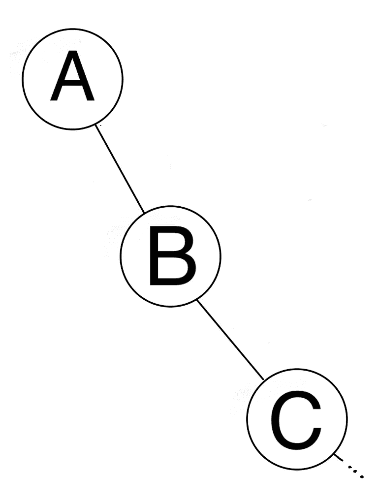
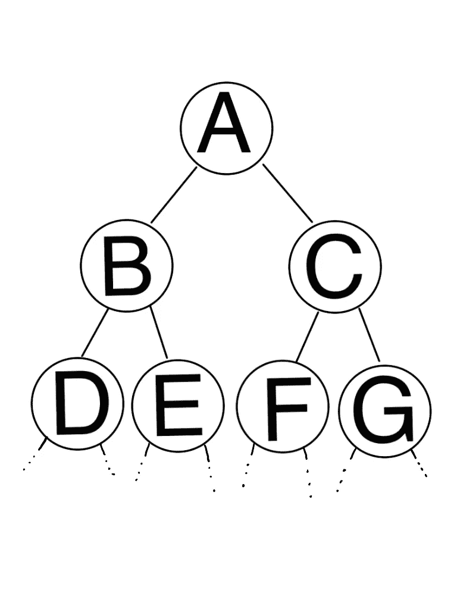
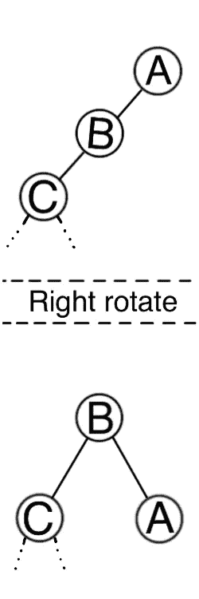
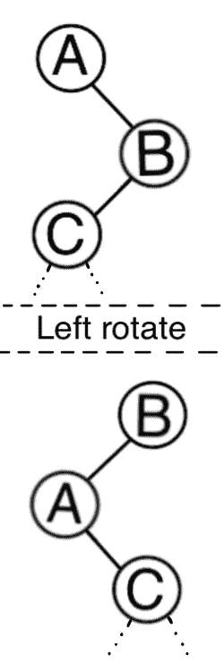
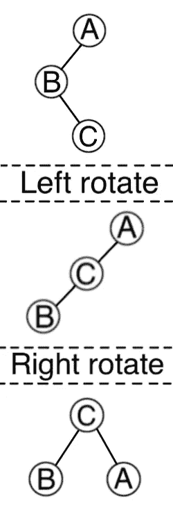

# 二分搜索法树一瞥

> 原文：<https://towardsdatascience.com/a-look-into-binary-search-trees-ee2d69e9d0ef?source=collection_archive---------10----------------------->

本周我一直在学习算法和数据结构，所以我想我们应该深入研究一下技术面试中常见的数据结构，二分搜索法树。对我来说，学习一个新主题的最好方法是看它如何应用于现实世界的问题，所以我将从解决特定问题的角度来介绍这个主题。

让我们假设你在一家软件工程公司工作，一个客户向你提出了一个问题。他们为一个只有一条跑道的小机场工作。他们要求您开发一个预订系统，该系统将跟踪着陆的飞机，以便没有重叠。他们希望能够为您的申请提供一个时间`T`,该时间代表两次航班着陆之间的最短时间，以分钟为单位。最后，他们希望应用程序在 O(log n)中运行。

让我们首先考虑什么样的数据结构最适合这个问题。第一个想到的是一个`Unsorted list / Array`结构，但是几乎所有你想用数组做的事情都将以线性时间运行(`O(N)`)。插入以恒定的时间运行，然而，搜索是线性的，当一架新飞机请求着陆时间时，我们将需要搜索一个可用的时隙。

下一个逻辑步骤是`Sorted Array`，这允许我们使用二分搜索法在`O(log N)`中找到请求的时间，并且我们可以通过将它与它之前和之后的下一个相邻时间进行比较来验证恒定时间(`O(1)`)中的槽。当我们试图插入新的预订时，问题出现了。要将一个新元素插入到一个排序的数组中，我们必须将插入点之前的所有其他元素向前移动 1，这是在线性时间内完成的，这违反了我们的最后一个要求。

考虑到这一点，我们继续进行`Sorted Linked Lists`。这种结构允许在恒定的时间内插入，但是剥夺了我们应用二分搜索法的能力，这将我们的搜索时间复杂度降低到线性时间。

现在我们已经讨论了各种可能性，最符合我们需要的数据结构是排序数组，那么我们如何解决它的插入问题呢？这就是二叉查找树发挥作用的地方。二叉查找树(BST)，也称为有序二叉树，是一种基于节点的数据结构，其中每个节点不超过两个子节点。每个子节点必须是另一个二叉查找树的叶节点或根节点。左侧子树仅包含键小于父节点的节点；右边的子树只包含键大于父节点的节点。

二叉查找树为我们提供了一些有趣的时间复杂性。为了搜索，我们必须遍历所有元素。因此，在二叉查找树中搜索的最坏情况复杂度为 O(n)。对于插入元素，它必须作为一片叶子插入到正确的位置，以保持二叉查找树不变量为真。因此，我们需要遍历所需的元素来找到它的正确位置，其最坏情况的复杂度为 O(n)。最后，对于删除，我们必须遍历所有元素来找到要删除的目标。因此，二叉树中的删除具有 O(n)的最坏情况复杂度。通常，这些操作的时间复杂度是`O(H)`，其中`H`是 BST 的高度。树的高度被定义为从节点到叶子的最长路径。这不应该被混淆

所以现在，我想象你对着你的电脑屏幕大喊“`O(H)`的复杂性不符合客户给我们的`O(log N)`的要求！”。放轻松，老虎，我们会成功的。让我们讨论树的高度的最好和最坏的情况。

Worst Case Scenario

在最坏的情况下，每次我们添加一个叶子，它都会被添加到相同的路径中。如果将一系列递增的数字添加到树中，就会出现这种情况，因为每个数字都比上一个数字大，它总是会选择正确的路径。这导致树的高度为`N`,因此如果我们的目标是这棵树的叶子，那么无论何时我们都必须遍历它，我们将不得不查看每一个元素。该树的时间复杂度为`O(N)`。

Best Case Scenario

在最好的情况下，我们所有的节点均匀地分布在整个树中。没有一条路比另一条路更长。这被称为平衡树，它为我们在其上执行的操作提供了最佳的运行时间。每次你选择一个分支往下走，你实际上是把你必须搜索的节点数减半，就像一个。是的…你猜对了，二分搜索法算法。平衡二叉树的高度将是`log N`，因此其基本操作的时间复杂度也将是`O(log N)`。

现在唯一需要回答的问题是如何保持我们的树木平衡。有许多不同的算法来平衡一棵树，我们将使用 AVL 树(以发明者命名)作为这个例子，因为它是第一个被发明的这样的数据结构。在 AVL 树中，任何节点的两个子树的高度最多相差 1；如果在任何时候它们相差一个以上，就要进行重新平衡以恢复该属性。这保证了在一般和最坏的情况下，查找、插入和删除都需要花费`O(log N)`时间。

为了保持 AVL 树的平衡，我们必须记录两个孩子的身高差。差额由`abs(Height(RightSubtree) — Height(LeftSubtree))`计算。只要结果小于 1，我们就知道我们的树符合 AVL 定义。请注意，这个公式永远不会产生大于 2 的值，因为我们一次只会向已经平衡的树中添加一个节点。当一棵 AVL 树变得不平衡时，我们必须对它的子树进行旋转以重新平衡结构。

Blatantly stolen image from [Wikipedia](https://en.wikipedia.org/wiki/Tree_rotation).

由`α, β and γ`表示的三角形代表`N`大小的子树。当在树上执行旋转时，它的顺序遍历是不变的，这允许我们的树保持它的排序性质。

最简单的解决模式是我喜欢称之为线模式。在这种情况下，节点沿直线向右或向左延伸。在这种情况下，旋转中间节点(在这个例子中是`B`)将平衡我们的树。

在大多数情况下，右旋转或左旋转将平衡树。然而，有一个实例，其中插入创建了之字形图案，其中单次旋转不会改变树的最终平衡。在左边的例子中，我们在`B`上执行向左旋转。在这种情况下，旋转只是移动节点，因此树现在是右偏而不是左偏。

Double Rotation

对此的解决方案是首先在底部节点上执行旋转，使其符合线型。然后，您可以像在线型中一样旋转中间节点，并平衡您的树。这就是所谓的双旋转。

让我们回到我们的问题上来。当插入一个节点时，我们必须遍历树，一旦我们找到它的插入点，我们就可以检查它的父节点和子节点是否离它至少有`K`远。如果满足所有验证，我们的函数将返回一个`true`，否则返回一个`false`。在 AVL 树中插入一个新节点可以在`O(log N)`时间内完成，搜索可以以相同的复杂度完成。

我希望这有助于照亮二分搜索法树和他们的力量。作为临别礼物，我留给你一张来自维基百科的 gif，它很好地概述了 AVL 树中的插入和旋转。

AVL Tree Insertion and Rotation

**一如既往，如果您喜欢此内容或有任何反馈，请在下面留下评论* *