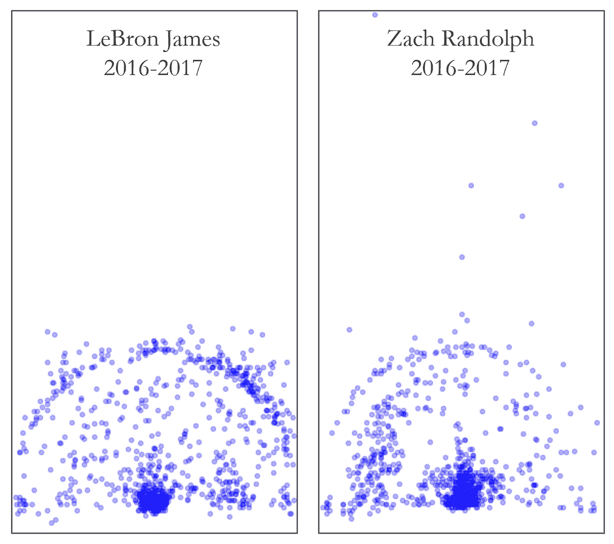
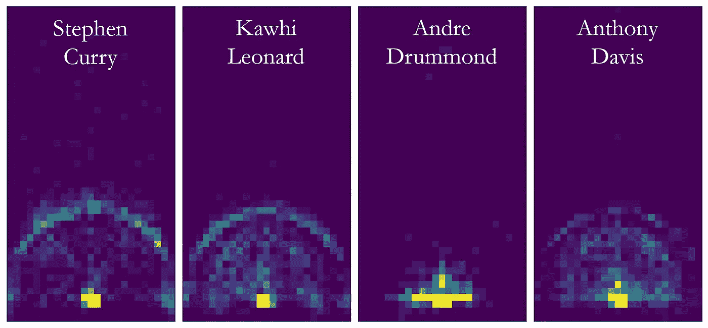
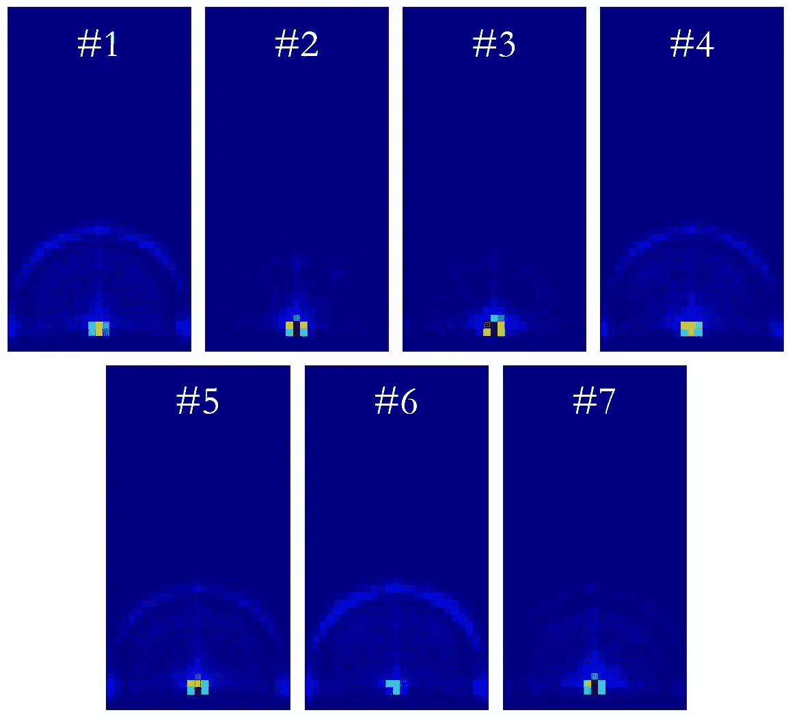
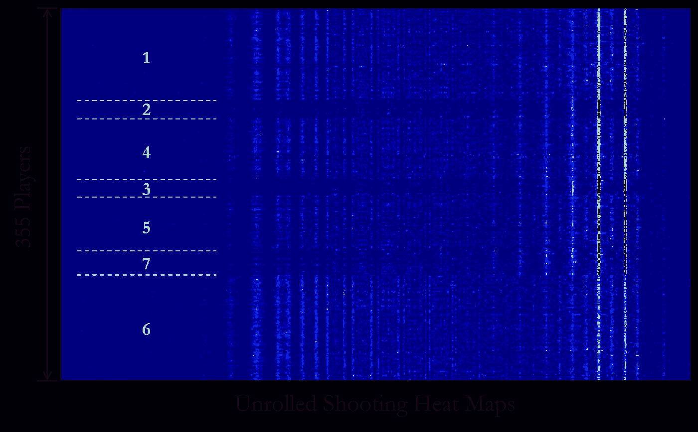
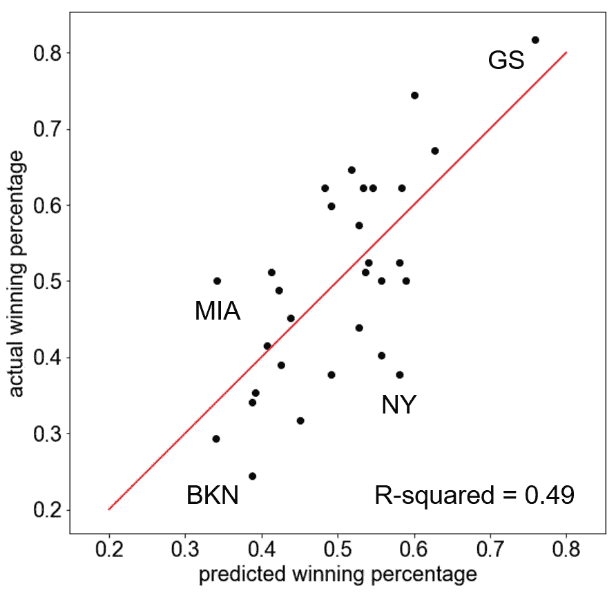
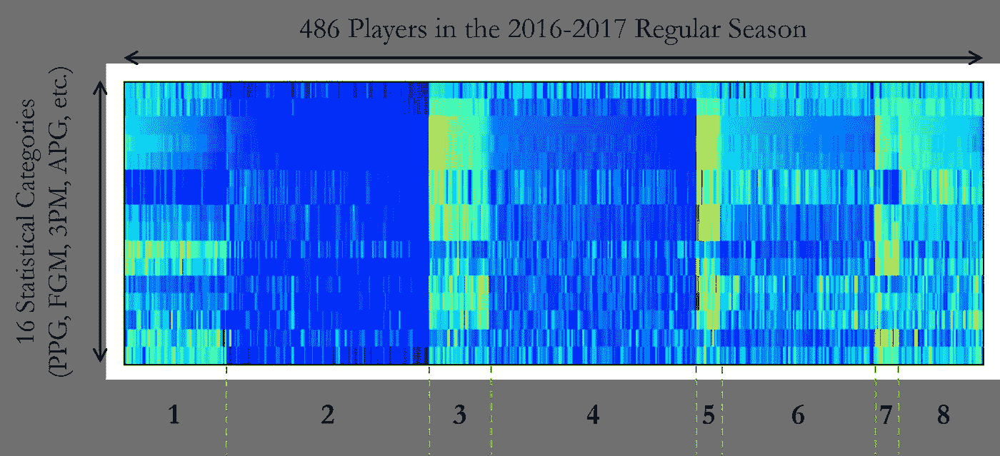
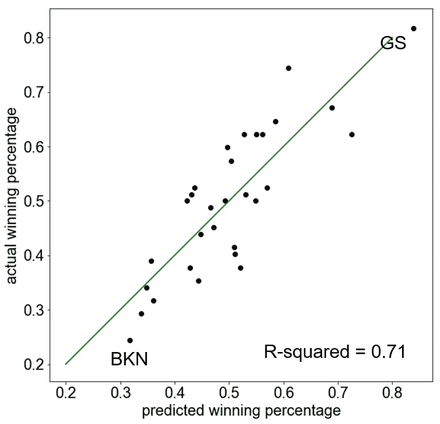
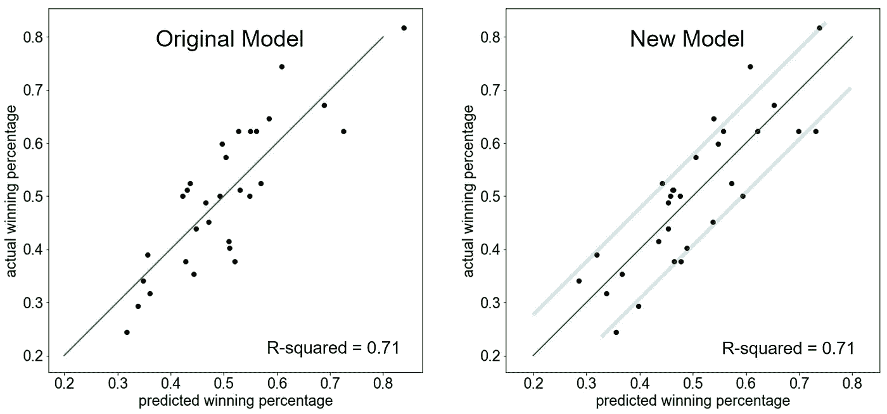

# 冶金学家预测 NBA 球队成功的方法

> 原文：<https://towardsdatascience.com/a-metallurgical-scientists-approach-to-predicting-nba-team-success-4bfa7b2bd6a7?source=collection_archive---------5----------------------->

彼得·蔡博士

由于我是博客社区的新手，请允许我介绍一下我自己。我是一名训练有素的冶金科学家，很难认为自己是一名专业的体育分析师。然而，在我内心的书呆子成长为完全成熟之前，我已经是一个忠实的篮球爱好者(包括打球和观看)，并且作为一个技术领域的积极研究者，我通常倾向于通过创造性思维和定量分析从可用数据中发现新的见解。因此，下面的故事详细介绍了几个月的随机研究结果，试图回答我脑海中一个简单但反复出现的问题:篮球队的胜率在多大程度上反映了其球员的表现统计数据和比赛风格？

冶金研究界的一个普遍观点是，合金的性能与其化学组成或成分密切相关。例如，两种合金可能包含完全相同的*类型*的原子种类，但是由于它们的化学成分的平衡不同，它们的测量属性有很大不同。打个篮球的比方，我的假设的基本假设是，所有活跃在 NBA 的球员都可以根据他们在场上活动的共同相似性被分成有限数量的不同类别。如果大体上是真的，那么每支球队的名单就可以根据组成球队的球员类型来明确地描述。就像工程合金的化学成分决定了它的结构属性一样，我假设一个团队的球员构成应该反映它的获胜成功率。

眼前的挑战是找出如何具体定义这些“所谓的”玩家类别。最明显的分组就是篮球中的五个位置: **PG** 、 **SG** 、 **SF** 、 **PF** 和 **C** 。通常，一个球队的质量是通过一个球员名单的“深度”来评估的，这个“深度”是指占据每个位置的球员数量。不幸的是，传统的位置缺乏特异性，因为它们不能充分描述现代游戏中球员的进攻风格，在现代游戏中，角色可能有很大的重叠。例如，勒布朗詹姆斯正式成为一名小前锋，但像一名控球后卫一样，比传统的中锋更好地控制局面。另一方面，凯里·欧文是得分后卫，但打得更像得分后卫。最近几年，我们也引进了所谓的“延伸 5”，像布鲁克·洛佩斯这样的中锋，他们可以在内线投球，也可以游走到外线，以意想不到的效率投篮。让我们不要忘记凯文·杜兰特，一个 7 英尺高的小前锋，但拥有令人印象深刻的后卫般的技能。

对比赛风格更准确的描述是累积击球图表，这是一个赛季中在球场上尝试击球的所有位置的 x-y 图。利用各种 Python 库中的工具，我能够从网上抓取 2010 年至 2016 年间所有 NBA 球员的投篮数据。虽然数据的原始来源是 stats.nba.com，但因为包含拍摄图表信息的 API 最近变得无法访问，所以我从可靠的第三方网站[www.nbasavant.com 间接获得了相关数据。](http://www.nbasavant.com.)为了说明投篮图表中包含的其他见解，请参见下面提供的勒布朗·詹姆斯和扎克·兰多夫过去一个赛季的图表。

显然，勒布朗·詹姆斯似乎更喜欢从篮筐的左侧(从球员的角度来看)投篮，而扎克·兰多夫更喜欢从另一侧投篮。这个观察相当有趣，因为伦道夫是左撇子，而詹姆斯是右撇子，这使得他们的倾向有些反常。由于球员之间的射门量不同，为了根据相似的射门图表模式有效地比较球员，我通过将数据的二维直方图与尝试的投篮总数归一化，将每个射门图表转换为热图。请看下面的例子，在过去的一个赛季中，联盟中几位杰出球员的 25 x 47 热图。

接下来是机器学习的魔力。我首先将每个玩家的 25 x 47 热图展开成 1 x 1175 个特征向量，然后将它们堆叠起来，创建一个数据矩阵，每行数据代表一个特定的玩家。平均每场比赛投篮不到一次的球员被排除在外，因为他们的累积投篮量不足以产生一个准确描绘他们投篮倾向的地图。然后，我继续应用一种经过试验但真正无监督的学习算法，K-means 聚类，将数据矩阵中相似的行/玩家分组在一起。使用“肘技术”，决定了球员可以根据他们的拍摄模式分为 7 类。7 个组的代表性质心是通过平均属于一个组的所有球员的击球图表创建的，如下所示。

看着这些图片，可以说有些群体并没有太大的不同。例如，组 2、组 3 和组 7 都由主要在内线活动的玩家组成，属于组 2 的玩家是否真正不同于组 3 的玩家是值得怀疑的。作为健全性检查，我根据组标签重新组织了累积数据矩阵中的所有行，并可视化了它的图像表示，如下所示。为了视觉上的清晰，超出半场线的不必要的数据被剪掉，因为“空白”背景对所有球员来说几乎是一样的。

盯着数据矩阵足够长的时间，你可以说服自己，聚类算法识别的 7 组球员实际上是彼此不同的。在成功地对球员进行分类之后，每支球队的组成可以通过 7 维“组成”向量来具体描述，属于一个组的球员人数作为向量的相应特征。例如，勇士队的组成向量为[4，3，1，1，3，2，0]，这意味着其 2016-2017 年的球员名单由 4 名属于第 1 组的球员，3 名属于第 2 组的球员，1 名属于第 3 组的球员组成，…你明白了。再次提醒，平均每场比赛投篮次数少于一次的球员被排除在分析之外，所以名册的实际大小可能略大于组合向量的总和。然后，通过将 30 支球队中的每支球队的组合向量一个接一个地堆叠起来，来编译 30×7 的球队组合训练集，并且使用简单的线性回归模型来评估每一类球员相对于其对球队胜率的贡献所承担的“权重”:

通常，将一组训练示例(在我们的例子中是团队组成向量)分成训练集、交叉验证集和测试集被认为是一种良好的做法，以便确保模型的泛化，防止过度拟合，并避免潜在离群值的不良影响。由于团队组成数据集相对较小，仅包含 30 个训练示例，因此我使用了不同的方法来优化模型。对 24 个小组的随机子集进行线性回归，记录得到的拟合系数，包括截距值。这个过程重复了很多次，直到所有试验的平均拟合系数收敛到“最佳”值。

奇怪的是，简单的回归分析表明，第 2 组和第 6 组(最大的正系数)的球员对球队的成功贡献最大，而第 4 组和第 7 组(负系数)的球员对球队获胜的机会没有任何帮助。下面是回归模型的预测胜率图，通过团队组成矩阵和拟合系数之间的内积计算得出，与所有 30 个团队的实际胜率相比。

红线表示完美的可预测性，点的显著分散表明模型远非理想。然而，预测胜率和实际胜率之间的 R 平方值 0.49 并不是微不足道的，这证实了射击模式至少是团队成功的一个重要因素。

也许上述预测模型最明显的不足是完全没有考虑到玩家的表现指标。毕竟，获胜只需要一支球队比他们的对手得分更多，不需要火箭科学家告诉你，最好的球队也会有最好的得分手和防守者。类似于上面描述的分析方法，我再次应用 K-means 算法来识别独特的球员群体，这一次是基于从 stats.nba.com 获得的 16 类传统球员统计数据而不是射门图。这些包括比赛次数、上场时间、得分、投篮次数、投篮次数、三分球次数、三分球次数、罚球次数、罚球次数、进攻篮板、防守篮板、助攻、失误、抢断、盖帽和个人犯规。该算法成功识别了 8 个不同的玩家组，下面显示的是 jet 配色方案中 16 x 486 累积数据矩阵的彩色表示，根据组标签排序。深蓝色表示统计类别中的最低值，深红色表示最高值。

从图像中可以立即注意到几个有趣的细节。第二组包括大量几乎在每个统计类别都很低的玩家；这些多是被贬到替补席的“默默无闻”的球员，希望能被插入轮换阵容。与之形成鲜明对比的是，第 5 组的球员代表了目前超级巨星的上层梯队:拉塞尔·维斯特布鲁克、詹姆斯·哈登、伊塞亚·托马斯、德玛尔·德罗赞、达米恩·利拉德、德马库斯·考辛斯、勒布朗·詹姆斯、科怀·伦纳德、斯蒂芬·库里、凯文·杜兰特、吉米·巴特勒、约翰·沃尔、凯尔·洛瑞、埃里克·布莱索。有趣的是，这一组包括了过去一个赛季所有提议的和官方的 MVP 候选人，证明了该算法客观地识别联盟最佳球员的能力，其中一些球员，如埃里克·布莱索，由于球队表现不佳或赛季结束受伤而被忽视。第七组包括联盟中著名的大个子:安东尼·戴维斯、卡尔-安东尼·唐斯、扬尼斯·阿德托昆博、乔尔·恩比德、克里斯塔普斯·波尔津吉斯、拉马库斯·阿尔德里奇、哈桑·怀特塞德、尼古拉·约基奇、尼古拉·武切维奇、迈尔斯·特纳、鲁迪·戈贝尔、安德烈·德拉蒙德、德怀特·霍华德和迪安卓·乔丹。同样，有趣的是，根据流行的看法，名单中的一些球员并不被认为是全明星级别的，即使他们的表现数据表明并非如此。

像以前一样，我继续对基于统计的团队组成矩阵的随机子集应用迭代线性回归。不出所料，拟合系数的值显示，上一段中讨论的第 5 组和第 7 组对团队的成功贡献最大。下面显示的是预测胜率与实际胜率的散点图，预测值由基于统计的回归模型的拟合系数计算得出。

关于这些结果没有太多可说的，只是第二个回归模型的可预测性与第一个模型不相上下。为了改进模型，我尝试了一个“愚蠢”的简单方法，将第一个合成矩阵与第二个合成矩阵合并成一个 30×15 的矩阵；简单的理由是，由于投篮命中率和表现统计都是球队成功的重要因素，也许结合两者的回归模型会导致预测准确性的提高。

事实上，混合回归模型的预测胜率之间的相关性明显好于前两个模型，其 R 平方值为 0.71，RMSE 误差为 0.07。

进一步改进该模型的一个可能的方法是通过合并说明一个组中每个玩家的独特性的信息。回想一下，在团队组成向量的创建中，特定组中的玩家被认为是彼此无法区分的；勒布朗·詹姆斯对一支球队的价值被认为和德马库斯·考辛斯一样。换句话说，即使在一个给定的组中的玩家之间有轻微的差异，这些差异也被分析方法忽略了。

我得出的解决方案是用一个给定玩家到群体质心的相对“距离”来评估这个玩家对所有*群体的贡献。也就是说，如果将组形心想象成不同的颜色，每个玩家将被表征为所有*颜色的部分混合，而不是采用最近形心的绝对颜色。玩家的数据表示越像特定的质心，它对该组的贡献就越大；相反，远离质心的玩家对相应组的贡献很小。由此可见，玩家到质心的距离 ***d*** 的倒数可以作为接近度的定量度量，并且玩家对组 ***i*** 的分数贡献可以由以下表达式给出:**

**

*使用该策略，构建了新的 30×15 团队组成矩阵，并再次应用线性回归来计算模型的新拟合系数。令人惊讶的是，新模型的预测结果乍一看并没有显示出明显的改善(R 平方= 0.71，RMSE 误差为 0.07)，即使每个队的组成向量现在更准确地描述了其组成球员的个性。为了比较，下面是两个混合回归模型的“预测与实际”图。*

**

*尽管为两个模型计算的 R 平方值几乎相同，但对图的进一步观察表明，新模型中绘制的数据点的分布更加结构化。例如，右边图中的淡蓝色线是“完美可预测性”趋势线的变化版本。注意它们与数据点的重叠程度；本质上，这表明了超额预测的胜率都偏离了实际胜率几乎相同的量(~ +0.10)，对于预测不足的胜率团队也是如此(~ -0.07)。对这些观察结果的合理解释是，也许所有被高估或低估的球队都有不可忽视的相似之处(例如，球员受伤、赛季中期名单变化、教练、团队化学等)。)是新模型没有考虑到的。然而，确认是否如此需要进一步的分析，这超出了本初步研究的范围。*

*因为本研究中的回归模型是建立在团队组成决定成功的基本概念之上的，所以它有可能被用作建立成功 NBA 球队的指导工具。假设一名球员的表现统计数据和特征投篮图表可以从一个球队转移到另一个球队，该模型可以提供一个相当不错的潜在收购对球队获胜机会的直接影响的定量估计。据我所知，我可能是错的，整个联盟管理层的团队重组决策仍然主要植根于人类的直觉和传统智慧。我并不是建议球探和人类的直觉应该被计算模型所取代，但我个人认为，NBA 的名册建设工作肯定可以受益于比现在更受数据驱动。*