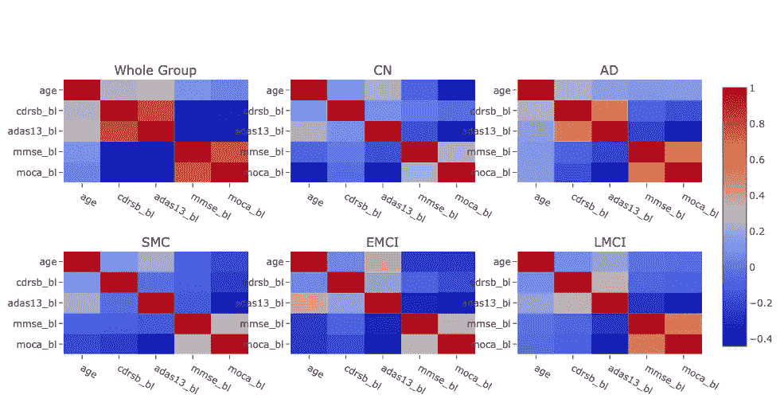
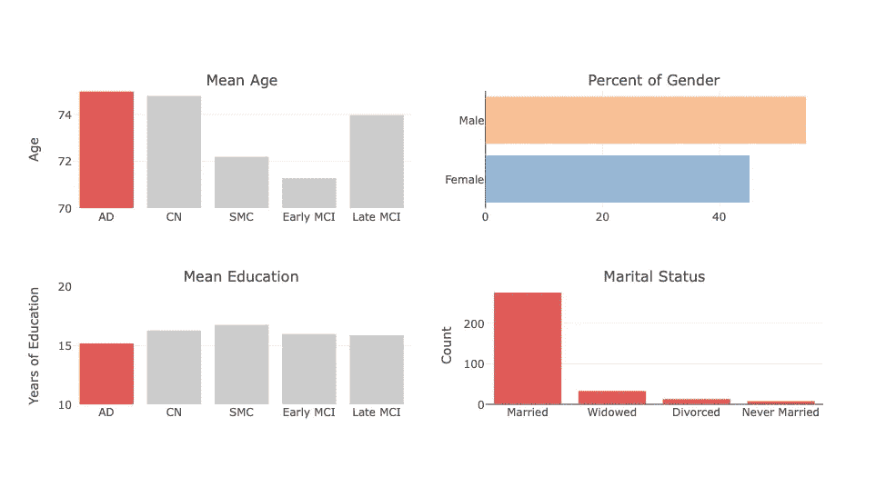
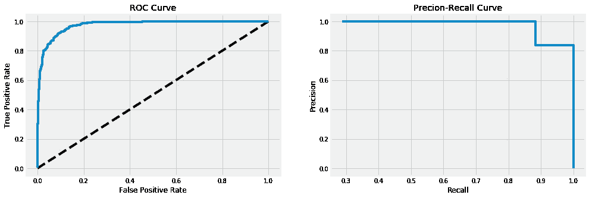

# 一个没有时间的头脑:对向阿尔茨海默病转化的分类

> 原文：<https://towardsdatascience.com/a-mind-without-time-classifying-the-conversion-to-alzheimers-disease-1a5c6079bb91?source=collection_archive---------12----------------------->

这是我在跳板数据科学职业生涯的第一个顶点项目的总结。

由于我的背景是脑科学，我想从事与我的专业领域相关的机器学习工程。令人欣慰的是，许多伟大的科学家和医生已经投入了大量的工作，使大量关于阿尔茨海默病(AD)的数据公开和可访问。我在这个项目中使用的数据集来自阿尔茨海默病神经成像倡议(ADNI)，主要由南加州大学神经成像实验室(LONI)管理。这不是唯一一个公开的关于 AD 的数据集，但它似乎包含了我认为与识别有患 AD 风险的人相关的最多样化的变量集。

我从 ADNI 检索到的数据集包括已知在某些方面与 AD 相关的变量。其中包括:

*   年龄和性别等人口统计信息
*   相关认知评估的分数
*   大脑区域体积和皮质厚度的估计
*   脑功能活动的测量
*   APOE4 等位基因的存在

# 研究的基本原理

我查阅了已发表的关于 AD 分类的文献，发现大多数研究都专注于使用特定的数据类型，无论是认知评估还是基于 MRI 的测量。很好，最近对这些研究的综述是 [**多变量数据分析和阿尔茨海默病的机器学习，重点是结构磁共振成像**](https://www.researchgate.net/publication/261520070_Multivariate_Data_Analysis_and_Machine_Learning_in_Alzheimer%27s_Disease_with_a_Focus_on_Structural_Magnetic_Resonance_Imaging) **。**

虽然确切的指标和评分标准因研究而异，但使用 MRI 特征的方法通常以 68-75%的**准确度将转换器与非转换器进行分类。**使用多模态特征集的性能更好，以 68–82%的**准确度分数将转化者与非转化者进行分类，我观察到的最高准确度分数是 [91.5%](https://www.ncbi.nlm.nih.gov/pubmed/21236349) 在专门对转化为 AD 的 MCI 患者进行分类时。考虑到一些基准，我接下来概述了我的研究用例。**

# 目标受众和使用案例

这项研究的主要目标受众是医疗保健提供者。结构和静息态功能磁共振成像是最简单和最快的大脑成像方法之一。使用它们对处于危险中或患有 AD 的人进行分类将有助于提供早期干预和针对性治疗。重要的是，能够准确地对有转化为阿尔茨海默病风险的人进行分类也将允许医院在资源稀缺时优先考虑用于预防的资源。

作为科学家，另一个目标受众是学术界。这是我写这些论文和博客的很大一部分原因。正如牛顿的名言

> 如果说我看得更远，那是因为我站在巨人的肩膀上

我能在这么短的时间内，只用我的笔记本电脑完成这项研究的原因是因为研究社区的存在，他们推动数据和数据分析向所有人开放和开放。如果没有 ADNI 或 Sci-Kit Learn 的开发人员，将会有一个人无法合理完成的大量工作。我坚信科学最好是在开放的环境中进行，方法、代码和数据都可以向其他人公开。在我看来，这大大加快了集体知识和对世界以及我们在其中的位置的理解的速度。

在接下来的部分中，我将概述我在这项研究中采取的具体步骤，如果您想自己运行它(我强烈建议这样做)，可以链接到代码和数据。如果你只对研究结果感兴趣，直接进入第三步。

# 第一步:数据争论

无论好坏，数据争论是数据科学的核心，通常需要大量的时间投入。当数据集对您来说很陌生时尤其如此，因为您需要了解您正在处理的变量、它们之间的潜在关系、它们与您正在解决的特定问题的关系，以及需要对它们做些什么才能使模型构建成为可能。

我采取的所有数据争论步骤都包含在这个 [Jupyter 笔记本](https://github.com/A2ed/springboard_data_science/blob/master/capstone_1_mri/data_cleaning.ipynb)中。注意，所有的编码都是用 Python 完成的。简而言之，我采取的步骤是:

*   重命名列，使它们更容易理解和理解
*   从主数据帧中提取感兴趣的列
*   将主数据框与包含 fMRI 测量的数据框合并
*   记录缺失值
*   删除或估算缺失值
*   将时间序列列减少到具有感兴趣的测量的患者就诊
*   处理诊断变更栏中的缺失值
*   识别并清除诊断更改列中的重复条目

清理后的数据帧在这里[可用。](https://github.com/A2ed/springboard_data_science/blob/master/capstone_1_mri/df_cleaned.csv)

# 步骤 2:探索性数据分析

像数据争论一样，一个好的 EDA 是数据科学工作流程的重要组成部分。这是你开始理解其中的数据和模式的机会，也是你开始讲述背后的故事的机会。我们通常带着特定的假设/问题来处理数据集，一个有洞察力的 EDA 将显示为什么该假设是重要的，但也可能揭示与假设/问题相关的有趣方面，这些方面可能无法从我们的直觉和领域专业知识中获得。

这方面的一个例子是我在 EDA 期间做的一些功能工程。当观察不同诊断组(即 AD、认知正常、早期轻度认知障碍、晚期轻度认知障碍、显著记忆问题)的认知评估得分之间的关系时，我注意到两种易于使用的认知评估之间的相关性随着认知障碍的严重程度而变化。

Correlation matrices showing the relationship between scores on different cognitive assessments broken down by diagnosis type

这些图中有两个要点需要注意。首先，如果我们只看整个组内的关系，数据中有趣的模式会被掩盖。第二，测试分数之间的相关性随着诊断类型的不同而变化。在 AD 患者中，CDRSB 和 ADAS13，以及 MMSE 和 MOCA 之间存在高度正相关。这些相关性在晚期 MCI 患者中有些明显，在 CDRSB/ADAS13 相关的情况下，在认知正常的人群中呈负相关。为了进一步研究这一点，我创建了一个新的特征向量，它采用了 CDRSB 和 ADAS13 之间的得分差异。这只是特征工程捕捉这方面数据的一种方法，但正如我们稍后将看到的，这是将转化为 AD 的患者与未转化为 AD 的患者进行分类的一个重要特征。

完整的 EDA 在这个 [Jupyter 笔记本](https://github.com/A2ed/springboard_data_science/blob/master/capstone_1_mri/eda.ipynb)中可用，用于建模的最终数据帧是这里的。请注意，我使用这个 EDA 作为学习伟大的 plotly 可视化库的机会。虽然我没有在离线模式下编码所有的情节，所以笔记本没有渲染所有的情节。你可以下载相关的[eda.html](https://github.com/A2ed/springboard_data_science/blob/master/capstone_1_mri/eda.html)文件，看看他们辉煌的剧情。

**老年痴呆症患者的画像**

虽然没有大量的人口统计信息，但观察典型的 AD 患者是什么样子还是很有趣的。

Demographic information for patients with Alzheimer’s Disease at baseline

正如我们在图中看到的，基线时 AD 患者的平均年龄大于其他诊断组，男性，受教育程度较低且已婚。

**皈依者与非皈依者**

虽然注意到典型的 ad 患者是什么样子是很有趣的，但我的目标是对有转化为 AD 风险的人进行分类，而不是对那些在基线访问时患有 AD 的人进行分类。下图显示了在研究的某个时间点转化为 AD 的患者的人口统计学信息。

Demographic information for patients that convert to Alzheimer's Disease during the study

不足为奇的是，典型的转化者被诊断为晚期轻度认知障碍而进入研究。这是因为轻度认知障碍，尤其是晚期轻度认知障碍，被认为是功能正常的人和被诊断为 AD 的人之间的中间步骤。此外，他们通常是男性，平均年龄较大，有大学学位，已婚，不是西班牙裔/拉丁裔。

EDA 包含大量信息，因为数据集非常大，并且包含许多不同的要素和要素类别。我通过它们找出了认知正常、轻度认知障碍和 AD 之间的区别。这是通过将数据中的趋势可视化，以及主要使用事后检验的 ANOVAs 进行一些统计推断来完成的。

# 步骤 3:模型评估和优化

在 EDA 之后，我决定在训练模型时使用一组精简的特征，以便最大化训练/测试集中的数据点。显示诊断类型之间差异并记录大多数患者就诊的主要特征类别是人口统计学信息、认知评估得分(不包括 MOCA)、海马和内嗅皮层的体积估计以及 APOE 突变的存在。其他特征记录得更少，将它们包含在训练集中意味着要处理大量缺失数据或丢弃大量观察值。参见下一步的最后一节，了解我打算如何处理这里没有包括的特性。

用于模型评估和优化的 Jupyter 笔记本可在[这里](https://github.com/A2ed/springboard_data_science/blob/master/capstone_1_mri/model.ipynb)获得。请注意，笔记本中有两个主要功能，您可以在自己的工作流程中复制和使用。这些功能允许您训练、优化和评估不同的分类器。

我的基本管道是这样的:

1.  提取特征值和目标标签
2.  将数据集分为训练集(75%)和测试集(25%)。请注意，这是一个分层的分离，以保持训练/测试集中转换者与非转换者的比例。这在这样的情况下是很重要的，因为这里有不止一个目标类(这里是非皈依者)。
3.  缩放非二进制数据
4.  使用网格搜索交叉验证优化超参数
5.  评估模型

为了评估这个模型，我考察了三个指标。

1.  测试集的准确度分数
2.  ROC 曲线下面积
3.  平均精度

我还绘制了 ROC 和 precision-recall 曲线，以便更好地了解性能。

笔记本显示了四个模型的结果:逻辑回归、随机森林、XGBoost 和支持向量机。我建议把它们都记下来，看看它们的表现有什么不同。现在，我将关注 XGBoost 模型，因为它在三个评估指标中表现最好。

Performance of XGBoost model on classifying coverts from non-converts

如果你以前看过这些图，你会发现这个模型在对转化为 AD 的人进行分类方面做得非常好。ROC 曲线绘制了真阳性率(被归类为转化为 AD 的患者，他们在研究期间确实转化为 AD)与假阳性率(被归类为转化为 AD 的患者，他们实际上并未转化为 AD)的对比图。精确回忆曲线的工作原理略有不同。精度是真阳性率除以真阳性率加上假阳性率。这告诉你分类器在标记真正皈依者时有多精确。召回率是真阳性率除以真阳性率加上假阴性率，假阴性率表示被归类为非皈依者的患者实际上皈依了。这是这项研究的一个重要指标，因为分类器的用例是帮助识别应该接受早期干预和预防性护理的患者。在这个用例中，向不太可能转化的人提供这些资源(误报)比不向可能转化的人提供这些资源(误报)要好。

总的来说，模型表现得非常好。请记住，它所做的是将一个人分类为在未来某个时间转换为 AD 或不转换。评估指标包括:

*   测试数据的准确率为 92.1%
*   测试数据的 ROC 曲线下面积:0.975
*   平均精度:0.787

准确性分数比我在《将皈依者与非皈依者进行分类》中看到的有了很大的提高，并且在将 AD 患者与认知正常的个体进行分类的更简单的任务上也有相似的准确性分数。但是，该模型也过度拟合了训练数据，准确率为 100%。

为了了解不同的特性是如何对模型产生影响的，我根据它们的重要性分别绘制了图表。

Feature importance in final model

虽然这只是评估特征如何影响分类模型的一种方式，但它提供了模型如何区分转换者和非转换者的初步观察。主要特征是年龄，ADAS13 和 CDRSB，海马和内嗅皮层的体积估计，以及 APOE4 等位基因。有趣的是，基线诊断并不重要。

# 后续步骤

首先，我只评估了一组精简的特性。数据集中有更多的可用数据，但这是以丢失数据增加为代价的。合乎逻辑的下一步将是训练包括其他特征类别的新模型，并观察它们与基线模型相比如何。

第二，为了处理过度拟合，我正在考虑做一些功能工程，以包括更多的功能(一个例子是在基线模型中包括功能之间的交互)，并调整交叉验证用于优化模型的得分度量。

第三，该模型目前表明一个人是否在某个时候有转化为 AD 的风险。预测转换的时间框架是可能的。这不会影响评估和转化为 AD 之间的时间，但会提示对资源有限的医院或护理人员有用的预防性治疗的紧迫性。

还有其他潜在的下一步，虽然这些对我来说是唾手可得的。我希望你喜欢这个概述，并学到了一些新的东西。如果您对研究有任何疑问，请联系我。