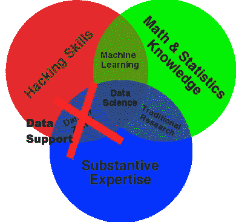

# 德鲁·康威数据科学维恩图的一个修正

> 原文：<https://towardsdatascience.com/a-modification-of-drew-conways-data-science-venn-diagram-d5ba93037e1a?source=collection_archive---------5----------------------->

在大会上我们的数据科学沉浸式项目的第一周，我们的一位讲师[马特·布雷姆斯](https://medium.com/@matthew.w.brems)展示了[德鲁·康威著名的维恩图](http://drewconway.com/zia/2013/3/26/the-data-science-venn-diagram)。

Drew Conway’s Data Science Venn Diagram

Brems 解释了每个圆圈以及交叉点，并强调了危险区域。以下是他对那个十字路口的人的体验:

我亲眼看到人们处于“危险地带”。“这些人对他们应用数据科学的现实世界问题有着非常扎实的理解，并且拥有出色的编程技能——甚至使用涉及统计的库或函数。因为这些人所拥有的技能，他们知道一种特定的建模技术可能被设计来解决现实世界的问题，并且可以利用他们的 Python(或 R，等等)。)实现它的技巧。但是，不会弹出错误消息警告用户建模技术的假设不合理或者数据没有正确缩放。在许多情况下，所发生的是正在建立的模型类型依赖于不满足的假设。因此，这些模型可能无法准确反映真实发生的情况，因此使用这些模型来更好地了解世界或解释一些现实世界的现象可能是不合适的。虽然分析通常是出于好意，但是仅仅因为 Python 能够给你一个结果并不意味着它是有意义的。当有人对一个可能误导的结果采取行动时……嗯，这就是为什么“危险区”——不理解建模背后的统计数据——会如此危险。”

康威对处于危险地带的人也有类似的看法，但他也认为恶意可能是这个十字路口的一些人的动机:

“在这个领域，完全有能力提取和构建数据的人，可能与他们相当了解的领域有关，甚至可能知道足够的 R 来运行线性回归并报告系数；但是他们对这些系数的含义缺乏理解。“谎言、该死的谎言和统计数据”这句话就是从图表的这一部分发出的，因为不管是出于无知还是恶意，这种技能的重叠让人们有能力做出看似合理的分析，而不知道他们是如何做到这一点的，也不知道他们创造了什么。”

我理解 Brems 和 Conway 的想法，但是危险区域不应该成为那些拥有编程技能和领域知识但缺乏数学技能的人的默认标签。是的——这个地区的人们有可能遇到危险，但前提是他们在没有适当的数学或统计学知识的情况下试图做出统计推断。然而，处于危险区域的人可以为分析/数据科学团队做出巨大贡献。我这样说是因为这是我过去几年工作的领域。

**数据项目管理**

我以前的工作是管理劳联-产联的会员数据。AFL-CIO 是一个工会联合会，每个工会都有一份成员名单。我们的分析团队需要一份准确的成员名单，以便他们可以创建各种模型，并根据该名单进行投票。

这项任务要求我作为项目经理与客户组织的 IT 部门合作，以确保他们及时提交成员文件。美国劳联-产联有数百万成员，我不仅需要了解数据应该是什么样子，还需要有黑客技能，能够对数据进行适当的探索性分析。

这是至关重要的，因为如果客户联盟在他们的数据上犯了一个错误，例如丢失了三分之一的文件，丢失了一个字段，或者交换了名字和姓氏等字段，这可能会对我们的程序产生负面影响。尽管这些错误不一定是我的错，但我要对它们负责——责任在我。我需要保持警觉，准备好抓住这些错误，并为客户提出解决方案。

尽可能提高这一过程的效率也很重要。许多客户希望在文件从他们的数据库中出来时就交付文件。我必须指导许多客户以标准格式提交数据，以简化流程，这需要与这些 it 部门建立关系。

他们说数据科学 80%是清洗数据，只有 20%是分析。向我们的分析团队交付我们的会员文件是我热衷的事情，因为这使他们能够进行他们拥有技能的更高层次的分析。

**描述性分析**

除了每个客户的 IT 部门，我还与每个组织的政治主管建立了关系。劳联-产联提供的一项关键服务是为劳工运动共享政治资源，这就是为什么政治指导者是重要的利益相关者。

尽管一些政治指导者可能对进入模型构建的杂草感兴趣，但许多人想要他们的数据的肉和土豆。我管理的成员更新过程的一部分是向他们的成员添加政治数据字段。

我开发了可复制的报告，这些报告将在会员更新周期结束时为每个会员生成，这些报告将告诉政治主管他们的工会成员中有多少人是注册选民，他们注册了哪个政党，他们在哪些选举中投票，等等。

这些报告对数学的要求都不比计算或生成百分比的能力更高。然而，这些报告得到了广泛的赞赏，因为我用我的领域知识和黑客技能创造了一个这些关键利益相关者想要的产品。

我并不是说我们的分析团队不能做同样的工作，但这项工作会有机会成本。由于我负责数据采集、增强和向附属机构报告关于其会员资格的描述性统计数据，我们的分析团队可以更加专注于分析会员和投票者数据，以帮助推动我们组织的战略。

**数据支持:黑客和领域知识的交集**

事实是，任何一个极端的十字路口都可能是危险地带。处于领域知识和数学技能的交叉点，但不会编程的人将总是被 Excel 电子表格提供的百万记录限制所限制。如果有人处于黑客技术和数学技能的交叉点，但不具备他们行业的领域知识，他们可能会提出一个理论上很好的建议，但由于他们行业的现实，这个建议是站不住脚的。

Data Support: The Intersection of Hacking Skills and Substantive Expertise

尽管我不是我们分析团队的成员，但以上是我为支持他们的工作所做贡献的例子。这种关系之所以有效，是因为我没有试图扮演数据科学家。我没有尝试运行回归、神经网络或决策树，并以某种方式、形状或形式使用它来影响我们组织的战略。然而，我总是钦佩他们的工作，因此我现在在大会上提高我的数学技能。

分析和数据科学团队应该寻找符合这些技能的人。站在这些人的肩膀上，他们可以专注于分析，以帮助他们的组织取得成功。