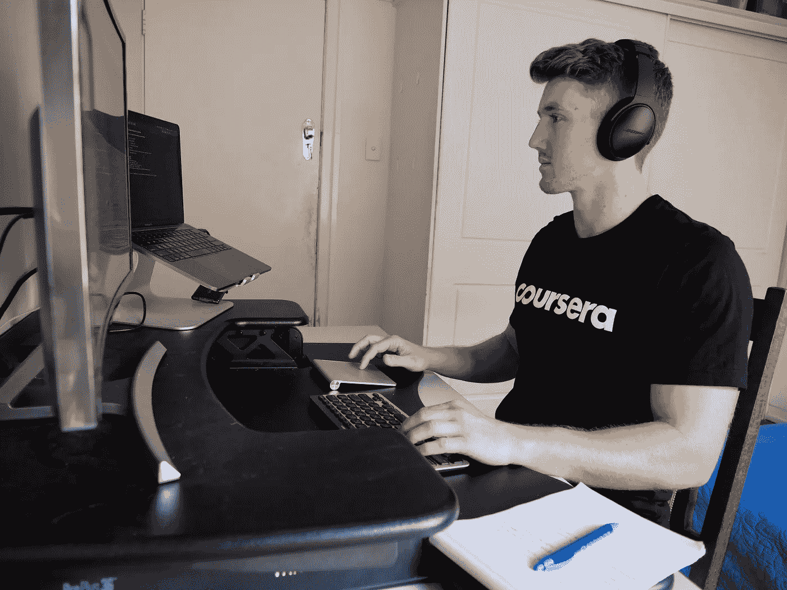

# 每天用四个小时学习数据科学的非革命性技术

> 原文：<https://towardsdatascience.com/a-non-revolutionary-technique-for-learning-data-science-in-four-hours-per-day-68da3199fd64?source=collection_archive---------9----------------------->

## (或者其他什么……)

Man sitting at computer desk whilst looking intently at a monitor— [@mrdbourke](http://instagram.com/@mrdbourke) on Instagram

大学里临时抱佛脚应付考试对我来说从来都不起作用。我记得考试那天，我走进校园，直奔食堂。

请来两杯红牛。

然后，我的膝盖会在接下来的两个小时里不停地敲打，但我的大脑却无法将这些点联系起来。当我 4 个小时前读到的东西没有出现在页面上时，我会感到不安。

三年制的学位五年后，我毕业了。但是我从大学带走的最有价值的东西不是那张纸。它是学习如何学习。

我没有在考试前几天死记硬背，而是把整个学期的工作量分成 25 分钟的小块。没有任何革命性的东西。但对我来说是。

现在我也一样。

当我想学东西的时候，我试着每天做一点。

> 如果你想学点什么，最好的方法就是和做任何事情一样，一点一点来。

对于数据科学和编程，我的大脑在大约四个小时的集中注意力时达到极限。之后，工作开始遵循收益递减规律。

作为一名机器学习工程师，我花了很多时间在马克斯·凯尔森(Max Kelsen)清理数据，在互联网上研究解决问题的新方法，并编写数据科学和机器学习管道的代码，以投入生产。

所以当我完成工作时，我不可能有效地学习新的东西。我不再死记硬背更多的信息，而是用运动、创造和休息来填满时间。让潜意识做它该做的事。

在我不在 MK 的日子里，如果我想提高我的技能，我会使用番茄工作法。还记得之前的 25 分钟吗？

还是那句话，没什么革命性的。但我是那种对什么都兴奋的人。因此，如果像设置计时器这样简单的事情能让我集中注意力，我完全赞同。

在重要的日子里，我会瞄准 10 个。

其他日子我会瞄准 8。有时更少。

很简单。你设定了一个 25 分钟的计时器，在这 25 分钟里，除了你在一天开始时为自己设定的单一任务之外，什么也不做。你想重复多少次就重复多少次。

假设你做了 10 次，你的一天可能是这样的:

> **早上 7 点 45 分**
> 
> 抽屉里有电话。
> 
> **上午 8 点**
> 
> 打开[关注 Mac](https://itunes.apple.com/au/app/be-focused-focus-timer/id973130201?mt=8) 并设置定时器。或者你可以使用任何其他计时设备(除了你的手机，太多分散注意力的东西)。
> 
> 番茄 1 号
> 
> 5 分钟休息
> 
> 番茄 2 号
> 
> 5 分钟休息
> 
> 番茄 3 号
> 
> 5 分钟休息
> 
> 番茄 4 号
> 
> 30 分钟休息
> 
> **上午 10 点 25 分**
> 
> 番茄 5 号
> 
> 5 分钟休息
> 
> 番茄 6 号
> 
> 5 分钟休息
> 
> 番茄 7 号
> 
> 5 分钟休息
> 
> 番茄 8 号
> 
> 60 分钟休息
> 
> **下午 1 点 20 分**
> 
> 番茄 9 号
> 
> 5 分钟休息
> 
> 番茄 10 号
> 
> 5 分钟休息
> 
> **下午 2 点 20 分**

现在还不到下午 2:30，如果你做对了，你已经完成了一些不可思议的工作。你现在可以检查你的手机了。

你可以用下午剩下的时间补上那些你需要补上的东西。

你不认为 10 次 25 分钟(4 小时多一点)的时间足够做你需要做的事情吗？

试试看。你会惊讶于你在 4 小时的专注工作中所能完成的事情。

上面的时间表类似于我在找到工作之前花了九个月时间攻读我自己的[人工智能硕士学位](http://bit.ly/AIMastersDegree)。

前几天也是一样。除了我在中午的时候挤出一点时间去训练和小睡。

我在 Coursera 上学习密歇根大学的 Python 应用数据科学专业[。](http://bit.ly/courseraDS)

前几课都是关于操作数据的不同方法。我发现这是解决机器学习问题时最重要的步骤之一。课程项目与我在 Max Kelsen 做机器学习工程师时的日常工作非常接近。

因此，如果你想提高你的数据科学技能，特别是预处理步骤，我建议试试免费的 [7 天试用期，看看专业化是否适合你](http://bit.ly/courseraDS)。

如果你不能在一天之内完成 10 件值得专注的工作。从 1 开始。然后 2。然后 3。有时你甚至会决定超过 25 分钟。最终，你会想知道你是如何以其他方式工作的。

PS 你不用把手机放在抽屉里。如果你白天需要它，你需要它。

*本文首发于*[*【mrdbourke.com】*](http://mrdbourke.com)*(每天还有更)。*