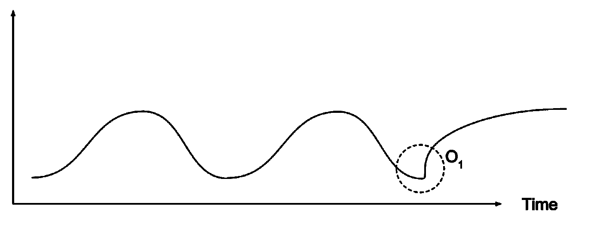

# 关于发现异常的一个注记

> 原文：<https://towardsdatascience.com/a-note-about-finding-anomalies-f9cedee38f0b?source=collection_archive---------0----------------------->

# 序言

这篇文章的灵感来自于在大学期间所做的研究。本文的目标是提醒人们发现异常并不是一项简单的任务(目前)。

# 介绍

异常检测是指发现不符合正常预期行为的观察结果的任务。在不同的应用领域中，这些观察结果可以被命名为异常、离群、新奇、例外、惊喜。文献中最常见的术语是异常值和异常值。异常检测是各种领域中的实际问题，例如:

*   入侵检测
*   欺诈检测
*   工业损伤检测
*   医疗和公共卫生
*   图像处理
*   文本数据中的异常检测
*   传感器网络和其他领域

# 什么是异常

不幸的是，异常没有明确的定义，这就是为什么我选择了下面这个——异常是数据中不符合正常行为的明确定义的模式[1]。我们可以用一个简单的二维空间来说明异常(图 1)。

Figure 1\. Illustration of simple anomalies in two-dimensional space

N₁和 N₂是有正常数据的地区，因为大多数观测值都在这些地区。远离正常区域的点，如 O₁点、O₂点和 O₃地区点是异常点。数据中的异常可能由于不同的原因而出现。恶意活动、信用卡欺诈、入侵、系统故障等。这些异常对数据分析师很有吸引力。因此，异常检测是一个重要的过程，并被认为是各种决策系统的优势。

# **异常类型**

异常可分为以下三类:

*   *点异常*。如果一个对象可以相对于其他对象被观察为异常，则它是点异常。这是最简单的异常类别，许多研究都包括它们。考虑图 1 所示的例子，O₁和 O₂是异常点
*   *语境异常*。如果对象在某个定义的上下文中是异常的。只有在这种情况下才是语境异常(也称条件异常[2])。在图 2 中可以看到周期性的背景。在这种情况下，点 O₁是异常的，因为它不同于周期性的背景
*   *集体异常*。如果一些链接的对象可以相对于其他对象被观察为异常。在这种情况下，单个物体不可能是异常的，只有物体的集合才是异常的。

Figure 2\. Contextual anomaly example

我们需要明白，这些异常是有联系的。如果我们对它应用上下文，点异常可以变成上下文。或者点异常可以变成集体异常，如果我们把多个点异常连接在一起。

在抽象层面上，异常检测似乎是一项简单的任务。但是这项任务非常具有挑战性。以下是一些挑战:

*   定义正常区域是非常困难的。在许多情况下，异常数据和正常数据之间的界限并不精确。在这种情况下，正常的观察可以被认为是异常，反之亦然
*   如果行为是恶意的，如欺诈，它被认为是异常的。攻击者经常试图使他们的行为适应正常行为。同样，在这种情况下，识别异常任务并不简单
*   今天被认为是正常的，将来可能就不正常了。在各种因素的影响下，大多数业务系统都会及时发生变化
*   一个领域中的异常检测方法通常不能用于另一个领域。它们在大多数情况下是无效的
*   模型训练的训练和验证数据可用性是一个大问题

# 让我们来玩吧！

下面我将给出一些数据集的例子。你的目标是慢慢滚动(一个例子接一个例子)并尝试用眼睛确定异常。

Figure 3\. Little game

正如您所看到的，在某些情况下“通过眼睛”来确定异常并不简单。即使你会应用一些统计技术，它仍然不是微不足道的。那么，去哪里找，做什么呢？

# 异常检测方法概述

可用于发现异常的方法分为以下几类[4]:

*监督异常检测。*在训练和测试数据集中标记数据的设置；当简单的分类器可以被训练和应用时。这种情况类似于传统的模式识别，只是类别在大多数情况下非常不平衡。并非所有的分类方法都适合这项任务。例如，某些类型的决策树不能很好地处理不平衡的数据。[支持向量机【SVM】](https://en.wikipedia.org/wiki/Support_vector_machine)或者[人工神经网络](https://en.wikipedia.org/wiki/Artificial_neural_network)应该表现更好。然而，这种设置是不相关的，因为我们需要知道所有的异常并正确标记数据。在许多情况下，异常是事先不知道的，或者可能在测试阶段以新奇的方式出现。

Figure 4\. Supervised anomaly detection

*半监督异常检测。*最初*，*当我们没有任何知识时，我们从训练结果中收集。该设置还使用训练和测试数据集，其中只有训练数据由没有任何异常的正常数据组成。其思想是，正常类的模型已经被教导，并且异常可以通过偏离学习的模型来检测。这种方法也被称为“一类”分类。众所周知的方法是一类支持向量机和[自动编码器。](https://en.wikipedia.org/wiki/Autoencoder)一般来说，任何密度估计方法都可以用于建模正态类的概率密度函数，例如[高斯混合](https://en.wikipedia.org/wiki/Mixture_model#Gaussian_mixture_model)方法或[核密度估计](https://en.wikipedia.org/wiki/Kernel_density_estimation)。

Figure 5\. Semi-Supervised anomaly detection

*无监督异常检测。*一种设置，当我们不知道数据中哪些是正常的，哪些是不正常的。这是最灵活的配置，不需要任何标签。训练数据集和测试数据集之间也没有区别。其概念是无监督异常检测方法仅基于数据集的自然特征对数据进行评分。通常，距离或密度用于评估什么是正常的，什么是异常值。可视化表示可以在图 6 中找到。

Figure 6\. Unsupervised anomaly detection

大多数方法作为输出会给出分数或标签。评分和贴标签的区别在于灵活性。使用评分技术，分析师可以选择更适合问题领域的值。之后，他可以使用阈值来选择异常或只选择顶部的异常。标签是一种分类。如果不对领域和特征提取进行研究，到目前为止还没有一种方法可以在所有领域都获得同样的成功。大多数无监督的异常检测方法如图 7 所示。

Figure 7\. Unsupervised anomaly detection approaches classification diagram

# 现实生活是动态的

如果定义的环境中的可观察对象的行为随时间改变，则该环境可以被认为是动态环境。

动态环境，如生产过程、通信网络、公路交通等。，可能包含大量随时间变化的信息，这对于理解环境的一般行为、发现环境中当前发生的规律和异常、控制进化过程以及智能建模或管理环境来说是宝贵的资源[3]。

例如:一个正在成长的网上商店。交通和交易量的变化。以前正常的事情现在不会了，这种转变只能被认为是一种异常。这是之前确定的挑战之一。另一个例子是分析客户行为的系统。最初可以对客户进行分类。但是顾客也可以因为某种原因及时从一个等级转移到另一个等级。随着软件的更新或行为的改变，系统会随着时间而发展。首先，为了有效地检测异常，需要持续学习的系统。其次，要在早期阶段检测异常，不能等到指标明显超出界限。早期检测需要能够检测到模式中不明显的细微变化。此外，由于异常本质上是不可预料的，有效的检测系统应该能够确定异常事件是否是新的，而不依赖于预编程的阈值。

检测动态环境中的异常似乎是一项艰巨的任务。可以面临的最大问题是，在大多数公司里，不会有可供学习的数据。在这种情况下使用的大多数方法应该是无人监管的。

# 可能的解决方案

目前进步并给人希望的解决方案包括神经网络(NN)，其中一些与统计方法相结合。

现在用于时间序列的流行神经网络是长短期记忆(LSTM)——它在深度学习领域受到欢迎，因为它们有可能记住长期运行的依赖关系。

另一种有趣的网络是新的，没有提到很多，是分层时间记忆(HTM)——这是一种基于神经科学研究的神经网络，它也有能力学习和记忆长期运行的依赖关系。会告诉你更多。

**分级时间记忆(HTM)**

HTM 是由 Numenta 公司的 Jeff Hawkins 和 Dileep George 开发的一种无监督到半监督的在线机器学习方法，它是一种旨在捕捉新大脑皮层的结构和算法属性的技术。HTM 是新大脑皮层的理论，几乎没有类似的大脑结构。新大脑皮层约占人脑体积的 75%，它是我们所认为的大部分智力的核心。HTM 是一个生物理论，这意味着它来自神经解剖学和神经生理学，并解释了生物新皮层如何工作。他们说，HTM 理论是“生物约束的”，与机器学习中使用的术语“生物激励的”相反。

HTM 学习方法设计用于动态环境，如传感器和电机数据。传感器输入可以根据来自服务器的不同障碍而改变。相反，输入数据可能会发生变化，因为传感器的移动与人眼观看静态图像的移动相同。

HTM 系统在线学习。当输入数据有任何变化时，HTM 系统的存储器被更新。有一种标准的机器学习方法，如在测试和训练数据集中拆分数据，并学习网络以达到定义的准确性水平。问题来了:“如果没有标签，它怎么知道，它工作正常？它如何纠正自己的行为？”。在每一个时间点，HTM 都会预测下一步会发生什么。换句话说，HTM 建立了一个预测世界的模型。然后，将预测与发生的事情进行比较，这个结果是学习的基础。作为一种经典的机器学习方法，它试图最小化预测的误差。HTM 不断学习。这是生物有机体生存的基本素质。HTM 是围绕这一理念建立的，即智能系统需要像生物有机体一样不断学习。将会有系统不需要在线学习的应用，但是这些不是标准，而是例外。HTM 假装是一种通用的学习方法，适用于任何具有时间行为的任务。更多细节可以在他们的网站上找到，参考以下来源[4]。

# 发明了新方法！如何证明有效？

好吧，你发明了新方法来解决这个问题。如何证明你的方法有效并且比别人更好？

许多研究人员在研究无监督异常检测方法时遇到了一个问题——没有一个定义好的框架来评估它们的性能。许多科学家只做理论上的假设。目前，出现了一些创建这种框架的尝试。

Markus Goldstein 和 Seiichi Uchida 在他们的工作[5]中提出了如何对异常检测方法进行评估。但是他们的评估方法是基于处理表格数据的方法。

在 2015 年第 14 届机器学习和应用国际会议(IEEE ICMLA)上，Alexander Lavin 和 Subutai Ahmad 提出了他们的实时异常检测程序评估方法 Numenta 异常基准(NAB)[6]。

**抓捕**

这是时间序列中异常检测程序的第一个基准。 [NAB 是一个开源框架](https://github.com/numenta/NAB)，旨在通过可控和可重复的环境来评估实时异常检测程序。NAB 数据语料库由 58 个真实数据集组成，其中异常窗口被标记。每个文件包含 2，000 到 22，000 个时间戳，数据以 5 分钟为间隔聚合。它的总分是 365，551 分。这些数据集是合成的和真实的:

*   IT 指标
*   社交媒体聊天
*   工业机器传感器

评分机制定义了异常检测窗口来衡量早期检测。它奖励算法:

*   检测所有存在的异常
*   尽快发现他们
*   触发很少的误报
*   处理实时数据
*   在所有数据集中都是自动的

它使用应用程序配置文件来衡量不同场景的性能。“开始吧”一节中的所有数据集示例都来自该基准测试。

# 结论

许多主要产品是某种数据库的公司会在会议上提出这个话题，并向你展示如何用他们的工具发现异常。但问题是，所示方法仅适用于特定数据集和用例。永远记住这一点。

请记住，发现异常需要分析师给出适当的定义。有不同类型的异常。有不同的方法可以找到特定类型的异常。总是试图缩小你的问题。并针对您的问题使用可用的基准或一些数据集(如果可用)来测试您的方法。

要阅读更多关于这个主题的内容，你可以参考下面的不同文章。

愿原力与你同在。

# **参考文献**

[1]chan dola v .，Banerjee，a .和 Kumar v .，2009 年。异常检测:综述。美国计算机学会计算调查，7 月。41(3).

[2]宋，谢，吴，米&杰梅因，2007 .条件异常检测。IEEE 知识与数据工程汇刊，3 月 26 日，19(5)，第 631–645 页。

[3]川野，h，西尾，s，韩，j 和长谷川，t，1994。知识发现如何与主动数据库技术合作控制动态环境？。希腊雅典，柏林海德堡施普林格出版社。

[4]霍金斯，j .，艾哈迈德，s .和拉文，a .，2016 年。生物和机器智能。地点:【http://bit.ly/2qJzvjO 

[5] Goldstein，m .和 Uchida，s .，2016 年。多元数据无监督异常检测算法的比较评估。PLoS ONE，11(4)，第 31 页。

[6]拉文和艾哈迈德，2015 年。评估实时异常检测算法 Numenta 异常基准。迈阿密 IEEE。