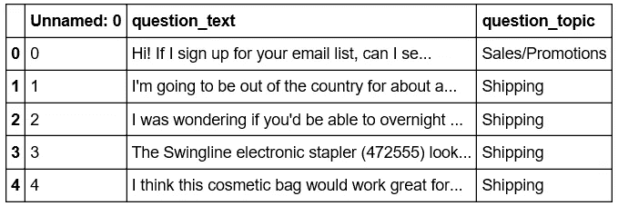

# 一个生产就绪的多类文本分类器

> 原文：<https://towardsdatascience.com/a-production-ready-multi-class-text-classifier-96490408757?source=collection_archive---------1----------------------->


在任何业务中，理解客户是成功的基本要素。用户的观点、查询和意见在传递用户观点方面起着重要作用。每个人现在都在试图使用一种叫做“自然语言处理”的新兴技术来收集这些嵌入式用户对产品或服务的看法。文本或句子分类是“自然语言处理”下一个非常热门且必要的问题。在这篇文章中，我们将介绍如何使用支持向量机构建一个生产就绪的多类文本分类器。

[](https://github.com/sambit9238/Machine-Learning/blob/master/question_topic_nlp.ipynb) [## sambit 9238/机器学习

### 机器学习——它代表了机器学习在不同场景中的一些实现。

github.com](https://github.com/sambit9238/Machine-Learning/blob/master/question_topic_nlp.ipynb) 

任何机器学习问题的第一步都是收集所有分析和预测所需的数据。这里，我们使用的数据集包含 5000 个客户查询和相应的问题主题。总共有 5 个独特的问题主题。因此，让我们首先导入所需的依赖项并加载数据集。

```
import pandas as pd
import numpy as np
#load data
df = pd.read_csv("question_topic.csv")
```

为了了解数据是如何存在的，让我们探索一下数据集中的 5 个随机观察值。

```
df.sample(5)
```



在继续之前，我们需要检查问题主题以及在数据集中出现的次数。

```
from collections import Counter
Counter(df["question_topic"])
```


每个职业出现的次数看起来还不错，尽管在职业中不平衡。现在，在进行特征分解之前，我们首先需要做一些预处理，比如去除数字等。因为它们无助于预测问题的上下文。

```
#pre-processing
import re 
def clean_str(string):
    """
    Tokenization/string cleaning for dataset
    Every dataset is lower cased except
    """
    string = re.sub(r"\n", "", string)    
    string = re.sub(r"\r", "", string) 
    string = re.sub(r"[0-9]", "digit", string)
    string = re.sub(r"\'", "", string)    
    string = re.sub(r"\"", "", string)    
    return string.strip().lower()
X = []
for i in range(df.shape[0]):
    X.append(clean_str(df.iloc[i][1]))
y = np.array(df["question_topic"])
```

现在，让我们对数据进行训练测试分割，开始建模。一般惯例是取 70%作为训练数据，30%作为测试数据。

```
#train test split
from sklearn.model_selection import train_test_split
X_train, X_test, y_train, y_test = train_test_split(X, y, test_size=0.3, random_state=5)
```

之后，训练测试分裂，我们应该开始设计分类器。因为输入是文本，我们首先需要将它们转换成数字向量，以输入到任何机器学习算法中。使用以下两种方法完成要素的矢量化。

**CountVectorizer:** 将评论转化为 token 计数矩阵。首先，它对文本进行标记，并根据每个标记出现的次数，创建一个稀疏矩阵。CountVectorizer 矩阵的计算:假设我们有三个不同的文档，包含以下句子。

“相机很棒”。

“相机太可怕了”。

“相机没问题”。

生成大小为 3*5 的矩阵，因为我们有 3 个文档和 5 个不同的特征。矩阵将看起来像:-


**TF-IDF:** 它的值代表一个词在语料库中对文档的重要性。TF-IDF 值与一个词在文档中的出现频率成正比。TF-IDF 值的计算:假设电影评论包含 100 个单词，其中单词 Awesome 出现了 5 次。Awesome 的项频率(即 TF)则为(5 / 100) = 0.05。同样，假设语料库中有 100 万条评论，单词 Awesome 在整个语料库中出现 1000 次，则逆文档频率(即 IDF)被计算为 log(1，000，000 / 1，000) = 3。因此，TF-IDF 值计算如下:0.05 * 3 = 0.15。

现在，数字向量作为支持向量机算法的输入给出。因为在文本情况下特征的数量通常很大，所以线性核通常表现最好。

这里的另一个挑战是多类分类。在支持向量机实现中，我们可以使用 OneVsRest 分类器概念。OneVsRest(或一对一对所有，OvA 或 OvR，一对一对所有，OAA)策略涉及每个类训练一个单一的分类器，该类的样本作为阳性样本，所有其他样本作为阴性样本。这种策略要求基本分类器为其决策产生一个实值置信度得分，而不仅仅是一个分类标签；单独的离散类别标签会导致模糊性，即针对单个样本预测多个类别。

为了使分类器设计生产就绪，我们可以创建一个上述所有这些过程的管道，从而使其更容易转移到其他系统。

```
#pipeline of feature engineering and model
model = Pipeline([(‘vectorizer’, CountVectorizer()),
 (‘tfidf’, TfidfTransformer()),
 (‘clf’, OneVsRestClassifier(LinearSVC(class_weight=”balanced”)))])
#the class_weight="balanced" option tries to remove the biasedness of model towards majority sample
```

对于使用的每一种机器学习算法，参数调整都起着重要的作用。已经观察到，通过设置适当的参数值，模型的性能合理地提高。我们可以使用网格搜索找到适合我们情况的参数，如下所示

```
#paramater selection
from sklearn.grid_search import GridSearchCV
parameters = {'vectorizer__ngram_range': [(1, 1), (1, 2),(2,2)],
               'tfidf__use_idf': (True, False)}
gs_clf_svm = GridSearchCV(model, parameters, n_jobs=-1)
gs_clf_svm = gs_clf_svm.fit(X, y)
print(gs_clf_svm.best_score_)
print(gs_clf_svm.best_params_)
```


所以，现在我们从网格搜索中得到合适的参数。是时候使用最合适的参数来准备最终的管道了。

```
#preparing the final pipeline using the selected parameters
model = Pipeline([('vectorizer', CountVectorizer(ngram_range=(1,2))),
    ('tfidf', TfidfTransformer(use_idf=True)),
    ('clf', OneVsRestClassifier(LinearSVC(class_weight="balanced")))])
```

然后，我们将使用训练数据和测试数据来拟合模型，以便对整体性能有一个总体了解。

```
#fit model with training data
model.fit(X_train, y_train)
#evaluation on test data
pred = model.predict(X_test)
from sklearn.metrics import confusion_matrix, accuracy_score
confusion_matrix(pred, y_test)
```


Confusion Matrix

否则，如果确信从网格搜索交叉验证获得的准确度分数，我们可以直接用全部数据拟合模型。

```
model.fit(X, y)
```

现在我们需要将准备模型保存在 pickle 文件中，以便可以在生产端部署它。python 中的 joblib 函数使它变得更容易。

```
from sklearn.externals import joblib
model = joblib.load('model_question_topic.pkl')
```

现在模型已经准备好并保存到文件系统中。对于模型部署，pickle 文件可以移动到生产站点，并将通过如下所示的输入进行调用

```
from sklearn.externals import joblib
model = joblib.load('model_question_topic.pkl')
question = input()
model.predict([question])[0]
```

提高文本分类器性能的更多技巧可以是:-

1 .消除低质量特征(单词)

2.有一个合适的停用词表

3.多样化你的训练语料库

4.使用词干化和词汇化

**参考文献-**

[](http://scikit-learn.org/stable/modules/generated/sklearn.pipeline.Pipeline.html) [## sk learn . pipeline . pipeline-sci kit-learn 0 . 19 . 1 文档

### 管道的目的是组装几个步骤，这些步骤可以在设置不同的…

scikit-learn.org](http://scikit-learn.org/stable/modules/generated/sklearn.pipeline.Pipeline.html) [](http://scikit-learn.org/stable/modules/pipeline.html) [## 4.1.Pipeline 和 FeatureUnion:组合估算器-sci kit-了解 0.19.1 文档

### 可用于将多个评估器连接成一个。这很有用，因为在…中通常有固定的步骤顺序

scikit-learn.org](http://scikit-learn.org/stable/modules/pipeline.html) [](http://scikit-learn.org/stable/tutorial/text_analytics/working_with_text_data.html) [## 使用文本数据-scikit-了解 0.19.1 文档

### 20 个新闻组数据集是大约 20，000 个新闻组文档的集合，这些文档(几乎)均匀地进行了分区…

scikit-learn.org](http://scikit-learn.org/stable/tutorial/text_analytics/working_with_text_data.html)