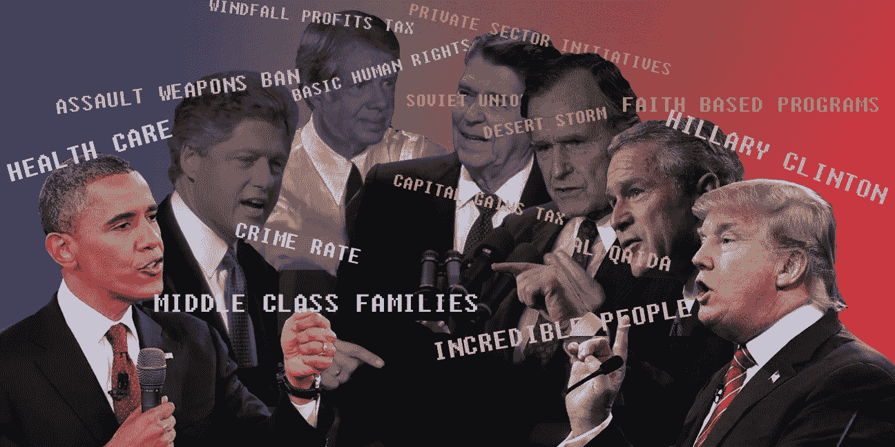
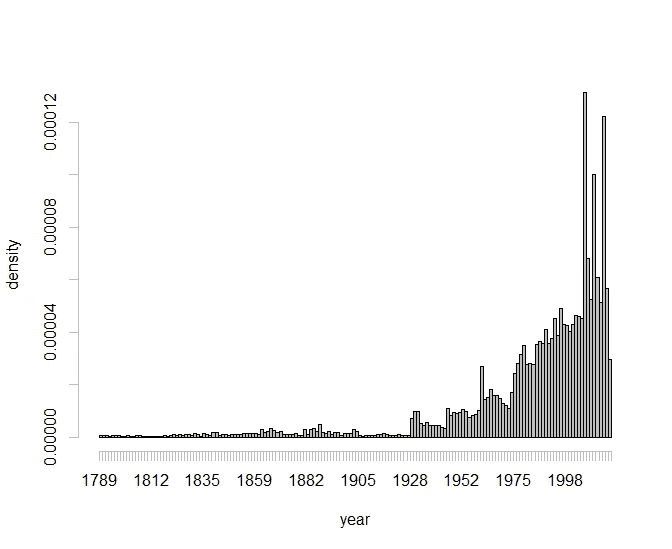
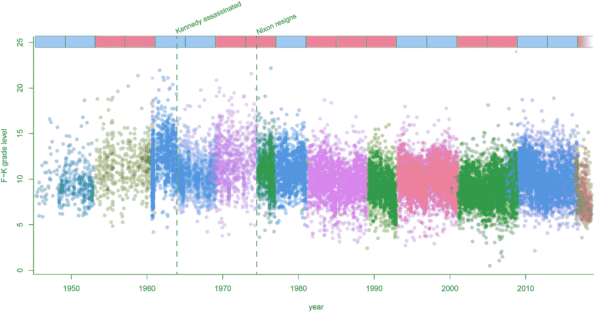
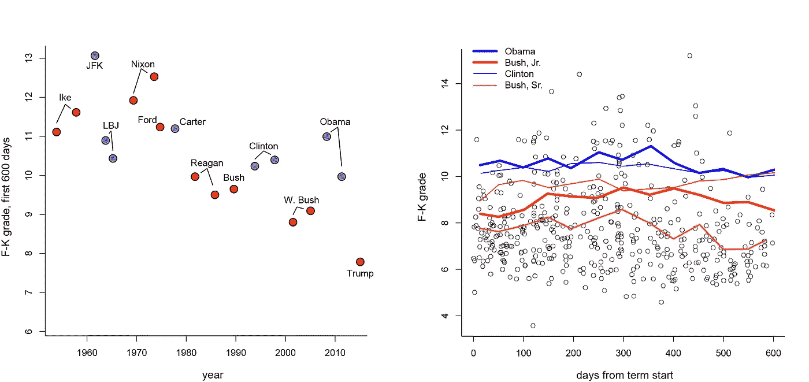
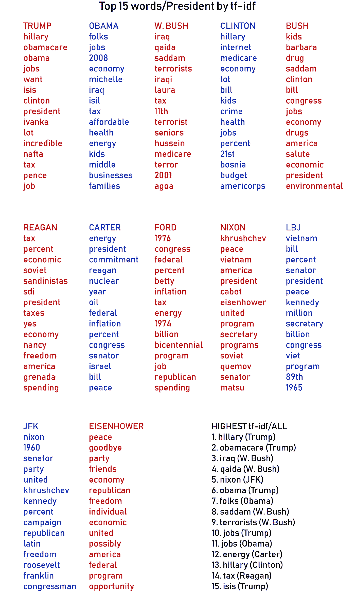
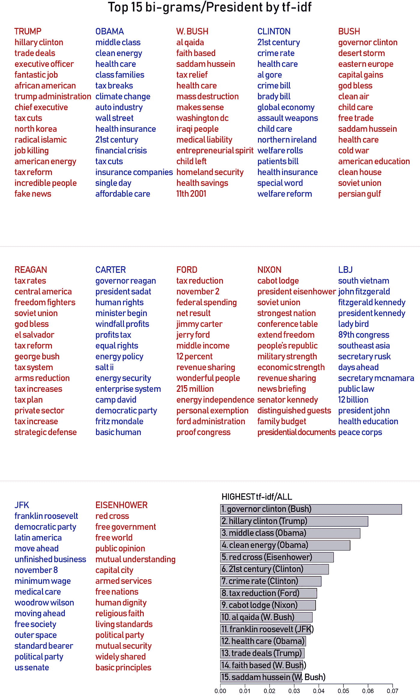
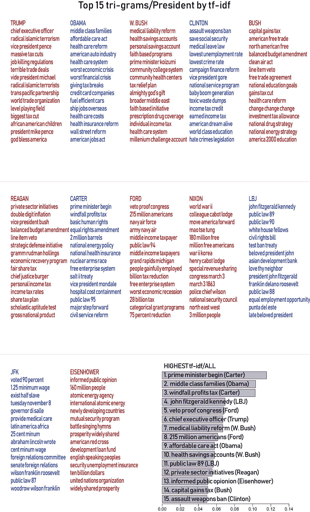

# 总统言论的快速下降，还是永久的暴跌？

> 原文：<https://towardsdatascience.com/a-quick-dip-in-presidential-rhetoric-or-a-permanent-plunge-fda7f3cc2625?source=collection_archive---------12----------------------->

超过 130，000 份总统文件抄本的语言学分析

到首先，这个项目几乎完全归功于[美国总统项目](https://www.presidency.ucsb.edu/)在记录和归档总统文稿方面所做的大量工作。我有兴趣看看总统的语言是如何随着时间的推移而变化的，以及是否有任何有趣的模式可以提取。我非常依赖 Hadley Wickham 的 [rvest 软件包](https://cran.r-project.org/web/packages/rvest/rvest.pdf)从美国总统项目的 html 源代码页面中抓取并阅读文字记录。总的来说，我使用的文件记录取自 1789 年 4 月 30 日([乔治·华盛顿的第一次就职演说](https://www.presidency.ucsb.edu/documents/inaugural-address-16))到 2018 年 9 月 21 日([概况介绍——唐纳德·j·特朗普总统获得资金来照顾我们的退伍军人，重建我们的军队，并投资于我们的基础设施](https://www.whitehouse.gov/briefings-statements/president-donald-j-trump-secures-funding-care-veterans-rebuild-military-invest-infrastructure/))，尽管对于这个项目，我决定只关注相对现代的总统(艾森豪威尔到特朗普)，因为从 20 世纪中叶开始，每位总统的文件/记录的数量急剧增加:

To partially control for the increase in Presidential transcripts over time, Eisenhower was taken as the cutoff. For one thing, current Presidents are simply much more well-documented than those in the past; in addition, many older Presidents don’t have much in the way of verbal addresses (e.g., Taft and Harding had a lot of Executive Orders and Proclamations, but not many actual speeches).

其他分析已经研究了就职演说和其他更正式的演讲是如何随着时间的推移而变化的。我更感兴趣的是总统们在准备不充分的情况下用词的选择，所以我决定把我的大部分分析集中在总统的讲话上，我预测总统的讲话会更少排练，更少由演讲稿撰写人团队撰写，也许会更直接地衡量每位总统的基本词汇。因此，我提取了原始语音数据的一个子集，其中每个语音都包含单词“Remarks”(例如:“选举前夕的 Remarks”、“抵达德国时的 Remarks”、“参观明尼苏达州明尼阿波利斯州际公路 35W 大桥损坏后的 Remarks”)，然后通过删除会话记录(“交流”、“通话”、“问答”等)来进一步细化数据集。).我还删除了不是来自现任/未来总统的文字记录(因此没有新闻秘书、副总统或初选候选人)。这给我留下了 19433 份抄本。

为了简单、直接地测量语言内容，我计算了每组评论的[弗莱斯奇-金凯等级水平](https://en.wikipedia.org/wiki/Flesch%E2%80%93Kincaid_readability_tests#Flesch%E2%80%93Kincaid_grade_level)。这种方法通过一个考虑了句子长度和音节数的公式得出文档的近似美国等级阅读水平(更高等级→更复杂的语音)。因为音节计数是一个相当缓慢和乏味的过程(而且绝对不是无足轻重的)，我还尝试缩短一些较长的演讲。我发现，从一些较长的转录中随机抽取 50 个句子，得到的 F-K 等级与整个文档的 F-K 等级高度相关，而计算只需要很少的时间。因此，用这种抽样方法来计算每份备注的 F-K 分数。由此得出的数据提供了一个有趣的(也是相当惊人的)总统语言随时间变化的图像:

Flesch-Kincaid reading grade level for each set of Presidential “remarks” plotted by the date of the remarks and colored by President. The timeline at the top provides a key of which party the President belonged to. Harry Truman is plotted at far left, though he was not a part of later analyses.

这个图中有几件事很突出(至少对我来说)。一个是肯尼迪-尼克松辩论期间令人难以置信的言论密度(尤其是对肯尼迪而言)；另一个是总统之间相对明显的变化(除了福特和卡特)；还有一个原因是，至少从罗纳德·里根开始，随着任期的进行，总统言论的等级倾向于降低(并且经常在下一任期开始时“重置”)。我不确定这到底是怎么回事:随着总统任期的延长，他们会变得更加自在/随和吗？学期开始时是否更需要正式的演讲？言论是不是一开始准备得更充分，然后就变得更像总统自己的(随意的)声音？他们在为选举做准备时是否有意识地降低自己的讲话水平？我不清楚，但这仍然是一个有趣的模式。

到更深入地查看数据，为了控制一些总统在整个任期内比其他总统发表更多言论的事实，我接下来只查看了他们每个任期头 600 天的言论(这大约是特朗普执政的天数)。

(Left) The average Flesch-Kincaid reading grade level for all “remarks” made by each President in the first 600 days of each term. (Right) All individual remarks made by Donald Trump are plotted in black, along with his running average (orange) and the running averages of the previous four Presidents (colored by party and weighted by relative recency in office).

随着时间的推移，弗莱什-金凯对总统言论的阅读水平明显下降，尽管这一趋势似乎对共和党总统比对民主党总统更为明显(在过去的四任总统中，民主党总统基本上保持了 10-11 年级的水平)。JFK 的阅读难度最高，紧随其后的是理查德·尼克松，这符合[认为](https://academic.oup.com/dh/article/30/1/119/523435)[他们](https://www.theatlantic.com/politics/archive/2015/06/the-complexity-of-being-richard-nixon/394547/)是博览群书的“知识分子”的观点。我还发现有趣的是，奥巴马在第一任期和第二任期之间的成绩变化最大，在第二任期内，他讲话的冗长程度明显下降。

更仔细地观察最近几任总统，我们也可以看到，特朗普没有任何迹象表明他回到了前任的水平；如果有什么不同的话，随着他任期的延长，他可能会更加偏离到一个更低的 F-K 等级水平。在执政的头 600 天里，他的言论从大约 8 级水平上升到大约 7 级水平，而前四任总统都很稳定。此外，通过绘制单个评论点，我认为很明显，这个滚动平均值并不是对潜在语言内容的不公平估计。看了几个例子后，我有自己的理论来解释为什么这个指标可能会下降:

The first 50 sentences of one set of remarks from Donald Trump, about four months into his term.

首先，特朗普总统倾向于重复自己，多次以略有不同的措辞重申同一想法。我在上面的文本中对这些分组进行了颜色编码，以突出它们，这不仅是基于相同单词的直接重复，也是基于相同想法的重复。偶尔，他似乎会偏离主题，如方框中所述，他从谈论帮助创建医疗改革立法的一群人转向谈论……他自己，以及他成为总统是多么令人惊讶。这种即兴创作也明显不同于演讲中更直接的部分，因为句子更短，单词更单音节(这有助于解释 Flesch-Kincaid 评分较低的原因)。当然，这只是一份示例记录，但我认为它提供了一些关于特朗普的言论与前几任总统的言论有何显著不同的见解。

为了获得每位总统的全部言论，我接下来计算了每位总统言论中使用的所有词语的 [tf-idf](https://en.wikipedia.org/wiki/Tf%E2%80%93idf) 得分(使用 [tidytext](https://www.tidytextmining.com/) 包)。这提供了一个衡量每位总统比其他总统使用频率更高的词汇的方法，同时控制了所有总统使用词汇的总体频率。

特朗普被 tf-idf 顶上的三个字都是针对他的政治“敌人”:希拉里·克林顿和巴拉克·奥巴马，这相当不寻常。另外一位在前三名中提到政治对手的总统是 JFK，他的言论主要倾向于他上任前与尼克松的辩论(乔治·布什和吉米·卡特不在此列，对手分别排在第五和第四位最常用词)。值得注意的是，特朗普是自吉米·卡特以来唯一一位妻子的名字不在前 15 个单词中的总统；取而代之的是他女儿的名字伊万卡(考虑到正在进行的[评论](https://www.independent.co.uk/news/world/americas/us-elections/donald-trump-ivanka-trump-creepiest-most-unsettling-comments-a-roundup-a7353876.html) [对](http://www.cc.com/video-clips/73fxht/the-daily-show-with-trevor-noah-don-t-forget--donald-trump-wants-to-bang-his-daughter) [他们的](https://www.quora.com/Is-Donald-J-Trump-sexually-attracted-to-his-daughter-Ivanka-Trump) [关系](https://www.theroot.com/now-this-is-creepy-new-book-claims-that-trumps-circle-1821814739)，这真的对情况没有帮助)。同样值得注意的是:奥巴马显然大量使用了“人们”这个词；你可以清楚地看到 911 对乔治·w·布什言论的影响，他的大部分热门词汇都与中东和恐怖主义有关；里根的热门词汇中大约有一半是与金钱或经济相关的，比其他任何一位总统都多。我还对二元和三元语法(分别是两个和三个单词的序列)进行了同样的 tf-idf 量化。

从这些分析中还可以发现其他一些有趣的方面(至少对我来说)。首先，特朗普反复使用三个词的短语的可能性比他使用一个或两个词的短语的可能性小得多，这与之前发现的较低等级/较短的句子相吻合。总的来说，这些二元词和三元词提供了一个很好的窗口，让我们了解每位总统认为最重要的问题；我想象一下，如果大多数人只是简单地看到一组没有名字标签的这些克，那么说出它们来自哪个总统就相当容易了(尤其是特朗普的“假新闻”)。有一些证据表明，宗教，或者至少是基督教，在从里根开始的保守派总统中变得越来越重要(“上帝保佑”，“基于信仰的项目”)。在乔治 H.W 布什时代，医疗保健似乎已经成为最重要的问题，此后历届总统都不断提到它(“医疗保健”、“医疗保险改革”、“平价医疗”)。LBJ 对 JFK 遗产的依赖是非常突出的，JFK 在所有单词集中反复出现。然而，最让我惊讶的是，艾森豪威尔如何看起来比他的共和党继任者有更多的全球主义目标(“红十字会”、“新兴发展中国家”、“自由世界”、“和平”)。

总结——我认为，在总统言论相对一致的专业水平中，特朗普是否真的是一个暂时的异类，或者他是否只是延续了前任(共和党)总统的趋势，这种结论是不准确的。演讲能力对选民来说已经不重要了吗？现代共和党选民会更喜欢孤立主义、民族主义的特朗普，而不是更为全球乐观的艾森豪威尔吗？我更倾向于这样一种观点，即尽管特朗普落在了规范之外，但他只是继续朝着规范在过去几十年中一直在变化的同一方向前进。即便如此，也很有可能总统们只是越来越多地试图给选民们他们想听的东西。为此，如果选民决定他们更喜欢发表更有思想、更鼓舞人心的演讲的政治家，他们有能力改变这一点。