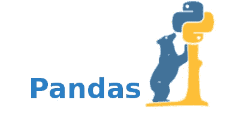

# “熊猫”Python 库快速介绍

> 原文：<https://towardsdatascience.com/a-quick-introduction-to-the-pandas-python-library-f1b678f34673?source=collection_archive---------0----------------------->


Pandas are cute, but it’s a different kind of panda :)

# 一些背景

大家好！今天我想写关于[熊猫图书馆](http://pandas.pydata.org/)(链接到网站)。Pandas 代表“Python 数据分析库”。根据维基百科关于熊猫的页面，“这个名字来源于术语“[面板数据](https://en.wikipedia.org/wiki/Panel_data)”，[计量经济学术语](https://en.wikipedia.org/wiki/Econometrics)多维结构化数据集。”但我觉得这只是一个超级有用的 Python 库的可爱名字！

当谈到用 Python 分析数据时，Pandas 是一个相当大的游戏改变者，它是数据管理/争论中最受欢迎和广泛使用的工具之一。Pandas 是开源的，可以免费使用(在 BSD 许可下),它最初是由 [Wes McKinney](https://en.wikipedia.org/wiki/Wes_McKinney) 编写的(这里有他的 [GitHub 页面](https://github.com/wesm)的链接)。

Pandas 的酷之处在于它获取数据(如 CSV 或 TSV 文件，或 SQL 数据库)并创建一个包含行和列的 Python 对象，称为数据框，它看起来非常类似于统计软件中的表格(例如 Excel 或 SPSS)。熟悉 R 的人也会看到 R 的相似之处)。与通过 for 循环或列表理解来使用列表和/或字典相比，这要容易得多(请随意查看我以前的一篇关于使用 Python 进行非常基本的数据分析的博客文章[。用熊猫做我在那里做的事情会容易得多！).](https://medium.com/@adi.bronshtein/the-first-week-of-general-assembly-dsi-and-some-basic-python-6148099be7c0)

# 安装和入门

为了“得到”熊猫，你需要安装它。您还需要 Python 3.5.3 及更高版本。作为安装的先决条件(将与 Python 3.6、3.7 或 3.8 一起工作)，它还依赖于其他库(如 [NumPy](http://www.numpy.org/) )并具有可选的依赖项(如用于绘图的 Matplotlib)。因此，我认为安装 Pandas 最简单的方法是通过一个包来安装它，比如 [Anaconda 发行版](https://www.continuum.io/downloads)，“一个用于数据分析和科学计算的跨平台发行版”你可以在那里下载 Windows、OS X 和 Linux 版本。如果您想以不同的方式安装，这些是[的完整安装说明](http://pandas.pydata.org/pandas-docs/stable/install.html)。

为了在您的 Python IDE ( [集成开发环境](https://en.wikipedia.org/wiki/Integrated_development_environment))中使用 Pandas，如 [Jupyter Notebook](http://jupyter.org/) 或 [Spyder](https://pythonhosted.org/spyder/) (两者都默认带有 Anaconda)，您需要首先*导入*Pandas 库。导入一个库意味着把它加载到内存中，然后你就可以使用它了。为了导入 Pandas，您只需运行以下代码:

```
import pandas as pd 
import numpy as np 
```

通常你会添加第二部分(' as pd ')，这样你就可以用' pd.command '来访问 Pandas，而不是每次需要使用它的时候都要写' pandas.command '。此外，您也可以导入 numpy，因为它对于使用 Python 进行科学计算是非常有用的库。现在熊猫可以使用了！请记住，您需要在每次启动新的 Jupyter 笔记本、Spyder 文件等时执行此操作。



# 和熊猫一起工作

## 用 Pandas 加载和保存数据

当您想要使用 Pandas 进行数据分析时，您通常会以三种不同的方式使用它:

*   将 Python 的列表、字典或 Numpy 数组转换为 Pandas 数据框
*   使用熊猫打开一个本地文件，通常是一个 CSV 文件，但也可以是一个分隔文本文件(如 TSV)，Excel 等
*   通过 URL 打开网站上的远程文件或数据库，如 CSV 或 JSONon，或者从 SQL 表/数据库中读取

每个选项都有不同的命令，但是当您打开一个文件时，它们看起来像这样:

```
pd.read_filetype()
```

正如我之前提到的，熊猫可以处理不同的文件类型，所以你可以用实际的文件类型(比如 CSV)替换“文件类型”。你应该在括号内给出路径、文件名等。在括号内，您还可以传递与如何打开文件相关的不同参数。有许多参数，为了了解它们，您必须阅读文档(例如，pd.read_csv() 的[文档将包含您可以在这个 Pandas 命令中传递的所有参数)。](http://pandas.pydata.org/pandas-docs/stable/generated/pandas.read_csv.html)

为了转换某个 Python 对象(字典、列表等),基本命令是:

```
pd.DataFrame()
```

在括号内，您可以指定创建数据框的对象。该命令也有[不同的参数](http://pandas.pydata.org/pandas-docs/stable/generated/pandas.DataFrame.html)(可点击链接)。

您还可以将正在处理的数据框保存到不同类型的文件中(如 CSV、Excel、JSON 和 SQL 表)。一般的代码是:

```
df.to_filetype(filename)
```

## 查看和检查数据

现在您已经加载了数据，是时候看一看了。数据框看起来怎么样？运行数据框的名称会得到整个表，但是您也可以用`df.head(n)`得到前 n 行，或者用`df.tail(n)`得到后 n 行。`df.shape`会给你行数和列数。`df.info()`会给你索引、数据类型和内存信息。命令`s.value_counts(dropna=False)`将允许您查看一个系列(比如一列或几列)的唯一值和计数。一个非常有用的命令是`df.describe()`，它输入数字列的汇总统计数据。也可以获得整个数据帧或一系列(一列等)的**统计数据**:

*   `df.mean()`返回所有列的平均值
*   `df.corr()`返回数据帧中各列之间的相关性
*   `df.count()`返回每个数据框列中非空值的数量
*   `df.max()`返回每列中的最大值
*   `df.min()`返回每列中的最小值
*   `df.median()`返回每列的中值
*   `df.std()`返回每列的标准偏差

## 数据选择

与从列表或字典中选择值相比，在 Pandas 中选择您想要的数据要容易得多。您可以选择一列(`df[col]`)并将带有标签 col 的列作为系列返回，或者选择几列(`df[[col1, col2]]`)并将列作为新的 DataFrame 返回。您可以按位置(`s.iloc[0]`)或按索引(`s.loc['index_one']`)进行选择。为了选择第一行，可以使用`df.iloc[0,:]`，为了选择第一列的第一个元素，可以运行`df.iloc[0,0]`。这些也可以用在不同的组合中，所以我希望它能给你一个不同的选择和索引的概念。

## 筛选、排序和分组依据

您可以使用不同的条件来筛选列。例如，`df[df[year] > 1984]`将只给出大于 1984 年的列。您可以使用& (and)或| (or)向您的过滤添加不同的条件。这也被称为*布尔过滤*。

可以使用`df.sort_values(col1)`对某一列中的值进行升序排序；并且还使用`df.sort_values(col2,ascending=False)`以降序排列。此外，可以使用`df.sort_values([col1,col2],ascending=[True,False])`按升序对值进行排序，然后按降序对值进行排序。

本节中的最后一个命令是 groupby。它包括根据某些标准将数据分组，独立地对每个组应用一个函数，并将结果组合成一个数据结构。`df.groupby(col)` 返回一列值的 groupby 对象，而`df.groupby([col1,col2])` 返回多列值的 groupby 对象。

## 数据清理

数据清洗是数据分析中非常重要的一步。例如，我们总是通过运行检查空值的`pd.isnull()`来检查数据中的缺失值，并返回一个布尔数组(缺失值的数组为*真*，非缺失值的数组为*假*)。为了获得空值/缺失值的总和，运行`pd.isnull().sum()`。`pd.notnull()` 与`pd.isnull()`相反。在你得到缺失值的列表后，你可以去掉它们，或者通过使用`df.dropna()`删除行或者`df.dropna(axis=1)`删除列来删除它们。另一种不同的方法是用其他值填充缺失值，方法是使用`df.fillna(x)`用 x 填充缺失值(您可以随意放置),或者使用`s.fillna(s.mean())`用平均值替换所有空值(平均值可以用统计部分的几乎任何函数替换)。

有时需要用不同的值替换值。例如，`s.replace(1,'one')` 将用`'one'`替换所有等于`1`的值。对于多个值也可以这样做:`s.replace([1,3],['one','three'])` 将用`'one'`替换所有的 1，用`'three'`替换`3`。您还可以通过运行:`df.rename(columns={'old_name': 'new_ name'})`来重命名特定的列，或者使用`df.set_index('column_one')`来更改数据框的索引。

## 加入/合并

最后一组基本 Pandas 命令用于连接或组合数据帧或行/列。这三个命令是:

*   `df1.append(df2)` —将`df1`中的行添加到`df2`的末尾(列应该相同)
*   `df.concat([df1, df2],axis=1)` —将`df1`中的列添加到`df2`的末尾(行应该相同)
*   `df1.join(df2,on=col1,how='inner')` — SQL 样式将`df1`中的列与`df2`中的列连接起来，其中`col`的行具有相同的值。怎么可能等于:`'left'`、`'right'`、`'outer'`、`'inner'`中的一个

这些是非常基本的 Pandas 命令，但我希望您能看到 Pandas 在数据分析方面有多么强大。这篇文章只是冰山一角——毕竟，整本书都可以(并且已经)写关于熊猫的数据分析。我也希望这篇文章让你感觉像拿着一个数据集，用熊猫来摆弄它！:)

一如既往，如果你有任何意见，笔记，建议或问题，请不要犹豫给我写信！感谢阅读:)我将以一张可爱的熊猫图片和一个问题结束，大熊猫和小熊猫你更喜欢哪一个？？？


下次见！

附言

如果你喜欢这个教程，请查看我的[NumPy](https://medium.com/@adi.bronshtein/a-quick-introduction-to-the-numpy-library-6f61b7dee4db)快速介绍！