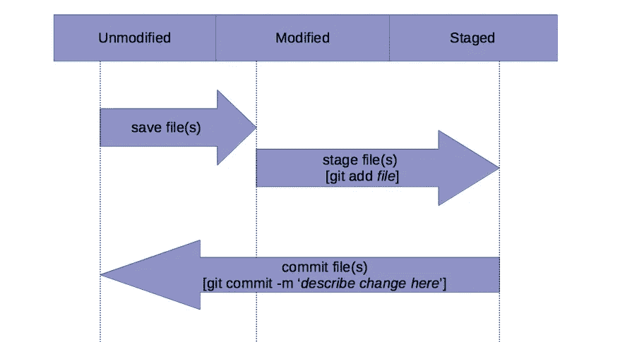
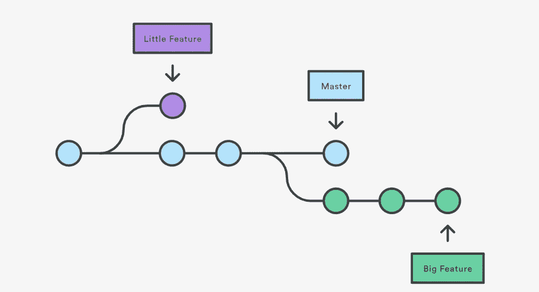

# 使用 Git 进行版本控制的快速入门

> 原文：<https://towardsdatascience.com/a-quick-primer-to-version-control-using-git-3fbdbb123262?source=collection_archive---------3----------------------->


source: [xkcd](https://xkcd.com/1597/)

版本控制是一种系统，它允许您跟踪一段时间内对代码所做的更改。因此，版本控制非常有用，因为:

1.  您可以恢复到代码的特定“版本”
2.  因为特定的变更和相关的贡献者被跟踪，所以在相同的工作上的协作是可能的

由于编码是数据科学不可或缺的一部分，因此使用版本控制来维护源代码和数据库是最佳实践。它还简化了协作项目。更改可以记录在存储库中:存储文件和对这些文件所做更改的记录的数据结构。

Git 是最流行的版本控制系统之一。它是一个[分布式版本控制系统](https://en.wikipedia.org/wiki/Distributed_version_control)。变更不一定要提交到同一个中央存储库中，这将要求项目中的每个人访问该中央存储库并下载最新的代码以保存变更。取而代之的是，每个人都可以拥有自己的本地化存储库及其全部历史。

事实上，Git 是一个相当简单的工具，与 Github(在云上托管 Git 存储库)等服务相结合，有助于版本控制。

# Git 基本步骤

确保你的机器上安装了[Git](https://git-scm.com/book/en/v2/Getting-Started-Installing-Git)。

所有后续命令都在[终端](https://blog.galvanize.com/how-to-use-the-terminal-command-line/)上执行，您必须在[项目目录](https://learnpythonthehardway.org/book/appendixa.html)中。

注意:将来所有需要用户指定输入的代码(比如特定的文件)都将以斜体显示。

```
add *filename*
```

上面的代码意味着您总是键入“add ”,但是您必须指定您想要添加的文件。



general overview of edit-stage-commit process. the rectangles delineate the ‘state’ of the file(s) in question. when the file is finally committed, we revert back to the unmodified state until we are ready to stage and commit more changes.

## 1.初始化 Git 储存库

要在项目目录中初始化 Git 存储库:

```
git init
```

这将在项目目录中创建一个. git 目录。

## 2.检查文件状态

要检查是否有任何文件已被修改但尚未提交，

```
git status 
```

这将返回存储库的当前状态，如下所示:


尚未“跟踪”(暂存和/或提交)的文件将在此处注明。如果所有文件都被跟踪，那么 Git 将会注意到没有什么需要提交的，工作树也是干净的。

## 2a。创建一个. gitignore 文件

答。gitignore file 对于确保包含敏感信息(如密码和个人 API 密钥)的文件不被跟踪非常重要。当您选择将存储库推送到云服务以便公开显示时，这一点尤其重要。来创建。gitignore 文件:

```
touch .gitignore
```

在。gitignore file，添加决定要忽略的文件的文件名或通用规则(详细定义见 [Octocat](https://gist.github.com/octocat/9257657) )。gitignore 规则)。

最佳做法是将文件添加到。gitignore 在进行任何提交之前。将任何文件添加到。gitignore 将确保文件不会在 ***后续的*** 提交*中被跟踪。*该文件的任何先前提交仍将可用，并且该文件将需要从那些较旧的提交中移除。

## 3.暂存文件更改

您可以有选择地暂存已修改的文件，将它们添加到“暂存区”以准备提交。未添加到临时区域的已修改文件随后将不会被提交。这允许更细化和更具体的提交(例如:只对项目的 A 部分进行变更)，这对将来的参考很有用。

```
#to stage specific modified files
git add *filename*#to stage all modified files
git add .
```

应当注意，记录当前分支的提交；这被认为是项目历史上的一个**分支**。

## 4.提交文件更改

然后提交所有暂存文件，实质上是在特定时刻创建这些特定文件的“屏幕截图”。这有效地记录了对存储库的新变更。

```
git commit -m '*describe change(s) made here*' 
```

每次提交都必须有一条消息，描述所做的更改。这是用现在时完成的，最好是更具描述性的。这将有助于以后查看日志。

## 4a。使用过去的提交

检查过去的提交可能非常有用，无论是查看自那以后做了什么新的更改(潜在地识别新 bug 的来源)，还是甚至回到以前的提交。

要显示所有提交的日志:

```
git log
```

这将返回一个提交日志，其中每个提交如下所示:


每个提交都有一个相关的描述(这就是为什么提交期间的描述很重要)、时间和提交 ID。头是指当前分支，在这种情况下，它是主分支。

要检查特定提交中所做的更改，请执行以下操作:

```
git show *commit-id*
```

提交 ID 也称为哈希(随机生成)。

要完全恢复到以前的提交:

```
git reset --hard *commit-id*
```

这实质上将返回到指定的提交(以及该特定提交处的文件)；自该提交以来的所有更改都将丢失，并且头指向指定的提交。不包括“— hard”选项将导致软复位；所有更改将作为未分级的更改保留，并且头指向指定的提交。

在继续之前，描述分支很重要，这是 Git 的一个基本方面。

## 分支



source: [Atlassian](https://www.atlassian.com/git/tutorials/using-branches)

一个[分支](https://www.atlassian.com/git/tutorials/using-branches) 本质上是一个“新”目录，在你将那些变更合并到包含你所有源代码的主分支之前，你可以在这个目录上处理一个项目的特定部分或特性。

您总是开始的默认分支总是被称为主分支。主分支包含最新的可用源代码。始终假设主分支已经准备好进行部署。所有的试验和变化，无论大小，都是在以后要合并的其他分支上进行的。

## 基本步骤

要列出存储库中的所有分支:

```
git branch
```

要创建新分支:

```
git branch *new-branch-name*
```

这只会创建分支。要切换到特定分支并开始在其中工作:

```
git checkout *another-branch*
```

或者，如果您想要创建一个新分支并立即切换到它:

```
git checkout -b *new-branch-name*
```

## 合并分支

要合并两个分支(在本地存储库中)，如特征分支和主分支:

**1。确保您在接收分支上(主设备将从特征分支接收)**

```
git checkout *master*
```

**2。特征分支和主分支都必须是完全最新的，包括远程更改。**

要提取并合并最近的远程更改:

```
git pull
```

**3。将特征分支合并到主分支:**

```
git merge *feature-branch*
```

**4。删除现在不相关的特征分支**

```
git branch -d *feature-branch*
```

# 使用 Github

确保您有一个 [Github](https://github.com/) 帐户，并且您已经为您的项目创建了一个 [Github 资源库](https://help.github.com/articles/create-a-repo/)。然后，您可以[将本地回购](https://help.github.com/articles/adding-an-existing-project-to-github-using-the-command-line/)推送到这个存储库。

或者，您可以[克隆](https://www.atlassian.com/git/tutorials/setting-up-a-repository/git-clone)一个现有的存储库，这实质上是在您的机器上创建一个公共存储库的副本。

```
git clone *filepath*
```

克隆时，会自动创建到原始存储库的远程连接(称为“源”)。这允许您向前推和拉变更(到原始存储库和从原始存储库)。

Github 的主要用处是因为它加速了协作工作。项目的每个参与者都可以拥有自己的项目本地私有存储库，对本地存储库进行更改，并在以后将更改推送到公共存储库。他们可以做到这一切，而不必跟上公共存储库的变化。

## README.md

自述文件是公共存储库不可或缺的一部分，因为它有助于描述项目、识别错误、列出依赖项等。对于数据科学项目的自述文件中应该包含哪些内容，RociosNG 提供了很好的指导。它通常被创建为 README.md。

# 通用 Git 工作流程

一般的 [Git 工作流程](https://www.atlassian.com/git/tutorials/comparing-workflows)是什么样子的？这将因团队和项目而异，但每个工作流都从存储在服务器上的公共存储库(通常是 Github)开始，并依赖于分支。要解释的最基本和最直接的 Git 工作流是集中式工作流。许多其他工作流只是集中式工作流的扩展。

集中式工作流依赖于单个公共存储库。

1.贡献者从 Github 克隆中央存储库，从而在他们的本地机器上创建存储库的副本。

```
git clone *repository*
```

2.然后，他们可以在他们的本地存储库上创建自己的分支，在那里他们可以在本地进行、暂存和提交他们的更改。

```
git checkout -b *branch*
```

3.然后，他们可以将这些(提交的)变更推送到 Github 上他们分支的远程版本(仍然与主远程分支分开)。

```
#ensure local version of master is up-to-date
git pull --rebase origin master#push to remote branch
git push origin *branch*
```

4.一旦贡献者准备好了，他们就可以为他们的远程分支提交一个[拉请求](https://help.github.com/articles/creating-a-pull-request/)。其他协作者可以检查这些更改，一旦这些更改被批准，这些更改就可以被合并到主远程分支。

如果有冲突，Git 将产生一个错误消息，冲突需要由贡献者来解决。一旦解决了冲突，就可以成功地推送更改。

## 解决冲突

因为贡献者正在对他们的本地存储库进行更改，一旦这些更改实际上被推送到中央存储库，他们的代码可能会与其他贡献者的代码冲突。

假设两个贡献者都在处理同一个文件，他们都以不同的方式修改了第 13 行。如果做了同样的改变，那么就不会有冲突了。如果更改不同，那么可能会出现冲突。通常 Git 会尝试以一种智能的方式组合变更，但是当它不能确定哪个变更应该被集成时(如果它们不能都被包含)，那么冲突必须被手动解决。

**1。从中央存储库中提取所有新的变更**

```
git pull --rebase origin master
```

这将会把贡献者克隆的所有变更推到中央存储库。这将更新主分支。

通过包含 [rebase](https://www.atlassian.com/git/tutorials/rewriting-history/git-rebase) 选项，在本地*进行的提交被添加到新更新的主分支。这实质上将重写主分支的项目历史；所有本地提交现在都是其项目历史的一部分。*

*这将导致一个更干净的项目历史，没有分叉或者额外的合并提交。这样更便于日后参考。*

***2。解决冲突***

*重置基础将一次提交添加到主分支的项目历史中。当它这样做时，任何冲突也会出现。这使得解决冲突变得容易得多，因为它们可以在个案的基础上处理。*

*因为数据科学的特点是协作工作，这通常需要编码，所以学习和实践版本控制非常重要。我觉得讨论 Git 是最有用的，因为它是目前最流行的版本控制系统。应该注意的是，它不是唯一的版本控制系统。但是，至少了解版本控制和一些版本控制系统是很重要的。*

*这是对 Git 要点的一个非常广泛的概述。有关更深入的资源，请参见下文。*

# *资源*

*   *[数据营](https://www.datacamp.com/community/blog/version-control-data-science)*
*   *[GitHowTo](https://githowto.com/)*
*   *[Git 文档](https://git-scm.com/doc)*
*   *[进一步 Git & Github 练习](https://dont-be-afraid-to-commit.readthedocs.io/en/latest/git/git.html)*
*   *[亚特兰蒂斯 Git 教程](https://www.atlassian.com/git/tutorials/learn-git-with-bitbucket-cloud)*
*   *[Github 流程](https://guides.github.com/introduction/flow/)*