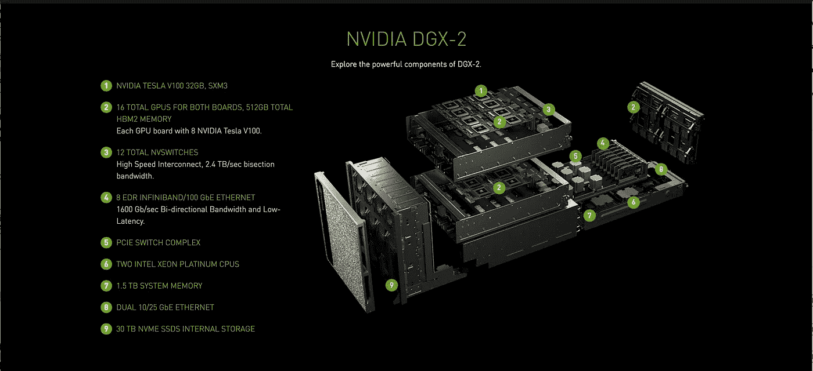

# 英伟达 GTC 2018 大会综述——新 GPU、深度学习加速、数据增强、自动驾驶..

> 原文：<https://towardsdatascience.com/a-review-of-nvidia-gtc-2018-conference-new-gpus-deep-learning-acceleration-data-augmentation-d6d4f638bcda?source=collection_archive---------4----------------------->

会议主题是“AI 与深度学习”。

NVIDIA DGX-2 Workstation, 10x faster than the DGX-1 released 6 months ago. [Source](https://www.nvidia.com/en-us/data-center/dgx-2/).

在 [NVIDIA GPU 技术大会](https://www.nvidia.com/en-us/gtc/)上为期 4 天的精彩演讲、主题演讲、演示、海报和互动。作为一名对应用人工智能感兴趣的 HCI 研究人员，了解人工智能硬件(GPU)的进展是令人兴奋的，这些技术讲座涵盖了人工智能科学和人工智能的行业用例。这篇文章总结了我参加的会议主题和技术会议的笔记。

TLDR——一些亮点

*   [NVIDIA AI](https://medium.com/u/ab69c39a85e1?source=post_page-----d6d4f638bcda--------------------------------) 宣布了新的 GPU，并原生集成了他们的深度学习推理优化器[(tensort)与](https://devblogs.nvidia.com/tensorrt-integration-speeds-tensorflow-inference/) [TensorFlow](https://medium.com/u/b1d410cb9700?source=post_page-----d6d4f638bcda--------------------------------) 。
*   人们对构建模拟环境以测试自动驾驶汽车算法的兴趣越来越大。英伟达公布了一款[自动驾驶平台](https://www.nvidia.com/en-us/self-driving-cars/drive-platform/)。
*   对于人工智能的许多现实应用，数据增强策略越来越重要。参见 [Fatkun 插件](https://chrome.google.com/webstore/detail/fatkun-batch-download-ima/nnjjahlikiabnchcpehcpkdeckfgnohf/related)采集训练图像，参见 [imagaug](https://github.com/aleju/imgaug) 库进行图像增强。另请参见这篇关于 python/Tensorflow 中的[数据扩充](https://medium.com/nanonets/how-to-use-deep-learning-when-you-have-limited-data-part-2-data-augmentation-c26971dc8ced)步骤的博文。
*   生成性人工智能(GANs，进化算法)正在被探索用于 CAD 和游戏设计用例——艺术内容生成(人物，背景)，内容重用等。
*   研究人员正在探索人工智能在安全领域的应用——例如检测域生成算法。
*   人工智能正被用于通过加速模拟来加速科学研究。

# 主题演讲 GPUs、图形应用、人工智能、自动驾驶的进步。

## **图形处理器**

宣布了几款新的 GPU——Quadro gv 100(10，000 个内核)和 DGX 2 号工作站(2 PFlOPS，512GB HBM2，10Kw，350 磅)。从性能的角度来看，DGX 2 号比 6 个月前发布的 DGX 1 号快 10 倍。模型训练时间中的示例进一步展示了 GPU 进步对人工智能研究和实践的影响。

> 就在 5 年前，用**2 GTX 580 训练 Alexnet 花了 **6 天**。今天，Alexnet 可以在 DGX-2 上进行 18 分钟的训练。相当大的进步！**

**主题演讲还强调了 GPU 现在如何实现运动图形的实时光线跟踪，以及以前在超级计算机上完成的工作现在如何能够在 DGX 工作站上高效地完成，其价格仅为****功耗**** *和 ***空间*** 要求的一小部分。***

## ***医学成像超级计算平台***

******

***CLARA — NVIDIAs system to enable medical imaging. [Source](https://blogs.nvidia.com/blog/2018/03/28/ai-healthcare-gtc/).***

***英伟达还提到了他们对医疗成像超级计算机的尝试——克拉拉。这个项目很有前景，因为它旨在利用人工智能/深度学习的进步来扩展现有医疗成像设备的能力。有一个有趣的视频，讲述了深度学习算法如何用于心脏的 3D 重建(心室大小、血流等细节)，这些图像是基于 15 年前的超声波扫描仪捕捉的图像。点击这里了解更多关于克拉拉的信息。***

## ***自动驾驶，传感器融合***

***获取**训练数据**和设计**算法**融合来自自动驾驶所需的多个传感器的输入(传感器融合)是很难的。NVIDIA 提到了创建一个[平台——NVIDIA DRIVE](https://www.nvidia.com/en-us/self-driving-cars/drive-platform/)——来帮助解决这些问题的努力。对于自动驾驶汽车研究人员来说，这是个好消息。***

> ***NVIDIA DRIVE 平台结合了深度学习、传感器融合和环绕视觉，以改变驾驶体验。它能够实时了解车辆周围发生的事情，在高清地图上精确定位自己，并规划安全的前进路径。该平台围绕多样化的冗余系统架构设计，旨在支持最高级别的汽车功能安全 ASIL-D。***

***还有一些其他的技术讲座，强调了对高质量模拟环境的需求，以训练/测试自动驾驶汽车算法。***

## ***张量流+张量***

***[NVIDIA AI](https://medium.com/u/ab69c39a85e1?source=post_page-----d6d4f638bcda--------------------------------) 也宣布原生 I[tensort 与 Tensorflow](https://devblogs.nvidia.com/tensorrt-integration-speeds-tensorflow-inference/) 整合。NVIDIA TensorRT 是一款深度学习推理优化器和运行时，它通过基于 GPU 的平台的优化和高性能运行时来加速深度学习推理。如果您正在 NVIDIA GPUs 上运行 Tensorflow 应用程序，您现在可以添加一些代码行来自动启用 TensorRT 优化和加速！***

# ***技术会谈***

***下面是我参加的一些技术讲座。***

## ***温斯顿·许的数据增强策略[ [幻灯片](https://winstonhsu.info/wp-content/uploads/2018/03/gtc18-data_aug-180326.pdf)***

***我发现这个演讲很有趣，因为它提供了关于如何满足监督深度学习的数据饥渴需求的实用建议。演讲者从数据的人工注释是一个昂贵的过程这一前提开始，并提出了他们在工作流程中使用的四种方法来解决这一问题。***

*****网络抓取**:从网站和社交网络中高效抓取标签数据的方法。
**弱监督方法**:给定一个由专家标记的小数据集，我们可以学习标记策略，并将其应用于标记更大的数据集。
**数据转换**:我们可以通过使用简单的线性转换生成额外的示例来扩充数据集，例如裁剪、移位、色偏、镜头失真、晕影、随机背景等。这种转换的库的例子是 [imageAug](https://github.com/aleju/imgaug) 。
**数据合成**:我们可以生成纹理化的 CAD 模型作为训练数据，我们可以给数据添加特定的特征，例如给面部图像添加眼镜，以及使用 GANs 一起合成新的图像。***

***更多信息请点击此处查看主讲人的[幻灯片。](https://winstonhsu.info/wp-content/uploads/2018/03/gtc18-data_aug-180326.pdf)***

## ***司机睡意检测——英伟达的 Siddarth Varier***

***英伟达的研究人员展示了一些检测司机睡意的早期工作。作者训练了一个按比例缩小的 VGG16 模型，并使用从 3D 人脸模型生成的合成数据增加了他们的训练数据集。对于分类，它们依赖于在一段时间内预测的眼睛俯仰角。***

## ***生成人工智能***

***Autodesk 创成式设计:在这次演讲中，演讲者讨论了进化算法在生成 CAD 设计中的一些有趣的应用。给定一个设计挑战，目标通常是平衡成本(材料)和性能。为此，他们试验了生成候选设计的进化算法，同时优化成本/性能/制造方法等参数，并使用自动化压力测试(FEA 分析)作为反馈的一部分。给出了一个具体的例子，其中一个进化算法提出了一个摩托车的高性能(和不寻常的外观)部件。***

*****人工智能颠覆游戏内容创作的未来——艾瑞克·里塞尔，** [**Artomatix**](https://artomatix.com/)***

******

****Left — original: We can see a clear vertical and horizontal seam line running through the center of the image, Right — Artomatix output:The seam was intelligently repaired with new features that appear realistic. Source —* [*Artomatix Blog*](https://artomatix.com/blog/)*.****

***本次演讲的重点是如何将人工智能加速的工作流应用于媒体行业的各个方面(例如电影、视频游戏)。演示者透露，视频游戏行业在艺术内容生成上花费了 61%的预算——主要角色和背景。大部分工作包括手动工作流程。创造性或生成性人工智能提供了改善这一点的机会，涉及纹理合成、材料增强、杂交和风格转移等领域。这包括使艺术家能够用结构绘画的方法、基于示例的工作流(扫描现实世界的对象并利用人工智能进行改进)和摄影测量。人工智能还可以帮助回收旧内容，例如[高清](https://artomatix.com/blog/index.php/2018/01/22/enhance-that/)视频。给出了一个行业使用案例，宜家能够轻松扫描产品的 3D 模型，然后在网站上使用(研究表明，拥有 3D 模型可使网站销售额提高 20%)。查看主持人公司[博客](https://artomatix.com/blog/)的更多详情。***

***[**生长生成模型**](https://arxiv.org/abs/1710.10196) **— Samuli Laine 等人** NVIDIA 的研究人员展示了一些关于如何使用生成对抗网络(GANs)生成高分辨率图像的有趣工作。他们的方法解决了 GANs(模式崩溃)的一个已知问题，加速并稳定了训练过程。关键思想是逐渐增加发生器和鉴别器:从低分辨率开始，随着训练的进行，增加新的层来模拟越来越精细的细节。他们强调了这项工作在为游戏和电影生成资产以及调节 GAN 以确定输出(例如男性或女性面孔)方面的潜力。更多细节可以在他们的[论文](https://arxiv.org/abs/1710.10196)中找到。***

******

***Examples of high resolution faces generated by their GAN. [Paper](https://arxiv.org/abs/1710.10196).***

## ***网络防御——用机器智能对抗 DGAs***

***另一个有趣的话题是如何使用 ML 来解决一些安全问题——检测域生成算法。域生成算法 DGAs 是各种恶意软件家族中常见的算法，用于定期生成大量域名，这些域名可用作其命令和控制服务器的集合点。它们被黑客用来交流和从网络中窃取数据，旨在绕过传统的网络防御，并取得了极大的成功。他们引用了最近的一篇论文“[深度网络在线 DGA 检测](https://ieeexplore.ieee.org/document/8215728/)”。***

## ***[看见 AI](https://www.microsoft.com/en-us/seeing-ai/) ，一款针对视障人士的 app—[Anirudh Koul](https://twitter.com/anirudhkoul)***

******

***微软研究院的 Anirudh Koul 的有趣演讲展示了他的团队如何为视障人士(VIP)开发 seeingAI 移动应用程序。***

***他注意到这一方向如何孕育创新，从而激发了应用程序的可访问性设计。例如，雷·库兹韦尔受一位盲人的启发，发明了一种阅读机器。格雷厄姆·贝尔也有类似的故事，他在研究助听器时发明了电话。***

> ***对残疾人来说是小众的东西明天将成为主流。***

***seeingAI 应用程序可以帮助 VIP 阅读文本、识别人物、场景、笔迹、文档、产品、货币、光源等。也许这项工作的创新之处在于 ***大部分这些功能都是在设备*** 上本地执行的。演示者分享了他们对这个项目体验的有趣想法。***

*   *****训练视觉模型**:他们试验了几种方法来组合他们的数据集和 [customvision.ai](https://customvision.ai/) 来训练它。他们建议使用 [Fatkun 插件](https://chrome.google.com/webstore/detail/fatkun-batch-download-ima/nnjjahlikiabnchcpehcpkdeckfgnohf/related)来删除具有适当权限的数据。他们还讨论了为货币生成受控合成数据的实验——例如，采用货币、翻转、遮挡、添加背景等。这里的一个重要思想是确保模型不会仅仅通过看到非鉴别特征(例如，具有零的边缘)来学习预测音符..可以是 10 或 20 美元的钞票)。***
*   *****为用户体验而不是验证准确性挑选最佳模型**。演示者提出了一个重要的观点，即高验证准确性可能不会很好地转化为良好的用户体验。例如，一个准确率为 95%但偶尔会将 100 美元的钞票标记为 10 美元的模型对一个准确率为 90%但不会犯这种错误的模型的吸引力要小得多。针对精度进行优化。在逐帧分析过程中，UX 还需要考虑何时发言。***
*   *****人们如何使用这款应用**:一个盲人根据来自应用的信息——面部、情绪等——改变音调。一个盲人学校的老师，他有自己的电话，当学生进入教室时，他会通知他们。父母能够第一次阅读他们孩子的家庭作业或阅读圣诞信息。
    演讲者还指出，人们通过自我训练来理解人工智能的极限——它能做什么和不能做什么。***

## ***使用 ML 加速研究***

***有一些有趣的演示显示了机器学习如何通过以很少的时间和成本复制昂贵、耗时的模拟来加速科学发现。尤其是在物理科学领域，通常会有让科学家测试想法的模拟器，例如用于碰撞测试、化学反应、压力测试等的模拟器。这些模拟中的许多是复杂的、计算昂贵的(有时高达每年数十亿个 CPU 小时),并且可能需要几天或几周来完成单个模拟。这个想法是训练 ML 模型，学习这些模拟器中使用的过程并复制它们的功能——只需很少的时间和成本。Google Research [的相关工作已经展示了](https://arxiv.org/abs/1702.05532)机器学习模型，与现有的预测有机分子属性的模拟器相比，这些模型同样准确并且*更快* ( **300，000 倍**)。在 GTC，也有一个类似的关于使用 GANs 改进高能物理模拟器的报告。***

*****用甘斯加速科学—** [**米凯拉·帕格尼尼**](http://mickypaganini.github.io/)***

******

***Accelerating Science with Generative Adversarial Networks: An Application to 3D Particle Showers in Multi-Layer Calorimeters. [Paper here](https://arxiv.org/abs/1705.02355).***

***[Michela Paganini](https://medium.com/u/472eceb632f7?source=post_page-----d6d4f638bcda--------------------------------) 做了一个有趣的演讲，讲述了她如何应用 GANs 来模拟量热法——高能物理实验中计算量最大的模拟之一。虽然结果并不完美，但它们展示了一些前景，有可能加快研究周期。更多细节可在他们的 arxiv 论文中找到。***

# ***结论***

***这是一次非常有趣的会议。大会上有 900 多场会议，我在这里所涉及的只是很小的一部分。我发现的共同主题是各种数据增强策略的使用，人工智能的创造力，自动驾驶汽车的模拟环境，人工智能和安全，以及人工智能促进加速研究。***

***有反馈或意见吗？随时联系— [twitter](https://twitter.com/vykthur) ， [linkedin](https://www.linkedin.com/in/dibiavictor) 。***