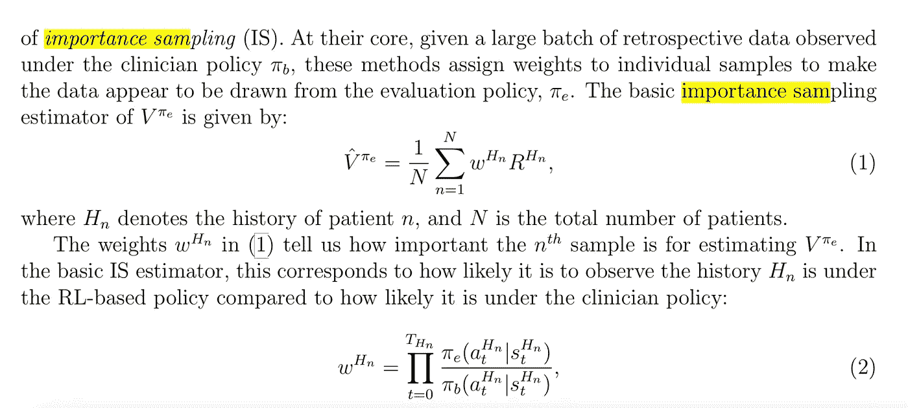
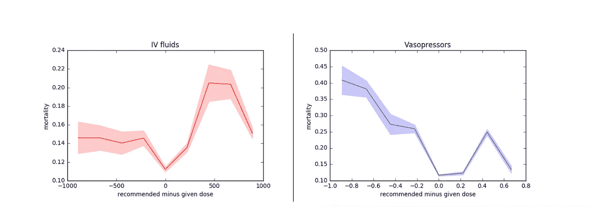
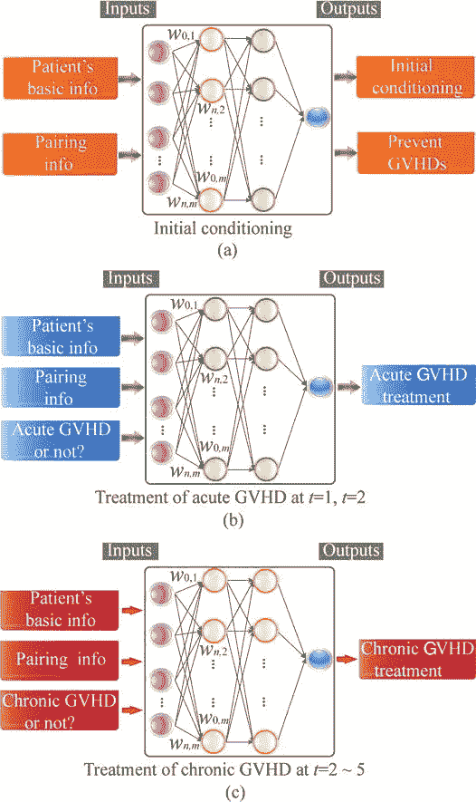

# 强化学习在医疗保健中的应用综述

> 原文：<https://towardsdatascience.com/a-review-of-recent-reinforcment-learning-applications-to-healthcare-1f8357600407?source=collection_archive---------9----------------------->

## 让机器学习超越诊断，找到最佳治疗方法

Photo taken from Wang et al. [KDD Video](https://www.kdd.org/kdd2018/accepted-papers/view/supervised-reinforcement-learning-with-recurrent-neural-network-for-dynamic)

机器学习在医疗保健领域的应用已经取得了许多重大成果。然而，这些研究大部分集中在诊断病情或预测结果，而不是明确的治疗上。虽然这些可以间接帮助治疗患者(例如，诊断是找到治疗方法的第一步)，但在许多情况下，特别是在有许多可用治疗方案的情况下，为特定患者找出最佳治疗策略对人类决策者来说是一项挑战。虽然强化学习已经变得非常流行，但大多数论文都专注于将其应用于棋盘或视频游戏。RL 在学习这些(视频/棋盘游戏)环境中的最优策略方面表现很好，但是相对而言，在医疗保健等真实世界环境中尚未经过测试。RL 是实现这一目的的一个很好的候选，但是在实际工作中有许多障碍。

在本文中，我将概述一些最新的方法，以及将 RL 应用到医疗保健中存在的最大障碍。如果你对这个话题感兴趣，我将在 [PyData Orono Meetup 上详细介绍几个模型，该会议将于本周三美国东部时间 7-9:30 在 Zoom 上播出。本文假设您对强化学习有基本的了解。如果你不知道，我建议你读一读关于数据科学的文章。](https://www.meetup.com/PyData-Orono/)

## **基本挑战:**

1.  **对纯(或主要)观测数据的学习和评估**

与 AlphaGo、Starcraft 或其他棋盘/视频游戏不同，我们无法模拟大量的场景，在这些场景中，代理人进行干预以学习最优策略。最重要的是，利用患者来训练 RL 算法是不道德的。此外，这将耗资巨大，可能需要数年才能完成。因此，有必要从观察史料中学习。在 RL 文献中，这被称为“政策外评估”。许多 RL 算法，如 Q-learning，“理论上”可以在偏离策略的上下文中有效地学习最优策略。然而，正如 Gottesman 等人在他们最近的文章中指出的那样，“在观察性健康设置中评估强化学习算法”，准确评估这些学习到的策略是棘手的。

在正常的 RL 环境中，为了评估一项政策，我们只需让代理人做出决策，然后根据结果计算平均奖励。然而，如上所述，由于道德和后勤方面的原因，这是不可能的。那么我们如何评价这些算法呢？截至目前还没有一个满意的答案。Gottesman 等人在他们的报告中详细描述了这一点，并陈述了可能的情况，但他们没有就使用哪种度量得出具体的结论。下面是常用指标的简要分类。在讨论个别论文时，我也会更详细地介绍。

*   *重要性抽样*

Gottesman et al. *Note don’t confuse “weight” here with the weight of neural network. Here you can think of weight almost as a measure of similarity between the histories of the patient under the clinical policy versus what it would be under the learned policy.

为了简化数学术语，这种方法本质上涉及到寻找由医生制定的、匹配或几乎匹配所学政策的治疗方案。然后我们根据这些实际治疗的结果来计算奖励。这种方法的一个问题是，在许多情况下，“非零重要性权重”的实际数量非常小这意味着本质上，如果学习政策建议了医生永远不会做的治疗(或缺乏治疗),那么你将很难评估该政策，因为没有类似的历史，我们实际上有可以比较的结果。

戈特斯曼等人。艾尔。不要提供这个问题的解决方案。相反，他们指出，人们应该*“*总是检查重要性权重的分布”，因为大多数人往往会坐在零附近。为此，Gottesman 指出“因此，我们应该确保用于评估政策的有效样本量足够大，以使我们的评估具有统计学意义。如上所述，将我们自己限制在与医生相似的政策范围内，也将有利于增加有效样本量。"

*   u 形曲线

Examples of the U-Curve from Gottesman et al.

这种方法侧重于比较学习策略和医生策略之间在结果方面的差异。这种评估方法本身也有问题，因为它很容易导致糟糕的政策看起来比临床医生的政策更好。该方法的核心是潜在的假设，即如果当政策推荐剂量和医生剂量匹配时，死亡率低，则政策一定是好的。然而，Gottesman 等人发现，由于数据中发现的差异，随机或无治疗策略看起来会优于医生的策略。

选择良好的评估指标很重要，因为在某些情况下，由于大多数接受治疗的患者具有不良结果，代理可能会学会将治疗与负面结果相关联。这是由于缺乏未治疗患者的数据。正如 Gottesman 等人关于脓毒症所述:

> “我们观察到一种已有政策的趋势，即建议对非常高急性(SOFA 评分)的患者进行最低限度的治疗。从临床角度来看，这个建议没有什么意义，但从 RL 算法的角度来看是可以理解的。大多数 SOFA 评分高的患者接受积极的治疗，由于他们病情的严重性，这一亚群的死亡率也很高。在缺乏没有接受治疗的高急性患者的数据的情况下，RL 算法得出结论，尝试一些很少或从未进行的事情可能比已知结果不佳的治疗更好。第 4 页

这又回到了相关性不等于因果性的经典问题。虽然在这里很明显，这个模型在其他环境中有问题，但如果没有适当的评估，它可能更加微妙，不容易被发现。

**2。部分可观察性**

与医学中的许多游戏不同，我们几乎永远无法观察体内发生的一切。我们几乎可以每隔一段时间测量一次血压、体温、二氧化硫和其他简单的指标，但这些都是信号，并不是患者的真实情况。此外，有时我们可能在某些时间点有数据，但在其他时间点没有。例如，医生可能只在治疗肺炎病人的前后进行胸部 x 光检查。因此，模型必须在没有所有数据的情况下估计条件的状态。这是医疗保健中的一个难题，因为在每个时间点都有很多关于病人的未知信息。

**奖励功能**

在许多现实世界的问题中，找到一个好的奖励函数是具有挑战性的。医疗保健也不例外，因为通常很难找到一个奖励函数来平衡短期改善和整体长期成功。例如，在脓毒症的情况下，血压的周期性改善可能不会导致结果的改善。相比之下，最后只给出一个奖励(生存或死亡)意味着一个很长的序列，没有任何中间反馈给代理人。通常很难确定哪些行为(或不行为)导致了奖励或惩罚。

**RL 渴望数据**

几乎所有深度强化的重大突破都是基于多年的模拟数据。显然，当您可以通过模拟器轻松生成数据时，这就不是什么问题了。但是，正如我在以前的许多文章中所描述的那样，特定治疗的数据通常很少，这些数据需要付出巨大的努力来注释，并且由于 HIPPA 合规性和 PHI，医院/诊所对共享他们的数据非常谨慎。这为将深度 RL 应用于医疗保健带来了问题。

**非平稳数据**

医疗保健数据本质上是非静态和动态的。例如，患者可能会在不一致的时间间隔记录症状，并且一些患者会比其他人记录更多的生命体征。治疗目标也可能随着时间的推移而改变。虽然大多数论文关注的是降低整体死亡率，例如，如果患者的病情有所改善，关注点可能会转移到缩短住院时间或其他目标上。此外，病毒和感染本身可能会以训练数据中未观察到的动态方式快速变化和进化。

## **有趣的近期研究**

既然我们已经解决了医疗保健中关于强化学习的一些最大挑战，让我们看看一些令人兴奋的论文以及他们如何(试图)克服这些挑战。

*   [**深度强化治疗脓毒症**](https://arxiv.org/pdf/1711.09602.pdf)

这篇文章是最早直接讨论深度强化学习在医疗保健问题中的应用的文章之一。在这篇文章中，作者使用了 MIMIC-III 数据集的脓毒症子集。他们选择将作用空间定义为由升压药和静脉注射液组成。他们将药物剂量分成四组，每组包含不同数量的药物。核心网络是具有独立价值流和优势流的双深度 Q 网络。基于测量器官衰竭的 SOFA 评分，奖励函数是临床激励的。为了评估，他们使用了戈特斯曼所谓的 U 型曲线。具体来说，他们将死亡率视为处方政策与实际政策之间剂量差异的函数。

*   [**强化学习与行动衍生奖励化疗与临床试验给药方案选择**](http://web.media.mit.edu/~pratiks/mlhc_2018/reinforcement_learning_with_action_derived_rewards_for_chemotherapy_and_clinical_trial_dosing_regimen_selection.pdf)

本文描述了一种通过强化学习寻找化疗患者最佳治疗策略的方法。本文还使用 Q-Learning 作为底层模型。对于一个行动空间，他们制定了一定数量的剂量给定的持续时间，代理人能够从中进行选择。剂量周期只能以专家确定的频率启动。在每个周期结束时计算转换状态。回报函数被定义为肿瘤直径的平均减少。使用模拟临床试验进行评估。目前还不清楚这些模拟是如何建立的，但这种类型的模拟通常包含病理和统计数据。

*   [**用递归神经网络监督强化学习进行动态治疗推荐**](https://arxiv.org/pdf/1807.01473.pdf)

本文将监督式 RL(通过演员评论方法)与 RNNs 一起用于学习整体治疗计划。这篇论文值得注意的是，它试图利用完整的 MIMIC-III 数据集，为所有患者提供治疗，而不仅仅是一个子集。该设置基本上包含三个主要组件:基于患者状态推荐药物的参与者、评估这些药物的价值以鼓励或阻止它们的批评家网络，以及用于通过总结历史观察来帮助克服部分可观察性问题的 LSTM。动作空间是 1，00 种确切的药物或 180 种药物类别。作者根据估计的住院死亡率来评估他们的方法。

*   [**对医疗登记数据进行动态治疗方案的深度强化学习**](https://www.ncbi.nlm.nih.gov/pmc/articles/PMC5856473/)

Image from article detailing using RL to prevent GVHD (Graft Versus Host Disease).

这是一篇有趣的论文，旨在为各种动态治疗方案提供一个框架，而不像以前的论文那样局限于特定的个体类型。作者声明“提出的深度强化学习框架包含一个监督学习步骤，以预测最可能的专家行动；和深度强化学习步骤，以估计动态治疗方案的长期价值函数。”第一步是监督学习，以预测给定患者的一组可能的专家治疗方法，以预防移植物抗宿主病(GVHD)，GVHD 是骨髓捐赠后的一种常见并发症，其中捐赠者的免疫细胞攻击宿主的细胞。第二步是 RL 步骤，代理人寻求将并发症的可能性降至最低。

还有一些其他的论文，由于篇幅原因，我就不赘述了，但仍然很有趣。

*   [**一种鼓励糖尿病患者身体活动的强化学习系统**](https://arxiv.org/abs/1605.04070)

这是一篇完全不同的论文，它涉及使用 RL 来鼓励健康的习惯，而不是直接治疗。

*   [**脓毒症患者个性化血糖控制的表征和强化学习**](https://arxiv.org/abs/1712.00654)

这是另一篇关于脓毒症和 RL 的论文。然而，它采用了一种稍微不同的方法，只关注血糖控制。

*   [**从观测数据中学习最优策略**](https://arxiv.org/pdf/1802.08679.pdf)

这实际上不是一篇强化学习的论文，不管它有多好。它侧重于反事实推理和使用领域对抗性神经网络。

## 结论

在医疗保健中应用强化技术仍然存在许多挑战。最困难和最突出的是在医疗保健场景中有效评估 RL 算法的问题。其他挑战涉及培训所需的数据量、数据的非平稳性以及数据仅部分可观察的事实。也就是说，有很多最近出现的文献可以帮助解决一些问题。如上所述，我打算在[即将举行的 meetu](https://www.meetup.com/PyData-Orono/events/256618548/) p 会议上深入探讨其中的一些方法。此外，我希望复兴[关于医疗保健机器学习的 Slack 频道](https://join.slack.com/t/curativeai/shared_invite/enQtNDk5NDAzNTM3NzMxLTZkYWEyYjY5MzI4MGE1YjZiNjBkZDIwNGY2YWJkZDEzY2MzZTJhNjIyZTdiN2JmMjllYzE2OTU3Y2EyYWRhNWI)，所以如果你感兴趣，请加入。

## 附加注释的参考文献

[医疗保健领域的数字医生研讨会强化学习](https://www.youtube.com/watch?v=OsGxPVYR2xo)

这是一个非常好的演讲，由 MLHC 的组织者之一做的，关于将 RL 应用于 HIV 治疗。在这里，她以一种清晰明了的方式讨论了许多问题。

[在不稳定和竞争环境中通过元学习进行持续适应](https://arxiv.org/pdf/1710.03641.pdf)

这篇论文与医疗保健无关，但我认为它提供了一个很好的框架来处理 MAML 的非固定问题(可能会出现)。此外，(只是直觉)我认为它可能对进化非常快的病毒和 RL 必须快速适应并基于少量数据的其他情况有用。

[评估观察健康环境中的强化学习算法](https://arxiv.org/pdf/1805.12298.pdf)

我已经为这篇文章做了大量的采样，但是我认为如果你真的想理解评估，你应该通读这篇文章。