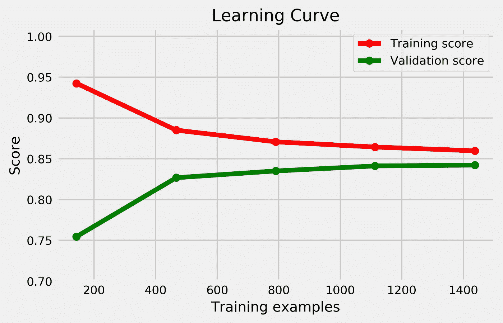
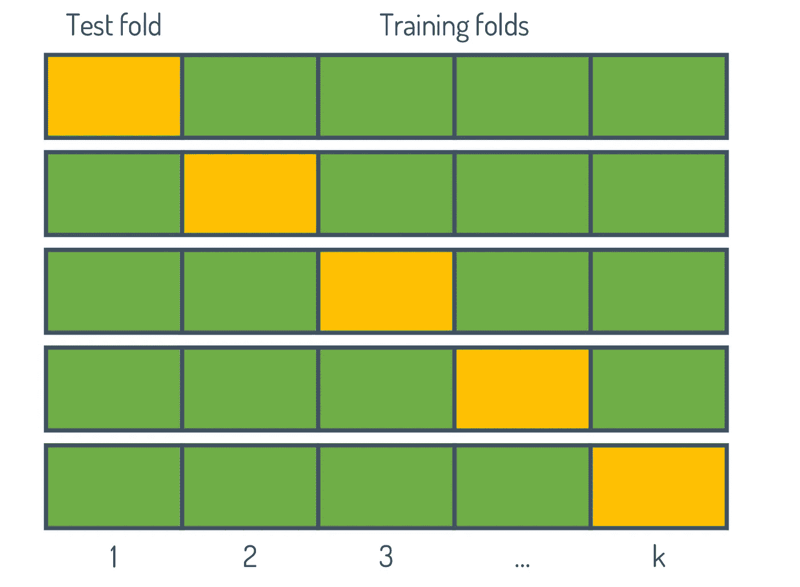
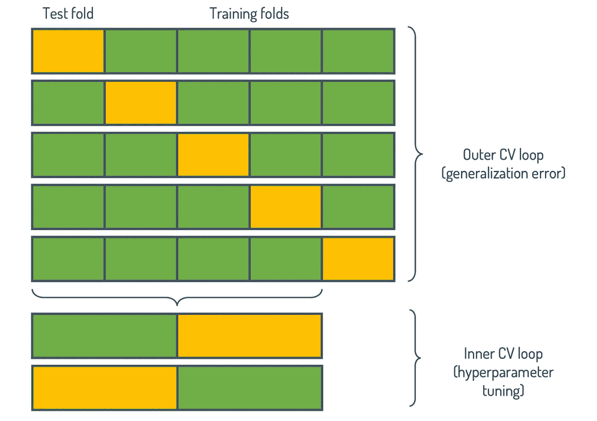

# 模型选择的“简短”介绍

> 原文：<https://towardsdatascience.com/a-short-introduction-to-model-selection-bb1bb9c73376?source=collection_archive---------4----------------------->

## 大数据和小数据下的超参数选择和算法选择综述

在这篇文章中，我将讨论构建好的(有监督的)机器学习模型的核心主题:模型选择。这并不是说模型选择是数据科学工作流程的核心，没有高质量的数据，模型构建就是一纸空文。然而，模型选择在建立良好的机器学习模型中起着至关重要的作用。

## 不同比例的模型选择

那么，模型选择是怎么回事呢？机器学习上下文中的模型选择可以具有不同的含义，对应于不同的抽象级别。

首先，我们可能有兴趣为选定的机器学习方法选择最佳的 ***超参数*** 。超参数是我们必须先验指定的学习方法本身的参数，即在模型拟合之前。相反， ***模型参数*** 是作为拟合的结果而出现的参数[1]。例如，在逻辑回归模型中，正则化强度(以及正则化类型，如果有的话)是必须在拟合之前指定的超参数，而拟合模型的系数是模型参数。为模型找到正确的超参数对于模型在给定数据上的性能至关重要。

另一方面，我们可能希望从一组合格的机器学习方法中选择最佳的 ***学习方法*** (以及它们相应的“最优”超参数)。在下文中，我们将此称为 ***算法选择*** 。对于手头的分类问题，我们可能想知道，例如，逻辑回归模型或随机森林分类器是否在给定的任务上产生最佳的分类性能。

## “还有一件事”:模型评估

在深入研究模型选择的不同方法的细节以及何时使用它们之前，我们需要讨论“另一件事”: ***模型评估*** 。模型评估旨在估计所选模型的泛化误差，即所选模型对未知数据的表现。显然，好的机器学习模型不仅对训练期间看到的数据表现良好(否则机器学习模型可以简单地记住训练数据)，而且对看不见的数据也表现良好。因此，在将模型交付生产之前，我们应该相当确定模型的性能在面对新数据时不会降低。

但是 ***为什么*** 我们需要 ***模型选择和模型评估的区别吗？*** 原因是过拟合。如果我们用我们用来选择获胜模型的相同数据来估计我们选择的模型的泛化误差，我们将得到一个过于乐观的估计。为什么？
我们来做个思想实验。假设给你一组黑盒分类器，并指示你选择性能最好的分类器。所有的分类器都是无用的——它们输出 0 和 1 的(固定)序列。您评估了数据上的所有分类器，发现它们平均有 50%的正确率。偶然地，一个分类器在数据上比其他分类器表现得更好，比如说，差 8%。您将此性能作为分类器对未知数据的性能估计(即，作为泛化误差的估计)。你报告说你找到了一个比随机猜测更好的分类器。然而，如果你使用一个完全独立的测试集来估计泛化误差，你会很快发现这个骗局！为了避免这样的问题，我们需要完全独立的数据来估计模型的泛化误差。我们将在交叉验证的上下文中回到这一点。

## 如果数据不是问题

模型选择的推荐策略取决于可用的数据量。如果 ***有足够的数据*** 可用，我们可以将数据分成几个部分，每个部分服务于一个特殊的目的。例如，对于 ***超参数调整*** ，我们可以将数据分成三组: ***训练/验证/测试*** 。训练集用于训练与模型超参数的不同组合一样多的模型。然后在验证集上评估这些模型，并且在该验证集上具有最佳性能的模型被选为获胜模型。随后，使用选择的超参数集在训练+验证数据上重新训练该模型，并且使用测试集来估计泛化性能。如果这种泛化误差类似于验证误差，我们有理由相信该模型在看不见的数据上表现良好。最后，在将模型用于“生产”之前，我们根据完整数据(训练、验证&测试集)对其进行重新训练。
因为并非所有的数据都是平等的，所以没有关于数据应该如何分割的通用规则。典型的比例是 50%/25%/25%。无论如何，验证集应该足够大，以测量我们希望能够测量的性能差异:如果我们关心模型之间 0.1%的差异，我们的验证集必须不小于 1000 个样本，但 10000 个样本就足够了。

对于 ***算法选择*** ，按照上面的推理，我们可以使用 ***几个训练/验证/测试集*** ，每个算法一个三元组。由于这种方法对数据要求很高，我们将在下面讨论一种替代方法。

## 学习曲线，以及它们为什么有用

但是为什么要在模型选择/模型评估之后重新训练模型呢？答案最好用 ***学习曲线*** 来说明。在学习曲线中，模型在训练集和验证集上的性能被绘制为训练集大小的函数。 ***图 1*** 显示了一条典型的学习曲线:随着训练集规模的增大，训练得分(在训练集上的表现)降低，而验证得分同时增加。高训练分数和低验证分数同时指示模型过度拟合数据，即，对特定训练集样本适应得太好。随着训练集的增加，过度拟合会减少，验证分数会增加。
特别是对于数据饥渴的机器学习模型，在给定的训练集规模下，学习曲线可能尚未达到平稳状态，这意味着当向模型提供更多数据时，泛化误差可能仍会降低。因此，在估计测试集的泛化误差之前增加训练集(通过添加验证集)并在发布模型之前进一步利用测试集数据来拟合模型似乎是合理的。是否需要这种策略很大程度上取决于初始训练集大小的学习曲线的斜率。

Fig. 1: Example of a learning curve.

学习曲线进一步允许容易地说明(统计的) ***偏差*** 和 ***方差*** 的概念。在这种情况下，偏差是指错误的(例如，简化)模型假设，这可能导致模型对数据拟合不足。高偏差模型不能充分捕捉数据中存在的结构。另一方面，方差量化了当我们改变训练数据时模型变化的程度。高方差模型对训练数据的微小波动非常敏感，这会导致模型过度拟合。可以使用学习曲线来估计偏差和方差的量:如果训练分数稳定在高水平，而验证分数处于低水平，即，如果训练和验证分数之间存在大的差距，则模型表现出高方差，但是偏差低。相反，具有低方差但高偏差的模型是训练和验证分数都低但相似的模型。非常简单的模型是高偏差、低方差的，而随着模型复杂性的增加，它们变得低偏差、高方差。

模型复杂性的概念可用于创建有助于模型选择的度量。有一些措施明确处理拟合优度和模型简单性之间的这种权衡，例如*(AIC)和 ***贝叶斯信息标准*** (BIC)。两者都惩罚模型参数的数量，但奖励训练集的拟合优度，因此最佳模型是具有最低 AIC/BIC 的模型。BIC 对模型复杂性的惩罚力度更大，因此更青睐“错误更多”但更简单的模型。虽然这允许在没有验证集的情况下进行模型选择，但它可以严格地仅应用于参数线性的模型，即使它通常也适用于更一般的情况，例如用于一般的线性模型，如逻辑回归。关于更详细的讨论，参见例如参考文献。[2,3].*

## *分而治之——但是要小心*

*贯穿以上讨论，我们隐含地假设**训练、确认和测试集**是从同一分布 中采样的 ***。如果不是这样，所有的估计都将是完全错误的。这就是为什么在建立模型之前必须确保数据的分布不受数据分区的影响。例如，假设您正在处理不平衡的数据，例如，一个二元目标的数据集只有 10%的情况是肯定的。例如，按照 50%/25%/25%的比例将数据随机分为训练/验证/测试集可能会导致 5%的阳性案例分布在训练集中，15%的阳性案例分布在验证测试集中&，这可能会严重影响算法性能估计。在这种情况下，您可能希望使用*(如果您的学习方法需要，可能与过采样或欠采样技术相结合)进行划分。*****

**最后提醒一句:当处理任务是进行预测的时间序列数据时，必须通过沿着时间轴 拆分 数据******来选择训练、验证和测试集。也就是说，“最老的”数据用于训练，最近的数据用于验证，最近的数据用于测试。随机抽样在这种情况下没有意义。********

## *如果你只有少量数据*

*但是如果我们只有小数据呢？这种情况下我们怎么做选型评估？模型评估不会改变。我们仍然需要一个测试集来估计最终选择的模型的泛化误差。因此，我们将数据分成两组，一组训练集和一组测试集。与之前的过程相比，我们使用训练集的方式发生了变化。*

## *鱼与熊掌兼得:超参数选择的交叉验证*

*对于 ***超参数选择*** ，我们可以使用*K*-折叠 ***交叉验证*** (CV)。交叉验证的工作方式如下:*

1.  *我们将训练集分成 K 个更小的集合。注意，关于不平衡数据的警告在这里也适用。*
2.  *我们将每个 *K* 折痕留出一次，如图 ***图 2*** 所示。我们在剩余的 *K-1* 折叠上训练与模型超参数的不同组合一样多的模型，并计算保留折叠上的验证分数。*
3.  *对于每组超参数，我们计算平均验证分数，并选择在保留验证集上具有最佳性能的超参数集。或者，我们可以应用“一个标准误差规则”[2]，这意味着我们选择最节省的模型(具有最低复杂性的模型)，其性能不超过最佳性能模型的标准误差。*

*随后，我们在全训练集上用选择的超参数集训练模型，并使用测试集估计泛化误差。最后，我们使用训练集和测试集的组合数据重新训练模型。*

**

*Fig. 2: Illustration of 5-fold cross-validation.*

*我们应该做多少次分裂，也就是说，我们应该如何选择 K ？不幸的是，没有免费的午餐，也就是说，没有一个答案总是最好的。如果我们选择 *K=N* 其中 *N* 是训练样本的数量，我们处理的是一种叫做 ***留一交叉验证*** (LOOCV)的方法。这里的优点是，由于我们总是使用几乎全部数据进行训练，因此估计的预测性能是近似无偏的，这意味着预测误差的期望值和“真实”预测误差之间的差异非常小。然而，缺点是 LOOCV 的计算量很大，并且方差可能很高，这意味着我们的预测性能估计值可能会在其“真实”值附近剧烈波动。相比之下，如果我们选择 *K=5* 或 *K=10* ，我们预测性能估计的方差较低，但我们的估计可能过于悲观，因为我们仅使用 80–90%的可用数据进行训练(参见上面对学习曲线的讨论)。尽管如此，作为经验法则，推荐 10 倍(或 5 倍)CV[2]。*

## *matryoshka 内部:算法选择的嵌套交叉验证*

*对于 ***算法选择*** 我们需要一个更精细的方法。这里， ***嵌套交叉验证*** 就来帮忙了，如图 ***图 3*** 所示，工作原理如下:*

1.  *我们将数据分成 *K* 个更小的集合(外层折叠)。*
2.  *每一个 *K* 折叠我们留出一次。对于每种学习方法，我们然后在剩余的 *K-1* 折叠上执行*K’*-折叠 CV(按照上面的程序)，其中我们做超参数选择。为简便起见，将具有 *K* 外折叠和*K’*内折叠的嵌套 CV 称为*KxK’*嵌套 CV。 *KxK'* 的典型值为 *5x2* 或 *5x3* 。*
3.  *我们使用每个算法的最佳超参数集来估计其在保留折叠上的验证分数。*
4.  *然后，我们计算在 *K* 折叠上的平均验证分数(以及标准偏差),并选择最佳执行算法
    。随后，我们使用完整训练集选择基于 CV 的最佳超参数集，并使用测试集估计泛化误差。*

*最后，我们使用训练集和测试集的组合数据重新训练模型。*

**

*Fig. 3: Illustration of 5x2 nested cross-validation.*

## *嵌套交叉验证的复杂业务*

****如果我们 ***不使用在嵌套 CV 程序的内循环*** 中找到的“最佳”超参数，为什么我们*** 还要选择超参数？原因是在算法选择中，我们并不是真的对为特定数据样本(我们的训练集)找到最佳算法&对应的超参数集感兴趣。我们更希望算法能够很好地推广，并且如果我们使用稍微不同的数据进行训练，它不会从根本上改变[4]。我们想要一个稳定的算法，因为如果我们的算法不稳定，泛化估计是无用的，因为我们不知道如果算法遇到训练集中的不同数据点会发生什么。因此，如果在内部循环中发现的超参数是不同的，只要在保持集上的相应性能估计是相似的，我们就没有问题。如果它们是，那么不同的超参数很可能导致相似的模型，并且在完整的训练数据上训练算法将再次产生相似的(尽管希望略有改进)模型。*

****特征选择等预处理*** 呢？根据经验，监督预处理(包括数据标签)应该在(内部)CV 循环内完成[2]。相比之下，无监督的预处理，如缩放，可以在交叉验证之前完成。如果我们忽略这个建议，我们可能会得到一个过于乐观的性能估计，因为在所有训练数据的基础上选择了相关特征之后，为了验证的目的而搁置数据会在训练和验证之间引入依赖性。这与独立性的假设相矛盾，当我们使用数据进行验证时，独立性是隐含的。然而，通过在内部 CV 循环中进行预处理(如特征选择),我们可能会得到一个悲观的性能估计，因为预处理过程可能会在使用更多数据时得到改善。*

## *当散文不够的时候*

*如果您想知道如何使用代码 实现这种略微繁琐的嵌套交叉验证过程 ***，您可以在这里找到一个 ***示例***(python jupyter notebook with scikit-learn)[。](https://github.com/esentri/datascience_blog_resources/blob/master/model_selection.ipynb)****

*虽然到目前为止还不全面，但这篇文章涵盖了许多关于模型选择的重要概念和“最佳实践”。关于这个主题还有更多要说的，特别是关于模型选择的统计测试和用于估计性能估计的不确定性的基于采样的方法(例如 bootstrapping)。如果这篇文章只是让你开始，请参考参考文献。【1-3】供进一步阅读。*

## *参考*

*[1] [机器学习中的模型评估、模型选择和算法选择](https://sebastianraschka.com/pdf/manuscripts/model-eval.pdf)Sebastian rasch ka。*

*[2] Hastie T .、Tibshirani R .和 Friedman J,《统计学习的要素》,美国纽约州纽约市:斯普林格纽约公司(2008 年)。*

*[3][Neptune . ai 博客上的机器学习中模型评估和选择的终极指南](https://neptune.ai/blog/the-ultimate-guide-to-evaluation-and-selection-of-models-in-machine-learning)。*

*[4]参见 Stackexchange 讨论[此处](https://stats.stackexchange.com/questions/65128/nested-cross-validation-for-model-selection)，此处[此处](https://stats.stackexchange.com/questions/251752/model-selection-problem-using-nested-cross-validation-in-presence-of-several-alt)，此处[此处](https://stats.stackexchange.com/questions/232897/how-to-build-the-final-model-and-tune-probability-threshold-after-nested-cross-v)。*