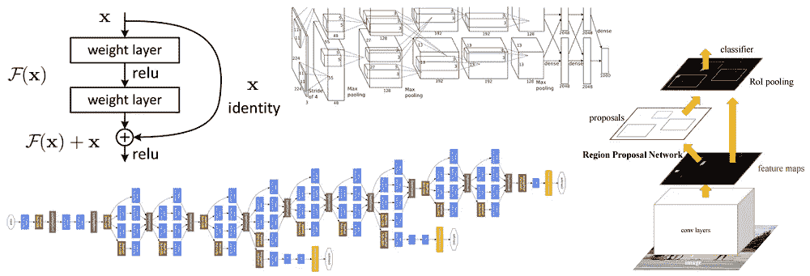
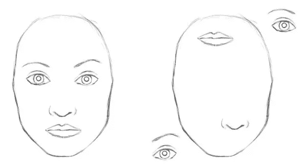
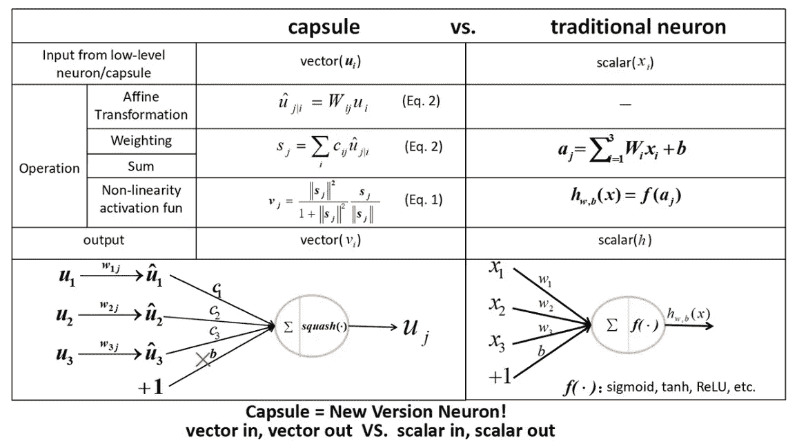
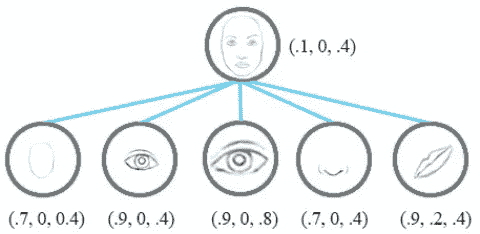

# 对辛顿胶囊网络的简单而直观的解释

> 原文：<https://towardsdatascience.com/a-simple-and-intuitive-explanation-of-hintons-capsule-networks-b59792ad46b1?source=collection_archive---------9----------------------->

> 想获得灵感？快来加入我的 [**超级行情快讯**](https://www.superquotes.co/?utm_source=mediumtech&utm_medium=web&utm_campaign=sharing) 。😎

# 深度学习的复兴

早在 2012 年，机器学习领域发表的一篇论文将引发人工智能领域的复兴。该论文首次发表了使用*深度卷积神经网络*进行图像识别的研究。它打破了图像识别算法的所有记录。

从那时起，每个人都跳上了深度学习的列车，原因很简单:它一直在工作。事实上，在计算机视觉或自然语言处理中，还没有一个领域应用了深度学习，没有改善结果。研究人员也一直在尝试各种疯狂的配置，并将这些技术应用到许多新的应用中，这对人工智能来说确实是一个令人兴奋的时刻。

下图显示了其中的一些技术。像堆叠许多层、多个子网络、改变卷积大小和跳过连接都在提高精确度和推进研究方面发挥了作用。

A few of the many techniques developed for deep learning in computer vision

…那么有什么问题呢？

深度学习不会在任何地方都有效。

很明显，在过去的几年里，它在很多事情上都做得很好，但是当你使用一段时间后，它的一些缺陷和弱点就会显现出来。

# 深度学习的失败

卷积神经网络(CNN)的主要构件是卷积运算。在深度网络中，卷积(及其权重)的基本工作基本上是“检测”关键特征。当我们训练一个深度网络时，我们有效地调整了 CNN 卷积运算的权重，以检测图像中的某些特征或被其“激活”。

如果我们在人脸检测数据集上训练一个网络，那么网络中的一些卷积可能由眼睛触发，而其他卷积可能由耳朵触发。如果我们拥有组成一张脸的所有组成部分(或至少一定数量)，如眼睛、耳朵、鼻子和嘴巴，那么我们的 CNN 会告诉我们它已经检测到一张脸，万岁！！

但不幸的是，CNN 的影响力仅限于此。让我们看看下面的例图，看看为什么。左边的人脸图像包含了上面提到的所有元素。CNN 很好地处理了这种情况:它看到了所有的组件，即卷积在所有正确的特征上激活。所以我们的网络说是的，那是一张脸！

An example of where a CNN would fail. [Source](http://sharenoesis.com/wp-content/uploads/2010/05/7ShapeFaceRemoveGuides.jpg)

棘手的是，对于 CNN 来说，右边的图像也是一张脸。你说为什么？对一个网络来说，它拥有一张脸的所有特征。当应用卷积运算时，它们将在所有这些特征上被激活！

需要理解的一件重要事情是，较高级别的特征将较低级别的特征组合为加权和:在被传递到激活非线性之前，前一层的激活乘以后一层神经元的权重并相加。在这个信息流中，没有任何地方考虑到特征之间的关系。

因此，我们可以说*CNN 的主要失败在于它们没有携带任何关于特征之间相对关系的信息。*这只是 CNN 核心设计中的一个缺陷，因为它们是基于应用于*标量*值的基本卷积运算。

# 胶囊有什么帮助

Hinton 认为，为了正确地进行图像识别，保持图像特征之间的层次姿势关系是很重要的。胶囊引入了一种新的构建模块，可用于深度学习，以更好地对网络内部的这些关系进行建模。当这些关系建立到网络中时，它很容易理解它看到的东西只是它以前看到的东西的另一个视图，因为它不仅仅依赖于独立的特征；它现在把这些特征放在一起，形成一个更完整的“知识”表示。

这种更丰富的特征表现的关键是使用了*矢量*而不是*缩放器*。让我们回顾一下 CNN 中卷积的基本操作:矩阵乘法(即标量等待)，全部相加，标量到标量映射(即激活函数)。以下是步骤:

1.  *标量*输入*标量*的加权
2.  加权输入的总和*标量*
3.  *标量*到- *标量*非线性

通过使用*向量*代替*标量*，可以简单地分解胶囊网络的变化:

1.  输入矢量*的矩阵乘法*
2.  输入矢量*的标量加权*
3.  加权输入矢量的总和*矢量*
4.  *矢量* -to- *矢量*非线性

Capsules vs traditional neurons

向量有帮助，因为它帮助我们编码更多的信息，而不仅仅是任何一种信息，*相关*和*相对*信息。想象一下，不仅仅是特征的*标量*激活，我们认为它的*向量*包含类似于包含【可能性，方向，大小】的东西。最初的标量版本可能像左边的图一样工作；即使眼睛和嘴唇相对于面部来说很大(95%的可能性)，它也能检测到面部！另一方面，胶囊由于其更丰富的矢量信息，看到特征的大小是不同的，因此输出检测面部的较低可能性！请特别注意图表中的分数，以便完全理解。

*Left*: How a regular CNN would detect facial features. *Right*: How a capsule network would detect features.

胶囊还有一个好处，就是能够用少得多的训练数据达到很好的准确度。*等方差*是对可以相互转化的物体的检测。直观上，胶囊检测到脸部向右旋转 20(或向左旋转 20)，而不是意识到脸部匹配向右旋转 20 的变体。因此，由于胶囊具有诸如方向、大小等矢量信息，所以它可以在被训练时使用该信息来学习更丰富的特征表示。它不需要 50 个相同的旋转狗的例子；它只需要一个可以很容易转换的向量表示。通过迫使模型学习胶囊中的特征变体，我们*可以*用更少的训练数据更有效地推断可能的变体。

# 结论

凭借胶囊提供的丰富信息，它们显示出巨大的潜力，成为我们未来深度网络的主要驱动力。这种丰富性确实带来了新的挑战:更多的数字意味着更多的计算和更多的复杂性。无论如何，人工智能领域一个激动人心的新机遇已经开启。

# 喜欢学习？

在[推特](https://twitter.com/GeorgeSeif94)上关注我，我会在那里发布所有最新最棒的人工智能、技术和科学！也在 LinkedIn 上与我联系！