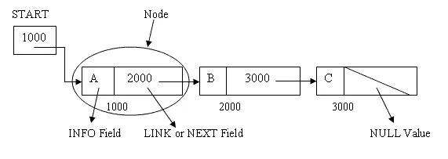

# 数据结构的简单介绍:第一部分——链表

> 原文：<https://towardsdatascience.com/a-simple-introduction-to-data-structures-part-one-linked-lists-efbb13e9ad33?source=collection_archive---------3----------------------->

编程的世界总是在变化。而且变化很快。我们一直在寻找更好的方法来做我们正在做的事情。这是一件伟大的事情。迭代是一个非常强大的概念。

然而，在计算机科学世界中，有一些想法和结构是不变的。数据结构及其应用就是其中的一部分。

你可能会想，在所有事情中，这是每个程序员或软件工程师都会理解的，对吗？那你就错了。

我可以告诉你，大学毕业后，我肯定不知道何时以及为什么要使用一种数据结构而不是另一种，我发现，现在许多通过实践学习编程的程序员也不知道(代码训练营，让你动手的在线课程，从地下室构建软件)。

老实说，我记得我认为它们真的没有那么重要。我认为它们只在特殊情况下需要，可能是为公共框架或库编写的代码。

伙计，我错了。

了解如何有效地使用数据结构可以很容易地将优秀的开发人员与糟糕的开发人员区分开来。然而，对于一些很难理解这些抽象概念的人来说，真正掌握它们是很困难的。试着从头到尾阅读关于这个主题的事实上的书(“算法简介”——旁注:我知道它说的是“算法”，但它实际上涵盖了数据结构是如何构建的，以适应特定的算法)。

在那本书和许多其他类似的书中，你会发现许多数学证明和想法看起来非常理论化，并且它的抽象本质使得在实际开发软件时很难理解实际的用例。

那么一个程序员如果没有数学学位毕业该怎么办呢？

当许多开发人员第一次意识到数据结构的重要性时(在试图编写一个在几秒钟内处理数百万条记录的系统之后)，他们经常会看到为斯坦福大学计算机科学学位的人编写的书籍或文章。

我希望这篇文章能够填补这个空白，并以更实用的方式解释数据结构。我希望人们从这篇文章中学到的是理解为什么我们有不同的数据结构，它们是什么，以及何时使用一个特定的数据结构。

这将是一个简单的介绍，所以我将介绍您 95%的时间会用到的数据结构，剩下的 5%留给您自己去发现。

让我们开始吧！

首先，我们需要定义什么是数据结构。好吧，一群聪明人已经抛出了许多复杂的听起来不错的定义，但是描述数据结构的最简单也是最准确的方式是说数据结构是在计算机中组织数据的一种特殊方式，以便它可以被有效地使用。仅此而已。这只是一种组织数据的方式，就像人类组织书架的方式一样。你要以一种方式来组织它们，使它们容易得到你想要的东西。

例如，继续使用书架类比，如果我想要能够快速地挑选出我拥有的以字母“T”或“B”或任何其他字母开头的所有书籍(假设有数百本)，那么我会想要以一种使任务快速且容易执行的方式来组织这些书籍。在这个例子中，这意味着按字母顺序组织书籍。很简单。

然而，如果我使用书架的方式不同(比如我想找到所有与物理学科相关的书籍)，那么我们很快就会发现这种书籍的组织方式是有问题的，会导致我在寻找我想要的书籍时效率非常低。

这里的解决方案是根据我们在最常见的场景中如何检索它们，以不同的方式组织书籍。在第二个场景中，我们可能已经决定根据主题来组织书架。这同样适用于数据结构以及你通常如何与它们交互。

让我们开始讨论组织数据的不同方式...又名公共数据结构的类型。为了开始这个有趣的话题，我们将从我最喜欢的数据结构之一开始...

# 链表:更复杂数据结构的构建块

链表是最简单和最常见的数据结构之一。它们也是一个很好的起点，因为链表是一种数据结构，许多其他数据结构在它们自己的结构中内部使用它。

理解链表将有助于你理解“指针”(一个值——通常以十六进制书写——代表另一个值的内存地址或一个值序列的开始)以及系统如何存储和访问内存。

为了使事情变得简单，我在概念上包含了一个链表的可视化表示。

让我们浏览一下上面的图片，然后我们将解释为什么以这种方式存储数据在某些情况下可能是个好主意，而在其他情况下可能是个坏主意。

首先，你可以看到图像上写着“开始”的地方。这就是所谓的链表的“头”。它只是起点，表示第一个“节点”在内存中的位置(本例中为地址 1000)。“1000”是指向下一个节点位置的指针。

我知道你在想什么。“什么是节点？?"。至少这是我第一次读到链表时的想法。简单来说,“节点”就是一个有两个字段的对象。一个字段是“信息”字段(您可以在其中存储一些您关心的数据)，另一个是指针字段。指针字段保存的只是下一个节点位置的地址位置。就是这样！这实际上简单得可笑，以至于很多人都想多了。

正如你在上面的图片中看到的，在我们到达内存地址 1000 之后，我们遇到了一个节点。在这个节点中，我们可以看到两个字段。在我们的例子中，保存“信息”的第一个字段是存储字符“A”。第二个字段(指针字段)将内存中的位置存储到下一个节点(内存位置 2000)。

接下来，我们跟随指针到内存位置 2000。一旦我们到达那里，我们会遇到第二个节点。如您所见，第二个节点的信息为“B ”,指针值为“3000”。这里没什么新鲜的！

最后，我们跟随指针值到内存位置(3000 ),来到另一个节点。这个节点和前面两个差不多。它的信息字段有一个值“C ”,但是正如您所看到的，它的指针字段什么也没有(或者为空)。这仅仅意味着我们已经到了列表的末尾。没有更多的指针可循！这个节点(作为最后一个节点)被称为“尾节点”。

那么是什么使得链表作为一种数据结构有价值，我们什么时候以及为什么会选择使用它呢？让我们接下来讨论这个问题。

链表的结构允许它拥有许多属性，这使得它不同于其他集合结构(比如我将在后面的文章中介绍的数组)。由于使用指针而不是连续的内存块，链表非常适合以下情况:

当您需要从列表中进行固定时间的插入/删除时(例如在实时计算中，时间的可预测性是绝对重要的)

当您不知道列表中会有多少项时。对于数组，如果数组变得太大，您可能需要重新声明和复制内存(同样，我将在以后的文章中更详细地介绍数组。)

当您不需要随机访问任何元素时

当您希望能够在列表中间插入项目时(例如优先级队列——我将在后面介绍的另一种数据结构)

然而，有时使用链表会非常低效，使用另一种集合数据结构(如数组)会更好。

在以下情况下不要使用链表:

当您需要对元素进行索引/随机访问时

当您提前知道数组中元素的数量以便可以为数组分配正确的内存量时

当你需要速度的时候。您可以对数组使用指针数学来访问每个元素，而您需要根据链表中每个元素的指针来查找节点，这可能会导致页面错误，从而影响性能。

当记忆成为问题时。填充数组比链表占用更少的内存。数组中的每个元素都只是数据。每个链表节点都需要数据以及一个(或多个)指向链表中其他元素的指针。

正如你所看到的，取决于你想做什么，链表可能是一个很好的数据结构，也可能是一个非常低效的数据结构。这一切都要追溯到理解每种数据结构的优缺点，并为工作选择正确的“工具”。

希望这是一个快速简单的介绍，说明了为什么学习数据结构是重要的，并阐明了链表何时以及为什么是数据结构的重要起点。

接下来，我将讨论数组、堆栈和队列。敬请期待！

如果你能想到任何更好的方法来解释链表，或者为什么理解数据结构很重要，请在评论中留下它们！

如果你喜欢这篇文章，请与他人分享！这是我能得到的最大的赞美。另外，如果你是技术爱好者，请订阅我的博客([jasonroell.com](https://jasonroell.com/))。祝您愉快，继续学习！