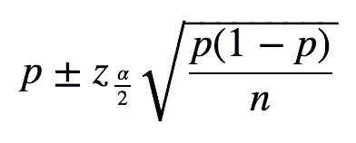

# 标准误差

> 原文：<https://towardsdatascience.com/a-standard-error-450820b5822?source=collection_archive---------5----------------------->

我最近正在读一本畅销书，讲述概率在日常生活中的应用，作者是列纳德·蒙洛迪诺。它雄辩地追溯了测量不确定性的历史，计算随机事件的概率。精选名言:

> 我们生命的轮廓，就像蜡烛的火焰，不断被各种随机事件引导向新的方向，这些事件以及我们对它们的反应，决定了我们的命运。

这些计算得出的见解令人惊讶，也说明了人类对随机性的直觉有多离谱。例如，如果你玩加州彩票，你死在去当地彩票供应商的路上的可能性和你中奖的可能性一样大。当你考虑到这个结果时，这个游戏就不那么吸引人了。

在这段关于数学家伯努利和以他名字命名的分布的文章中，我发现了一个错误:

> 假设巴塞尔 60%的选民支持市长。你要调查多少人才能有 99.9%的机会发现市长的支持率在 58%到 62%之间——也就是说，结果的精确度在正负 2%以内？(假设，为了与伯努利一致，被调查的人是随机选择的，但有替换。换句话说，你可能不止一次地调查一个人。答案是 25，550 人，在伯努利的时代，这大约是巴塞尔的全部人口。伯努利没有忘记这个数字是不切实际的。

根据我的计算，你只需要调查 6446 人，而不是 25550 人。我使用二项式的 CDF 来寻找最小的 n，它给出了至少 0.999 的概率，估计值在 0.58 和 0.62 之间。下面是 R 中的一行程序，p=0.6，n=6446:

> pbinom(天花板(n*.62)，n，p)-pbinom(地板(n*.58)，n，p)
[1] 0.9990067

求解 n 的更直接的方法是使用二项式均值的标准误差公式。下面的公式依赖于二项式的正态近似。我们想找到 n，使得区间等于[0.58，0.62]。

z_{𝛼/2}是标准正态分布的 1- 𝛼/2 分位数，其中𝛼是误差率，在本例中为 1–0.999 = . 001。求解 n 得到 6496.5，与之前计算的值相似。

如果对作者的 25550 人进行民调，那么 99.9%的区间就是 p 0.01，而不是 0.02。换句话说，在 25，550 人的调查中，99.9%的人会显示估计在 59%和 61%之间，而不是声称的 58%和 62%。

一本令人愉快的书中的一个小错误。