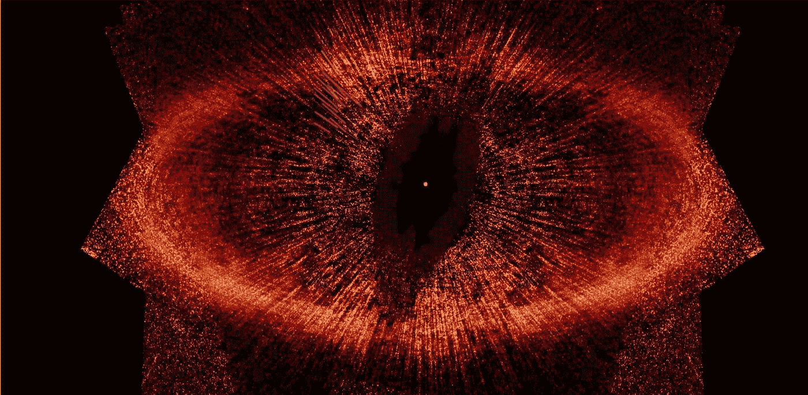
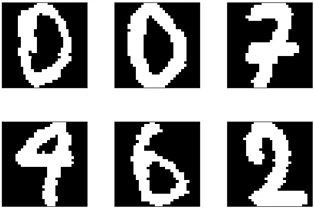
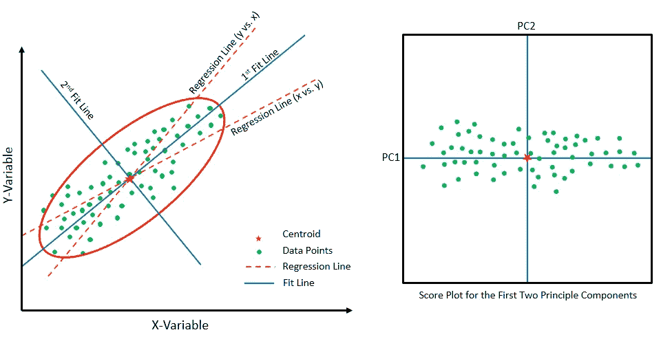
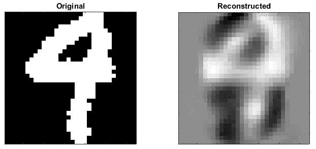
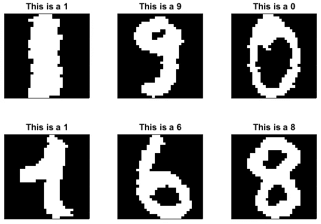

# 机器学习的故事:我们如何识别

> 原文：<https://towardsdatascience.com/a-story-in-machine-learning-how-do-we-see-59db689e84b9?source=collection_archive---------3----------------------->



A star named Fomalhaut and its surrounding belt dust (also known as the eye of Sauron)

考虑一个场景:当你环游世界一半的时候，你走在这个新城市的市中心，欣赏着新的风景。突然，你的注意力集中在向你走来的人身上。当你们彼此越来越接近时，你的大脑开始识别零碎的东西；首先是眼睛，然后是微笑，走路，脸型。突然，它击中了你。是你十年未见的朋友！

我们如何看到？

我们如何识别物体和人？我们如何区分椅子和桌子？朋友换了发型，胖了或者瘦了，长大了，我们怎么区分？这种能力与大脑不储存确切的图像而是储存抽象图像的事实有关。椅子的定义不是存储为一个四条腿的棕色木质物体，有一个背面，而是一个从地面升起的物体，有一些支撑，适合一个人放置。它可能有也可能没有轮子，可能有也可能没有扶手，等等。此外，随着我们看到越来越多的椅子，这种抽象会随着时间而演变。事实上，我们倾向于将这些抽象概念及时投射回去，并根据新的信息改变我们对过去的记忆。

**电脑怎么看？**

类似地，通过抽象来识别对象的计算机系统。一个简单的方法是使用主成分分析(PCA)。我将使用模式识别中机器学习的第一个真实世界应用之一来说明这一点，即识别邮政编码。在这个简单的例子中，我将说明如何构建一个非常简单的系统来将手写数字转换成数字。下图显示了将要分析的一些手写数字的示例。帖子最后给出了数据集链接。

```
% Open and read the file
fileID = fopen('optdigits-orig.tra','r');
formatSpec = '%s';
data = textscan(fileID,formatSpec); data = char(data{1});% Define important parameters
nx = 32; ny = 32; nxny = nx*ny;
nNumbers = size(data,1)/ (nx + 1);% Initialize the output
trainingMatrix = zeros(nxny, nNumbers);
output = zeros(nNumbers, 1);% Subdevide data into images
for i = 1:nNumbers
    startingLocation = ((i-1)*(nx+1))+1;
    endingLocation = startingLocation + ny - 1; 
    outputLocation = endingLocation +1;
    trainingMatrix(:,i) = str2num(reshape(data (startingLocation:endingLocation, :), nxny, 1)); 
    output(i) = str2double(data(outputLocation, :));
end% Visualize some the images
figure('Color', 'White');
for i = 1:6
    subplot(2,3,i)
    imagesc(reshape(trainingMatrix(:,i),32,32));
    axis equal; axis tight;
    set(gca,'xTickLabel', [], 'yTickLabel', []);
    colormap gray; 
end
```



Examples of handwritten numbers from the dataset used here

一般过程如下:1)首先，获得具有正确数字表示的手写数字的大训练集，2)系统将使用 PCA 识别每个数字的模式，3)最后，模式将用于对新的手写数字进行预测。

**提取模式(构建系统)**

主成分在给定的数据集中寻找独立的方向，使得第一方向解释数据集的最大信息量，第二方向解释第二大信息量，等等。下图显示了一个二维数据集以及相应的第一和第二主成分的示例。请注意，第一个分量在数据中具有最大的方差。我不会在这篇文章中详细介绍五氯苯甲醚的工作原理，因为互联网上有很多网站都在讨论这个问题。如果你有任何问题，请在评论中提问，我会用这些信息更新帖子。



How principle componenet analysis works. Note that the first principle component captures more variations (i.e. the data range is longer in that direction)

对图像应用类似的分析，可以获得图像的主成分。下图显示了包含 1934 个手写数字的数据集的前几个主要组成部分。请注意，每个组件都由一个模式组成，该模式可以被视为训练数据集的所有数字的线性组合。

```
[PC,score,latent,tsquare] = pca(trainingMatrix’);
varianceAccounted = latent./sum(latent);figure(‘Color’, ‘White’);
for i = 1:12
 subplot(4,3,i)
 imagesc(reshape(PC(:,i),32,32))
 axis equal; axis tight;
 set(gca,’xTickLabel’, [], ‘yTickLabel’, []);
 title([‘PC ‘ num2str(i) ‘ — Variance %: ‘ num2str(varianceAccounted(i)*100,’%10.1f’)]);
end
```


The first 12 (i.e., the most important 12) principle components (patterns) extracted from the handwritten number dataset

更重要的是，请注意，每个数字都可以被认为是这些主分量的线性分量。例如，数字 4(下图)可以认为是由第一个主成分的 0.3835 和第二个主成分的-5.9564 组成，以此类推。这些权重将用于识别新的手写数字。下图显示了使用前 30 个主成分重建的一个手写数字。

```
% Number index
numberIndex = 4;% Extract the number and its weights
realNumber = trainingMatrix(:,numberIndex);
scoreNumber = score(numberIndex,:);% Reconstruct the number with the first 30 PC
reconstructedNum = zeros(size(realNumber));
for i = 1:30
reconstructedNum = reconstructedNum + (PC(:,i) * scoreNumber(i));
end% Figure
figure(‘Color’, ‘White’);
subplot(1,2,1); imagesc(reshape(realNumber,32,32)); title(‘Original’);
axis equal; axis tight; set(gca,’xTickLabel’, [], ‘yTickLabel’, []);
subplot(1,2,2); imagesc(reshape(reconstructedNum,32,32)); title(‘Reconstructed’);
axis equal; axis tight; set(gca,’xTickLabel’, [], ‘yTickLabel’, []);
colormap gray;
```



An example of a handwritten number and its reconstruction using the first 30 principle components

**预测新的手写数字(进行预测)**

给定一个新的手写数字，可以使用 PCA 提取其中的模式。模式的权重可以与使用训练集构建的表进行比较。重量越接近某个数字，手写数字越有可能是那个数字。二次识别分析用于预测。事实上，我们可以使用权重来构建一个概率解。当然，在这个应用中，最可能的数字被认为是正确的解。但是，您可以考虑某些应用，在这些应用中，相对统一的概率解决方案将导致人工干预来决定最佳解决方案。

```
% Create Classifier
P = fitcdiscr(score(:,1:7),output’,’DiscrimType’,’pseudoQuadratic’);% Predict and Show
figure(‘Color’, ‘White’)
for i = 1:6
 subplot(2,3,i)
 randomImage = round(rand() * nNumbers);
 label = predict(P,score(randomImage,1:7));
 imagesc(reshape(trainingMatrix(:,randomImage),32,32))
 title([‘This is a ‘ num2str(label)]); colormap gray;
 axis equal; axis tight; set(gca,’xTickLabel’, [], ‘yTickLabel’, []);
end
```



Example of predicted solution for some handwritten numbers

**结束语**

我没有概述或使用的一件事是训练数据集与测试数据集的使用。实际上，我应该将数据集的一部分用于训练，另一部分用于测试。此外，在计算量大的数据集中，一些不太重要的主成分可能会被丢弃。我将在其他帖子中讨论这些问题。

我希望你现在明白了让计算机识别物体和人的一种方法。如今普遍使用的更精确的分类器依赖于更复杂的卷积神经网络。有一天我可能会写一篇关于这些的文章。

**使用的数据和软件说明**

Mathworks Matlab 2016b 在这篇文章中使用。然而，可以使用其他软件来执行相同的分析，包括 Octave(免费)、R(免费)、Wolfram Mathematica 和机器学习库，如 Tensor Flow 或 Microsoft Cognitive Toolkit。数据集是从加州大学欧文分校的机器学习和智能系统中心获得的([链接](https://archive.ics.uci.edu/ml/machine-learning-databases/optdigits/))。