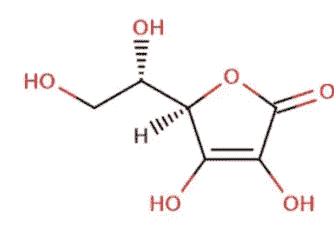
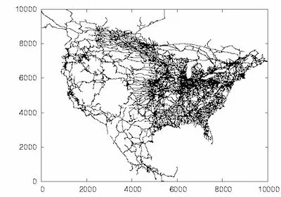
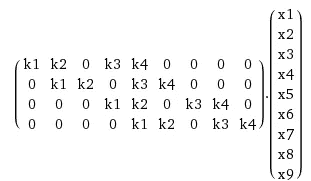
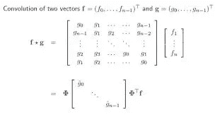

# 两个卷积的故事:图形神经网络的不同设计范例

> 原文：<https://towardsdatascience.com/a-tale-of-two-convolutions-differing-design-paradigms-for-graph-neural-networks-8dadffa5b4b0?source=collection_archive---------7----------------------->

“图形”是自然语言中一个不如数学术语精确的术语:在日常用语中，图形通常可以用来表示绘图、图表或更普遍的数据可视化。然而，从严格的定量角度来看，“图”指的是一种非常特殊的数据结构，由(至少)一些 N 大小的节点集、一些边集以及可以附加到节点或边的属性组成。虽然某些类型的信息本质上类似于图表，但更多情况下，图表是一种有意选择的组织某种信息的方式，以便捕捉和强调数据元素之间的关系。

图形可以用来表示社会网络和家庭关系、网络流量和分子结构。但是当我们以图表的形式给出一个网络数据时，我们给了它一个*归纳偏差*来捕捉关系。机器学习中归纳偏差的思想是，即使一个模型可以访问相同的信息(来自统计内容，信息论 POV)，优先考虑你的模型要学习的某些类型的模式可以帮助它更好地执行。这种情况的最简单形式见于老派模型正则化:下推系数的绝对值，产生更平滑的函数，并反映一种隐含的先验，即更平滑的函数更可能是真实的、可概括的函数，而尖锐、跳跃的函数更可能是过度拟合的。然而，如果这个先验是错误的，我们可能会把我们的模型引向错误的方向。

当我们设计一个专门处理图形的网络时，隐含地告诉它节点之间的关系是有意义的，前提是我们希望从图形中提取的信息包含在这些模式关系中，并且通过考虑它们可以最有效地提取。如果事实并非如此，那你就找错了地方。但如果是这样的话，你的先验关系作为模型的一个有用的概念，将大大缩小它的算法搜索空间。

卷积网络的目标是处理图像——一种复杂的结构化数据——并将它“消化”成一些压缩的特征集。一个图形网络有着相同的目标，除了它的目标是摄取和导出包含在一个*图形*中的有用的高级形式的信息。人们可能想问的关于图表的问题可能多种多样，如“这种分子结构是否可能作为治疗 X 疾病的药物”，或“这个社会图表中的 X 个人支持某个特定政党的可能性有多大”。在前一种情况下，我们想了解全图的一个性质。在后一种情况下，我们希望预测图中特定节点或边的属性。有些方法更适合这些目标中的一个或另一个。

这篇文章将给出两大类方法的高层次概述，这两大类方法用于赋予网络这种面向图形的归纳偏差。

根据数学定义，当构建操作员接收图表时，需要考虑一些属性:

*   图可以有**任意数量的节点**
*   每个节点可以有一个**任意数量的邻居**
*   图中没有固有的空间或方向的概念；考虑一个图形节点的“左”或“右”邻居是不明智的，就像图像像素排列在规则的网格中一样。

这最后两点结合起来使得朴素卷积方法不可行——当每个节点具有任意数量的邻居，而不是相对于中心像素存在于固定位置的离散数量时，您不能应用对上、下、左、对角线等方向的邻居具有固定权重的滤波器。此外，没有一种定义明确的方式来沿着图形滑动(或“平移”)过滤器。

当试图理解图形处理时，一个重要的概念区别是

*   一个问题，其中信息至少部分地包含在图本身的结构中，并且你希望提供给网络的每个例子可能具有不同的连接模式。这方面的一个例子是试图对不同的分子进行分类，每种分子都有不同的键结构。

When represented as a graph, atoms are seen as nodes with properties corresponding to element type, and edges with properties corresponding to bond type

*   一个问题是**图的连接结构在所有的例子中是固定的**，但是图的各个部分的属性是不同的，定义了一个函数，它具有一些我们可能想要学习或匹配的特征。这种“定义在图上的函数”的想法，也就是你可以在同一个图上定义不同的函数，对于这篇文章和阅读任何关于图形分析的文章来说，都是一个需要理解的重要概念。这方面的一个例子可能是关于通过道路网络连接的一些城市中每一个城市的感染人数的信息，其中您想要了解疾病传播的速度:城市之间的道路连接不会因场景而异，只是每个城市的属性值会发生变化。你也可以认为图像是在相同(非常无聊)的像素图上定义的不同像素值函数，例如，左上的节点在它的右边和底部相连。

A road connectivity map of the United States

当比较不同的方法可以应用于哪种类型的问题时，记住这种区别是特别有用的。

# 对非常规卷积的探索

现代神经网络设计中的一项重大创新是卷积，这是一种专门的设计，用于以更具参数效率的方式处理图像，相对于简单的模型，它似乎具有有价值的归纳偏差。围绕图形网络的思维是围绕这个关键问题建立的:我们能对图形做同样的事情吗？我们能不能设计一种结构，利用卷积网络最有价值的属性，但以图形可以使用的方式。

该领域的两种主要方法都试图回答这个问题，即**如何将卷积推广到图**中，这两种方法都称自己为“图卷积”，但它们采用了完全不同的方法。第一个试图复制卷积的字面数学运算，而第二个只是对图像特定的卷积所扮演的角色进行启发性的观察，并试图重新创建它。

# 检查光谱

首先，完美主义者:他们通过问“在深层次的数学层面上，卷积是什么？我们如何在图形中复制它？”找到了答案。这个解释会偏离图表一段时间，但我保证它会回来的。

为了简化，神经网络中使用的卷积是广义卷积算子的特殊情况。(更多细节，请阅读我之前关于这个主题的文章。当我们大多数人想到卷积时，我们可能会想象在图像上移动的方形滤波器片。这种在原始数据的许多不同偏移量处计算相同模式的点积匹配的操作，通常需要在一个大的“循环矩阵”中在不同偏移量处多次重复您的模式，如下图所示，并将其乘以包含您的数据的向量(或矩阵，在图像上下文中)。

This is a matrix calculating a simple convolution over a 1D vector — each row of the vector is a copy of the filter, shifted by some amount. When we multiply it by the vector on the right (analogously, the data we’re matching against our filter), we get different activations at each offset, depending on the alignment where the data most closely matches the filter (dot products are higher when vectors are more similar)

但是，可以转换数据和过滤器，使每个过滤器都由一个简单的对角化矩阵表示(除了对角线上的值，其他都是零)，然后乘以数据的转换版本。当你对数据进行**傅立叶变换**时，这种简化就会发生。傅立叶变换通常被认为是在函数的上下文中，并且(在很高的层次上)，它们将任何函数表示为更简单的“频率”函数的加权组合；从解释数据的宽笔画模式的低频开始，到填充较小细节的高频结束。

在任何变换发生之前，一个连续函数完全可以用一个无限长的向量来表示，只需简单地指定每一点的值。(题外话:在卷积和傅立叶变换讨论函数运算的许多上下文中，更容易想象它发生在固定长度的向量上，然后[只是想象自己](https://pbs.twimg.com/media/DfWgx7IV4AAAa0o.jpg)，“那，但是无限”)。当转换到傅立叶空间时，在最差的情况下，您的函数可能仍然需要无限长的向量来正确表示，但向量的条目将表示构成函数的每个频率的幅度，对于更简单的函数，您可能只需查看频率加权向量的前 10 个条目，就能够捕捉到函数的良好近似。要对这一事实给出直观或数学上的解释可能太过分散注意力，但这是一个关于卷积的数学上的事实，即可以通过将一个信号(对角化)投影到傅立叶域，并将其乘以傅立叶域中的数据来计算算子。

I apologize that this is tiny, but, if you squint, you can see that the top matrix is an effective duplicate of the one above — offset versions of your filter in each row, multiplied by a matrix. The bottom version takes your Phi matrix (consisting of your Fourier basis vectors_ and left-applies it to both your original f vector, and also to a compressed version of your filters that only has values along the diagonal

光谱卷积的支持者认为，他们应该从以下角度处理事情:如果他们能够**为一组数据**找到傅立叶基，那么他们可以将权重和数据都投影到该基中，并且，通过这种定义途径，**他们已经为自己获得了卷积**，即使没有沿着图形移动(或“转换”)过滤器的明确能力。这组矩阵乘法的结果是一个 N 维向量，

好吧。因此，我们走上了这条有些曲折的道路，回到了数学上有效的卷积的另一种推导形式。这和图表有什么关系？那么，我们可以通过获取图的拉普拉斯的特征值来定义图的傅立叶基，拉普拉斯是一个矩阵，通过获取度矩阵 D(由每个节点的度沿对角线构成)并减去权重或捕捉所有边上的权重的邻接矩阵来构建。

拉普拉斯算子用于计算“图形梯度”，即根据每个相邻节点的权重，测量每个节点处的函数值相对于附近节点处的函数值改变了多少。**当你计算拉普拉斯的特征向量时，你最终得到了图的傅立叶基，**以及一种将图上定义的函数名义上投影到 N 维欧氏空间中定义的函数上的方法。这些轴也称为图的“谱”，因此得名“谱聚类”。作为一维投影，它们在概念上对应于沿图形捕捉最大距离的方向。默认情况下，将有与图节点一样多的特征向量，并且每个节点由沿着所有这些向量定义的轴的值来表示。注意，特征向量是图的连通性的表示，并且对于在该图顶部定义的函数是不可知的。这就是为什么我们可以在图上把不同的函数表示为沿着特征向量基的不同模式的值。

The eigenvectors/eigenfunctions corresponding to the largest eigenvalues. You can see that (a) is a gradient roughly going on a diagonal from top left to bottom right, which would be the single-dimensional compression that would do the best job of capturing distances along the graph. (b) is an axis roughly going roughly radially from the central urban area outward, which is the next-best single-dimensional representation taking (a) into account, and so on.

要通过这种方法计算谱卷积，首先需要计算图的完整 NxN 拉普拉斯特征向量矩阵，然后将每个滤波器以及数据本身乘以该矩阵。对于大型图形来说，这是非常计算密集型的，因为对于每个过滤器，它按 N 缩放。除了计算复杂性之外，谱卷积方法的一个显著缺点是它们只对学习固定图上的模式有用，并且不能有效地学习或考虑每个观察图具有不同连接结构的情况。这是因为每组计算出的特征值只适用于计算它的特定图形。

此外，谱卷积不是本地的(即，在围绕中心节点的邻居的小支持集上定义)，而是对照图的全局连接结构来匹配模式。默认情况下，会使它们更加僵化，导致它们需要学习更多的参数。这个问题可以通过学习滤波器来解决，这些滤波器是每个特征向量[的简单多项式变换，如本文](https://arxiv.org/abs/1606.09375)所示，因为这些滤波器需要更少的参数，并且匹配更小、更局部化的模式。然而，事实仍然是谱卷积本身并没有被很好地设计为局部模式匹配器。

# 把话传下去

因此，谱卷积的优点是允许我们对图形进行数学上正确的卷积，但它们也有明显的实际缺点。

对于某些问题，所有这些缺点让我们回到了绘图板:考虑图像卷积的优点，以及如何用图形作为输入来复制它们。广义的消息传递神经网络(MPNN)试图模仿普通卷积的许多优点，但具有数学上不同的过程。

(*作为题外话:我在这里将使用术语消息传递神经网络，这是本文首创的***，因为我认为它更清晰，更具描述性。然而，对于不同网络结构的不同分类法和命名约定，在文献中有一点地盘之争。* [*最近的一篇论文*](https://arxiv.org/pdf/1806.01261.pdf) *，有点令人沮丧地将他们对本质上是 MPNNs 的分类简单地称为“图网络”，考虑到前面提到的谱图方法的存在，这实在是太宽泛了*。*

*提醒一下，我们需要图形计算具有的基本属性是:A)它可以对称地应用于每个节点，作为该节点属性的函数；B)它可以聚合任意数量邻居的信息*

*许多论文提出了基本相似的方法。每一个都有自己的稍微不同的这些成分的组合:一些被省略或简化作为手边领域的功能。最一般的骨架，其中大多数其他版本是特例，看起来像这样:*

**

*A figure from the DeepMind Graph Networks paper, illustrating the iterative procedure of edges pulling information from nodes, nodes pulling it in from edges, and then the global network attribute getting updated from both together.*

*   *作为一个整体，节点、边和全球网络都具有向量值属性。你也可以潜在地有一个设置，其中所有这些都有属性向量和“隐藏”向量(a la RNNs ),给你自己一个更灵活地保存信息的方法，但目前，我们将坚持单属性向量模型。*
*   *边属性通过计算它们的发送节点、它们的接收节点、全局属性和它们自己的过去值的某种变换来更新它们自己。注意，对于“接收节点属性”和“发送节点属性”，可以有特定的权重矩阵，因为给定的边只有一个发送者和接收者。*
*   *节点属性基于其所有传入边邻居的聚合信息(以及全局属性值和其自身的过去值)进行自我更新。由于一个节点可以有任意多条边，这种聚合通常是通过最基本的输入大小不变的操作(求和)来完成的，但也可以使用类似基于内容的注意力加权来完成。*
*   *最后,“全局属性”被计算为某种节点值的聚合——同样，可以是总和，可以是注意力，只要它对不同大小的输入起作用。*
*   *现在，节点已经通过边从它们所有的相邻节点获取信息。如果这个过程重复很多次，那么信息将能够进行多次“跳跃”,并且每个节点将会拉入关于图的其余部分的更大范围的上下文信息。这与卷积堆栈中具有更宽感受域的后面的层相当。*
*   *最终，在这个更新过程的一些迭代之后，您现在有了节点、边和全局属性，这些属性从图的其余部分收集了一些上下文*

*这种结构很有趣，因为它同时具有卷积结构和递归结构。它在启发式上类似于普通卷积，因为它在网络上的任何地方都使用相同的共享变换集，并且还因为它假设图上感兴趣的结构将是连续的，因此优先从邻居的同心圆中提取信息。这种逐渐扩大的感受野功能更接近于感受野逐层加宽的图像卷积网络。这里一个有趣的注意事项是，正如前面所暗示的:像这样的图形操作从根本上来说不如图像卷积灵活，因为它们从每个邻居那里同等地提取信息。你可以把它想象成一个离散的径向卷积，你可以根据距离远近，使用离散的距离单位从不同的点提取信息。*

*如果你假设不仅在图中的所有点，而且在扩散过程的后续迭代中使用相同的变换，该结构也开始看起来非常像一个循环网络。在这种情况下，你几乎可以把它想象成一个放射状的循环网络，向四面八方进行处理。在这种节点到节点信息扩散的高级框架内，您可以沿着这个范围定义许多网络子类型——每个“层”具有不同变换的网络，看起来更卷积，或者迭代地重新计算看起来更递归的相同变换；预测节点值、边缘值或全局值的模型。但是它们都使用相同的基本构件。*

*这些方法比谱卷积灵活得多，因为这种操作堆栈可以在不同的连接结构上执行，并且仍然给出一致的结果，如果您试图将一个图的函数投影到另一个图的拉普拉斯傅里叶基中，情况就不会如此。它们本身也是本地的，因为每次转换只接受来自邻居的信息。然而，这个堆栈在真正的数学意义上不是卷积，只是一组模仿卷积的一些优点的启发式操作。*

# *将这些点连接起来*

*与图像相比，图形网络的设计仍处于其狂野西部的早期阶段:它的用途更加小众，并且它缺乏像 ImageNet 那样的标准化数据集。现代模型设计倾向于从现有领域大量借用，然后将这些直觉输入神经网络；图网络方法的研究人员似乎仍处于调查其他领域(光谱分析和消息传递算法)的这个阶段，试图看看在哪里可以找到有价值的见解。*

*虽然这可能是纯粹的叙述性放纵，但我很难不看到这篇文章中所展示的谱卷积的数学正确性和 MPNNs 的计算实用性之间的紧张关系，作为更广泛地举例说明机器学习中的紧张关系。这两种方法都试图推广卷积的成功，但一种是用数学家的证明和精度，另一种是用工程师的实用试探法。这两个工具包都是深度学习的组成部分，并以不同的方式提供信息。*

*从外部角度来看，虽然我欣赏谱卷积背后的聪明之处，但我认为 MPNNs 具有相当大的优势，特别是在处理非固定图问题时。*

*然而，仍然有很多问题，我希望在这个领域有更好的答案(或者，可能有答案，但我还没有找到)。*

*   *与一些更简单的方法相比，这些方法在不同密度/稀疏度的图上表现如何？你可能会天真地认为，当你接近一个过于密集的图时，其中所有的东西都相互关联，特定于图的方法可能没有什么附加值。*
*   *当你有有意义的权重信息时，与只有二进制邻居或没有关系相比，它们的效果如何？在这两种情况下，它们是否比基线方法更有优势？*
*   *尝试这些或其他方法的最佳典型问题是什么？这里引用的许多论文更多地关注玩具问题，或者已经找到好的解决方案的问题(比如图像)。分子分析任务对我来说似乎是最有吸引力的，但我很想听听其他人的想法。*

# *参考资料:*

*   *[快速、局部、光谱网络](https://arxiv.org/abs/1606.09375)*
*   *[量子化学的信息传递神经网络](https://arxiv.org/abs/1704.01212)*
*   *[来自 DeepMind 的近期图网论文](https://arxiv.org/pdf/1806.01261.pdf)*
*   *[对图形的傅立叶分析](http://www.norbertwiener.umd.edu/Research/lectures/2014/MBegue_Prelim.pdf)*