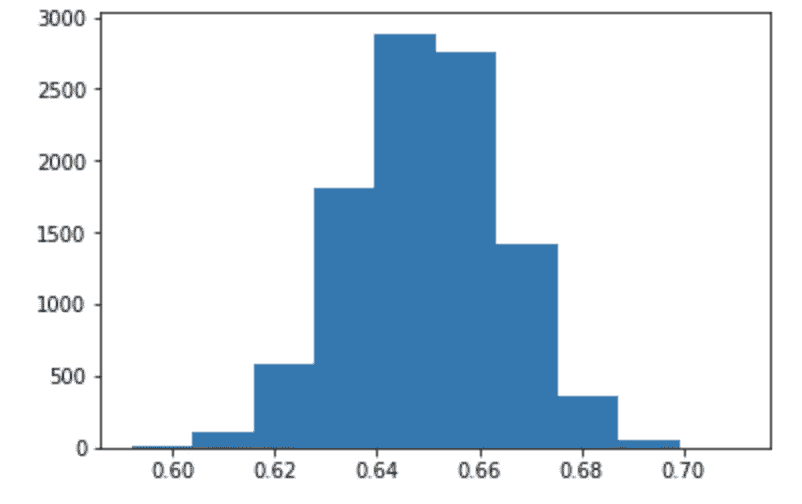
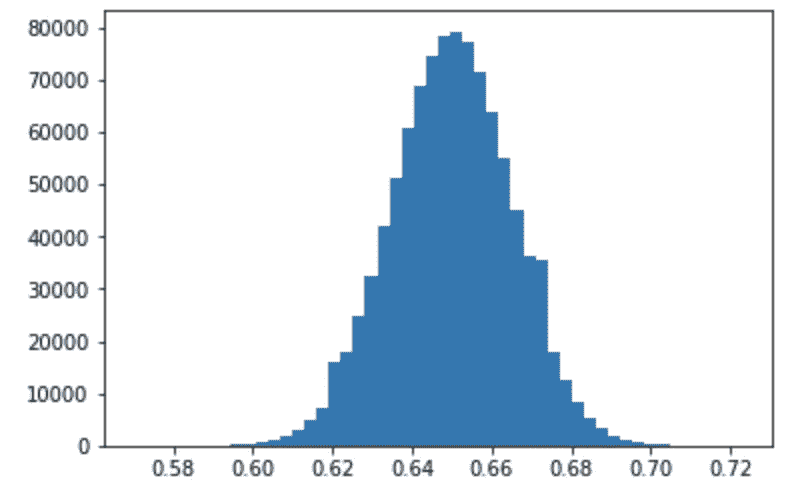
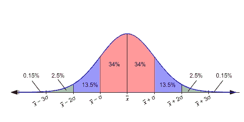

# 置信区间的(非常)友好的介绍

> 原文：<https://towardsdatascience.com/a-very-friendly-introduction-to-confidence-intervals-9add126e714?source=collection_archive---------2----------------------->


今天我想谈谈统计学中的一个基本术语——置信区间，我想以一种非常友好的方式进行讨论，只讨论一般概念，没有太多花哨的统计学术语，并且使用 python！

虽然这个术语非常基础，但有时很难完全理解(对我来说)到底发生了什么，为什么我们需要它，什么时候我们应该使用它。

那我们开始吧。

假设你想知道美国有百分之多少的人喜欢足球。为了得到这个问题 100%正确的答案，你唯一能做的事情就是问每一个美国公民他们是否热爱足球。根据维基百科，美国有超过 3.25 亿人。与 3.25 亿人交谈并不实际，所以我们不得不考虑其他事情，我们必须通过问(少得多)的人来得到答案。

我们可以通过在美国随机抽样(与更少的人交谈)来做到这一点，并获得样本中热爱足球的人的百分比，但我们不会 100%相信这个数字是正确的，或者这个数字与真实答案有多远，所以，我们将试图实现的是获得一个区间，例如，对这个问题的一个可能的答案可能是:“我 95%相信美国热爱足球的人的百分比在 58%和 62%之间”。这就是置信区间这个名字的由来，我们有一个区间，我们对它有一些信心。

旁注:我们的样本将是随机的，这一点非常重要，我们不能只从我们居住的城市中选择 1000 人，因为那样就不能很好地代表整个美国人口。另一个糟糕的例子是，我们不能向 1000 个随机的人发送脸书消息，因为这样我们会得到一个美国脸书用户的代表，当然不是所有的美国公民都使用脸书。

假设我们有一个来自美国的 1000 人的随机样本，我们看到在这 1000 人中 63%的人热爱足球，我们可以对整个美国人口做出什么样的假设(推断)？

为了回答这个问题，我想让我们换个角度来看。假设我们知道(理论上)美国人的确切比例，假设是 65%，随机选择 1000 人，只有 63%的人会喜欢足球，这种可能性有多大？让我们使用 python 来探索这一点！

```
love_soccer_prop = 0.65  # Real percentage of people who love soccer
total_population = 325*10**6  # Total population in the U.S. (325M)num_people_love_soccer = int(total_population * love_soccer_prop)num_people_dont_love_soccer = int(total_population * (1 - love_soccer_prop))people_love_soccer = np.ones(num_of_people_who_love_soccer)people_dont_love_soccer = np.zeros(num_
people_dont_love_soccer)all_people = np.hstack([people_love_soccer, people_dont_love_soccer])print np.mean(all_people)# Output = 0.65000000000000002
```

在这段代码中，我创建了一个包含 3.25 亿人的 numpy 数组，如果他们中的每个人热爱足球，我就为他们存储一个数组，否则就存储零个数组。我们可以通过计算平均值来得到数组中 1 的百分比，实际上是 65%。

现在，让我们取几个样本，看看我们得到的百分比是多少:

```
for i in range(10):
    sample = np.random.choice(all_people, size=1000)
    print 'Sample', i, ':', np.mean(sample)# Output:
Sample 0 : 0.641
Sample 1 : 0.647
Sample 2 : 0.661
Sample 3 : 0.642
Sample 4 : 0.652
Sample 5 : 0.647
Sample 6 : 0.671
Sample 7 : 0.629
Sample 8 : 0.648
Sample 9 : 0.627
```

你可以看到我们得到了每个样本的不同值，但是直觉(和统计理论)表明大量样本的平均值应该非常接近真实的百分比。就这么办吧！让我们取许多样本，看看会发生什么:

```
values = []
for i in range(10000):
    sample = np.random.choice(all_people, size=1000)
    mean = np.mean(sample)
    values.append(mean)print np.mean(values)# Output = 0.64982259999999992
```

我们创建了 10K 样本，检查了每个样本中热爱足球的人的百分比，然后对他们进行平均，我们得到了 64.98%，这非常接近实际值 65%。让我们画出我们得到的所有值:



你在这里看到的是我们在所有样本中得到的所有值的直方图，这个直方图的一个非常好的特性是它非常类似于正态分布。正如我所说的，我不想在这里使用太多的统计术语，但我们可以说，如果我们多次(无限次)进行这个过程，我们将得到一个非常接近正态分布的直方图，我们可以知道这个分布的参数。更简单地说，我们将知道这个直方图的形状，所以我们将能够准确地说出有多少样本可以得到任何范围的值。

这里有一个例子，我们将运行这个模拟更多次(试图达到无穷大):



首先，我们可以看到直方图的中心(平均值)接近 65%，正如我们预期的那样，但我们可以通过查看直方图了解更多信息，例如，我们可以说一半的样本大于 65%，或者，我们可以说大约 25%大于 67%，甚至，我们可以说(大约)只有 2.5%的样本大于 68%。

在这一点上，许多人可能会问两个重要的问题，“我如何获取无限数量的样本？”以及“这对我有什么帮助？”。

让我们回到我们的例子，我们采取了 1000 人的样本，得到了 63%，我们想知道，1000 人的随机样本将有 63%的足球爱好者的机会是什么。使用这个直方图，我们可以说有(大约)25%的机会得到小于或等于 63%的值。理论告诉我们，我们实际上不需要做无限的样本，如果我们随机选择 1000 个人，其中只有 63%的人会喜欢足球。

边注#2:实际上，为了所有这些(找到值范围的机会)，我们需要知道，或者至少估计，总体的标准偏差。因为我想让事情变得简单，所以我现在就离开它。

让我们回到现实和真正的问题，我不知道美国足球爱好者的实际比例。我只是拿了一个样本，得到了 63%，这对我有什么帮助？

所以我们不知道美国热爱足球的人的实际比例。我们所知道的是，如果我们取无限数量的样本，它会是这样的:


这里 *μ* 是总体均值(我们例子中足球爱好者的真实百分比)，σ是总体的标准差。

如果我们知道这一点(并且我们知道标准偏差),我们就可以说，大约 64%的样本将落在红色区域，或者，在该图中，超过 95%的样本将落在绿色区域之外:



如果我们使用之前假设实际百分比为 65%的图，那么 95%的样本将落在 62%和 68%之间(±3)


当然，距离是对称的，所以如果样本百分比在实际百分比-3 和实际百分比+3 之间的 95%的时间内下降，那么实际百分比将是样本百分比-3 和样本百分比+3 之间的 95%的时间。

如果我们取一个样本，得到 63%，我们可以说我们 95%有信心，真实的百分比在 60% (63 -3)到 66% (63+3)之间。

这是置信区间，区间是 63+-3，置信度是 95%。

我希望置信区间现在更有意义，就像我之前说的，这个介绍遗漏了一些技术上但很重要的部分。有很多文章确实包含这些部分，我希望现在遵循它们会容易得多。