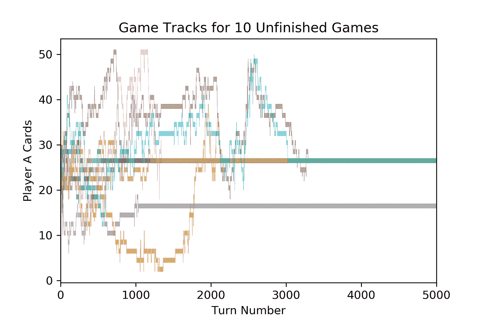
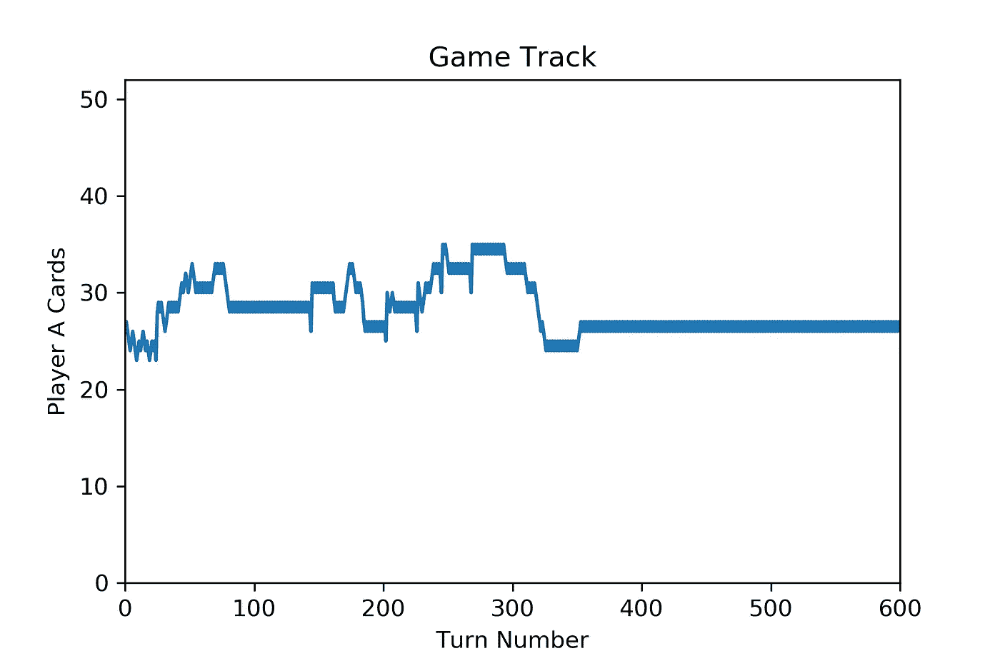
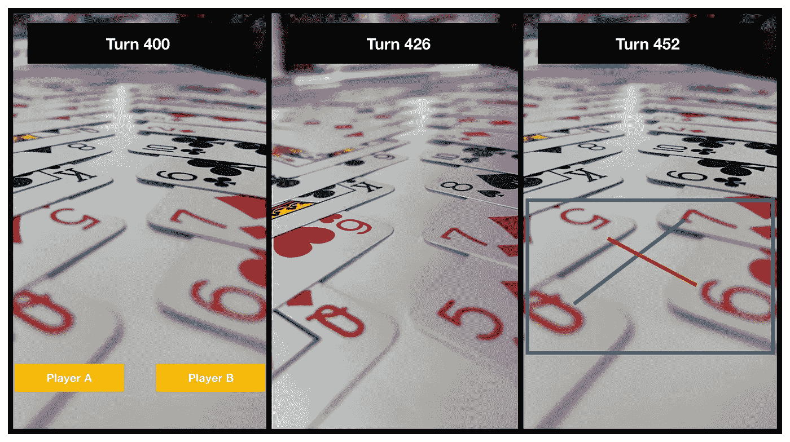
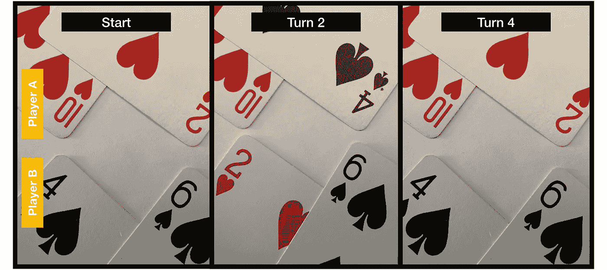
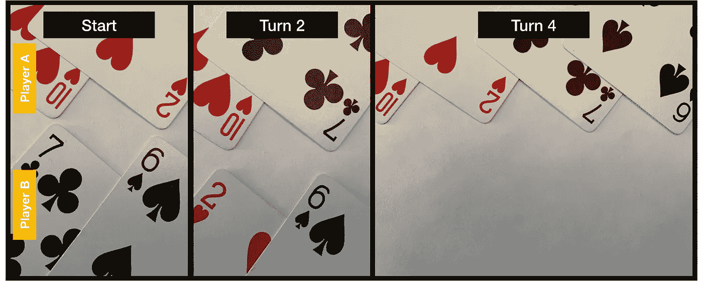
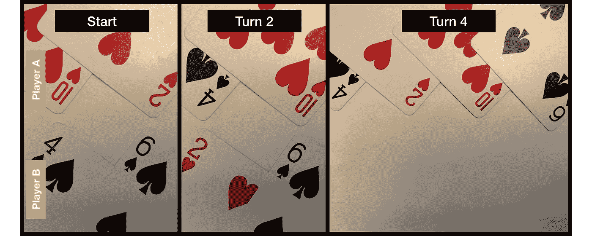
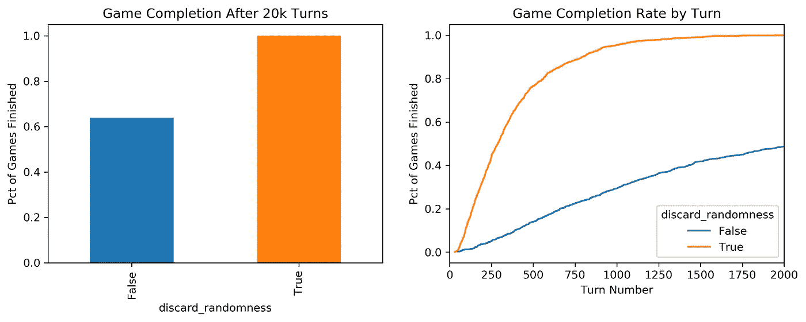

# 兄弟姐妹间的战争……第二部

> 原文：<https://towardsdatascience.com/a-war-amongst-siblings-part-ii-9bf51636ceaf?source=collection_archive---------20----------------------->

## 卡牌游戏大战有可能无限期进行下去吗？

# 介绍

几个月前，我发表了一篇关于纸牌游戏战争的报道。如果你还没有读过，或者在这段漫长的插曲后需要复习，在继续之前去[看看](https://medium.com/@john.ryan.mcglynn/a-war-amongst-siblings-251008322eaf)。这是一个快速阅读。

在不列颠哥伦比亚省度假时，我和姐姐凯莉一起玩了一个 T2 战争游戏。我们在停机时间玩了好几天都没有完成。凯利觉得这个游戏会永远继续下去，但我不相信这是可能的。我用 Python 写了一个模拟器来测试它。[第一部分](https://medium.com/@john.ryan.mcglynn/a-war-amongst-siblings-251008322eaf)发现这确实是可能的——我模拟的游戏中有 1/3 是永无止境的。凯利获得了(并利用了)吹牛的权利。

这篇文章回顾了第一部分提出的关键问题:是什么让游戏永远继续下去？答案实际上比我预期的更有启发性。吹牛的权利甚至可能仍然是待价而沽。

# 达到稳定状态

我和妹妹玩的游戏，疯狂的来回摇摆。我们中的一个人会只拿到几张牌，但之后势头会逆转，在我们意识到之前，另一个人会成为筹码短缺的人。我认为永无止境的游戏会永远经历这样的循环。

我错了。如下图所示，永无止境的游戏最终会达到一种“稳定状态”。在稳定状态下，两个玩家轮流赢得一张牌的战斗，他们之间的牌的平衡基本上保持不变。

Game tracks showing the number of cards that Player A has as each game progresses. Each color represents a unique game. There are 10 games in this diagram, however several games settle into equivalent stable states and the tracks therefore obscure each other on the right side of the diagram.

我姐姐和我从来没有达到那种程度。也许我们过早的放弃了？尽管如此，我还是想更深入地探究稳定状态的动力学，以阐明为什么一个游戏会永无止境。

大约 85%的未完成游戏达到了一个稳定的状态，即使每个玩家只有 26 张牌。我选择了其中的一个游戏来感受它是如何运作的。我们感兴趣的游戏在开始时会来回跳动，但到了第 400 局，每个玩家都有 26 张牌，已经稳定下来。

当你从 400 号弯道前进时，有趣的事情发生了。事情很快开始感觉…奇怪的熟悉。我们以前来过这里吗？玩家在 400 回合的牌和他们在 452 回合的牌完全一样。我们又到了 504、556 等处。现在我们可以理解一个游戏是如何永无止境的——它只是陷入了一个循环！

A stable state game at turns 400, 426, and 452\. Player A’s cards are on the left and Player B’s are on the right; the cards towards the bottom of the image are at the top of the players’ hands. Turn 400 and 452 are exactly the same; turn 426 is essentially symmetrical with the cards on the losing diagonals swapped.

为什么会卡在一个循环里？当我们并排看玩家的手时，我们可以观察到一个明显的模式。首先，请注意，当我们向下移动牌组时，大牌在玩家 A 和玩家 B 之间完美地交替出现。这是有道理的，因为我们知道玩家 A 和玩家 B 会轮流获胜。如果我们将手牌分成 4 张牌的区块(两张来自玩家 A，两张来自玩家 B)，我们还可以看到，在每个区块中，输牌(在一条对角线上)比赢牌(在另一条对角线上)都低。

一个简化的 4 张牌游戏说明了这种结构的重要性。

Player A’s cards are on top and Player B’s are on bottom; decks are ordered from left (top of deck) to right (bottom of deck).

玩家 A 以一个 10 和一个 2 开始。玩家 B 以 4 和 6 开始。这个例子复制了我们在稳定状态游戏的每个方块中看到的结构，因为获胜的对角线(10 和 6)均匀地大于失败的对角线(4 和 2)。在前两局中，玩家 A 赢了玩家 B 的四张牌，但输了他的两张。又玩了两局后，玩家 A 赢回了他原来的两张牌，但失去了他从玩家 b 那里得到的四张牌。我们在这个四张牌的区块中建立了一个循环，玩家只需来回交换他们较少的牌。

让我们考虑第二个与第一个相同的例子，除了玩家 B 的第一张牌是 7。请注意，这个*并不*符合我们在稳定状态游戏中观察到的结构。原输对角线中的一张牌比赢对角线中的一张牌大。

在前两轮，玩家 A 赢了 B 的 7，输了他的 2。然而，游戏现在设置为结束，玩家 A 的 10 和 7 击败玩家 B 的 2 和 6。稳定状态结构的一个明显的小偏差会很快导致非常不同的结果。一个四张牌的方块，其中一条对角线上的两张牌都比另一条对角线上的两张牌大，将无限循环下去；任何其他安排都会导致解决。

这个小例子很容易推广到一个完整的游戏。26–26 稳定状态(85%的永无止境游戏)由 13 个相互堆叠的四张牌组成。每四张牌的方块在游戏每 52 回合循环时保持不变。15%未完成的游戏达到不均衡的稳定状态，一个玩家比另一个玩家有更多的牌。这些游戏的结构有点复杂，因为四张牌的方块不能保持完整，但在整个游戏中保持了一个等效的结构。在这两种情况下，永无止境的游戏会达到一种特定的卡片排列，从而导致动态平衡和循环游戏。

# 打破稳定状态

尽管有个名字，稳定状态实际上是相当脆弱的。

为了说明原因，我需要指出我的战争模拟器的一个简化假设和上面的小例子。每个游戏的游戏性都是完全确定的。换句话说，每场游戏在发牌后只有一种可能的结果，因为每一步都是 100%程序化的。在每一轮中，玩家 A 和玩家 B 打出他们手中最上面的牌，赢家拿起这些牌(假设没有平局)。玩家 A 的牌总是在玩家 B 的牌前面回到赢家手里。

在每个玩家使用哪张牌(每个玩家牌组中的顶牌)以及如何确定赢家(较高的牌)的规则中没有回旋的余地。这些步骤应该完全程序化。另一方面，规则并没有规定当纸牌回到赢家手中时的“正确”顺序。在我的模拟中，玩家 A 的牌总是放在赢家手中玩家 B 的牌之前。在现实生活中，你会期望变化。在某些回合中，玩家 A 的卡会先被拿走，而在其他回合中，玩家 B 的卡会先被拿走。

随机性被证明是稳定状态的克星。让我们重温一下四张卡的例子，看看为什么。如果我们改变游戏玩法，使得玩家 B 的牌在第一回合回到玩家 A 的面前，稳定状态模式被打破，游戏立即结束。

对完整游戏的影响同样引人注目。随机排列返回牌的顺序，赢家的手牌将未完成游戏的比例从 1/3 减少到 0。游戏也结束得更快。75%的带有随机元素的游戏在 500 回合内结束，而没有随机元素的游戏只有 14%。随机性使得稳定状态难以维持，永无止境的游戏实际上不存在。

这对于我的论点来说是个好消息！我们不再有证据表明战争游戏(如果它被逼真地模拟)可以永远继续下去。

我很乐意收工并宣布胜利。但是，违背我自己的最大利益，我要努力成为一个好科学家(也是一个好哥哥)。就像他们说的，没有证据并不是不存在的证据。如果我们想*证明*一个游戏不能无限期继续下去，我们需要更进一步。

# 无限中的一个

让我们戴上科学家的帽子，从一个思维实验开始。

以我们的四张卡为例。第一回合只有一个可能的赢家，玩家 A，因为十比二大。然而，就牌如何回到玩家 A 手中而言，有两种可能的结果。假设有 50%的几率玩家 A 的牌首先回到玩家 A 的手里，有 50%的几率玩家 B 的牌回到玩家 A 的手里。下一轮是同样的故事——只有一个可能的赢家，但有两种可能的结果。这意味着前两轮有 2 x 2 = 4 种可能的结果，这取决于每轮后先拿起哪张牌。

四个场景中的两个，第一个和最后一个，保留了我们熟悉的稳定状态结构，因为每个回合后都先拿起同一个玩家的牌。然而，其他人打破了稳定状态，导致游戏在四个回合结束。换句话说，游戏有 50%的概率在四个回合内结束。

让我们继续前两个阶段保持稳定状态结构的 50%的场景。再玩两局后，有 50%的几率*那些*场景的场景会打破稳定状态。所以，有 75%的概率(前 50%加上幸存的 50%的 50%)游戏会在六个回合内结束。每增加两轮后，可能性增加剩余概率的 50%，跳至 88.5%、94.25%、97.125%等。完成的可能性很快接近 100%。

为了证明这个游戏**不能**无限进行下去，我们需要完成的可能性实际上达到 100%。它会到达那里吗？虽然我们很快接近 100%的确定性，但总会有极小的机会，随机抽取的概率会以保持稳定状态结构的方式继续展开。我们不得不得出结论，尽管**极不可能**，但我们的小例子*可能会无限期地继续下去。*

这同样适用于完整的游戏。考虑到玩家 A 的牌在每一回合都有可能(尽管**极其**不太可能)首先“随机”回到赢家手中。这将使随机游戏的行为完全像原来的模拟。我们知道原始博弈可以无限期地进行下去，所以随机博弈也应该如此。可能还有其他方法来实现一个无限的游戏，尽管一个例子就足够了，我们不能说一个永无止境的游戏是不可能的。

我们*可以*说不太可能。无限中的一个不太可能。谁有吹牛的权利？我让你来判断。

# 最后的想法

我实际上写下了当我和 Kelly 决定放弃我们的游戏时的牌。根据随机弃牌模拟，我们的游戏在接下来的 300 回合中有 50%的可能性会结束，在接下来的 600 回合中有 75%的可能性会结束，在我们停止后的 900 回合中有 90%的可能性会结束。我们在比赛中还有很多时间。我认为编写一个 Python 模拟器仅仅是快了一点点。

感谢阅读！请在评论区分享你的想法、问题或反馈。

另外，我的战争模拟器代码和我用来分析的 Jupyter 笔记本见 [Github](https://github.com/jrmcglynn/WAR_simulation) 。模拟器是作为一个“战争”类编写的——我希望其他 Python 程序员能找到机会使用它。