# 敌对自动编码器向导指南:第 2 部分，探索敌对自动编码器的潜在空间。

> 原文：<https://towardsdatascience.com/a-wizards-guide-to-adversarial-autoencoders-part-2-exploring-latent-space-with-adversarial-2d53a6f8a4f9?source=collection_archive---------1----------------------->

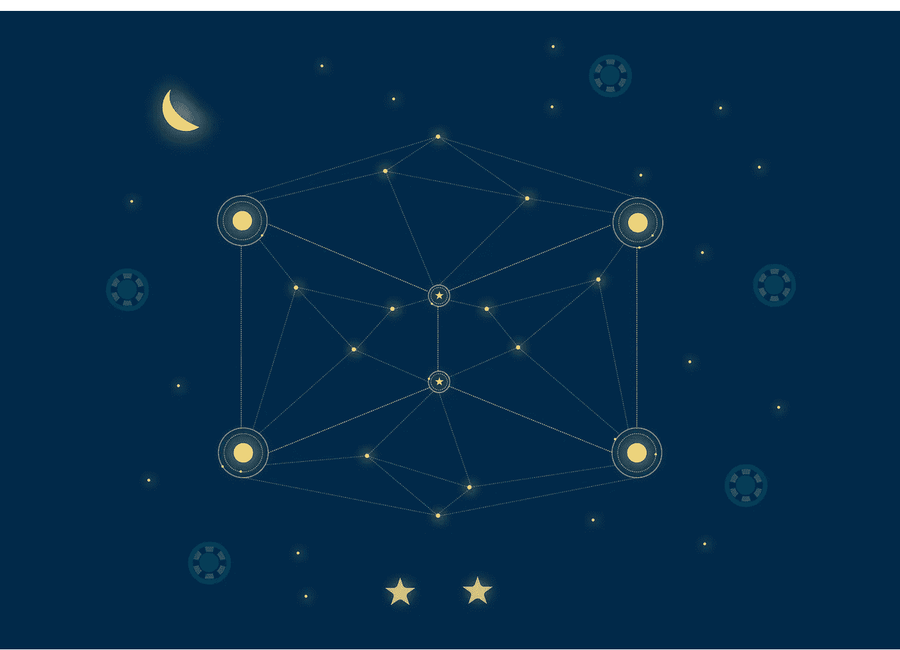

*“这篇文章是* [*自动编码器向导:第 1 部分*](https://medium.com/towards-data-science/a-wizards-guide-to-adversarial-autoencoders-part-1-autoencoder-d9a5f8795af4) *的延续，如果你没有读过它，但熟悉自动编码器的基础知识，那么请继续。你需要了解一点概率论，可以在这里找到***。”**

*第 1 部分:[自动编码器？](https://medium.com/towards-data-science/a-wizards-guide-to-adversarial-autoencoders-part-1-autoencoder-d9a5f8795af4)*

*我们省略了第 1 部分，将一个值(0，0)传递给我们训练过的解码器(在输入端有 2 个神经元),并找到它的输出。它看起来模糊不清，没有代表一个清晰的数字，让我们得出结论，编码器 **h** (也称为潜在代码)的输出在特定空间中分布不均匀。*

**

*因此，我们在这一部分的主要目标将是迫使编码器输出与给定的先验分布相匹配，这个要求的分布可以是正态(高斯)分布、均匀分布、伽玛分布…然后，这将导致潜在代码(编码器输出)在给定的先验分布上均匀分布，这将允许我们的解码器学习从先验到数据分布的映射(在我们的情况下是 MNIST 图像的分布)。*

> *如果你完全不理解上面的段落。*

**假设你在上大学，并且选择了机器学习(我想不出其他课程:p)作为你的课程之一。现在，如果课程老师不提供教学大纲指南或参考书，你将为期末考试学习什么？(假设你的课没有帮助)。**

*如果你被问及 ML 的任何子领域的问题，你会怎么做？用你知道的东西化妆？？*

*如果我们不将编码器输出限制为遵循某种分布，解码器就无法学习任何数字到图像的映射，就会发生这种情况。*

*但是，如果你有一份合适的教学大纲指南，你可以在考试前浏览一下材料，这样你就会对考试有所了解。*

**同样，如果我们迫使编码器输出遵循一个已知的分布，如高斯分布，那么它可以学习扩展潜在代码以覆盖整个分布，并学习无任何间隙的映射。**

**

*Good or Bad?*

*我们现在知道自动编码器有两个部分，每个部分执行完全相反的任务。*

> *两个本性相似的人永远不可能单独相处，只有两个对立面才能和谐。*
> 
> *—拉姆·莫汉*

*用于从输入获得潜在代码(编码器输出)的编码器，其约束条件是潜在代码的尺寸应小于输入尺寸，其次是接收该潜在代码并尝试重建原始图像的解码器。*

*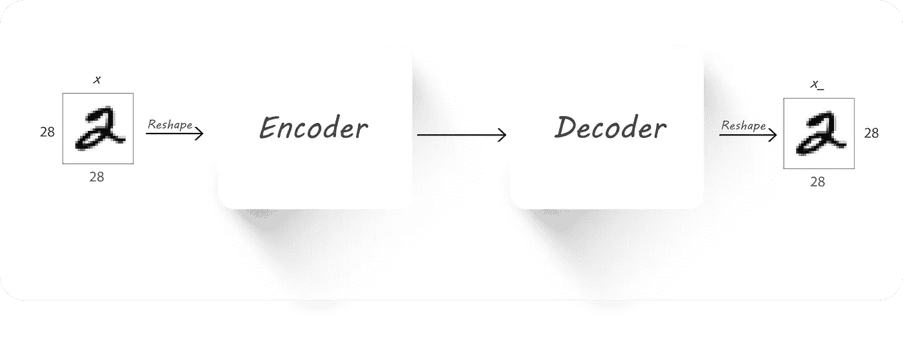*

*Autoencoder Block diagram*

*让我们看看当我们先前实现我们的自动编码器时，编码器输出是如何分布的(checkout [part 1](https://medium.com/towards-data-science/a-wizards-guide-to-adversarial-autoencoders-part-1-autoencoder-d9a5f8795af4) ):*

*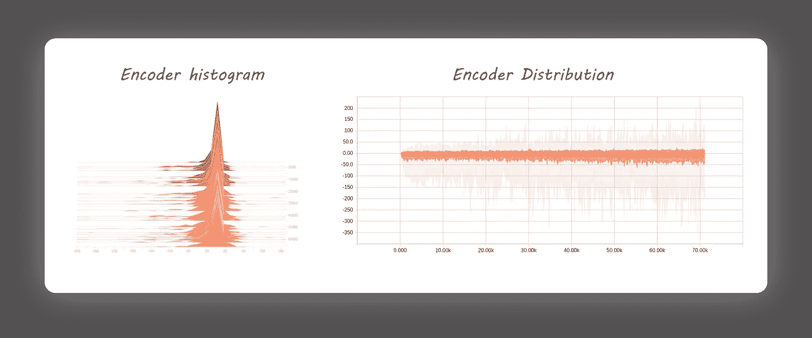*

*Encoder histogram and distribution*

*从分布图(向右)我们可以清楚地看到，我们的编码器的输出分布无处不在。最初，似乎分布集中在 0，大多数值为负。在训练的后期阶段，当与正样本相比时，负样本分布在远离 0 的地方(同样，如果我们再次运行实验，我们甚至可能得不到相同的分布)。这导致了编码器分布中的大量间隙，如果我们想将解码器用作生成模型，这不是一件好事。*

> *但是，为什么在我们的编码器分配中，这些差距是一件坏事呢？*

*如果我们给一个训练有素的解码器一个落在这个间隙中的输入，那么它会给出看起来奇怪的图像，在输出端不代表数字(我知道，第三次)。*

*另一个重要的观察结果是，训练自动编码器给了我们具有相似图像的潜在代码(例如，全是 2 或 3..)在欧几里得空间中彼此远离。例如，这可能导致我们数据集中的所有 2 被映射到空间中的不同区域。我们希望通过将相似数字的图像保持在一起，使潜在代码具有有意义的表示。有些事情是这样的:*

**

*A good 2D distribution*

*不同颜色的区域代表一类图像，请注意相同颜色的区域是如何相互靠近的。*

*我们现在来看看可以解决上述一些问题的对抗性自动编码器。*

*对抗自动编码器与自动编码器非常相似，但是编码器以对抗的方式被训练，以迫使它输出所需的分布。*

*理解对抗性自动编码器(AAEs)需要生成性对抗性网络(GANs)的知识，我写了一篇关于 GANs 的文章，可以在这里找到:*

* [## 甘斯·恩罗斯

### “本文假设读者熟悉神经网络和张量流的使用。如果没有，我们请求您…

medium.com](https://medium.com/towards-data-science/gans-n-roses-c6652d513260) 

如果您已经了解 GANs，这里有一个快速回顾(如果您记得接下来的两点，请随意跳过这一部分):

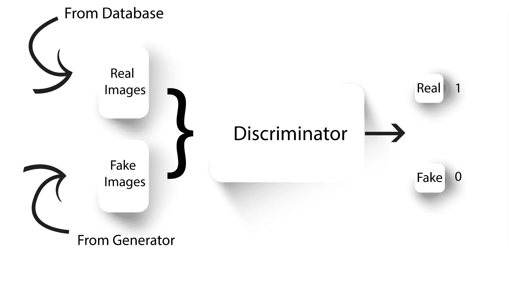

Discriminator

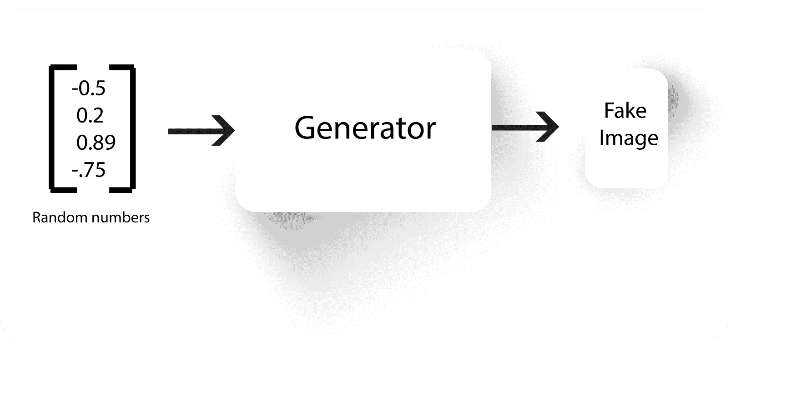

Generator

*   GANs 有两个神经网络，一个生成器和一个鉴别器。
*   生成器，很好地生成假图像。我们训练鉴别器来区分数据集的真实图像和生成器生成的假图像。
*   生成器最初会生成一些随机噪声(因为它的权重是随机的)。在训练我们的鉴别器来区分这种随机噪声和真实图像之后，我们将把我们的生成器连接到我们的鉴别器，并且仅通过具有鉴别器输出应该为 1 的约束的生成器进行反向传播(即，鉴别器应该将生成器的输出分类为真实图像)。
*   我们将再次训练我们的鉴别器来区分来自我们的生成器的新的假图像和来自我们的数据库的真实图像。然后训练生成器生成更好的假图像。
*   我们将继续这个过程，直到生成器变得非常擅长生成假图像，以至于鉴别器不再能够区分真实图像和假图像。
*   最后，我们将剩下一个生成器，它可以产生看起来真实的假图像，给定一组随机的数字作为输入。* 

*这是一个对抗性自动编码器的框图:*

*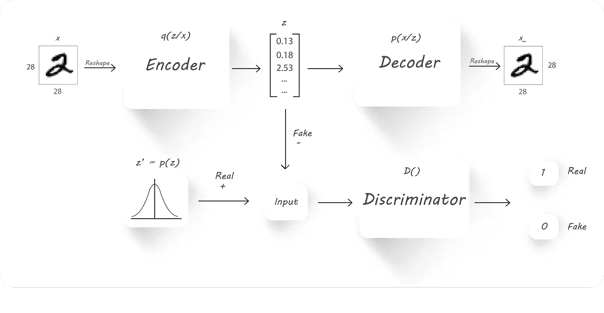*

*AAE block diagram*

*   *x →输入图像*
*   *q(z/x) →编码器输出给定输入 x*
*   *z →潜码(假输入)，z 由 q(z/x)得出*
*   *z' →具有所需分布的实际输入*
*   *p(x/z)→给定 z 的解码器输出*
*   *D() →鉴别器*
*   *x _→重建图像*

*同样，我们的主要目的是迫使编码器输出具有给定先验分布的值(这可以是正态分布，γ分布..分发)。我们将使用编码器(q(z/x))作为我们的生成器，鉴别器来判断样本是来自先前的分布(p(z))还是来自编码器(z)和解码器(p(x/z))的输出，以恢复原始输入图像。*

*为了理解这种架构如何用于在编码器输出上强加先验分布，让我们看一下如何训练 AAE。*

*训练 AAE 有两个阶段:*

*   ***重建阶段:***

*我们将训练编码器和解码器，以最小化重建损失(输入和解码器输出图像之间的均方误差，查看第 1 部分了解更多细节)。忘记鉴别器甚至存在于这个阶段(我已经将这个阶段不需要的部分变灰)。*

*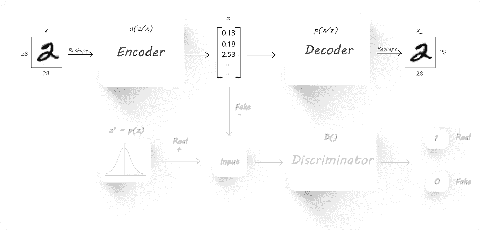*

*Reconstruction Phase*

*像往常一样，我们将输入传递给编码器，编码器将给出我们的潜在代码，稍后，我们将把这个潜在代码传递给解码器，以取回输入图像。我们将反向传播编码器和解码器的权重，以便减少重建损失。*

*   ***正规化阶段:***

*在这一阶段，我们必须训练鉴别器和生成器(它只不过是我们的编码器)。忘了解码器的存在吧。*

**

*Training the discriminator*

*首先，我们训练鉴别器来分类编码器输出(z)和一些随机输入(z '，这将有我们需要的分布)。例如，随机输入可以正态分布，平均值为 0，标准偏差为 5。*

*因此，如果我们传入具有期望分布(真实值)的随机输入，鉴别器应该给我们输出 1，当我们传入编码器输出时，应该给我们输出 0(假值)。直观上，编码器输出和鉴别器的随机输入应该具有相同的大小。*

*下一步将是迫使编码器输出具有期望分布的潜在代码。为此，我们将把编码器输出作为输入连接到鉴频器:*

*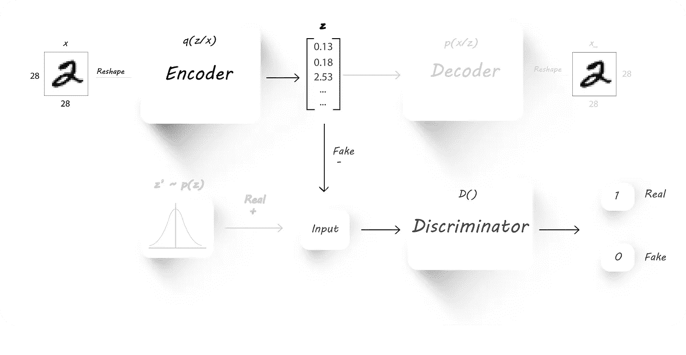*

*我们将把鉴别器权重固定为它们当前的值(使它们不可跟踪),并在鉴别器输出端把目标值固定为 1。稍后，我们将图像传入编码器，并找到鉴别器输出，然后使用该输出来查找损失(交叉熵成本函数)。我们将仅通过编码器权重进行反向传播，这将导致编码器学习所需的分布，并产生具有该分布的输出(将鉴别器目标固定为 1 将导致编码器通过查看鉴别器权重来学习所需的分布)。*

*既然理论部分已经完成，让我们看看如何使用 tensorflow 实现它。*

*下面是第 2 部分的完整代码(它与我们在第 1 部分中讨论的内容非常相似):*

* [## naresh 1318/Adversarial _ 自动编码器

### 对抗性自动编码器向导

github.com](https://github.com/Naresh1318/Adversarial_Autoencoder/blob/master/adversarial_autoencoder.py) 

像往常一样，我们有帮手:

我没有改变编码器和解码器的架构:

Encoder Architecture

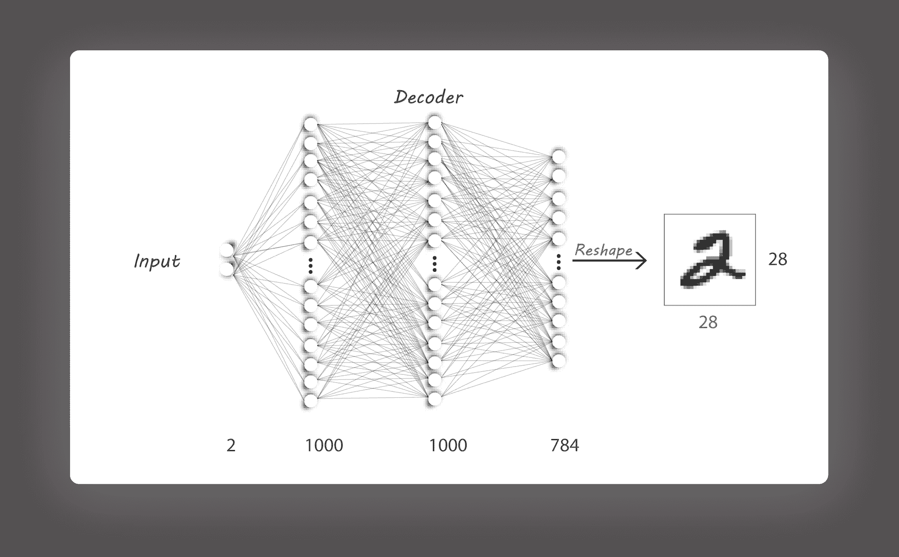

Decoder Architecture

这是鉴别器架构:

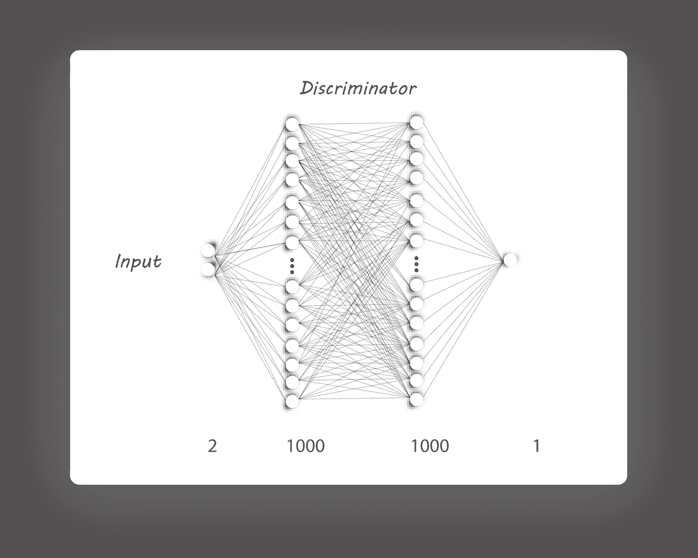

Discriminator Architecture

它类似于我们的编码器架构，输入形状是`z_dim`(实际上是`batch_size, z_dim`)，输出形状是 1 ( `batch_size, 1`)。

注意，在分别为编码器、解码器和鉴别器定义密集层时，我使用了前缀`e_`、`d_`和`dc_`。使用这些符号有助于我们轻松收集要训练的重量:

我们现在知道训练 AAE 有两个部分，首先是重建阶段(我们将训练我们的自动编码器来重建输入)和正则化阶段(首先训练鉴别器，然后是编码器)。

我们将编码器输出连接到解码器输入，开始重建阶段:

我每次调用我们定义的架构时都使用`tf.variable_scope(tf.get_variable_scope())`，因为它允许我们在所有函数调用中共享权重(只有在`reuse=True`时才会发生)。

损失函数通常是均方误差(MSE)，我们在[第 1 部分](https://medium.com/towards-data-science/a-wizards-guide-to-adversarial-autoencoders-part-1-autoencoder-d9a5f8795af4)中遇到过。

类似于我们在第 1 部分中所做的，优化器(它将更新权重以减少损失[希望如此])实现如下:

I couldn’t help it :P

重建阶段到此结束，接下来我们进入正则化阶段:

我们将首先训练鉴别器来区分真实的分布样本和来自生成器(这里是编码器)的假样本。

*   `real_distribution`是一个占位符，我用它将所需分布的值传递给鉴别器(这将是我们真正的输入)。
*   `encoder_output`连接到鉴别器，鉴别器将为我们提供伪输入的鉴别器输出`d_fake`。
*   这里是`reuse=True`，因为我们希望在第二次调用中使用相同的鉴别器权重(如果没有指定，那么 tensorflow 会创建一组新的随机初始化的权重[但是因为我使用了`get_variable()`来创建权重，所以会出错])。

我用来训练鉴别器的损失函数是:

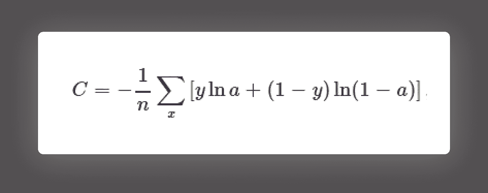

Cross entropy cost

这很容易在 tensorflow 中实现，如下所示:

下一步将是训练发电机(编码器)输出所需的分布。正如我们已经讨论过的，这需要将鉴别器的目标设置为 1，并将`d_fake`变量(连接到鉴别器的编码器【返回查看】)设置为 1。发电机损耗又是交叉熵代价函数。

为了在训练期间只更新所需的权重，我们需要将所有这些收集的权重传递给`minimize()`下的`var_list`参数。因此，我已经在它们的训练阶段传递了鉴别器变量(`dc_var`)和生成器(编码器)变量(`en_var`)。

我们差不多完成了，剩下的就是将我们的 MNIST 图像作为输入和目标，以及大小为`batch_size, z_dim`的随机数作为鉴别器的输入(这将形成所需的分布)。

训练部分可能看起来很吓人，但是盯着它看一会儿，你会发现它非常直观。

我在培训中使用的参数如下:

我用所需的分布训练了 300 个时期的模型，开始一个正态(高斯)分布，平均值为 0 和 5，作为它的标准分布。下面是编码器输出和所需的分布及其直方图:

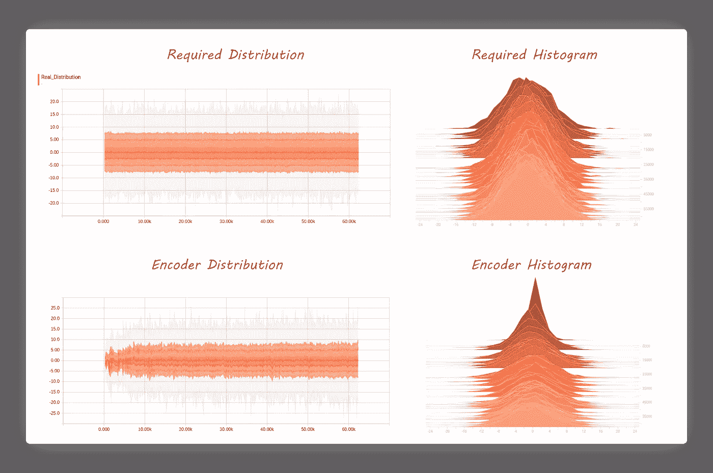

编码器分布几乎与要求的分布相匹配，直方图显示其中心为零。很好，但是鉴别器呢，它的表现如何？

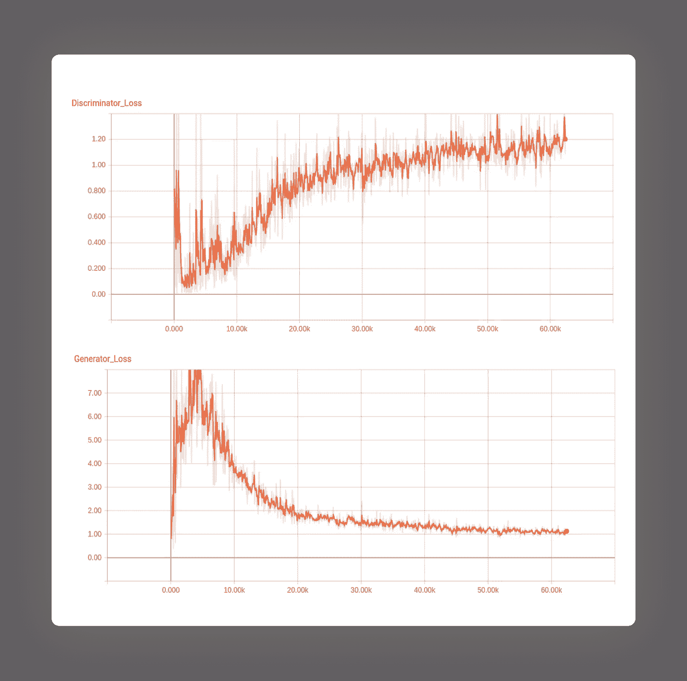

好消息是，鉴频器损耗正在增加(变得更糟)，这告诉我们很难区分真假输入。

最后，由于我们有了`z_dim=2` (2D 值)，我们可以将属于所需分布的随机输入传递给我们训练过的解码器，并将其用作生成器(我知道，我一直将编码器称为生成器，因为它向鉴别器生成假输入，但由于解码器已经学会映射这些假输入以在其输出端获得数字，所以我们可以将我们的解码器称为生成器)。我以固定的间隔将(-10，-10)到(10，10)的值传递给解码器，并存储其输出。下面是数字的分布情况:

上图显示了一个清晰的数字聚类及其在我们探索解码器训练值时的转换。AAE 使编码器输出分布中的间隙变得更近，这允许我们将解码器用作发电机。

就是这样！。在下一部分中，我们将重点讨论如何使用 AAE 将图像风格与其内容分开。这很容易实现，因为我们已经完成了大部分相对困难的部分。* 

*希望你喜欢 AAEs 上的这篇文章。我会公开鼓励任何批评或建议来改进我的工作。*

*如果你认为这个内容值得分享点击❤️，我喜欢它发送给我的通知！！*

*← Part 1: [Autoencoder？](https://medium.com/towards-data-science/a-wizards-guide-to-adversarial-autoencoders-part-1-autoencoder-d9a5f8795af4)*

*→第 3 部分:[风格与内容的解开。](https://medium.com/towards-data-science/a-wizards-guide-to-adversarial-autoencoders-part-3-disentanglement-of-style-and-content-89262973a4d7)*