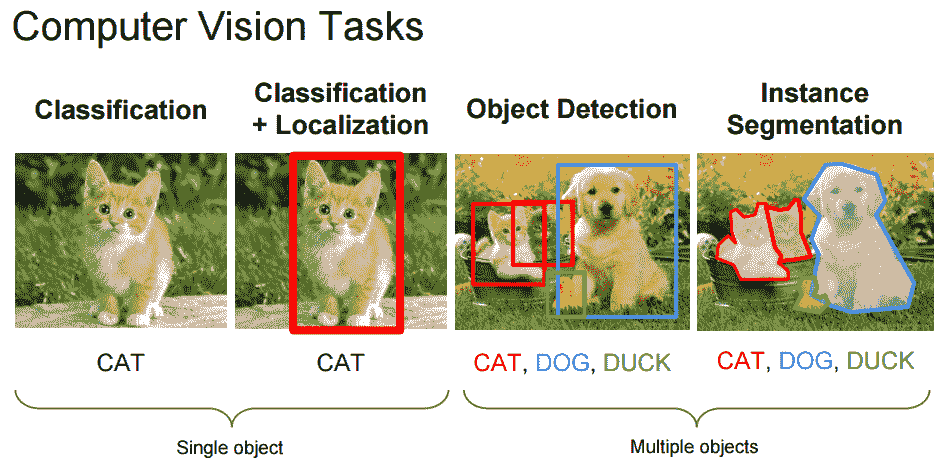
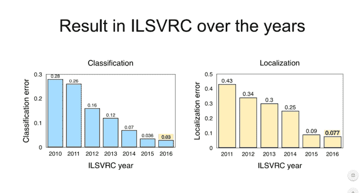
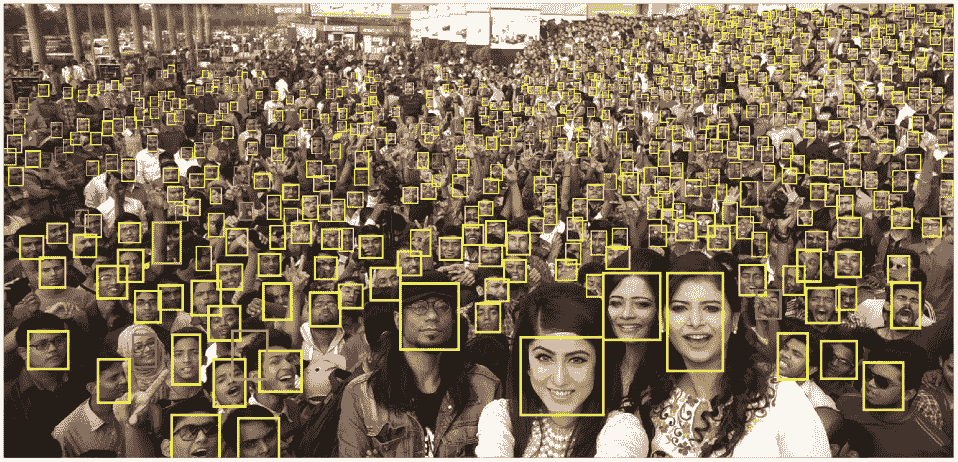
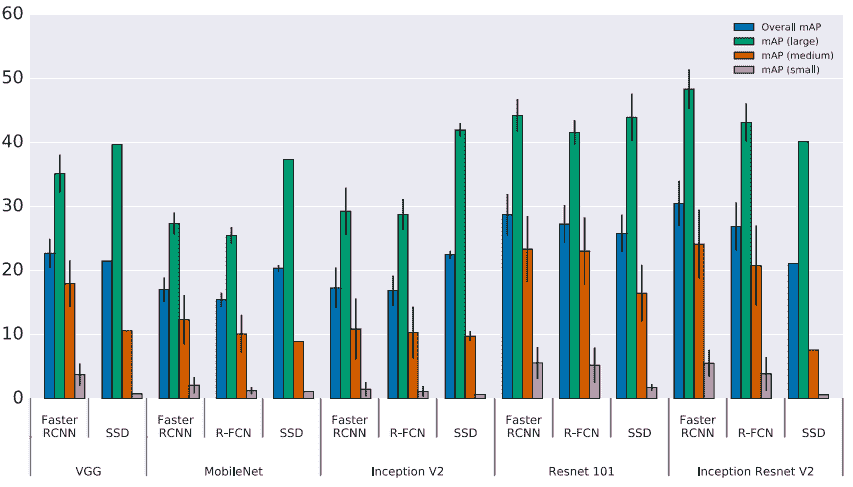
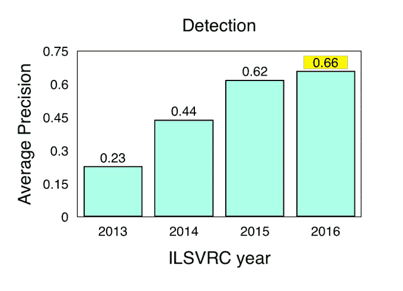

# 计算机视觉一年——第 1 部分，共 4 部分

> 原文：<https://towardsdatascience.com/a-year-in-computer-vision-part-1-of-4-eaeb040b6f46?source=collection_archive---------1----------------------->

## **—第一部分:分类/定位、目标检测&目标跟踪**

# **简介**

计算机视觉通常指的是赋予机器视觉能力的科学学科，或者更生动地说，使机器能够从视觉上分析它们的环境和其中的刺激。这个过程通常涉及对一个图像、多个图像或视频的评估。英国机器视觉协会(BMVA)将计算机视觉定义为“*，从单一图像或图像序列中自动提取、分析和理解有用信息。*【1】

术语*理解*为视觉的其他机械定义提供了一个有趣的对比点，它用来展示计算机视觉领域的重要性和复杂性。仅仅通过视觉表现是无法真正理解我们的环境的。相反，视觉线索通过视神经传播到初级视觉皮层，并由大脑以高度风格化的方式进行解释。从这种感官信息中得出的解释包含了我们自然编程和主观体验的几乎全部，即进化如何让我们生存下来，以及我们一生中对世界的了解。

在这方面，*视觉*只与图像的传输有关，用于解释；而*计算*所述图像更类似于思维或认知，利用了大脑的多种能力。因此，许多人认为，计算机视觉是对视觉环境及其背景的真正理解，由于其跨领域的掌握，它为强人工智能的未来迭代铺平了道路。

然而，放下干草叉，因为我们仍然处于这个迷人领域的萌芽阶段。这篇文章旨在展示 2016 年最大的计算机视觉进步。并希望将这些进步建立在预期的近期社会互动和我们所知的生命终结的半开玩笑的预言的健康结合上。

虽然我们的作品总是写得尽可能容易理解，但由于主题的原因，这一特定作品中的部分有时可能是倾斜的。我们确实从头到尾提供了基本的定义，但是，这些仅仅传达了对关键概念的浅显理解。为了将我们的重点放在 2016 年的工作上，为了简洁起见，经常会有省略。

一个明显的遗漏与卷积神经网络(下文称为 CNN 或 ConvNets)的功能有关，卷积神经网络在计算机视觉领域中无处不在。AlexNet[2]在 2012 年的成功，一个让 ImageNet 竞争对手措手不及的 CNN 架构，证明是该领域事实上的革命的煽动者，许多研究人员采用基于神经网络的方法作为计算机视觉新时代“正常科学”的一部分。[3]

四年后，CNN 的变体仍然构成了视觉任务的新神经网络架构的主体，研究人员像乐高积木一样重建它们；开源信息和深度学习力量的有效证明。然而，对 CNN 的解释可以很容易地跨越几个帖子，最好留给那些在这个主题上有更深的专业知识和使复杂的东西可以理解的亲和力的人。

对于希望在继续之前快速了解基础知识的普通读者，我们推荐下面的前两个资源。对于那些希望更进一步的人，我们订购了以下资源来帮助他们:

> **深度神经网络如何看待你的#自拍**Andrej Karpathy 是我们帮助人们理解 CNN 背后的应用和功能的最爱之一。[4]
> 
> **Quora:“什么是卷积神经网络？”—** 不缺很棒的链接和解释。特别适合那些没有事先了解。[5]
> 
> **来自斯坦福大学的 CS231n:用于视觉识别的卷积神经网络**是获得更多深度的优秀资源。[6]
> 
> **深度学习** (Goodfellow，Bengio &库维尔，2016)在第九章中提供了 CNN 特性和功能的详细解释。该教材由作者以 HTML 格式免费提供。[7]

对于那些希望了解更多关于神经网络和深度学习的人，我们建议:

> **神经网络和深度学习**(尼尔森，2017 年)是一本免费的在线教科书，它为读者提供了对神经网络和深度学习复杂性的真正直观的理解。即使只是完成了第一章，对于第一次接触的人来说，也能很好地阐明这篇文章的主题。[8]

作为一个整体，这部作品是不连贯和断断续续的，反映了作者的兴奋和精神，这是打算利用它，一节一节。使用我们自己的启发和判断来划分信息，这是一种必要的妥协，因为所介绍的大部分工作都受到跨领域的影响。

我们希望读者从我们在这里收集的信息中受益，不管他们以前有什么经验，都可以加深自己的知识。

来自我们所有的贡献者，

*米槽*

# 分类/本地化

当涉及图像时，分类的任务通常是指给整个图像分配一个标签，例如“猫”。假设这一点，则定位可以指找到对象在所述图像中的位置，通常由对象周围的某种形式的边界框的输出来表示。ImageNet[9]上当前的分类技术很可能已经超越了一群训练有素的人。[10]由于这个原因，我们更加重视博客的后续部分。

> **图 1:** 计算机视觉任务

**Source**: Fei-Fei Li, Andrej Karpathy & Justin Johnson (2016) cs231n, Lecture 8 — Slide 8, *Spatial Localization and Detection* (01/02/2016). Available: [http://cs231n.stanford.edu/slides/2016/winter1516_lecture8.pdf](http://cs231n.stanford.edu/slides/2016/winter1516_lecture8.pdf)

然而，随着类别数量的增加，更大的数据集的引入[11]可能会在不久的将来为进展提供新的衡量标准。在这一点上，Keras 的创建者 Fran ois Chollet[12]已经将包括流行的 architecture Xception 在内的新技术应用于包含 17，000 个类别的超过 3.5 亿多标签图像的内部 google 数据集。[13,14]

> **图 2:** 来自 ils vrc(2010–2016)的分类/本地化结果

**Note**: ImageNet Large Scale Visual Recognition Challenge (ILSVRC). The change in results from 2011–2012 resulting from the AlexNet submission. For a review of the challenge requirements relating to Classification and Localization see: [http://www.image-net.org/challenges/LSVRC/2016/index#comp](http://www.image-net.org/challenges/LSVRC/2016/index#comp)

**来源**:贾登(2016)。 *ILSVRC2016 对象定位:简介，结果*。幻灯片 2。可用:[http://image-net . org/challenges/talks/2016/ils vrc 2016 _ 10 _ 09 _ cls loc . pdf](http://image-net.org/challenges/talks/2016/ILSVRC2016_10_09_clsloc.pdf)

**ImageNet LSVRC(2016)的有趣收获:**

*   **场景分类**是指给一幅图像贴上某种场景类别的标签的任务，比如“温室”、“体育场”、“大教堂”等。ImageNet 去年用 Places2[15]数据集的一个子集举行了一次场景分类挑战:用 365 个场景类别的 800 万幅图像进行训练。
    海康威视[16]凭借深度初始型网络和不太深的残差网络的组合，以 9%的前 5 名误差胜出。
*   **Trimps-Soushen** 以 2.99%的 top-5 分类误差和 7.71%的定位误差拿下 ImageNet 分类任务。该团队采用集成进行分类(对 Inception、Inception-Resnet、Resnet 和 Wide Residual Networks 模型的结果进行平均[17])，并基于标签使用更快的 R-CNN 进行定位。[18]数据集分布在 1000 个图像类中，有 120 万个图像作为训练数据。分割的测试数据进一步汇编了 10 万幅看不见的图像。
*   脸书的 ResNeXt 以 3.03%的错误率位居第二，它使用了一种新的架构，扩展了原来的 ResNet 架构。[19]

# 目标检测

可以想象，**物体检测的过程**就是这样做的，检测图像中的物体。ILSVRC 2016[20]为对象检测提供的定义包括输出单个对象的边界框和标签。这不同于分类/定位任务，它将分类和定位应用于许多对象，而不仅仅是单个主要对象。

> **图 3** :以人脸为唯一类别的物体检测

**Note:** Picture is an example of face detection, Object Detection of a single class. The authors cite one of the persistent issues in Object Detection to be the detection of small objects. Using small faces as a test class they explore the role of scale invariance, image resolution, and contextual reasoning. **Source:** Hu and Ramanan (2016, p. 1)[21]

2016 年**物体探测**的主要趋势之一是向更快、更高效的探测系统转变。这在 YOLO、SSD 和 R-FCN 等方法中是显而易见的，这是朝着在整个图像上共享计算的方向发展。因此，区别于与快速/更快的 R-CNN 技术相关的昂贵的子网。这通常被称为“端到端培训/学习”,贯穿整篇文章。

基本原理通常是避免单独的算法孤立地关注它们各自的子问题，因为这通常会增加训练时间并降低网络精度。也就是说，这种网络的端到端适配通常发生在初始子网解决方案之后，因此是一种回顾性优化。然而，快速/更快的 R-CNN 技术仍然非常有效，并且仍然广泛用于对象检测。

*   **SSD:单次多盒探测器**【22】利用单个神经网络封装所有必要的计算，并消除了其他方法的昂贵提议生成。它实现了" *75.1%的 mAP，优于可比的更快的 R-CNN 模型*(刘等，2016)。
*   我们在 2016 年看到的最令人印象深刻的系统之一来自名为“ **YOLO9000:更好、更快、更强**”[23]的系统，它介绍了 YOLOv2 和 YOLO9000 检测系统。[24] YOLOv2 从 2015 年年中[25]起极大地改进了最初的 YOLO 模型，并能够在非常高的 FPS 下实现更好的结果(使用原始的 GTX 泰坦 X 在低分辨率图像上高达 90 FPS)。除了完成速度之外，在某些对象检测数据集上，该系统还优于具有 ResNet 和 SSD 的更快的 RCNN。
*   YOLO9000 实现了一种用于检测和分类的联合训练方法，将其预测能力扩展到可用的标记检测数据之外，即，它能够检测从未见过标记检测数据的对象。YOLO9000 模型提供了跨越 9000 多个类别的实时对象检测，缩小了分类和检测之间的数据集大小差距。更多细节、预训练模型和视频展示可点击[此处](http://pjreddie.com/darknet/yolo/)获取。[26]

YOLOv2 Object Detection running on frames from James Bond with DragonForce

*   **用于对象检测的特征金字塔网络**【27】来自 FAIR【28】，利用“*深层卷积网络固有的多尺度、金字塔式层级结构，以边际额外成本*构建特征金字塔，这意味着表现仍然强大，而不会影响速度或内存。林等人(2016)在 COCO 上实现了最先进的(以下简称)单一模型结果。[29]结合更快的 R-CNN 系统，击败了 2016 年获胜者取得的成绩。
*   **R-FCN:通过基于区域的完全卷积网络进行物体检测**【30】:这是另一种方法，通过使基于区域的检测器完全卷积并在整个图像上共享计算，避免在图像上应用昂贵的每区域子网络数百次。"*我们的结果是在每幅图像 170 毫秒的测试时间速度下实现的，比更快的 R-CNN 同行*快 2.5-20 倍"(戴等人，2016)。

> **图 4** :物体检测中的精度权衡

**Note**: Y-axis displays mAP (mean Average Precision) and the X-axis displays meta-architecture variability across each feature extractor (VGG, MobileNet…Inception ResNet V2). Additionally, mAP small, medium and large describe the average precision for small, medium and large objects, respectively. As such accuracy is “*stratified by object size, meta-architecture and feature extractor*” and “*image resolution is fixed to 300*”. While Faster R-CNN performs comparatively well in the above sample, it is worth noting that the meta-architecture is considerably slower than more recent approaches, such as R-FCN.

**来源**:黄等(2016 年第 9 期)[31]

黄等人(2016)[32]发表了一篇论文，对 R-FCN、SSD 和更快的 R-CNN 进行了深入的性能比较。由于围绕机器学习(ML)技术的准确比较的问题，我们想在这里指出产生标准化方法的优点。他们将这些架构视为“元架构”，因为它们可以与不同类型的特征提取器(如 ResNet 或 Inception)相结合。

作者通过改变元架构、特征提取器和图像分辨率来研究准确性和速度之间的权衡。例如，特征提取器的选择在元体系结构之间产生了很大的差异。

SqueezeDet[33]和 PVANet[34]的论文也证明了在保持实时商业应用(尤其是自动驾驶应用)所需精度的同时，使物体检测变得廉价和高效的趋势。而一家中国公司 DeepGlint 提供了一个很好的例子，即作为闭路电视集成的物体检测，尽管是以一种模糊的奥威尔方式:[视频](https://www.youtube.com/watch?v=xhp47v5OBXQ)。[35]

DeepGlint Object Detection, Object Tracking and Face Recognition

**ils vrc 和 COCO 检测挑战的结果**

COCO[36](上下文中的常见对象)是另一个流行的图像数据集。然而，与 ImageNet 等替代方案相比，它相对更小，更精确，重点是在更广泛的场景理解背景下的对象识别。组织者举办了一年一度的目标检测、分割和关键点挑战赛。ILSVRC[37]和 COCO[38]检测挑战的检测结果如下:

> **ImageNet LSVRC 从图像中检测物体(DET):** CUImage 66% meanAP。在 200 个物品类别中赢得了 109 个。
> 
> **ImageNet LSVRC 视频对象检测(VID):** NUIST 80.8%平均 AP
> 
> **ImageNet LSVRC 从视频中检测目标并跟踪:** CUvideo 55.8%平均 AP
> 
> **COCO 2016 检测挑战赛(包围盒):** G-RMI(谷歌)41.5% AP(比 2015 年冠军 MSRAVC 增加 4.2%绝对百分比)

在回顾 2016 年的检测结果时，ImageNet 表示,“MSRAVC 2015 为性能设立了非常高的标准[将 ResNets 引入竞争]。参赛选手在所有课程上的表现都有所提高。本地化在这两项挑战中都有很大提高。“小对象实例的高相对改进”(ImageNet，2016)。[39]

> **图 5** : ILSVRC 图像检测结果(2013–2016)

**Note**: ILSVRC Object Detection results from images (DET) (2013–2016). **Source**:ImageNet. 2016\. [Online] *Workshop Presentation, Slide 2*. Available: [http://image-net.org/challenges/talks/2016/ECCV2016_ilsvrc_coco_detection_segmentation.pdf](http://image-net.org/challenges/talks/2016/ECCV2016_ilsvrc_coco_detection_segmentation.pdf)

# 目标跟踪

指在给定场景中跟踪感兴趣的特定对象或多个对象的过程。传统上，它应用于视频和现实世界的交互中，在最初的**物体检测**之后进行观察；例如，这个过程对自动驾驶系统至关重要。

*   **用于目标跟踪的全卷积暹罗网络**【40】将基本跟踪算法与暹罗网络相结合，端到端训练，实现 SOTA，并以超过实时的帧速率运行。本文试图解决传统在线学习方法缺乏丰富性的问题。
*   **使用深度回归网络学习以 100 FPS 进行跟踪**【41】是另一篇试图通过在线训练方法改善现有问题的论文。作者制作了一种跟踪器，它利用前馈网络来学习围绕对象运动、外观和方向的一般关系，从而在没有在线训练的情况下有效地跟踪新对象。在标准跟踪基准上提供 SOTA，同时还管理“*以 100 fps 的速度跟踪一般对象*”(Held 等人，2016)。

GOTURN 视频(使用回归网络的通用对象跟踪)可用:[视频](https://www.youtube.com/watch?v=kMhwXnLgT_I)【42】

*   **用于视觉跟踪的深度运动特征**【43】**融合手工制作的特征、深度 RGB/外观特征(来自 CNN)、深度运动特征(在光流图像上训练)实现 SOTA。虽然深度运动特征在动作识别和视频分类中很常见，但作者声称这是他们第一次用于视觉跟踪。该论文还因“计算机视觉和机器人视觉”主题获得了 2016 年 ICPR 最佳论文奖。**

> ***本文介绍了在检测跟踪框架中深度运动特征的影响的研究。我们进一步表明，手工制作，深 RGB 和深运动特征包含互补信息。据我们所知，我们是第一个提出融合外观信息和深度运动特征进行视觉跟踪的人。综合实验清楚地表明，我们的具有深度运动特征的融合方法优于仅依赖外观信息的标准方法。***

*   ****虚拟世界作为多对象跟踪分析的代理**【44】**解决了现有视频跟踪基准和数据集缺乏真实生活可变性的问题。该论文提出了一种用于真实世界克隆的新方法，该方法从零开始生成丰富的、虚拟的、合成的、照片般逼真的环境，具有全标签，克服了现有数据集中存在的一些无菌性。生成的图像自动标记有准确的地面实况，允许除对象检测/跟踪之外的一系列应用，例如深度和光流。****
*   ******使用全卷积网络的全局最优目标跟踪** [45]处理目标变化和遮挡，将这些作为目标跟踪中的两个根本限制。“*我们提出的方法通过使用完全卷积网络解决了对象外观变化问题，并通过动态编程处理遮挡问题*”(Lee 等人，2016)。****

> ******在我们的网站上可以免费获得完整的出版物:**[*www.themtank.org*](http://www.themtank.org)****

****我们鼓励读者通过我们自己的网站来查看这篇文章，因为我们包括嵌入的内容和简单的导航功能，使报告尽可能地动态。我们不通过我们的网站赚取收入，我们希望尽可能地让读者对我们的网站感兴趣和直观，所以我们衷心欢迎对我们的网站的任何反馈！****

> ******关注我们下期关于媒体的简介(第 2 部分，共 4 部分)，以及即将到来的人工智能研究领域的内容。**请随意将所有反馈和建议放在评论区，我们会尽快回复。或者，您可以通过以下方式直接联系我们:info@themtank.com****

****非常感谢，****

****M 坦克****

********

## ****按出现顺序排列的参考文献****

****全文可从以下网址获得:[http://www . them tank . org/publications/a-year-in-computer-vision](http://www.themtank.org/publications/a-year-in-computer-vision)****

****[1]英国机器视觉协会(BMVA)。2016.什么是计算机视觉？*【在线】*可在:【http://www.bmva.org/visionoverview】T2【21/12/2016 访问】****

****[2] Krizhevsky，a .，Sutskever，I .和 Hinton，G. E .，2012。使用深度卷积神经网络进行 ImageNet 分类， *NIPS 2012:神经信息处理系统*，内华达州太浩湖。可用:[http://www . cs . Toronto . edu/~ kriz/imagenet _ class ification _ with _ deep _ 卷积. pdf](http://www.cs.toronto.edu/~kriz/imagenet_classification_with_deep_convolutional.pdf)****

****[3]库恩，T. S. 1962。*科学革命的结构*。第四版。美国:芝加哥大学出版社。****

****[4]卡帕西，A. 2015。深度神经网络怎么看待你的#自拍。*【博客】* *安德烈·卡帕西博客*。可用:[http://karpathy.github.io/2015/10/25/selfie/](http://karpathy.github.io/2015/10/25/selfie/)【访问时间:21/12/2016】****

****[5] Quora。2016.什么是卷积神经网络？*【在线】*可用:[https://www . quora . com/What-is-a-convolutionary-neural-network](https://www.quora.com/What-is-a-convolutional-neural-network)【访问时间:21/12/2016】****

****[6]斯坦福大学。2016.用于视觉识别的卷积神经网络。*【在线】CS231n* 。可用:[http://cs231n.stanford.edu/](http://cs231n.stanford.edu/)【2016 . 12 . 21 访问】****

****[7]古德费勒等人，2016 年。深度学习。麻省理工学院出版社。*【在线】*[http://www.deeplearningbook.org/](http://www.deeplearningbook.org/)【访问时间:21/12/2016】注:第九章，卷积网络【可用:[http://www.deeplearningbook.org/contents/convnets.html](http://www.deeplearningbook.org/contents/convnets.html)】****

****[8]尼尔森，M. 2017。神经网络和深度学习。*【在线】电子书*。可用:[http://neuralnetworksanddeeplearning.com/index.html](http://neuralnetworksanddeeplearning.com/index.html)【访问时间:2017 年 06 月 03 日】。****

****[9] ImageNet 指的是计算机视觉的流行图像数据集。每年，参赛者都要参加一系列不同任务的竞赛，这些任务被称为 ImageNet 大规模视觉识别挑战(ILSVRC)。可用:[http://image-net.org/challenges/LSVRC/2016/index](http://image-net.org/challenges/LSVRC/2016/index)****

****[10]参见 Andrej Karpathy 的“*我在 ImageNet* 上与 ConvNet 竞争时学到的东西”。这篇博客文章详细介绍了作者根据 ILSVRC 2014 数据集提供人类基准的旅程。错误率约为 5.1%，而当时最先进的 GoogLeNet 分类错误率为 6.8%。可用:[http://karpathy . github . io/2014/09/02/what-I-learn-from-competing-against-a-convnet-on-imagenet/](http://karpathy.github.io/2014/09/02/what-i-learned-from-competing-against-a-convnet-on-imagenet/)****

****[11]参见本文后面的新数据集。****

****[12] Keras 是一个流行的基于神经网络的深度学习库:[https://keras.io/](https://keras.io/)****

****[13]乔莱，F. 2016。用于大规模图像分类的信息论标签嵌入。*【在线】arXiv: 1607.05691* 。可用:[arXiv:1607.05691 v1](https://arxiv.org/abs/1607.05691v1)****

****[14]乔莱，F. 2016。例外:具有深度可分卷积的深度学习。*【在线】* *arXiv:1610.02357* 。可用:[**arXiv:1610.02357 v2**](https://arxiv.org/abs/1610.02357v2)****

****[15] Places2 数据集，可用细节:[http://places2.csail.mit.edu/](http://places2.csail.mit.edu/)。另请参见新数据集部分。****

****[16]海康威视。2016.海康威视在 ImageNet 2016 挑战赛的场景分类中排名第 1。*【在线】安全新闻台*。可用:[http://www . security news desk . com/海康威视-ranked-no-1-scene-class ification-imagenet-2016-challenge/](http://www.securitynewsdesk.com/hikvision-ranked-no-1-scene-classification-imagenet-2016-challenge/)【访问时间:20/03/2017】。****

****[17]详见本出版物第四部分“剩余网络”。****

****[18]详情请见团队信息 Trimps-Soushen，来自:[http://image-net.org/challenges/LSVRC/2016/results](http://image-net.org/challenges/LSVRC/2016/results)****

****[19]谢，s .，吉尔希克，r .，杜尔达，p .，涂，Z. &何，K. 2016。深度神经网络的聚合残差变换。*【在线】* *arXiv: 1611.05431* 。可用:[**arXiv:1611.05431 v1**](https://arxiv.org/abs/1611.05431v1)****

****[20] ImageNet 大规模视觉识别挑战赛(2016)，第二部分，可用:[http://image-net.org/challenges/LSVRC/2016/](http://image-net.org/challenges/LSVRC/2016/%23det)[访问日期:2016 年 11 月 22 日]****

****[21]胡与拉马南。2016.发现小脸。*【在线】arXiv: 1612.04402。*可用:[**arXiv:1612.04402 v1**](https://arxiv.org/abs/1612.04402v1)****

****[22]刘等 2016。SSD:单次多盒探测器。*【在线】arXiv: 1512.02325v5* 。可用:[**arXiv:1512.02325 V5**](https://arxiv.org/abs/1512.02325v5)****

****[23]法尔哈迪·雷德蒙，2016 年。YOLO9000:更好、更快、更强。*【在线】arXiv: 1612.08242v1* 。可用:[arXiv:1612.08242 v1](https://arxiv.org/abs/1612.08242v1)****

****[24] YOLO 代表“你只看一次”。****

****[25]雷德蒙等人，2016 年。你只看一次:统一的，实时的物体检测。*【在线】arXiv: 1506.02640* 。可用:[arXiv:1506.02640 V5](https://arxiv.org/abs/1506.02640v5)****

****[26]雷德蒙。2017.YOLO:实时物体检测。*【网址】pjreddie.com*可用:[*https://pjreddie.com/darknet/yolo/*](https://pjreddie.com/darknet/yolo/)【访问时间:2017 年 01 月 03 日】。****

****[27]林等 2016。用于目标检测的特征金字塔网络。*【在线】arXiv: 1612.03144* 。可用:[**arXiv:1612.03144 v1**](https://arxiv.org/abs/1612.03144v1)****

****[28]脸书的人工智能研究****

****[29]上下文中的通用对象(COCO)图像数据集****

****[30]戴等 2016。R-FCN:通过基于区域的完全卷积网络的目标检测。*【在线】arXiv: 1605.06409* 。可用:[**arXiv:1605.06409 v2**](https://arxiv.org/abs/1605.06409v2)****

****[31]黄等 2016。现代卷积目标探测器的速度/精度权衡*【在线】arXiv: 1611.10012* 。可用:[arXiv:1611.10012 v1](https://arxiv.org/abs/1611.10012v1)****

****32 同上****

****[33]吴等 2016。SqueezeDet:用于自动驾驶实时目标检测的统一、小型、低功耗全卷积神经网络。*【在线】arXiv: 1612.01051* 。可用:[arXiv:1612.01051 v2](https://arxiv.org/abs/1612.01051v2)****

****[34]洪等 2016。PVANet:用于实时对象检测的轻量级深度神经网络。*【在线】arXiv: 1611.08588v2* 。可用:[arXiv:1611.08588 v2](https://arxiv.org/abs/1611.08588v2)****

****[35]迪格林官方。2016.格灵深瞳 CVPR2016。*【在线】Youtube.com*。可用:[https://www.youtube.com/watch?v=xhp47v5OBXQ](https://www.youtube.com/watch?v=xhp47v5OBXQ)【访问时间:2017 年 01 月 03 日】。****

****[36]可可——共同的共同对象。2016.*【网址】*可用:[http://mscoco.org/](http://mscoco.org/)【访问时间:2017 年 4 月 1 日】。****

****[37] ILSRVC 的结果取自:ImageNet。2016.2016 年大规模视觉识别挑战赛。****

*****【网站】物体检测*。可用:[http://image-net.org/challenges/LSVRC/2016/results](http://image-net.org/challenges/LSVRC/2016/results)【访问时间:2017 年 4 月 1 日】。****

****[38] COCO 检测挑战结果取自:COCO-常见的常见对象。2016.检测排行榜*【网站】mscoco.org*。可用:[http://mscoco.org/dataset/#detections-leaderboard](http://mscoco.org/dataset/%23detections-leaderboard)【访问时间:2017 年 5 月 1 日】。****

****[39] ImageNet。2016.[在线] *研讨会演示文稿*，幻灯片 31。可用:[http://image-net . org/challenges/talks/2016/eccv 2016 _ ils vrc _ coco _ detection _ segmentation . pdf](http://image-net.org/challenges/talks/2016/ECCV2016_ilsvrc_coco_detection_segmentation.pdf)【访问时间:06/01/2017】。****

****[40] Bertinetto 等人，2016 年。用于目标跟踪的全卷积暹罗网络。*【在线】arXiv: 1606.09549* 。可用:[https://arxiv.org/abs/1606.09549v2](https://arxiv.org/abs/1606.09549v2)****

****[41]赫尔德等人，2016 年。学习用深度回归网络以 100 FPS 跟踪。*【在线】arXiv: 1604.01802* 。可用:【https://arxiv.org/abs/1604.01802v2 ****

****42 戴维·赫尔德。2016.GOTURN——一个神经网络跟踪器。【在线】YouTube.com*。可用:[https://www.youtube.com/watch?v=kMhwXnLgT_I](https://www.youtube.com/watch?v=kMhwXnLgT_I)【访问时间:2017 年 3 月 3 日】。*****

****[43] Gladh 等人，2016 年。用于视觉跟踪的深度运动特征。*【在线】arXiv: 1612.06615* 。可用:[arXiv:1612.06615 v1](https://arxiv.org/abs/1612.06615v1)****

****[44] Gaidon 等人，2016 年。虚拟世界作为多目标跟踪分析的代理。*【在线】arXiv: 1605.06457* 。可用:[arXiv:1605.06457 v1](https://arxiv.org/abs/1605.06457v1)****

****[45] Lee 等人，2016 年。全卷积网络的全局最优目标跟踪。*【在线】arXiv: 1612.08274* 。可用:[arXiv:1612.08274 v1](https://arxiv.org/abs/1612.08274v1)****