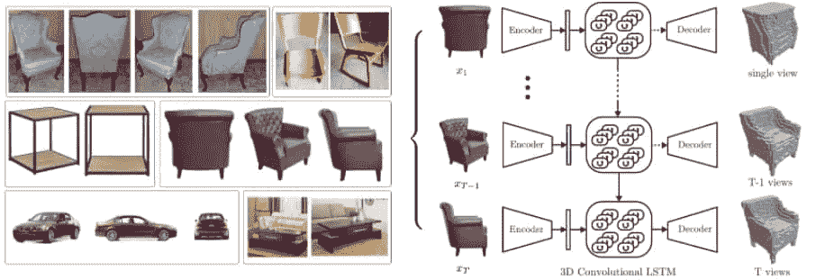
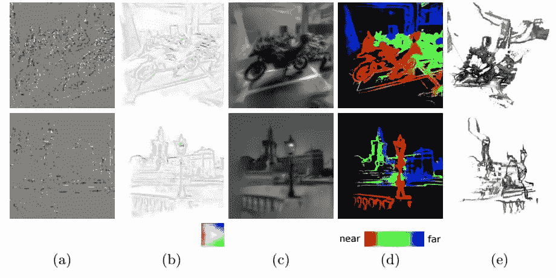

# 计算机视觉一年——第 3 部分，共 4 部分

> 原文：<https://towardsdatascience.com/a-year-in-computer-vision-part-3-of-4-861216d71607?source=collection_archive---------5----------------------->

## —第三部分:走向对世界的三维理解

下面这篇文章摘自我们的研究团队最近编辑的关于计算机视觉领域的出版物。第一、第二和第三部分目前可以通过我们的网站获得，剩下的第四部分将于下周一发布。

**未来几周，完整的出版物将在我们的网站上免费提供，第 1-3 部分现在可通过:**[*【www.themtank.org】*](http://www.themtank.org)获得

我们鼓励读者通过我们自己的网站来查看这篇文章，因为我们包括嵌入的内容和简单的导航功能，使报告尽可能地动态。我们的网站不会给团队带来任何收入，只是为了让读者尽可能地感受到这些材料的吸引力和直观性。我们竭诚欢迎对演示的任何反馈！

> 请关注、分享和支持我们的工作，无论你喜欢的渠道是什么(请尽情鼓掌！).如有任何问题或想了解对未来作品的潜在贡献，请随时联系编辑:info@themtank.com

# 介绍

> 计算机视觉的一个关键目标是从世界的 2D 观测中恢复潜在的 3D 结构。”—Rezende 等人(2016，第 1 页)[92]

如我们所见，在计算机视觉中，场景、物体和活动的分类，以及边界框和图像分割的输出是许多新研究的焦点。本质上，这些方法应用计算来获得图像的 2D 空间的“理解”。然而，批评者指出，3D 理解对于系统成功解释和导航真实世界是必不可少的。

例如，一个网络可以在一幅图像中找到一只猫，给它的所有像素着色，并将其归类为一只猫。但是，在猫的环境背景下，网络是否完全理解图像中的猫在哪里？

有人可能会说，计算机从上述任务中学到的关于 3D 世界的知识很少。与此相反，即使在检查 2D 图片时，人类也理解 3D 世界，即透视、遮挡、深度、场景中的对象如何相关等。将这些 3D 表示及其相关知识传授给人工系统代表了计算机视觉的下一个伟大前沿之一。这样想的一个主要原因是，一般来说；

*场景的 2D 投影是组成场景的摄像机、灯光和对象的属性和位置的复杂函数。如果具有 3D 理解能力，代理可以从这种复杂性中抽象出来，形成稳定、清晰的表示，例如，在不同的光照条件下，或者在部分遮挡的情况下，识别出椅子是椅子，无论是从上面还是从侧面看。*【93】

然而，3D 理解传统上面临几个障碍。第一个问题涉及“自身和正常遮挡”以及符合给定 2D 表示的大量 3D 形状。由于无法将相同结构的不同图像映射到相同的 3D 空间，以及在处理这些表示的多模态时，理解问题进一步复杂化[94]。最后，地面实况 3D 数据集传统上非常昂贵且难以获得，当与用于表示 3D 结构的不同方法结合时，可能导致训练限制。

我们认为在这一领域开展的工作值得关注。从未来 AGI 系统和机器人的早期理论应用，到增强、虚拟和混合现实中令人着迷的沉浸式应用，这些应用将在不久的将来影响我们的社会。我们谨慎地预测，由于利润丰厚的商业应用，计算机视觉领域将呈指数级增长，这意味着很快计算机可能会开始推理世界，而不仅仅是像素。

# 3D 对象

该第一部分是分散的，充当应用于用 3D 数据表示的对象的计算、从 2D 图像推断 3D 对象形状和姿态估计的总括；从 2D 图像确定物体的 3D 姿态的变换[95]。重建的过程也在下一节明确讨论它之前悄悄进行。但是，考虑到这几点，我们将展示在这一领域最让我们团队兴奋的工作:

*   **OctNet:在高分辨率下学习深度 3D 表示** [96]延续了卷积网络的最新发展，卷积网络使用 3D 卷积对 3D 数据或体素(类似于 3D 像素)进行操作。OctNet 是“一种新颖的 3D 表示，它使具有高分辨率输入的深度学习变得易于处理”。作者通过“分析分辨率对几个 3D 任务的影响，包括 3D 对象分类、方向估计和点云标记”来测试 OctNet 表示这篇论文的主要贡献是利用了 3D 输入数据的稀疏性，从而能够更有效地利用内存和计算。
*   **ObjectNet3D:用于 3D 对象识别的大规模数据库**【97】——为 3D 对象识别提供数据库，呈现 100 个对象类别的 2D 图像和 3D 形状。*我们数据库中[取自 ImageNet]的图像中的对象与[取自 ShapeNet 存储库]的 3D 形状对齐，这种对齐为每个 2D 对象提供了精确的 3D 姿势注释和最接近的 3D 形状注释。*基线实验包括:区域建议生成、2D 目标检测、联合 2D 检测和三维目标姿态估计，以及基于图像的三维形状检索。
*   **3D-R2N2:单视图和多视图 3D 对象重建的统一方法**【98】**—使用来自任意视点的对象实例的单个或多个图像，以 3D 占据网格的形式创建对象的重建从对象的图像到 3D 形状的映射主要使用合成数据来学习，并且网络可以在不需要“任何图像注释或对象类别标签”的情况下进行训练和测试。该网络包括一个 2D-有线电视新闻网、一个三维卷积 LSTM(一种新创建的架构)和一个三维去卷积神经网络。这些不同的组件如何相互作用并被端到端地训练在一起，这是神经网络分层能力的完美例证。**

****图 11**:3D-r2n 2 功能示例**

****

****Note**: Images taken from Ebay (left) and an overview of the functionality of 3D-R2N2 (right). **Source**: Choy et al. (2016, p. 3) [99]**

****来自来源**的注释:我们[作者]希望重建的对象的一些样本图像——注意视图被一个大基线分开，对象的外观显示很少纹理和/或非朗伯的。(b)我们提出的 3D-R2N2 的概述:该网络将来自任意(未校准)视点的图像序列(或仅仅一个图像)作为输入(在该示例中，扶手椅的 3 个视图),并生成体素化的 3D 重建作为输出。随着网络看到对象的更多视图，重建被逐渐细化。**

**3D-R2N2 使用 ShapeNet 模型生成“渲染图像和体素化模型”,并在运动结构(SfM)和同步定位和映射(SLAM)方法通常失败的情况下促进 3D 对象重建:**

***我们的大量实验分析表明，我们的重建框架 I)优于单视图重建的最新方法，ii)在传统 SFM/SLAM 方法失败的情况下，能够实现对象的 3D 重建。*”**

*   ****从多个物体的 2D 视图进行的 3D 形状归纳**【100】**使用“*投影生成对抗网络*”(PRG ans)，其训练深度生成模型，允许 3D 形状的精确表示，鉴别器仅显示 2D 图像。投影模块捕获 3D 表示，并在传递到鉴别器之前将它们转换成 2D 图像。通过迭代训练循环，生成器通过改进其生成的 3D 体素形状来改进投影。****

******图 12** : PrGAN 架构段****

********

******Note from source**: The PrGAN architecture for generating 2D images of shapes. A 3D voxel representation (323) and viewpoint are independently generated from the input z (201-d vector). The projection module renders the voxel shape from a given viewpoint (θ, φ) to create an image. The discriminator consists of 2D convolutional and pooling layers and aims to classify if the input image is generated or real.
**Source**: Gadhelha et al. (2016, p. 3) [101]****

****以这种方式，推理能力是通过无监督的环境学习的:****

*****投影模块的添加使我们能够在学习阶段不使用任何 3D、视点信息或注释的情况下推断基本的 3D 形状分布。*****

****此外，形状的内部表示可以插值，这意味着体素形状的离散共性允许从对象到对象的变换，例如从汽车到飞机。****

*   ******图像三维结构的无监督学习** [102]提出了一个完全无监督的生成模型，首次证明了“学习推断世界三维表示的可行性”。简而言之，DeepMind 团队提出了一个模型，该模型“*学习 3D 结构的强大深度生成模型，并通过概率推理*从 3D 和 2D 图像中恢复这些结构”，这意味着输入可以是 3D 和 2D。****

****DeepMind 的强大生成模型运行在体积和基于网格的表示上。在 OpenGL 中使用基于网格的表示允许内置更多的知识，例如，光如何影响场景和使用的材料。*使用基于 3D 网格的表示，并在循环中使用成熟的黑盒渲染器进行训练，可以学习物体的颜色、材料和纹理、灯光位置以及其他物体之间的相互作用*[103]****

****模型质量高，捕捉不确定性，并服从概率推理，允许在 3D 生成和模拟中的应用。该团队在 3D MNIST 和 ShapeNet 上实现了第一个 3D 密度建模的定量基准。这种方法表明，模型可以在 2D 图像上进行端到端的无监督训练，不需要地面真实的 3D 标签。****

# ****人体姿态估计和关键点检测****

****人体姿态估计试图找到人体部分的方向和配置。2D 人体姿态估计或关键点检测通常指的是定位人体的身体部位，例如找到膝盖、眼睛、脚等的 2D 位置。****

****然而，3D 姿态估计通过找到身体部位在 3D 空间中的方向而更进一步，然后可以执行形状估计/建模的可选步骤。在过去的几年里，这些子领域已经有了巨大的进步。****

****在竞争评估方面"*COCO 2016 关键点挑战包括同时检测人和定位他们的关键点* "[104]。欧洲计算机视觉公约(ECCV) [105]提供了关于这些主题的更广泛的文献，但是我们想强调:****

*   ******使用部分亲和场的实时多人 2D 姿态估计**。[106]****

****这种方法以 60%的平均精度(AP)在首届 MSCOCO 2016 关键点挑战赛上创造了 SOTA 的表现，并在 ECCV 获得了最佳演示奖，视频:[视频](https://www.youtube.com/watch?v=pW6nZXeWlGM)【107】****

****Realtime Multi-Person 2D Human Pose Estimation using Part Affinity Fields, CVPR 2017 Oral****

*   ******保持 SMPL:从单一图像自动估计三维人体姿态和形状**【108】。该方法首先预测 2D 身体关节位置，然后使用另一个称为 SMPL 的模型来创建 3D 身体形状网格，这允许它理解 2D 姿势估计的 3D 方面。3D 网格能够捕捉姿态和形状，而以前的方法只能找到 2D 人的姿态。作者在这里提供了他们工作的精彩视频分析::[视频](https://www.youtube.com/watch?v=eUnZ2rjxGaE) [109]****

****SMPLify: 3D Human Pose and Shape from a Single Image (ECCV 2016)****

*****我们描述了第一种从单幅无约束图像中自动估计人体的 3D 姿态及其 3D 形状的方法。我们估计了一个完整的 3D 网格，并显示仅 2D 关节就携带了惊人数量的关于身体形状的信息。这个问题很有挑战性，因为人体、关节、遮挡、服装、照明的复杂性，以及从 2D 推断 3D 的固有模糊性*【110】。****

# ****重建****

****如前所述，前一节介绍了一些重建的例子，但一般侧重于对象，特别是它们的形状和姿态。虽然其中一些是技术上的重建，但是该领域本身包括许多不同类型的重建，例如场景重建、多视图和单视图重建、运动结构(SfM)、SLAM 等。此外，一些重建方法利用额外的(和多个)传感器和设备，例如事件或 RGB-D 相机，并且通常可以将多种技术分层以推动进展。****

****结果呢？整个场景可以无拘无束地重建，并随时间和空间而变化，例如，你自己和你的动作的高保真重建，实时更新。****

****如前所述，围绕 2D 图像到 3D 空间的映射仍然存在问题。以下论文介绍了大量创建高保真实时重建的方法:****

*   ******Fusion4D:挑战场景的实时性能捕捉**【111】**转向计算机图形领域，然而，计算机视觉和图形之间的相互作用不能被夸大。作者的方法使用 RGB-D 和分割作为输入，以形成使用体素输出的实时多视图重建。******

********图 13** :实时进给的融合 4D 实例******

********

******Note from source**: “*We present a new method for real-time high quality 4D (i.e. spatio-temporally coherent) performance capture, allowing for incremental non-rigid reconstruction from noisy input from multiple RGBD cameras. Our system demonstrates unprecedented reconstructions of challenging non-rigid sequences, at real-time rates, including robust handling of large frame-to-frame motions and topology changes.*”****

******资料来源**:窦等(2016 年第 1 期)[112]****

****Fusion4D 创建实时、高保真的体素表示，在虚拟现实、增强现实和远程呈现中具有令人印象深刻的应用。微软的这项工作很可能会给运动捕捉带来革命性的变化，很可能是在体育直播中。该技术在实时应用中的一个例子如下:[视频](https://youtu.be/2dkcJ1YhYw4) [113]****

****Fusion4D: Real-time Performance Capture of Challenging Scenes****

****关于微软网真/全息的惊人例子，请看这里:[视频](https://youtu.be/7d59O6cfaM0)[【114】](http://localhost:3000/a-year-in-computer-vision-full#ftnt114)****

****holoportation: virtual 3D teleportation in real-time (Microsoft Research)****

*   ******使用事件摄像机进行实时 3D 重建和 6 自由度跟踪**【115】在 2016 年欧洲计算机视觉大会(ECCV)上获得最佳论文。作者提出了一种新的算法，能够使用单个事件摄像机实时跟踪 6D 运动和各种重建。****

******图 14** :实时三维重建示例****

********

******Note from source**: Demonstrations in various settings of the different aspects of our joint estimation algorithm. (a) visualisation of the input event stream; (b) estimated gradient keyframes; © reconstructed intensity keyframes with super resolution and high dynamic range properties; (d) estimated depth maps; (e) semi-dense 3D point clouds. **Source:** Kim et al. (2016, p. 12) [116]****

****与传统摄像机相比，事件摄像机因其更短的延迟、更低的功耗和更高的动态范围而受到计算机视觉研究人员的青睐。事件摄像机输出的不是常规摄像机输出的帧序列，而是"*一串异步尖峰，每个尖峰都有像素位置、符号和精确的定时，指示各个像素何时记录阈值对数强度变化。*【117】****

****有关事件摄像机功能、实时 3D 重建和 6 自由度跟踪的解释，请参见本文随附的视频:[视频](https://www.youtube.com/watch?v=yHLyhdMSw7w)【118】****

****Real-Time 3D Reconstruction and 6-DoF Tracking with an Event Camera****

****当考虑到使用单个视点所涉及的实时图像渲染和深度估计时，这种方法令人难以置信:****

*****我们提出了一种方法，该方法可以从单个手持事件摄像机执行实时 3D 重建，而无需额外的感测，并且在没有先验知识的非结构化场景中工作。*****

*   ******用于单视图深度估计的无监督 CNN:拯救的几何学**【119】**提出了一种用于训练深度 CNN 的无监督方法，用于单视图深度预测，其结果可与使用监督方法的 SOTA 相比。用于单视图深度预测的传统深度 CNN 方法需要大量人工标记的数据，然而无监督方法通过消除这种必要性再次证明了它们的价值。作者通过使用立体声装备，以类似于自动编码器的方式训练网络，实现了这一点。******

# ******其他未分类的 3D******

*   ********im2 CAD**【120】描述了将“图像转换为 CAD 模型”的过程，CAD 是指计算机辅助设计，这是一种用于为建筑描绘、工程、产品设计和许多其他领域创建 3D 场景的重要方法。******

****"*给定一张房间的照片和一个大型家具 CAD 模型数据库，我们的目标是重建一个尽可能与照片中描绘的场景相似的场景，并由从数据库中提取的对象组成。*****

****作者介绍了一个自动系统，它“迭代优化对象的位置和比例”，以最佳匹配来自真实图像的输入。使用深度 CNN 训练的度量，渲染的场景对照原始图像进行验证。****

******图十五**:im2 CAD 渲染卧室场景示例****

********

******Note** : Left: input image. Right: Automatically created CAD model from input.
**Note from source**: The reconstruction results. In each example the left image is the real input image and the right image is the rendered 3D CAD model produced by IM2CAD.
**Source**: Izadinia et al. (2016, p. 10) [121]****

******为什么要在意 IM2CAD？作者解决的问题是劳伦斯·罗伯茨在 1963 年展示的技术的第一个有意义的进步之一，该技术允许使用已知对象数据库从照片中推断 3D 场景，尽管是在非常简单的线条画的情况下。******

****尽管罗伯特的方法很有远见，但半个多世纪以来对计算机视觉的后续研究仍然没有导致他的方法在现实图像和场景上可靠工作的实际扩展。”****

****作者介绍了该问题的一个变体，旨在使用从 3D 对象模型数据库中获取的*对象来重建照片中的高保真场景。*****

******im2 CAD 背后的流程相当复杂，包括:******

*   ****一个完全卷积的网络，被端到端地训练以找到用于房间几何估计的几何特征。****
*   ****用于目标检测的快速 R-CNN。****
*   ****在图像中找到对象后，CAD 模型对准完成，以在 ShapeNet 存储库中找到与检测到的对象最接近的模型。例如，椅子的类型、给定的形状和近似的 3D 姿势。将每个 3D 模型渲染到 32 个视点，然后将其与在使用深度特征的对象检测中生成的边界框进行比较[122]。****
*   ****场景中的对象放置****
*   ****最后，场景优化通过优化渲染场景和输入图像的相机视图之间的视觉相似性来进一步改进对象的放置。****

******在这个领域，ShapeNet 再次证明了其价值:******

****"*首先，我们利用 ShapeNet，它包含数百万个物体的 3D 模型，包括数千种不同的椅子、桌子和其他家居用品。这个数据集是 3D 场景理解研究的游戏改变者，也是我们工作的关键。*****

*   ******学习视频中的运动模式**【123】提出使用合成视频序列来教导网络，以解决独立于摄像机运动确定物体运动的问题。“*我们方法的核心是一个完全卷积的网络，它完全从合成视频序列及其真实光流和运动分割中学习。*“作者在名为 DAVIS、[【124】](http://localhost:3000/a-year-in-computer-vision-full#ftnt124)的新运动对象分割数据集以及 Berkeley 运动分割数据集上测试了他们的方法，并在两个数据集上实现了 SOTA。****
*   ******深度图像单应性估计**【125】来自 Magic Leap 团队，这是一家秘密的美国初创公司，从事计算机视觉和混合现实领域的工作。作者将单应性估计的任务重新分类为“*一个学习问题*”，并提出了形成“*单应性网络的两种深度 CNN 架构:直接估计实值单应性参数的回归网络，以及产生量化单应性分布的分类网络。*****

****术语单应来自射影几何，指的是一种将一个平面映射到另一个平面的变换。*从一对图像中估计 2D 单应性是计算机视觉中的一项基本任务，也是单目 SLAM 系统的重要组成部分*。****

****作者还提供了一种从现有的真实图像数据集(如 MS-COCO)中产生“*看似无限的数据集*”的方法，这抵消了更深层网络的一些数据需求。他们设法通过将随机投影变换应用于大型图像数据集来创建*几乎无限数量的标记训练样本。*****

*   ******gvnn:几何计算机视觉的神经网络库**【126】为 Torch 引入了一个新的神经网络库，Torch 是一个流行的机器学习计算框架。Gvnn 旨在“弥合经典几何计算机视觉和深度学习之间的差距”。gvnn 库允许开发者将几何能力添加到他们现有的网络和训练方法中。****

****在这项工作中，我们构建了最初在空间变换网络中提出的 2D 变换层，并提供了各种新颖的扩展来执行几何计算机视觉中经常使用的几何变换。****

*****“这开启了 3D 几何变换的学习不变性在位置识别、端到端视觉里程计、深度估计和通过针对图像重建误差的参数变换的扭曲的无监督学习中的应用。*”****

# ****3D 求和与 SLAM****

****在本节中，我们将在 3D 理解领域大展拳脚，主要关注姿态估计、重建、深度估计和单应性。但是有更多的优秀作品我们不会提及，因为我们受到数量的限制。因此，我们希望为读者提供一个有价值的起点，这绝不是绝对的。****

****大部分突出的作品可以归入几何视觉，这通常涉及直接从图像测量现实世界的量，如距离、形状、面积和体积。我们的启发是，基于识别的任务更多地关注更高层次的语义信息，而不是几何视觉中的典型应用。然而，我们经常发现 3D 理解的这些不同领域有着千丝万缕的联系。****

****最大的几何问题之一是同时定位和映射(SLAM)，研究人员正在考虑 SLAM 是否会成为深度学习解决的下一个问题。对深度学习的所谓“普遍性”持怀疑态度的人有很多，他们指出 SLAM 作为一种算法的重要性和功能性:****

****"*视觉 SLAM 算法能够在追踪摄像机位置和方向的同时，构建 3D 世界地图。*【127】SLAM 方法的几何估计部分目前不适合深度学习方法，端到端学习仍然不太可能。SLAM 代表了机器人学中最重要的算法之一，并且是根据来自计算机视觉领域的大量输入而设计的。这项技术已经在谷歌地图、自动驾驶汽车、谷歌 Tango [128]等增强现实设备甚至火星车等应用中找到了自己的位置。****

****也就是说，托马斯·马利西维茨提供了一些杰出研究人员在这个问题上的轶事聚合意见，他们同意“*语义对于构建更大更好的 SLAM 系统是必要的。*【129】这潜在地展示了深度学习在 SLAM 领域的未来应用前景。****

****我们联系了 Plink and Pointy 的联合创始人马克·卡明斯(Mark Cummins)，他向我们提供了他对这个问题的想法。Mark 在牛津大学获得了大满贯技术的博士学位:****

> ****"*SLAM 的核心几何估计部分通过当前的方法得到了很好的解决，但是高级语义和低级系统组件都可以从深度学习中受益。具体来说:*****
> 
> *****深度学习可以极大地提高地图语义的质量，即超越姿态或点云，全面理解地图中不同种类的对象或区域。这对于许多应用程序来说更加强大，并且也有助于一般的健壮性(例如通过更好地处理动态对象和环境变化)。*****
> 
> ****在较低的水平上，许多组件可能通过深度学习得到改进。明显的候选是位置识别/循环闭合检测/重新定位，稀疏 SLAM 方法的更好的点描述符等****
> 
> *****总体而言，SLAM 解算器的结构可能保持不变，但组件有所改进。可以想象用深度学习做一些全新的事情，比如完全抛弃几何图形，拥有一个更加基于识别的导航系统。但对于目标是精确几何地图的系统来说，SLAM 中的深度学习可能更多地是改善组件，而不是做一些全新的事情。*****

****综上所述，我们认为 SLAM 不太可能被深度学习完全取代。然而，随着时间的推移，这两种方法完全有可能相互补充。如果你希望了解更多关于 SLAM 及其当前 SOTA 的信息，我们全心全意地推荐 Tomasz Malisiewicz 的博客:[实时 SLAM 和深度学习 vs SLAM 的未来](http://www.computervisionblog.com/2016/01/why-slam-matters-future-of-real-time.html) [130]****

******更新:2018 年 1-5 月。**我们之前所说的可能与最近的一些研究略有矛盾，例如:****

*   ****[从密集 3D 流中学习具有密集 3D 映射的单目视觉里程计](https://arxiv.org/abs/1803.02286)****
*   ****[主动神经定位](https://arxiv.org/abs/1801.08214)****
*   ****[利用基于注意力的递归网络进行全局姿态估计](https://arxiv.org/abs/1802.06857)****
*   ****[学习在没有地图的城市中导航](https://deepmind.com/blog/learning-to-navigate-cities-without-a-map/)****

> ******跟随我们下期关于媒体的简介——第 4 部分，共 4 部分:ConvNet 架构、数据集、不可组合的附加内容。******
> 
> ****请随意将所有反馈和建议放在评论区，我们会尽快回复。或者，您可以通过以下方式直接联系我们:info@themtank.com****

****完整版本可在:[www.themtank.org/a-year-in-computer-vision](http://www.themtank.org/a-year-in-computer-vision)获得****

****非常感谢，****

****M 坦克****

********

## ****按出现顺序排列的参考文献****

****[92] Rezende 等人，2016 年。图像三维结构的无监督学习。*【在线】arXiv: 1607.00662* 。可用:[arXiv:1607.00662 v1](https://arxiv.org/abs/1607.00662v1)****

****93 同上****

****94 同上****

****[95]姿态估计可以仅指对象的方向，或者指 3D 空间中的方向和位置。****

****[96]里格勒等人，2016 年。OctNet:学习高分辨率的深度 3D 表示。*【在线】arXiv: 1611.05009* 。可用:[arXiv:1611.05009 v3](https://arxiv.org/abs/1611.05009v3)****

****[97]向等，2016。ObjectNet3D:用于 3D 对象识别的大规模数据库。*【在线】斯坦福大学(cvgl.stanford.edu)计算机视觉和几何实验室*。来自:[http://cvgl.stanford.edu/projects/objectnet3d/](http://cvgl.stanford.edu/projects/objectnet3d/)****

****[98] Choy 等人，2016 年。3D-R2N2:单视图和多视图三维物体重建的统一方法。*【在线】arXiv: 1604.00449* 。可用:[arXiv:1604.00449 v1](https://arxiv.org/abs/1604.00449v1)****

****[【99】](http://localhost:3000/a-year-in-computer-vision-full#ftnt_ref99)同上****

****[100] Gadelha 等人，2016 年。从多个物体的 2D 视图归纳三维形状。*【在线】arXiv: 1612.058272* 。可用:[**arXiv:1612.05872 v1**](https://arxiv.org/abs/1612.05872v1)****

****101 同上****

****[102] Rezende 等人，2016 年。图像三维结构的无监督学习。*【在线】arXiv: 1607.00662* 。可用:[arXiv:1607.00662 v1](https://arxiv.org/abs/1607.00662v1)****

****[103]科尔耶，2017 年。图像三维结构的无监督学习。*【博客】晨报*。可用:[https://blog . acolyer . org/2017/01/05/unsupervised-learning-of-3d-structure-from-images/](https://blog.acolyer.org/2017/01/05/unsupervised-learning-of-3d-structure-from-images/)【访问时间:2017 年 4 月 3 日】。****

****[104]可可。2016.欢迎参加 COCO 2016 关键点挑战赛！*【网上常见】常见的对象(mscoco.org)*。可用:[http://mscoco.org/dataset/#keypoints-challenge2016](http://mscoco.org/dataset/%23keypoints-challenge2016)【访问时间:27/01/2017】。****

****105 ECCV。2016.网页。*【在线】欧洲计算机视觉公约(*[*【www.eccv2016.org】*](http://www.eccv2016.org/)*)*。可用:[http://www.eccv2016.org/main-conference/](http://www.eccv2016.org/main-conference/)【访问时间:26/01/2017】。****

****[106]曹等，2016。使用局部相似场的实时多人 2D 姿态估计。*【在线】arXiv: 161108050* 。可用:[arXiv:1611.08050 v1](https://arxiv.org/abs/1611.08050v1)****

****[107]曹哲。2016.使用部分亲和场的实时多人 2D 人体姿态估计，CVPR 2017 口头。*【在线】YouTube.com*。可用:[https://www.youtube.com/watch?v=pW6nZXeWlGM](https://www.youtube.com/watch?v%3DpW6nZXeWlGM)【访问时间:2017 年 04 月 03 日】。****

****[108] Bogo 等人，2016 年。保持 SMPL:从单幅图像自动估计三维人体姿态和形状。*【在线】arXiv: 1607.08128* 。可用:[arXiv:1607.08128 v1](https://arxiv.org/abs/1607.08128v1)****

****109 迈克尔·布莱克。2016.SMPLify:从单幅图像中获得 3D 人体姿势和形状(ECCV 2016)。*【在线】YouTube.com*。可用:[https://www.youtube.com/watch?v=eUnZ2rjxGaE](https://www.youtube.com/watch?v%3DeUnZ2rjxGaE)【访问时间:2017 年 04 月 03 日】。****

****110 同上****

****[111]窦等，2016。Fusion4D:挑战场景的实时性能捕捉。*【在线】SamehKhamis.com*。可用:[http://www.samehkhamis.com/dou-siggraph2016.pdf](http://www.samehkhamis.com/dou-siggraph2016.pdf)****

****112 同上****

****113 微软研究院。2016.Fusion4D:挑战场景的实时性能捕捉。*【在线】YouTube.com*。可用:[https://www.youtube.com/watch?v=2dkcJ1YhYw4&feature = youtu . be](https://www.youtube.com/watch?v%3D2dkcJ1YhYw4%26feature%3Dyoutu.be)【访问时间:04/03/2017】。****

****114 I3D 过去的项目。2016.全息传送:实时虚拟三维传送(微软研究院)。*【在线】YouTube.com*。可用:[https://www.youtube.com/watch?v=7d59O6cfaM0&feature = youtu . be](https://www.youtube.com/watch?v%3D7d59O6cfaM0%26feature%3Dyoutu.be)【访问时间:03/03/2017】。****

****[115] Kim 等人，2016 年。用事件摄像机进行实时三维重建和六自由度跟踪。*【在线】伦敦帝国理工学院计算机系(*[*www . doc . IC . AC . uk*](http://www.doc.ic.ac.uk/)*)*。可用:[https://www . doc . IC . AC . uk/~ ajd/Publications/Kim _ et al _ ECC v2016 . pdf](https://www.doc.ic.ac.uk/~ajd/Publications/kim_etal_eccv2016.pdf)****

****116 同上****

****[117] Kim 等人，2014 年。用事件摄像机同时进行镶嵌和跟踪。*【在线】伦敦帝国理工学院计算机系(*[*www . doc . IC . AC . uk*](http://www.doc.ic.ac.uk/)*)。*可用:[https://www . doc . IC . AC . uk/~ ajd/Publications/Kim _ et al _ bmvc 2014 . pdf](https://www.doc.ic.ac.uk/~ajd/Publications/kim_etal_bmvc2014.pdf)****

****[118]汉姆·金。2017.事件的实时三维重建和六自由度跟踪。*【在线】YouTube.com*。可用:[https://www.youtube.com/watch?v=yHLyhdMSw7w](https://www.youtube.com/watch?v%3DyHLyhdMSw7w)【访问时间:2017 年 3 月 3 日】。****

****[119]加尔格等人，2016 年。用于单视图深度估计的无监督 CNN:几何学拯救。*【在线】arXiv: 1603.04992* 。可用:[**arXiv:1603.04992 v2**](https://arxiv.org/abs/1603.04992v2)****

****[120] Izadinia 等人，2016 年。IM2CAD。*【在线】arXiv: 1608.05137* 。可用:[arXiv:1608.05137 v1](https://arxiv.org/abs/1608.05137v1)****

****121 同上****

****[122]然而更多的神经网络溢出****

****[123] Tokmakov 等人，2016 年。学习视频中的运动模式。*【在线】arXiv: 1612.07217* 。可用:[**arXiv:1612.07217 v1**](https://arxiv.org/abs/1612.07217v1)****

****124 戴维斯。2017.戴维斯:密集注释的视频分割。*【网站】戴维斯挑战赛*。可用:[http://davischallenge.org/](http://davischallenge.org/)【访问时间:27/03/2017】。****

****[125]迪通等人，2016 年。深度图像单应性估计。*【在线】arXiv: 1606.03798* 。可用:[**arXiv:1606.03798 v1**](https://arxiv.org/abs/1606.03798v1)****

****[126] Handa 等人，2016 年。几何计算机视觉的神经网络库。*【在线】arXiv: 1607.07405* 。可用:[arXiv:1607.07405 v3](https://arxiv.org/abs/1607.07405v3)****

****127 马利西维茨。2016.实时 SLAM 和深度学习 vs SLAM 的未来。*【博客】Tombone 的计算机视觉博客*。可用:[http://www . computer vision blog . com/2016/01/why-slam-matters-future-of-real-time . html](http://www.computervisionblog.com/2016/01/why-slam-matters-future-of-real-time.html)【访问时间:01/03/2017】。****

****[128]谷歌。2017.探戈。*【网址】get.google.com*。可用:[https://get.google.com/tango/](https://get.google.com/tango/)【访问时间:23/03/2017】。****

****129 同上****

****130 马利西维茨。2016.实时 SLAM 和深度学习 vs SLAM 的未来。*【博客】Tombone 的计算机视觉博客*。可用:[http://www . computer vision blog . com/2016/01/why-slam-matters-future-of-real-time . html](http://www.computervisionblog.com/2016/01/why-slam-matters-future-of-real-time.html)【访问时间:01/03/2017】。****