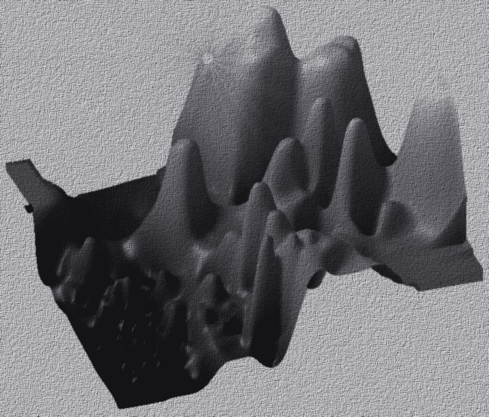
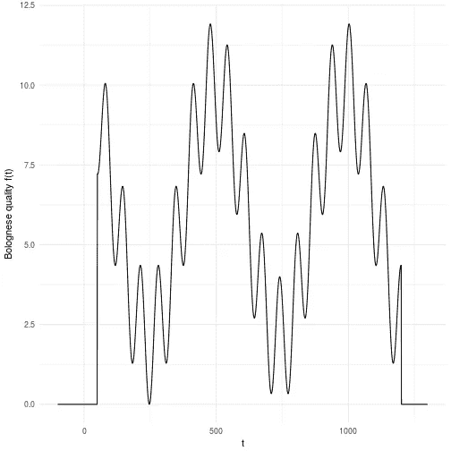
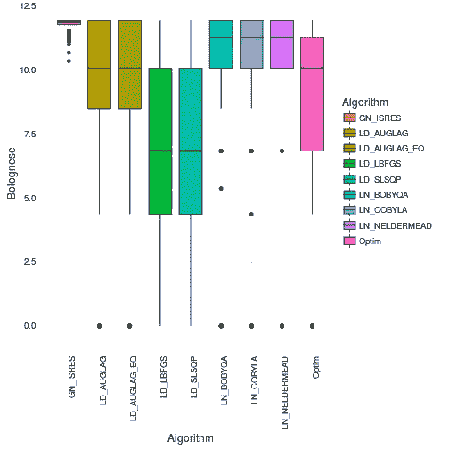
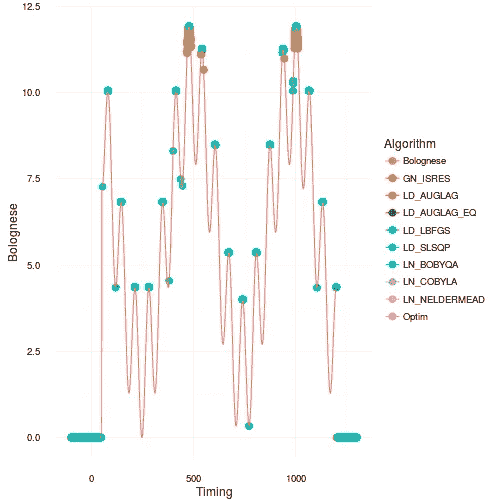
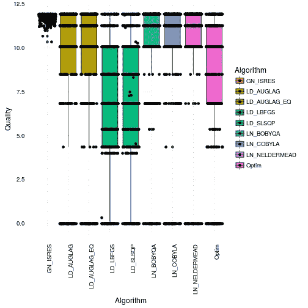
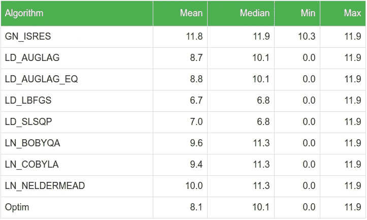

# 关于谨慎选择你的优化算法

> 原文：<https://towardsdatascience.com/about-choosing-your-optimization-algorithm-carefully-d5d3b721071d?source=collection_archive---------3----------------------->

为什么模拟很重要？首先，我们需要它，因为许多现象(我甚至可以说是所有有趣的现象)无法用一个封闭的数学表达式来封装，而这基本上是你可以用笔和纸或数学软件来完成的。听起来很抽象？好的，那么让我给你举个例子，为什么我们需要模拟。假设你的工作是做优化，你有一个变量，你要做的就是在这个变量的定义范围内找到一个点，这个点给你一个最佳解。比方说，我们想算出煮肉酱面的最佳时间，以获得完美的味道。现在肉酱面可以从 0 分钟煮到 1200 分钟，这是一个非常宽的范围。也就是说，我们有一种方法来评估肉酱面是否完美，给定它被烹饪的分钟数。我们姑且称这个神奇的评价函数 f( **t** )。现在关于 f 的恼人的事情是，我们只能在给定一个 **t** 的情况下评估它，我们不知道它一般是什么样子。因此，我们必须搜索 **t** 来寻找给出完美味道的值。

由于这个原因，我们必须搜索整个空间，即模拟功能，直到我们对它的样子有一个清晰的概念。这里展示的景观只是一维问题中的一个例子。现在想象你有 D 个维度，你把每个维度分成 M 个部分。你可以很快意识到，这个空间随着维度的数量呈指数增长，这是一个讨厌的等式。这基本上意味着，如果你把 10 个变量分成 10 份，你将有 10 个⁰=10 十亿个可能的解来搜索。你觉得 100 亿听起来可以吗？嗯，也许是吧。但是接下来让我用计算时间来代替。假设你有一个相当复杂的评估函数，每秒只能评估 1000 个点。这意味着你将不得不在电脑上花费((1010)/1000)/3600)/24𐅽116 天的模拟时间来搜索这个景观。更糟糕的是，您可能需要搜索的大多数变量或参数很少能分解成 10 个有效部分。更常见的情况是，参数和变量本质上是连续的，这在原则上意味着“部分”的数量是无限的。出于各种实际原因，这可能意味着每个维度都需要数百个部件，产生了((((10010)/1000)/3600)/24)/360𐅽3.2)十亿年的计算时间。这几乎和我们的星球一样古老，我们的星球现在已经有 45 亿岁了。我们不能等那么久！

幸运的是，今天大多数计算机可以同时计算超过 2000 亿次运算，这意味着即使我们天真的计算也可以归结为((()10010)/200000000000)/3600)/24)/360𐅽16 年。这反过来意味着，如果你能把分裂的数目减少到 40 个，那么你就能在((((4010)/200000000000)/3600))𐅽14.5 时间)内搜索整个景观。事实证明，科学让我们有能力以非暴力的方式搜索风景，这意味着我们不必评估我们将空间切割成的所有点。我们可以评估梯度，也可以将函数拟合到指导空间探索的数据中。这一切都可以归结为，事实上，我们可以使用先进的方法在一天内搜索数百个变量和参数。我们现在将研究其中的一些方法！

我们想通过调整烹饪时间来优化肉酱面的质量。正如我们在上面看到的，这不是一个很好的优化函数，这使得它在鲁棒性和避免局部最大值的能力方面非常适合硬核测试算法。

由于有许多优化方法和算法，我将尝试对最常见的和我喜欢使用的方法和算法进行基准测试。这不是一个详尽的列表，可能还有更多值得添加的，但这是我知道的列表。希望它能引导你选择前进。

我们将要研究的算法主要是在 *NLopt* 中实现的，除了模拟退火来自于 *R* 中的标准 *optim* 函数。无论哪种方式，算法列表都是:

*   模拟退火
*   改进的随机排序进化策略( [ISRES](http://www3.hi.is/~tpr/papers/RuYa05.pdf)
*   通过线性逼近进行约束优化( [COBYLA](http://www.jeannot.org/~js/code/index.en.html#COBYLA) )
*   通过二次逼近的界限优化( [BOBYQA](http://www.damtp.cam.ac.uk/user/na/NA_papers/NA2009_06.pdf)
*   低存储 Broyden–Fletcher–gold farb–Shanno 算法( [LBFGS](http://www.cs.nyu.edu/~overton/papers/pdffiles/bfgs_inexactLS.pdf) )
*   扩充拉格朗日算法( [AUGLAG](http://citeseerx.ist.psu.edu/viewdoc/summary?doi=10.1.1.72.6121) )
*   内尔德-米德单纯形法
*   序列二次规划( [SLSQP](http://www.neos-guide.org/content/sequential-quadratic-programming) )

由于一些算法(甚至大部分算法)可能严重依赖于初始值和起始点，因此我们对所有算法运行 500 优化，并采用随机起始点。每个算法在每次迭代中接收相同的起点。因此，每个算法开始在 500 个不同的位置进行优化。在我看来这是个公平的安排。

那我们来看结果。下面你会看到 500 次试验中每个算法找到的最佳肉酱面质量的方框和须状图。毫无疑问，一切都很好。然而，增广拉格朗日，模拟退火和 BFGS 是迄今为止最差的。他们也是最不一致的人。这基本上意味着它们对局部极大值非常敏感，无法正确探索整个景观。这并不奇怪，因为它们是基于梯度信息的。不管是不是二阶，它仍然是梯度信息，而且我的朋友本质上总是局部的。

不同算法的优化都去哪里了？让我们做一个散点图，一探究竟！实线是我们最初的博洛尼亚函数，我们希望根据参数时序 **t** 对其进行优化。

实际上看起来很糟糕。尤其是对于许多基于梯度的方法，因为它们陷入局部最大值或 0 梯度区域。他们中的大多数人只能在某些时候找到正确的解决方案。这与盒须图一致。然而，我要说的是，它实际上比情节中出现的更糟。只是为了说明你得到了多少糟糕的优化，看看下面的图，我们抖动了方块上的点。

那么，博洛尼亚优化的平均结果是什么呢？为了了解这一点，我们将使用稳健的统计数据来确保我们确实选择了经过优化的值。在这种情况下，稳健统计将是中值。现在我们来说明不同算法得出的平均烹饪时间。为了好玩，我们也将向您展示平均结果。只是为了你的教育乐趣。

Performance of the different optimization algorithms!

上面的表格非常清楚。从优化的角度来看，平均、中值、最坏和最好情况的结果都很清楚。这里唯一的潜在问题是时间。进化算法是出了名的慢。所以你可以自己尝试一下，看看是否会得到类似的结果。

推理快乐！

*最初发表于*[*doktormike . github . io*](http://doktormike.github.io/blog/Choosing-your-optimization-algorithm-carefully/)*。*