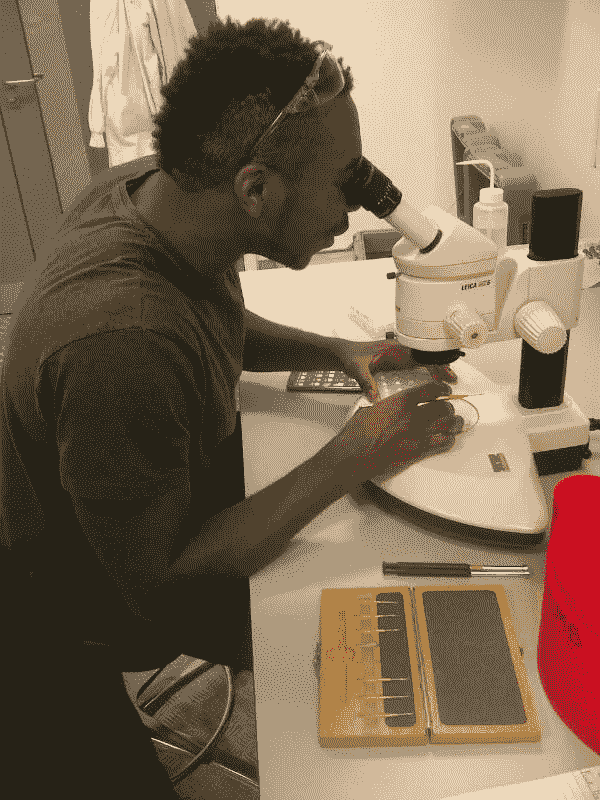

# 从学术界到数据科学

> 原文：<https://towardsdatascience.com/academia-to-data-science-91558063aa9e?source=collection_archive---------2----------------------->

我作为一名数据科学家已经工作了一年多，但在此之前，我在学术界担任博士后研究员。自从我转型以来，我的一些朋友问我关于我的工业数据科学之旅。他们中的许多人正在考虑离开学术界，数据科学是一个有吸引力的选择。虽然，我在数据科学领域的这一年有起有落，但我不后悔我的决定，我肯定会推荐它。然而，这种转变并不完全简单。这对于许多人来说是不同的，所以我写这篇文章，希望它能帮助那些仍然不知道如何实现这一飞跃的人。

我应该提到，我的经历是从一个具有学术研究背景的人的角度出发的，我经常使用数据科学技术方面通常使用的许多工具和技术。这意味着我不必真的从零开始，做许多过渡课程。然而，如果你觉得我的经历与你无关，你还是很幸运的。[玫瑰花蕾安乌里。](https://medium.com/u/a7875cc0d78e?source=post_page-----91558063aa9e--------------------------------)写了一篇关于她进入数据科学的[之旅的精彩文章。这是一个非常成功的故事，值得一读。](/my-journey-into-data-science-39e9bbbbf452)

# 我在学术界有什么问题？

当我在 2012 年开始攻读博士学位时，我并不确定自己以后想做什么，但我认为我最有可能留在学术界，成为一名教授(可能是应用数学或类似的专业)。学术界吸引人的一些因素，尤其是科学和数学，包括:

*   目标很明确。为了人类的利益，我们都想更多地了解我们周围的世界。这与工业相反，工业的目标是赚更多的钱。如果你在工业部门工作，你会被出卖的。
*   每个人都会在完美的协作中工作，我们希望其他人都好，因为我们有共同的目标。相比之下，创意在工业界是保密的，因为你需要自私才能赚钱。
*   完成工作不会有太大的压力，因为学术严谨是最重要的。因此，你总是知道你在做尽可能最佳的工作。

Me looking through a microscope for protein crystals that I grew. This photo was taken back in March 2015

哦，我是多么失望啊！以上都不是完全真实的。我觉得学术界的大多数问题都源于[发表或灭亡](https://www.ncbi.nlm.nih.gov/pmc/articles/PMC3999612/)文化，但那是另一篇博客文章的主题。

除了意识到我对上述的幻灭，还有其他原因让我想离开学术界。

*   我对我在生物学应用中使用的软件工具和算法越来越感兴趣，这是我所在领域的核心。
*   我希望有一天能有一个家庭，而学术界的短期合同的性质与家庭生活不相容。
*   我想在晚上和周末放松一下(在学术界，在正常工作时间之外工作是很常见的)。

我交谈过的许多早期学者都经历了我上面提到的同样的问题，所以我知道我不是唯一有这些观点的人。

我让学术界听起来很糟糕。事情没有我想象的那么糟糕，事实上[我的研究小组](http://www.bioch.ox.ac.uk/aspsite/index.asp?sectionid=garman)棒极了。我有很好的同事和很棒的导师，但问题是我不会在我整个学术生涯中都在这样一个令人惊叹的团队中。

# 我是怎么出来的？

在我博士期间，我在阅读卡尔曼滤波器时遇到了“机器学习”和“数据科学”这两个术语，因为我在做一些工作时需要用到它们。特别是数据科学，这是我第一次遇到一个似乎集中在我喜欢的学术领域的领域；复杂的算法和很酷的技术(数据科学还有很多[，但这是我当时关心的)。](https://www.rdisorder.eu/2017/09/13/most-difficult-thing-data-science-politics/)

随着时间的推移，我阅读了大量关于数据科学的书籍，并发现我已经使用了相当多的常用数据科学工具:我已经使用 Github 好几年了。我精通一些编程语言，包括 Python(我不使用 R，但我以前用过一次，如果我真的需要，我觉得我可以学习它)。我也有做回归、优化和贝叶斯推理等方法的经验。

尽管知道所有这些，我仍然觉得没有资格做数据科学。当你在网上读到数据科学和机器学习的时候，你会感到不知所措。似乎每天都有新的算法或技术需要你去了解，如果你不知道，那么你已经是这个领域的恐龙了。这不是真的，但它肯定会有这种感觉。

## 提升我的技能

我参加了一些在线课程来提高我的数据科学技能，但我觉得我学得不够快。幸运的是，我在 Twitter 上看到了 ASI 数据科学训练营。然而，申请截止日期不太合适，我觉得[科学到数据科学](http://www.s2ds.org/) (S2DS)训练营更适合我。

关于我在 S2DS 训练营的经历，我将把细节留到更全面的帖子中，但简而言之，我学到了一些非常重要的东西。其中最重要的一点是，我已经具备了成为一名初级数据科学家所需的技能。我不需要精通每一种新的复杂算法，也不需要成为最新高性能计算工具的专家。另一件重要的事情是，数据科学家是一个非常广泛且定义不清的工作角色，因此找到合适的工作需要大量的研究。

## 找到工作

在完成我的博士学位和学位后，我开始找工作。花了大约 3 个月的时间最终找到了一份工作，在此期间，我发现传统的求职方法(向我没有联系的公司发送简历)对我来说不太管用。我很幸运，组织 S2DS 训练营的公司 [Pivigo](https://www.pivigo.com/) ，也组织了[商业分析和数据科学会议](https://www.meetup.com/Business-Analytics-and-Data-Science/?_cookie-check=RAXn6myfYzXs9BGm)，并邀请我介绍我在训练营中所做的工作。我现在的雇主当时在观众席上，剩下的就是历史了。我还得到了另一位雇主的第二份工作邀请，那晚他也在观众席上。

# 那么我会给出什么建议呢？

我已经写了一篇博文，专门讲述了我在求职过程中所学到的东西，所以我不会在这里重点讲述获得数据科学工作的那个方面。相反，这里是我对准备阶段的建议，即当你考虑进入数据科学领域，但在正式申请之前，你应该做些什么。

*   **与数据科学家交谈。**了解他们做什么，并发现数据科学是否适合您。伸出手去。人们总是乐于谈论他们自己和他们的工作；)但最重要的是，它可能对你的职业决策有所帮助。有人在 LinkedIn 上突然联系我，希望进入数据科学领域。几个星期后，我们面对面共进午餐，我给他一些建议。现在，他在谷歌 deep mind 的资助下[攻读数据科学硕士学位。](https://www.linkedin.com/pulse/deepmind-sponsored-me-medical-student-study-msc-data-science-beckley/)
*   **多读书！** [玫瑰花蕾安乌里。](https://medium.com/u/a7875cc0d78e?source=post_page-----91558063aa9e--------------------------------)说的也是。你永远不会知道太多。你知道的越多，你的处境就越好。当申请的时候，你将能够做出更明智的决定来帮助你。
*   **开始学习使用工具。如果你不懂编程语言，那就去学一门。例如，我通过在 it 领域实现我的博士工作来强迫自己学习 Python(和其他语言)。如果你需要学习如何使用特定的工具，比如 Git/Github，云计算等等。然后想办法把它融入到你现在的工作中。或者如果你有时间的话，你可以做些兼职。网上有很多资源可以帮助你开始，如果你找不到人，就去问。例如，如果有人要求我写一篇关于某事的博客，我会非常高兴，因为我喜欢知道我的成果会对别人有用。**
*   **展示你的知识**为你的项目公开 [Github](https://github.com/) 库。在 [Medium](https://medium.com/u/504c7870fdb6?source=post_page-----91558063aa9e--------------------------------) 上写博客(我真的很爱 Medium)。它允许雇主或招聘人员搜索你。或者更好的是，雇主可以在考虑你的申请时搜索你，并查看你的工作来支持你的简历。当我们招聘的时候，我在浏览简历，我记得有一个候选人的个人博客的内容给我留下了深刻的印象。因此，他答应来和我们面谈。
*   开始建立你的人际网络。去数据科学[聚会](https://www.meetup.com/)和人们交谈。在 [LinkedIn](https://www.linkedin.com) 上联系人们。就像他们说的*重要的不是你知道什么，而是你认识谁*如果你和合适的人接触，你永远不知道会发生什么。

非常感谢您的阅读，我希望这是有用的。