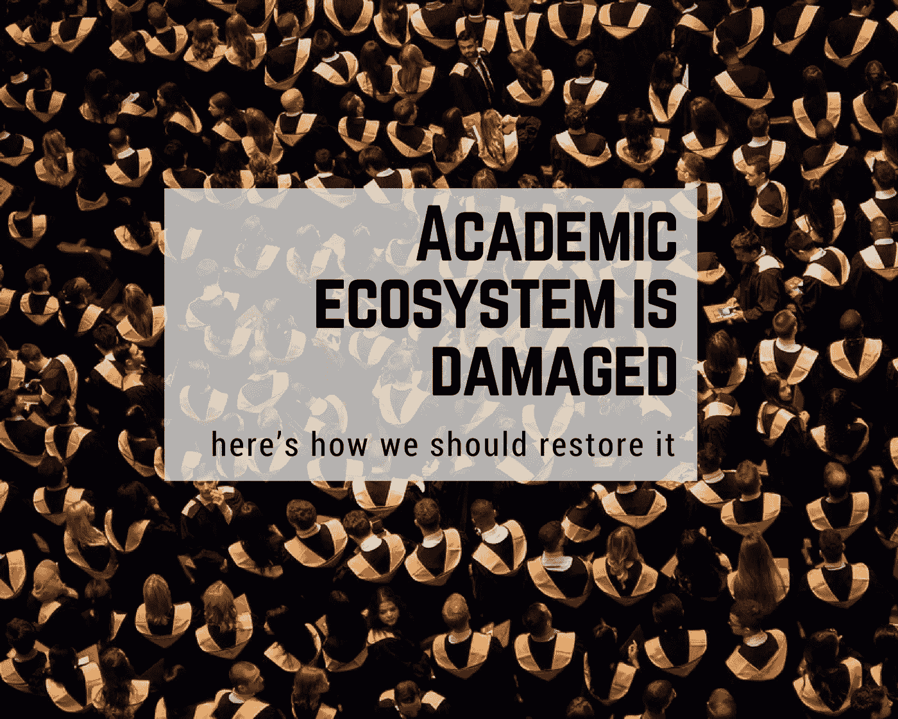
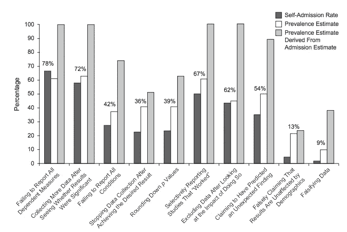
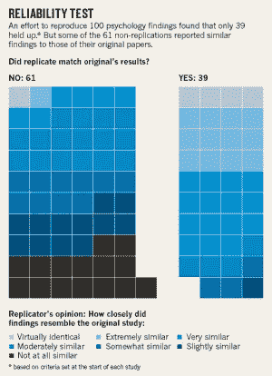
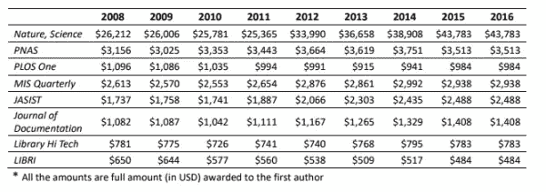
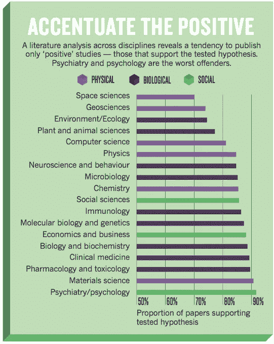

# 学术生态系统被破坏了，我们应该如何恢复它

> 原文：<https://towardsdatascience.com/academic-ecosystem-is-damaged-heres-how-we-should-restore-it-b038f81c367b?source=collection_archive---------3----------------------->

我在伦敦大学学院(University College London)攻读组织心理学硕士学位时，意识到学术界的生态系统遭到了破坏，而目前我们没有采取多少措施来恢复它。

这一切都是从我了解 p-hacking 和复制危机开始的。P-hacking 基本上意味着有选择地分析数据，只报告支持假设的结果。在一项对 2000 多名心理学家的调查中，哈佛商学院的莱斯利·约翰发现，超过 50%的心理学家在检验结果的重要性后才决定是否收集更多的数据，这样他们就可以等到假设得到证实。

调查还发现，大约 10%的研究心理学家参与了数据伪造，超过一半的人参与了欺诈行为，例如报告结果具有统计学意义，而实际上并不具有统计学意义，或者在查看了两种不同的数据分析技术的结果后，在两种技术之间做出决定，并选择更有利的技术。

John, L.K., Loewenstein, G. & Prelec, D. (2012). Measuring the Prevalence of Questionable Research Practices With Incentives for Truth Telling, Psychological Science, 23(5), 524–532.

虽然 p-hacking 本身并不是一种欺诈，但它会导致发布误导性的研究结果。如果心理学和其他社会科学的研究被定期复制，P-hacking 就不会是这样一个大问题。如果研究小组 A 在数据中发现了一个有趣的模式，而研究小组 B，按照完全相同的程序，没有发现，科学会在某种程度上自我修正。不幸的是，没有进行许多复制。

Open Science Collaboration. (2015). Estimating the reproducibility of psychological science. *Science*, *349*(6251)

[2015 年，Brian Nosek 和他的同事](https://www.nature.com/news/over-half-of-psychology-studies-fail-reproducibility-test-1.18248)在*科学*上发表了一项出色的研究，调查了 100 项发表在主要期刊上的认知和社会心理学研究。这些研究中只有 39 项被成功复制。虽然所谓的“复制危机”是心理学的热门话题，但遭受痛苦的不仅仅是心理学。2011 年，制药公司拜耳检查了 67 份药物发现出版物，报告称其中四分之三是错误的。

更糟糕的是，在科学不端行为的光谱中，还有科学欺诈。以荷兰蒂尔堡大学的 Diederik Stapel 教授为例，他伪造了至少 55 篇论文的数据，这些论文的主题包括人类的刻板印象或歧视倾向。

# **大海捞针**

从历史上看，大多数社会科学都是关于数据收集的。了解个人、群体、国家或地区行为所需的信息需要数年时间来收集。现在情况不再是这样了。据估计[到 2020 年，世界上每个人每秒将产生大约 1.7 兆字节的数据](https://www.forbes.com/sites/bernardmarr/2015/09/30/big-data-20-mind-boggling-facts-everyone-must-read/#8ebe4717b1e8)。如果今天我们偶尔无法利用一些现有的数据源，通常不是因为缺乏数据，而是因为隐私问题、缺少数据共享协议或计算能力不足。

有趣的是，在这个数据丰富的时代，大多数社会科学家继续一次收集一个实验参与者的实验数据。然而不幸的是，这些研究中的大多数都不能很好地概括。即使收集了数据，我们也不能确定它是否能告诉我们一些受过白人教育的大学生的行为，他们倾向于参与大多数实验，或者我们多样化的世界。

不久前，我读了一本关于约会的书，作者是[克里斯蒂安·鲁德尔，《数据专栏》](https://www.amazon.com/Dataclysm-Identity-What-Online-Offline-Selves/dp/0385347391)。书中的大部分观点来自美国最大的约会网站“OkCupid ”,反映了在该网站注册的人们的真实行为。有人可能会争辩说，这些发现仍然只适用于实际使用交友网站的人，但就洞察力而言，1000 万使用交友网站的美国人仍然比研究人员容易接触到的一小部分白人中产阶级大学生样本的研究要重要得多。

[以斯坦福大学的 Geoff Cohen 完成的一项典型实验研究为例](https://www.theatlantic.com/science/archive/2016/09/can-simple-tricks-mobilise-voters-and-help-students/499109/)。2003 年和 2006 年，他和他的团队与 158 名黑人七年级学生一起工作。他们中的一半被随机选择写一些对他们来说重要的事情，另一半写一些不重要的事情。这个练习只持续了 15 分钟，但那些写下自己价值观的人在学期结束时，他们的 GPA 增加了 0.3 分，缩小了他们和白人同龄人之间 40%的学术差距。根据作者的说法，这个简单的练习打破了许多黑人学生经历的恶性心理循环。有证据表明，黑人学生担心他们在学校表现不佳的负面刻板印象，这种担心造成了如此大的压力，以至于他们最终表现不佳。通过让孩子们写下他们的价值观，作者认为已经在心理上给他们注射了对抗这种刻板印象威胁的疫苗。

然而，158 名学生并不是一个大样本。因此，当加州大学欧文分校的保罗·汉塞尔曼试图用更大的样本重复两次研究结果时，他首先发现 GPA 仅增加 0.065 的影响要弱得多，然后发现写作练习根本没有影响。

# 破碎的激励

学术界的许多问题是系统性的，因为对在大学工作的人的激励被打破了。一些学术结构和过程，如专业协会和期刊出版可以追溯到 17 世纪，但它们对现代社会的适用性值得怀疑。我在伦敦大学学院读心理学的时候，多次听说出版物是科学的“货币”。

然而，在一些国家，出版物和现金之间的类比被发挥到了极致。为了了解中国的现金出版制度，来自武汉大学的[全伟和他的同事](https://www.technologyreview.com/s/608266/the-truth-about-chinas-cash-for-publication-policy/)调查了中国排名前 100 的大学提供的财政激励，并从数据中挖掘出有趣的趋势。他们发现，2016 年，在顶级科学期刊上发表一篇论文的平均报酬几乎是 44，000 美元，最高报酬是 165，000 美元。尽管从绝对值来看，这些数字相当可观，但需要注意的是，在研究期间，中国大学教授的平均工资仅为 8600 美元。

Quan, W., Chen, B., & Shu, F. (2017). Publish or impoverish: An investigation of the monetary reward system of science in China (1999–2016). *Aslib Journal of Information Management*

发表论文的动机在增加，但期刊对新奇、性感发现的渴望也在增加。因此，值得点击诱饵的发现偶尔会导致编辑忽略方法上的缺陷。此外，目前的制度不鼓励复制。根据定义，复制(或事实上未能复制)的研究并不新颖，因此通常会被拒绝(所谓的“文件抽屉”问题)。

[https://www.nature.com/news/replication-studies-bad-copy-1.10634](https://www.nature.com/news/replication-studies-bad-copy-1.10634)

臭名昭著的 Diederik Stapel 在至少 55 篇论文中伪造了数据，他认为公众没有意识到学术科学正在变成一门生意。在接受《纽约时报》采访时，Stapel 认为“科学当然是关于发现，关于挖掘发现真相。但这也是沟通、说服、营销。我是一名推销员。我在路上。人们带着他们的谈话在路上。用同样的话。这就像一个马戏团。”

更糟糕的是，学术界的竞争越来越激烈。博士的产生已经远远超过了对讲师的需求。[根据 Andrew Hacker 和 Claudia Dreifus](https://www.amazon.com/Higher-Education-Colleges-Wasting-Kids/dp/0805087346) 的说法，从 2005 年到 2009 年，仅美国就培养了超过 10 万名博士学位持有者，但同期只有 1.6 万个新教授职位出现。在这样一个竞争激烈的环境中，网络和游说在科学事业中扮演着至关重要的角色。然而，擅长玩弄体制的学者不一定能做出最高标准的研究。

# 弥合学术与实践之间的鸿沟

到我大学毕业的时候，这句话我一定听过至少一千遍了。很多学术做了很大的研究却不说从业者的语言。换句话说，他们无法解释他们进行的研究如何解决现实生活中的问题。另一方面，从业者通常无法获得学者拥有的许多工具和数据。因此，他们经常试图重新发明轮子，浪费资源。当然，某些杂志和博客会定期向非学术受众介绍和解释一些最新的研究，但这往往是个例外，而不是常规。

在我大学四年级的时候，我参加了一个公开讲座，主讲人是一位著名的学者，也是一位研究界和实践者之间更紧密合作的倡导者。我震惊地得知，科学发现平均需要九年时间才能付诸实践。虽然没有太多的科学应用到实践中，但实践世界中的大多数决策都没有任何证据支持。例如，根据奥巴马政府的彼得·奥斯泽格和布什政府的约翰·布里奇兰的说法，每 100 美元的政府支出中只有不到 1 美元有最基本的证据支持。

这并不是说学术研究的唯一目的是为决策者或其他从业者服务。然而，当从业者不听、不听或不理解学者们在说什么，而学者们继续进行由于样本量小、研究实践有问题或彻头彻尾的欺诈而难以概括的研究时，双输局面就不可避免了。

# 走向解决

今天，我们比以往任何时候都更需要科学和基于证据的政策。如果科学家逐渐选择接受点击诱饵和推销术的后现代意识形态，而不是致力于寻求真理、科学和道德完整性，我们就有大麻烦了。

在这个后真理政治的时代，必须确保每一份科学出版物的严谨性和质量，投资于科学教育和科学界与实践者之间更好的沟通，并重新设计有缺陷的激励矩阵，促进数量和新颖性而不是质量。大学也应该承认他们的机构责任。目前在大多数高等教育机构中根深蒂固的“出版或灭亡”的心态威胁着学术追求和知识探索的基础。在某种程度上，科学需要回到它辉煌的黎明，那时理解世界是如何工作的，并把它传达给其他人是它的主要的，也可能是唯一的目的。

我们还需要创造一种文化，促进复制和其他一些年来广泛讨论的良好做法。研究生应该得到奖励，因为他们以这种方式完成了复制，发展了他们的技能，同时也确保了发表的研究可以很好地复制。论文应该要求对研究、数据和任何其他相关材料进行登记，这对于决定学术论文的质量是很重要的。应该提供更好的方法和统计知识培训，作为各级大学教育的一部分。应该提倡跨学科研究。应该鼓励从业者和学术界建立有意义的伙伴关系，让学术界减少对政府资助的依赖，从实践中获取数据，而不是从难以概括的小样本中收集数据。

从错误中学习的意愿，谨慎的测试和对方法选择的质疑应该是科学的基础。不幸的是，今天许多学者被急功近利所驱使，经常试图跳过这些关键步骤。这种心态只会加强公众对科学的怀疑和某些犬儒主义，并破坏对共同现实的信念。在这样一个世界里，人们很自然地把自己关在回音室里，给他们觉得不愉快的科学发现贴上偏见、不可靠或纯属伪造的标签。讽刺的是，有时他们可能是对的。