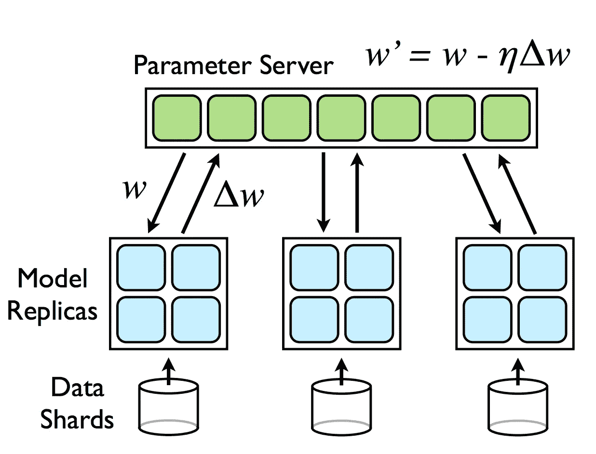
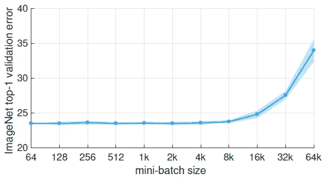

# 使用分布式 SGD 加速深度学习—概述

> 原文：<https://towardsdatascience.com/accelerating-deep-learning-using-distributed-sgd-an-overview-e66c4aee1a0c?source=collection_archive---------11----------------------->


训练神经网络既困难又耗时。通常，训练运行需要几天甚至几周时间才能收敛。这对参与人工智能技术研发的公司来说，阻碍了创新，耗费了大量资金。出于这个原因，最近许多脑力投入到提高神经网络训练速度，特别是使用平行化。

随机梯度下降(SGD)及其多个变体(如 RMSProp 或 Adam)是深度学习最流行的训练算法。由于它们的迭代性质，这些算法本质上是串行的。通常，唯一发生的并行化是卷积神经网络(CNN)中的像素并行化或小批量并行化。然而，小批量的大小也是网络准确性的关键参数，因此不能随意改变。此外，小批量的大小受到计算机内存(如果算法在 GPU 上运行，则为 GPU 内存)的强烈限制。由于这些原因，我们需要一个快速稳定的解决方案，在多个独立节点(计算机)上并行训练，以实现更高的加速比。能够做到这一点也将对开发成本产生巨大影响，因为大型商用集群(一堆普通 PC)通常比少数配备定制硬件(如 GPU 或 FPGAs)的高度专业化计算机便宜得多。此外，可扩展性将不再是一个问题，具有动态硬件扩展的按需培训将成为现实。

多年来，已经发明了针对该问题的多种解决方案。在这篇文章中，我将详细介绍一些最有前途的对普通 SGD 的修改，并尝试解释这些修改背后的基本原理。

## 锁定更新(同步 SGD)

跨多个 CPU 或节点并行化 SGD 的最简单解决方案是让每个节点读取当前参数值，使用一批数据计算梯度，锁定参数并更新它们。在伪代码中:

```
parallel for (batch of data):
   Acquire lock on current parameters
   Read current parameters
   Calculate the gradient w.r.t. the batch and update parameters
   Release lock
end
```

这种更新的问题是获取锁通常比计算梯度花费更长的时间。因此，同步成为一个主要的瓶颈，并行化是无效的。因此，必须设计替代方案。

## 疯狂奔跑:野猪！算法

Hogwild 算法([*)Recht，Benjamin，et al .〈hog wild:一种并行化随机梯度下降的无锁方法〉。神经信息处理系统进展。2011.*](http://papers.nips.cc/paper/4390-hogwild-a-lock-free-approach-to-parallelizing-stochastic-gradient-descent.pdf) )是并行化 SGD 的早期尝试之一。它是由威斯康星大学的研究人员在 2011 年发明的。Hogwild 的工作原理可以简单地解释为:它就像上面的代码，只是没有锁。在伪代码中:

```
parallel for (batch or sample of data):
   Read current parameters
   Calculate the gradient w.r.t. the batch and update parameters
end
```

虽然这可能不明显，但 Hogwild 的作者能够从数学上证明这是有意义的，至少在一些学习环境中是如此。算法的主要假设是参数更新是**稀疏的**。这意味着大多数更新只更新一组稀疏的参数。在这种情况下，Hogwild 能够实现与串行版本几乎相同的收敛速度。

## 倾盆大雨新加坡元



Downpour SGD architecture (credit: [paper](https://www.semanticscholar.org/paper/Large-Scale-Distributed-Deep-Networks-Dean-Corrado/0122e063ca5f0f9fb9d144d44d41421503252010))

倾盆大雨 SGD ( [*迪安，杰弗里，等《大规模分布式深度网络》神经信息处理系统进展。2012.*](https://static.googleusercontent.com/media/research.google.com/en//archive/large_deep_networks_nips2012.pdf) )是由谷歌的研究人员发明的，作为他们的 **DistBelief** 框架(TensorFlow 的前身)的一部分，其变体仍在今天的分布式 TensorFlow 框架中使用。它利用多个模型副本，每个副本基于一小部分数据计算更新(**数据并行性**)。计算之后，更新被发送到中央参数服务器。参数服务器本身被分成多个节点，每个节点保存和更新参数的一个小的子集(**模型并行性**)。到目前为止，这种并行化方案非常流行，尤其是因为它是 TensorFlow 中的内置特性。然而，该方案的收敛性受到以下事实的影响**模型复制品彼此不共享参数(权重)或更新**。这意味着它们的参数总是可以不同。


Speedups of Downpour SGD for different models (credit: [paper](https://www.semanticscholar.org/paper/Large-Scale-Distributed-Deep-Networks-Dean-Corrado/0122e063ca5f0f9fb9d144d44d41421503252010))

# 使用大型迷你批处理的分布式深度学习

分布式深度学习中的一个普遍问题是需要在计算网格的节点之间传输数据(梯度，参数更新)。这增加了开销，进而降低了整个计算的速度，即使使用高速网络通信也是如此。如果使用同步 SGD 等算法，即使速度极快的 100Gbit 以太网或 InfiniBand 连接也会成为瓶颈。

具体来说，在数据并行学习中，迷你批处理被拆分到多个节点上。每个计算节点(GPU 或机器)计算一个小批次的梯度。然后必须对这些梯度求和，并且必须计算新的权重并在节点间传播。这个过程可能非常慢，因为梯度的数量通常等于参数的数量。深度神经网络通常包含 32 位精度的数百万个参数，需要在每个更新步骤中进行交换。

本质上，有两种方法可以减少训练的通信开销: **(i)增加小批量大小(从而减少更新频率)和(ii)减少每次更新在计算节点之间交换的数据量**。在这一节中，我们将重点关注(I ),在下一节中，我们将研究(ii)。

在最近的一篇论文中([*)Goyal，Priya 等人“精确，大型迷你批处理 SGD:在 1 小时内训练 imagenet”arXiv 预印本 arXiv:1706.02677 (2017)。*](https://arxiv.org/pdf/1706.02677.pdf) )由来自 FAIR(脸书人工智能研究院)的研究人员，作者使用**超大型迷你批次，仅用 1 小时**训练 ImageNet。使用大型微型电池可以防止节点之间频繁的内存传输(交换梯度)。直观上，这种方法使学习快速而准确(达到一定的小批量)，但正如我们将看到的，它也在训练阶段早期引入了一些必须处理的收敛问题。

让我们首先检查梯度下降的两种边缘情况:随机梯度下降和批量梯度下降。SGD 对提供给网络的每个学习样本执行权重更新，而不是对整个训练数据集执行权重更新，从而使得学习过程有噪声，并允许梯度下降避开学习函数的可能的浅最小值。SGD 遵循更新公式:


在每个更新步骤中随机选择 *i* (来自数据集的样本)。

SGD 的随机性质类似于模拟退火(SA)和其他随机优化算法，如遗传算法(GA)。


Batch gradient descent vs. SGD (credit: wikidocs.net)

光谱的另一端是**批量梯度下降** (BGD)算法。BGD 对所有训练样本的误差求和，并且每个时期执行一次权重更新。BGD 的公式与 SGD 的公式几乎相同，不同之处在于，现在我们在执行梯度更新之前对所有样本的损失进行求和:


从数学角度来看， *i* (训练数据集)上的和使得学习过程非常稳定，但也非常严格，经常收敛于局部最小值。对于较大的训练数据集，批处理梯度下降比 SGD 表现更差，通常会导致过拟合。

如今最常用的梯度下降版本(也是每个主要深度学习框架中实现的版本)似乎是 **minibatch SGD** (mSGD)，这是 BGD 的稳定性和 SGD 的噪声之间的折衷。在 mSGD 中，**的重量更新在每个迷你批次**执行一次。迷你批次大小是另一个需要优化的超参数。迷你批次越大，需要的更新越少，因此学习速度更快。这尤其适用于数据分布式并行学习，其中需要在节点之间交换的每个梯度都增加了计算时间。另一方面，由于工艺的低随机性，使小批量过大通常会导致性能变差和过度拟合。

公平文件在很大程度上依赖于这样一个事实，即**性能随微型批次大小的恶化是高度非线性的**，对于大范围的微型批次大小保持不变(ResNet-50 高达 8192)，然后对于更大的微型批次迅速恶化。因此，研究人员首先表明，我们可以通过选择大的迷你批次大小来显著加快学习速度，同时保持类似的准确性。此外，研究表明，我们可以合理使用的最大 minibatch 大小不依赖于训练数据集的大小，至少在许多计算机视觉任务中是如此 **:**



ImageNet top-1 validation error vs. mini-batch size used for training (credit: FAIR)

然而，在论文中，研究人员清楚地表明，为了使用非常大的小批量来训练神经网络，我们必须根据小批量的大小来微调学习速率。事实证明，我们可以经常使用这个简单的经验法则:

> *当小批量乘以 k 时，将学习率乘以 k。*

文中还讨论了动量等超参数。不受影响，因为它们的最佳值似乎在很大程度上与微型批次的大小无关。

即使选择了合适的学习率，**训练也可能在训练**的初始阶段出现分歧。这是因为在这个阶段，权重可能会快速变化，训练误差很容易出现峰值。为了解决这个问题，本文建议使用一种**渐进预热策略**。这种策略最初只使用一个节点，直到训练稳定下来，可以使用更多的节点。此外，学习速率可以从非常小的数η逐渐上升到η’= kη，其中 k 与小批量大小成比例，如线性缩放规则所规定的。

该论文还提出，通过考虑单个迷你批次的变化统计，批次标准化是加速训练的有效工具。因此，批次标准化统计不应在整个批次上计算，而应仅在单个工人上计算。同样，这减少了通信开销。

## 1 位随机梯度下降

微软认知工具包(CNTK)实现了 SGD 的另一种变体:1 位 SGD([*)Seide，Frank 等人，“1 位随机梯度下降及其对语音 dnns 的数据并行分布式训练的应用。”国际言语交流协会第十五届年会。2014.*](https://www.isca-speech.org/archive/interspeech_2014/i14_1058.html) )。

在论文中，作者建议**将每个梯度的数据交换量减少到一位**。因此，交换的关于梯度的唯一信息是它是上升还是下降。自然，这种极其粗糙的量化对训练的收敛有深远的影响，并且不能单独使用。然而，这也是本文的重点，如果量化误差被添加到下一个小批次的梯度中，**不会显著影响计算:**


在此， *Q* 描述量化， *G* 梯度更新， *G_quant* 是量化梯度， *N* 是小批大小，δ是量化误差。这种形式的量化梯度更新构成了作者所谓的**延迟更新:**它确保即使我们交换截断的信息，我们也能跟踪我们由此引起的错误，并能在后续更新中纠正它。这样，最终可以恢复完全的准确性(在多次更新之后)。

实验数据表明，该技术对于全连接网络(例如用于语音处理的网络)工作得非常好，并且以仅少量损失准确度为代价提供了相当大的加速。你可以查一下报纸上的具体数字。然而，可以实现的加速和准确性似乎也严重依赖于特定的网络架构。此外，使用 SGD 的修改会对结果产生不同的影响。例如，在量化后应用 **AdaGrad 提高了精度**，而在量化前应用 AdaGrad 会使精度变差。

关于 **1 位 SGD** 的好处是它很容易在 **CNTK 框架**中使用。你可以在这里下载带 1 位 SGD [的 CNTK。它可以在 Windows 和 Linux 以及 mac OS 上运行(使用 Docker)。](https://github.com/Microsoft/CNTK/releases)

## 走哪条路？

此时要提出的问题是:如果有多个计算节点可用，应该使用哪种算法来加速神经网络训练？答案是，这在很大程度上取决于您正在使用的网络架构。通常，在该研究领域发表的论文仅使用一个或几个特定的、尽管非常广泛使用的神经网络来评估结果(例如，在 FAIR 论文中，它是 ResNet-50，包括其作为 R-CNN 的修改)。使用其他神经网络体系结构(如递归网络体系结构(RNNs ))时，该方法是否同样有效，这一点并不明显。此外，并非所有上述算法都适用于所有情况。例如，只有当节点间的通信时间远远超过每个节点的计算时间时，1 位 SGD 才能提供有效的加速。这又取决于网络中参数的数量(例如，ResNet 通常比 VGG 具有更少的参数)。

作为一般规则，必须接受的是，这些解决方案中的大部分(除了同步 SGD)修改训练过程以实现并行性，并接受作为结果的小的准确性冲击。如果这个打击不是太极端，加速带来的好处通常会超过它。最终，你将不得不决定为了速度的提高而牺牲准确性是否值得。一种折衷的可能性是在开发阶段使用高度并行，在最终训练阶段在单个节点上训练算法。