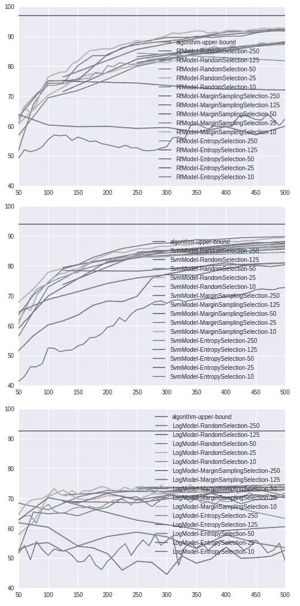

# 主动学习教程

> 原文：<https://towardsdatascience.com/active-learning-tutorial-57c3398e34d?source=collection_archive---------0----------------------->

如今，我们接触到大量未标记的数据，这些数据要么来自互联网，要么来自其他来源，如学术界或商界。由于未标记的数据相对容易获得且标记昂贵，公司通常雇佣一名专家或几名员工来标记数据[1]。考虑以下情况，一家数据驱动的医疗公司有大量 MRI 扫描，他们需要雇用一名专家来帮助他们解释这些扫描。公司资源有限，他们无法解释或标记所有数据；这就是他们决定使用主动学习(AL)的原因。人工智能的承诺是，通过迭代增加我们精心选择的标记数据的大小，有可能实现与使用完全监督的数据集相似(或更好[2])的性能，而成本或时间只是标记所有数据所需的一小部分。就标记数据量而言，AL 被认为是一种半监督方法，介于无监督和完全监督之间，即，对于无监督数据，我们使用 0%标记样本，而对于完全监督，我们使用 100%标记样本。因此，使用多少数据或者模型需要多少性能的决策依赖于资源管理决策，换句话说，它可以是业务决策。

Shanghai early morning pollution — ori cohen 2017

AL 有三种场景:
1。成员查询合成，即将生成的样本发送给 oracle 进行标记。
2。基于流的选择性采样，即每个样本都被单独考虑——在我们的例子中是标签查询或拒绝。类似于在线学习，数据不被保存，没有关于数据分布的假设，因此它可以适应变化。
3。基于池的采样，即从未标记的数据池中选择样本用于标记[3]。
在本教程中，我们使用第三种场景。

下面的伪算法表示学习过程，如代码中所写的，用于基于池的采样:
1 .将数据分成一个“池”和一个测试集
2。从初始训练集的池中选择“k”个样本并标记它们，剩余的数据将成为验证集
3。将所有集合
4 标准化。使用具有平衡权重的训练集训练模型。
5。使用经过训练的模型和验证集，获得每个样本的概率。
6。将训练好的模型与测试集一起使用，获得性能度量。
7。根据每个样本的概率，选择“k”个最具信息性的样本，即模型对其标签最不确定的样本。
8。将这些“k”个样本从验证集移动到训练集，并查询它们的标签。
9。所有数据集的逆归一化
10。根据停止标准停止，否则转到 3。

往前走之前有几点需要注意:
1。所选算法的全监督性能通常是上限，因此建议尝试几种算法。
2。在我们从验证集中移除样本后，所有集合的归一化必须被反转并再次归一化，因为我们的样本分布在新的验证和新的训练集中均发生了变化。
3。样本选择函数依赖于来自训练模型的测试样本概率，因此我们只能使用提供样本概率的算法。
4。“k”是一个超参数

我们在 AL 方法中最重要的工具是样本选择功能，这是我们影响学习过程的唯一点，使用正确的方法至关重要。这个领域是一个热门的研究课题，有许多研究提出竞争选择函数。
在本教程中，我提出了四个已知的选择函数。随机选择—我们从验证集中选择“k”个随机样本。
2。熵选择—我们选择具有最高熵的“k”个样本。
3。边际选择—我们选择两个最高类别概率之间差异最小的“k”个样本，即模型对单个类别非常确定的样本的数值较高，而类别概率非常相似的样本的数值较低。

这里[提供的代码](https://github.com/orico/ActiveLearningFrameworkTutorial)在选择各种学习算法和选择函数方面利用了模块化架构，并且可以用作其他模型-函数比较的基础。

我们比较了几种学习算法，如线性核支持向量机(SVM)、随机森林(RF)和逻辑回归(LOG)。每个算法都使用所有的“k”=[10，25，50，125，250]的选择函数来执行，总共累积了 80 次实验。由于某些算法和选择函数的随机性质，建议在代码中重复运行实验，以便计算出具有统计意义的结果。然而，运行时间很长，我选择对(模型、函数、k)的每个组合只运行一次实验。

下面是对代码及其类架构的解释。

我们首先下载我们的数据，并根据 MNIST 已知的 60K/10K 分割定义，将其分割为训练和测试。稍后，该列车组将被拆分以进行训练和验证。

我们创建了一个模块化的类表示，“BaseModel”是类架构的一个基础模型，你可以实现新的模型，并且可以互换使用它们，或者与所有其他模型一起使用。我们当前的实现包括 SVM、逻辑回归、随机森林和梯度推进。

我们的“TrainModel”类接受先前定义的学习算法之一，使用训练集进行训练，并从测试集中获取性能测量。

我们创建一个模块化的选择函数类表示，“BaseSelectionFunction”是各种样本选择方法的基类。使用这种架构，您可以实现新的选择方法，并使用它们来补充或代替以前的方法，以达到实验的目的。我们当前的实现包括随机选择、熵选择、边际抽样选择和最小标准差选择。

我们有一个类，用于使用[0，1]范围内的最小最大值缩放器进行归一化。

最初，我们希望从未标记的数据池中随机抽样，这是使用 random.choice 完成的，没有替换。

这是根据引言中描述的算法启动主动学习过程的主类。简而言之，我们选择“k”个随机样本，训练模型，选择信息最丰富的样本，从验证集中移除，查询它们的标签，并使用这些样本重新训练，直到达到停止标准。

在脚本的主要部分，我们下载数据，分为训练验证和测试，我们通过迭代所有的训练算法 X 所有的选择函数 X 范围[10，25，50，125，250]内所有可能的 k 来运行实验。准确性结果保存在字典中，并在模型完成训练后立即保存到一个独特的文件中，这在使用 Google Colaboratory 时至关重要，因为它往往会不时断开连接。我们还将我们的培训限制在最多 500 个查询样本。

独立地，我们使用 60K-10K 的训练测试分割训练了几个模型，结果表明 RF、SVM 和 LOG 的上限是 97。, 94.和 92.47。

下图显示随机森林分类器与边缘选择方法配对，k=10 是最佳配置。

对于前面提到的停止条件和超参数，性能最好的模型是随机森林算法！

A comparison of accuracy between a fully supervised & active-learning approaches, comparing random-forest, SVM and logistic regression, using all sampling methods and K=[10,25,50,125,250]. The y-axis represents the accuracy and the x-axis the amount of samples in each iteration.

我们进一步看到，最佳采样函数是边缘采样！

A comparison of accuracy between a fully supervised & active-learning approaches, using a random-forest classifier, all sampling methods and K=[10,25,50,125,250]. The y-axis represents the accuracy and the x-axis the amount of samples in each iteration.

最后，k=10 是最佳选择参数。

A comparison of accuracy between a fully supervised & active-learning approaches, using a random-forest classifier, Margin-Sampling and K=[10,25,50,125,250]. The y-axis represents the accuracy and the x-axis the amount of samples in each iteration.

我们已经看到，通过使用主动学习方法，我们可以使用一小部分标记数据，与完全监督的方法相比，可以获得非常接近的准确性。事实上，如果您选择使用 1000 个样本，准确率甚至会攀升到约 95%。此外，非常有趣的是，作为一种样本选择方法，边际抽样试探法优于熵。最后，我希望这篇教程对你有所启发，你可以考虑在你的下一次学习中使用这种方法。

我要感谢 Moshe Hadad 对 PEP8 的宝贵评论和 Shay Zweig 的校对和评论。

Ori Cohen 在机器学习、脑机接口和神经生物学领域获得了计算机科学博士学位。

参考资料:

[1] Shay Yehezkel，*高维统计过程控制与应用*，理学硕士论文。

[2] Ilhan、Hamza Osman 和 Mehmet Fatih Amasyali。 [*主动学习作为提高准确率的一种方式*](http://www.ijcte.org/papers/910-AC0013.pdf) 。”国际计算机理论与工程杂志 6，第 6 期(2014): 460。

[3] Stefan Hosein [*主动学习:好奇 AI 算法*](https://www.datacamp.com/community/tutorials/active-learning)