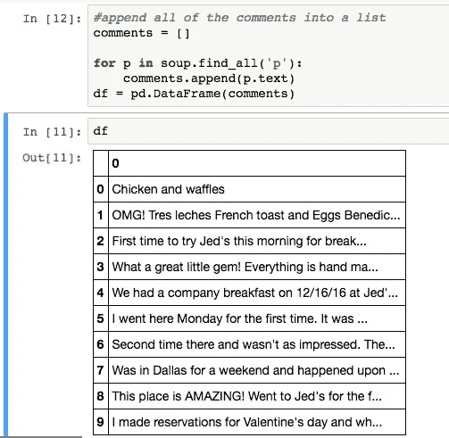

# 坚定不移。

> 原文：<https://towardsdatascience.com/adamant-3d87e8d98b83?source=collection_archive---------6----------------------->

又见面了。我的互联网昨天莫名其妙地出了问题，我没有机会写一点我的一个启示！在过去的几天里，我一直在为这个项目收集数据，我发现了一种使用预测分析的新方法。这对我来说不一定是新的，但有时当你开始做一个项目时，你可以如此坚定地坚持一种方式，以至于你忘记了一个项目有许多角度需要解决。

以上是一个片段 CSV 文件，我创建了包括每个场馆的功能。目前，我们正在试验每项功能，以及它们预测客户偏好的能力。回到启示，在过去的几天里，我一直在从每个场馆的网站和每个不同的社交媒体页面提取信息(客户评论、评级和评论)。一些特征是你的典型特征——场地类型、氛围、菜单风格、位置等等——但后来我决定找点乐子。

# **神奇宝贝**

我的第一个“为了好玩”的测试是在附近的 Pok 和 *mon stops* 和顾客去那个地方的可能性之间的相关性。它可能有也可能没有任何显著的相关性或商业价值，但是，如果这个特性吸引客户的可能性微乎其微，我会测试一下。我知道我又要遵循统计学的黄金法则"*相关性并不意味着因果关系，"*然而，这是一个有趣的项目，如果它带回了任何有价值的东西，我会与你们所有人分享(我想我刚刚打破了另一条黄金法则…得克萨斯州的规则是说 ya 'll 而不是 you all…whatev)。

# **相似性测试**

好了，回到正题。因此，对于我给定的集合，我将执行余弦相似性/相似性分析测试(类似于亚马逊和网飞向我们推荐类似产品的做法)。然而，在我开始之前，我必须扩展我的数据集，包括那些还没有被访问过的场馆，以便创建一个排名系统，并查看哪些企业在与已经签约的场馆的相似性方面排名最佳。

# **机器学习**

我最初的方法是使用离散变量对不同的场馆进行分类——签约的和未签约的——然后检查这是否是一个很好的预测器/指示器，如果一个场馆是否会与**in choices 做生意。**

学校的领导团队有一个理论，强大的社交媒体存在等同于理想的工作场所；给出这些信息后，我还会运行一个逻辑回归(LogReg)来测试这个假设的有效性。我已经将我的数据集按照已经签约的和潜在的地点(我的训练和测试数据集)进行了划分。从那里开始，我将在训练集上使用我与社交媒体相关的功能，并计算酒吧是否会签名。

# 网页抓取

网络抓取将允许我提取评论并建立一个文本分析器，以真正了解客户体验并区分每个场馆的优势。我使用图书馆 **BeautifulSoup** ，一个去图书馆，从不同的网站提取内容。下面是第一步，在我进入实质部分之前。马上我就能看到大多数的评论都与早餐的选择有关。下一步是进一步分析其余的评论，并根据这些信息做出明智而恰当的决定。

# **结论**

我知道我没有对我的方法做太多的详细说明，主要是因为我将为每种不同的方法写个人博客，并进一步详细说明。目前，这是总体计划。在一个小的创业公司工作很辛苦，但是非常有益。它挑战了我，让我用我所有的知识从不同的角度来处理每一项任务。我掌握的信息越多，领导团队对他们的业务就越有信心。我将在接下来的几天内回来，并带来项目的最新进展。