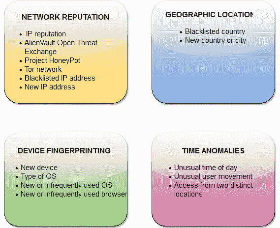
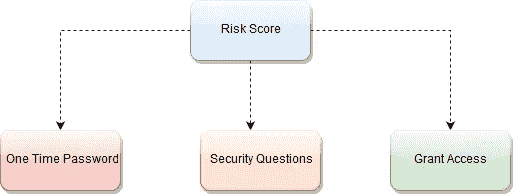

# 自适应认证和机器学习

> 原文：<https://towardsdatascience.com/adaptive-authentication-and-machine-learning-1b460ae53d84?source=collection_archive---------2----------------------->

“我们打个比方:你家的前门有一个把手，很容易转动就能进出。它有一把安全锁，”Nuro Secure Messaging 的联合创始人 Omri Sigelman 说。"你加的锁越多，开门就越费力."

如今，随着技术时代的发展，在保持高安全性标准的同时确保用户工作效率的双重挑战已经成为一个相当关键的挑战。尽管对安全性的关注并不一定会损害可用性，但人们仍在努力实现这样的动机。

自适应身份验证的概念在传统的身份验证控制框架中充满了复杂性，并消除了用户工作效率的障碍。在认证控制过程中加入额外的风险因素(如位置、网络类型或操作系统)的效率低下，使得传统框架越来越过时。

简单地说，自适应身份认证是一种可以配置和部署双因素身份认证或多因素身份认证的方式。这是一种根据用户的风险状况和倾向选择正确的身份认证因素的方法，用于根据具体情况调整身份认证类型。

Adaptive Authentication 的功能非常强大，可以识别相关的风险级别，并在现实场景中提供适当的身份验证级别。与可能对可用性、安全性、效率和合规性造成负面影响的“一刀切”等标准不同，Adaptive Authentication 在另一方面避免了低风险活动变得过于费力或高风险活动变得过于容易。

简而言之，这种非静态身份验证方法采用请求访问系统的代理的概况来确定与该交易相关的风险概况。之后，风险状况将用于确定挑战的复杂性。如前所述，这种方法适用于为高风险档案提供经受更强挑战的可行性的情况，而静态用户名/密码对于低风险档案可能就足够了。

当谈到在工业环境中实现自适应认证时，很明显，已经采用了不同的方法来实现自适应认证过程的不同变体。然而，考虑到手头问题的性质，基于机器学习的模型可以被识别为实现的有效机制。

OneLogin 已经采用这种实现方法来迎合他们“可用性驱动安全性”的动机。他们的自适应身份验证使用机器学习来确定是否提示用户进行多因素身份验证。为了使流程更加突出，它使用广泛的输入来计算风险分值，并为给定情况确定最合适的安全措施。以下是 OneLogin 在其基于机器学习的自适应身份验证模型中使用的输入类型的概述。

在 OneLogin 的 Adaptive Authentication 模型中，将根据将获得的风险分值执行以下操作。

很明显，通过这种基于机器学习的自适应身份认证模型，OneLogin 为其客户提供了无缝、安全的用户体验，可以跟上当今不断发展的安全风险。

在传统的环境中，很明显，当涉及到安全研究和安全系统开发时，人的因素和可用性问题被经验性地忽略了。在安全性和可用性之间总是有一个重要的权衡。然而，这种争论在商业系统中不会持续太久，因为在现代，一切都同等重要。这就是为什么像 Adaptive Authentication 这样的方法需要进入身份和访问管理领域的原因。

参考

1.  [https://www . onelog in . com/product/multi-factor-authentic ation](https://www.onelogin.com/product/multi-factor-authentication)

2.[https://news . hitb . org/content/RSA-更新-自适应-认证-解决方案-高级-威胁](https://news.hitb.org/content/rsa-updates-adaptive-authentication-solution-advanced-threats)

[3。https://www . onelog in . com/blog/what-is-adaptive-authentic ation](https://www.onelogin.com/blog/what-is-adaptive-authentication)