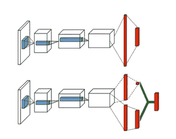
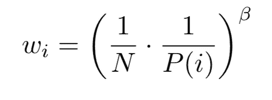
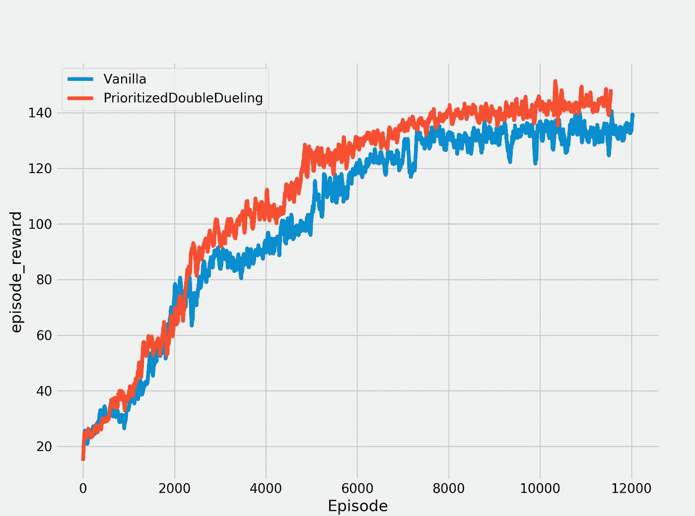
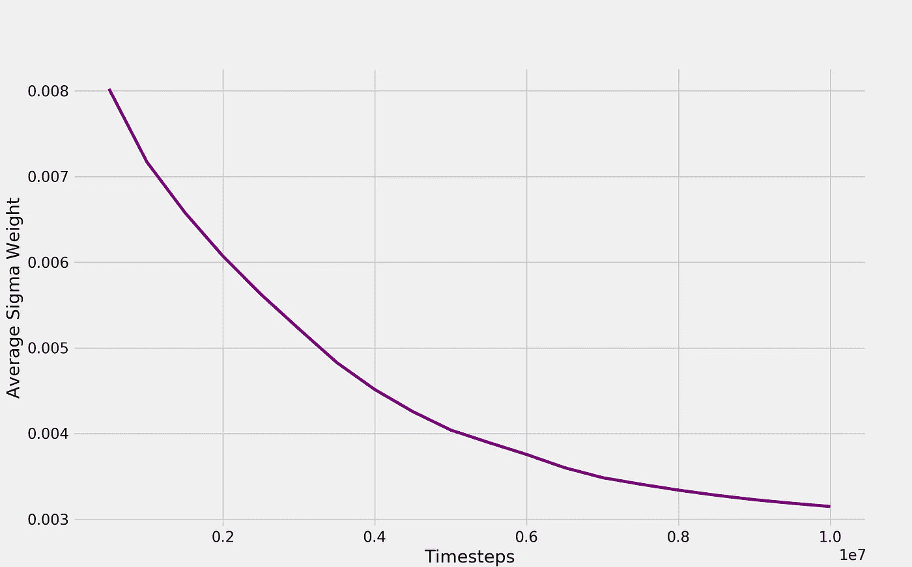
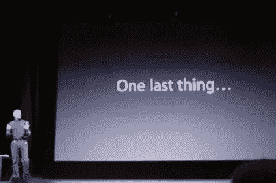
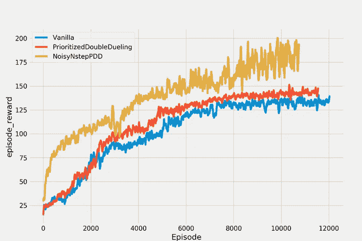
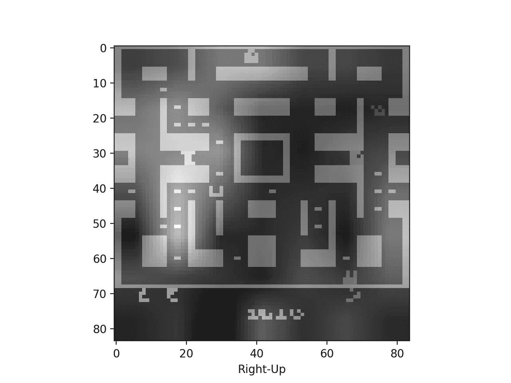
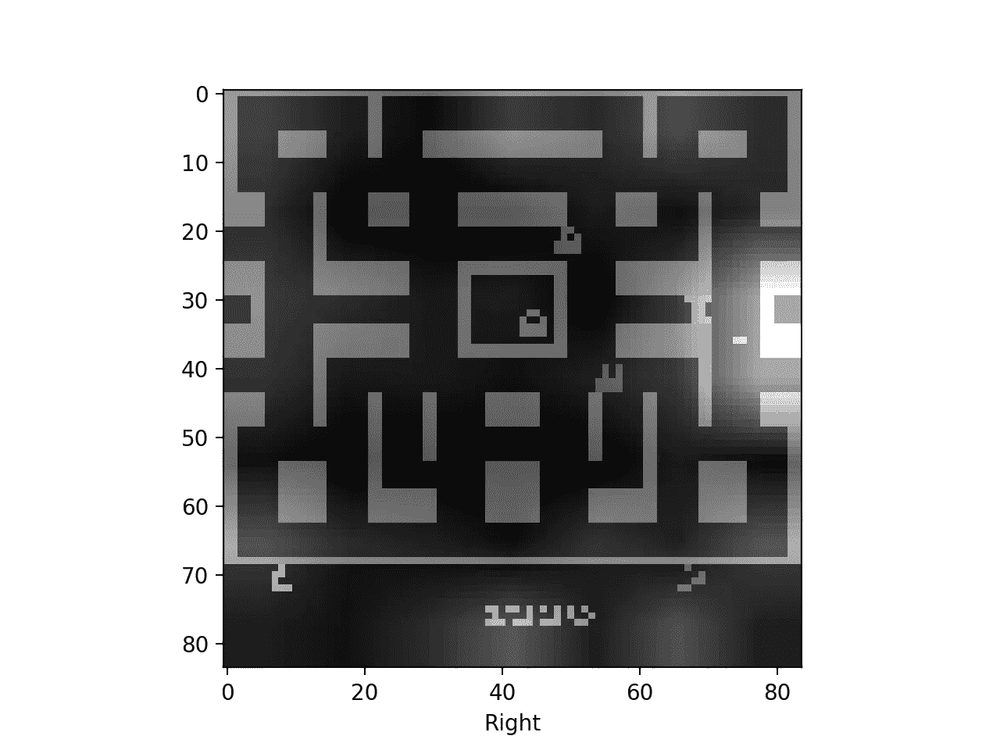
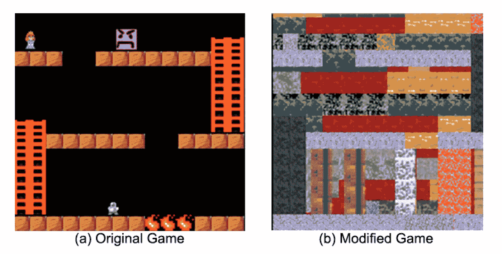

# 高级 DQNs:用深度强化学习玩吃豆人

> 原文：<https://towardsdatascience.com/advanced-dqns-playing-pac-man-with-deep-reinforcement-learning-3ffbd99e0814?source=collection_archive---------3----------------------->

art by [Yojama](https://www.deviantart.com/art/Pacman-Ghost-537722694)

2013 年，DeepMind [发布了第一个版本的 Deep Q-Network (DQN)，这是一个能够在许多经典的 Atari 2600 游戏上表现出人类水平的计算机程序。就像人类一样，算法根据它对屏幕的视觉进行游戏。从零开始，它发现了让它满足(在许多情况下，超过)人类基准的游戏策略。在此后的几年里，研究人员做出了许多改进，超级充电性能和解决游戏的速度比以往任何时候都快。我们一直致力于在 Keras(开源、高度可访问的机器学习框架)中实现这些进步，在这篇文章中，我们将详细介绍它们如何工作以及如何使用它们来掌握 Pac-man 女士。](https://www.cs.toronto.edu/~vmnih/docs/dqn.pdf)

## **强化学习简介**

DQN，以及类似的算法如 AlphaGo 和 TRPO，都属于机器学习的子集*强化学习* (RL)的范畴。在强化学习中，一个主体存在于一个环境中，并寻求某种回报的最大化。它采取行动，改变环境，并给予环境与改变相关的回报。然后，它查看自己的新状态，并决定下一个动作，无休止地重复这个过程，或者直到环境终止。这个决策循环更正式地称为*马尔可夫决策过程* (MDP)。

很容易看出像《吃豆人》这样的雅达利游戏是如何融入 MDP 框架的。玩家看着游戏屏幕，从不同的按钮和操纵杆位置中进行选择，以增加他们的分数。但这种简单性可能隐藏了一项艰巨的任务，任何玩过视频游戏的人可能都认为这是理所当然的，这是一个根据几乎无限的像素组合之一做出即时决定的过程，这些像素组合可以在任何给定的时间显示在屏幕上，而且是你以前不太可能遇到的。如果这还不够困难的话，视频游戏在技术上是*部分可观察的* MDPs，在这个意义上，你被迫基于游戏的间接表示(屏幕)而不是代码/内存本身做出选择，隐藏了一些你需要做出完全知情决定的信息。幸运的是，像吃豆人这样的视频游戏确实提供了两个有用的简化:帧速率和控制器。有限数量的按钮和操纵杆位置让我们可以将观察空间映射到离散和可管理的行动空间，当你意识到它不需要连续完成时，这种心理功能会进一步简化，因为你只能在每一帧按下一个按钮(大多数 RL 代理会更进一步，每 3 或 4 帧才做出新的决定)。接下来的挑战是困难但可定义的:我们如何利用我们玩游戏的经验做出增加分数的决策，并将决策过程推广到我们从未经历过的新位置？

## **深度 Q 网络的基础知识**

dqn 利用神经网络令人难以置信的成功来解决这一挑战。该架构可以分为两部分。首先，一系列卷积层学会检测游戏输入屏幕越来越抽象的特征(我们稍后将详细讨论这是如何工作的以及它学会检测什么)。然后，密集分类器将当前观察中存在的那些特征的集合映射到输出层，对于控制器上的每个按钮组合有一个节点。

Neural network schematic from DeepMind’s [2015 paper](https://storage.googleapis.com/deepmind-media/dqn/DQNNaturePaper.pdf)

这些输出值是代理在采取行动时对预期回报的最佳预测。这种“状态到预测奖励”的方法被称为基于*值的学习*，并以行动值函数 Q( *s，a* )为中心，表示在状态 *s，*中采取行动 *a* 的总价值，它是未来奖励 *r* 的总和，通过贴现因子*γ*进行调整，指示代理预期计划未来多远。最优策略被写成:

也就是说，在每一步中，我们都在采取导致最高奖励分数的行动。一旦我们可以计算出这些 Q 值，这就非常简单了，但是当然我们的 Pac-man 代理不能真正看到未来，也不能给每个可能的状态分配一个唯一的 Q 值。这就是深度学习的用武之地。通过将像素图像映射到 Q 值，我们的神经网络充当了 Q 函数逼近器，因此尽管它看不到未来，但通过足够的训练，它可以学会预测未来。

该训练是使用上述损失函数的梯度下降来完成的，该损失函数是时间差的变化。这可以被认为是“真实”或*目标 Q 值*和我们当前对它们的估计之间的差异，其中目标值是即时奖励加上我们在下一个状态将采取的行动的 Q 值。当然，这个值也是由我们的网络计算出来的，但由于它至少可以访问第一个奖励项，所以整体表达式本质上更准确。即便如此，这在数学上绝对等同于试图击中移动目标，因为真实值是由我们正在训练的同一个网络计算的。这是监督学习(机器学习的另一个子集，包括图像分类和情感分析等任务)和强化学习之间的巨大差异。监督学习使用带标签的数据集，这意味着目标值由人类手动设置，并假设是准确和不变的。强化学习创建它自己的、不断变化的数据集，这既是因为网络生成它自己的目标值，也是因为网络的动作选择直接影响它将到达其环境中的哪个状态，因此它必须学习什么。为了帮助管理，我们实际上采取了两个额外的稳定措施。首先，我们复制神经网络，使用第二个副本或*目标网络*来生成目标值，使用原始网络或*在线*网络来生成估计值。只有在线网络被训练，但是我们经常把它的权重复制到目标网络，用更优化的参数刷新它。第二，我们使用一种叫做*体验缓冲*的东西。缓冲区是我们的代理过去经历的数据集，其中经历被定义为( *s，a，r，t，s'* )，其中 *s，a* 和 *r* 保持它们先前的定义， *t* 是一个布尔值，它让代理知道这是否是该事件的最终状态，而 *s'* 表示当代理采取行动*时跟随 *s* 的状态您会注意到一个经验条目包含了计算损失函数所需的所有变量。因此，代理不是在玩吃豆人游戏时学习，实际上只是根据它已经学习的东西在屏幕上移动吃豆人，而是将所有这些经验添加到缓冲区中。然后，我们可以从存储中获取经验，并将其回放给代理，以便它可以从中学习，并在未来采取更好的行动。这在概念上类似于人类重放记忆以便从中学习，这个过程被恰当地命名为*经验重放*。最重要的是，它确保代理从它的整个历史中学习(或者至少是在我们开始覆盖最老的数据之前我们实际上可以存储的尽可能多的历史)，而不是从它最近的轨迹中学习。*

值得注意的是，这些架构决策将 DQN 归类为*非策略、无模型*算法*。*无模型，因为它学习预测与位置相关联的值，但不试图建立其环境的内部工作的模型，以便预测它将看到的下一个状态，以及无策略，因为它的训练样本是由它自己的过去版本生成的(因此是它的决策策略的过去版本)。

还有一个更重要的细节需要回避，那就是探索问题。在 Markov agents 内部，关于冒险探索新想法和利用已知事物哪个更好的争论从未停止过。想象一下，如果算法总是按下它认为会导致最高奖励的按钮，会发生什么？它很可能每一次都做同样的动作，从不尝试其他任何事情，因此永远不会进一步学习和提高。例如，它可能在第一次尝试时就知道从起始区域向右走可以得到几分，然后不管有多少鬼魂或墙壁挡在它的路上，它都继续向右走；它从未尝试过向左走，因此没有办法准确估计这样做会产生的回报。最初的 DQN 以一种武断但惊人有效的方式解决了这个问题。我们将变量*ε*初始化为 1.0。对于每一步，我们都会生成一个介于 0 和 1 之间的随机数。如果这个数字小于ε，我们完全随机地采取一个行动，不管代理人对这个行动的 Q 值说了什么。因为ε是 1，我们 100%的时间都这样做。但是随着训练的进行，我们将ε降低到 0.1 左右，这意味着我们在 90%的时间里采取最佳行动，而在另外 10%的时间里探索一个新的随机方向。有趣的是，我们在实践中从未让 epsilon 达到 0(即使在测试/评估期间，我们通常使用. 05)；这确保了吃豆人女士永远不会被困在角落里或无限期停止移动。这种方法被称为*ε贪婪。*

既然我们已经进入了实验/代码，现在可能是时候提及所有这些结果(包括所有训练模型的权重文件)，以及生成它们的脚本可以在[这个项目的 GitHub repo](https://github.com/jakegrigsby/AdvancedPacmanDQNs) 上找到。DQN 算法的内部工作是在开源库 [keras-rl](https://github.com/keras-rl/keras-rl) 中实现的。然而，在我们一直在研究并将在下面描述的更高级的技术被批准合并到主版本中之前，可能还需要一段时间。与此同时，您可以在[我们的论坛](https://github.com/jakegrigsby/keras-rl/tree/n-step-dqn)上访问它们。

关于 dqn(以及一般的 RL 算法)需要知道的是，它们的采样效率很低，训练成本也很高。DQN 文献中的标准方法是进行 2 亿次框架训练。这相当于在一个 P4000 GPU 上进行大约 930 小时的人类速度游戏或大约 20 天的训练(至少对于我们将看到的最终 DQN 版本来说)。我们没有足够的资源为算法的每个版本完成这样的事情。相反，我们选择对 1000 万帧进行这些比较实验(足以突出差异)，并训练我们最终表现最好的代理进行更长的 4000 万步运行。

这样一来，是时候看看我们所描述的算法是如何执行手头的任务的了。

## 香草 DQN 挑战吃豆人小姐

在培训期间监控和分析代理成功的一个有效方法是在每集结束时绘制其累积奖励。

奖励函数与游戏中的分数成比例(但不等于，实际上比游戏中的分数小得多)，所以它本身并不意味着什么。然而，代理显然能够学习一些关于游戏的知识，以便随着时间的推移不断改进。还要注意投资回报的递减，就像任何学习曲线一样——人类或机器。

让我们来看看一些游戏，看看它是如何做的。

令人惊讶的是，代理已经学会了在迷宫中导航。当仍然有密集的口袋需要收集时，它甚至可以很好地清理大面积区域。然而，它很难找到回到溜走的孤独的几个点的路，每当它发现自己被困在两个口袋中间，必须决定先去哪一个时，它似乎都彻底崩溃了(像在 0:29)。当鬼魂变得脆弱时，它似乎也不会主动追捕它们，只会在收集迷宫每个角落的所有点的过程中偶然触发这种行为。

## **双 Q 学习**

2015 年， [van Hasselt 等人](https://arxiv.org/abs/1509.06461)将*双 q 学习*应用于 DQN，这一修改提高了一些游戏的性能。请注意，在上面的损失函数中，我们使用目标网络来计算下一个状态中每个动作的 q 值，并选择我们想要采取的动作(最高的一个)。事实证明，这可能导致一些高估问题，特别是当目标网络和在线网络之间的差异导致它们在给定相同状态的情况下推荐完全不同的动作时(与 q 值略有不同的相同动作相反)。为了解决这个问题，我们取消了目标网络确定最佳行动的责任；它只是生成 Q 值，我们让在线模型决定使用哪一个。更正式地说，双 DQN 根据以下公式生成目标值:

## **决斗建筑**

RL 理论的一个重要细节是，Q 函数实际上可以分解为两个独立项的总和:价值函数 V( *s* )，它表示处于当前状态的价值，以及优势函数 A( *s，a* )，它表示每个动作的相对重要性，并有助于确保代理采取可能的最佳动作，即使该选择可能不会对游戏分数产生任何直接影响。

2016 年，[王等人](https://arxiv.org/abs/1511.06581)发表了*决斗网络架构*，将神经网络分成两个流，共享一个卷积基，每个流用于估计一个函数。

Vanilla DQN architecture (top) vs. Dueling DQN (bottom). Dueling estimates the action and value functions separately, before combining them to arrive at the overall Q function.

上面架构示意图中的绿色箭头代表我们用来组合它们的方法。不幸的是，天真的解决方案(将 A( *s，a* )添加到 V( *s* ))是无效的，因为网络没有被激励来独立地优化 V 和 A，因此我们根本不能保证这些就是它正在学习的。相反，我们使用另一种方法:

其中*α*和*β*分别代表优势流和价值流的参数。现在网络可以使用其所选动作的知识将优势函数推至 0，使得 Q( *s，a* )近似等于 V( *s* )。

## **优先体验回放**

当人们回顾过去，从我们的错误中学习时，我们会优化过程，把时间花在最需要的地方。当你期中考试不及格，决定期末考试要做得更好时，你会去专门检查你做错的问题；你不会浏览页面或者只是检查 3 的偶数倍。到目前为止，我们的代理一直从重放缓冲区中均匀随机地进行采样。在《吃豆人》的上下文中，这意味着我们的代理人在没有敌人的直道上滑行的情况比它进入三面都有幽灵的四向交叉路口、选择错误并付出代价的情况多得多。但是，如果它能从自己最错误的经历中吸取教训，那会怎么样呢？

[Schaul 等人](https://arxiv.org/abs/1511.05952)在 2016 年的论文中提出了一个解决方案，被称为*优先化体验回放* (PER)。在 PER 中，我们使用一个额外的数据结构来记录每个转换的优先级。然后按照优先顺序对经验进行抽样:

其中 *alpha* 是一个超参数，表示我们希望这个采样偏差有多大。优先级本身只是代理上一次在该经验上训练时的时间差异误差。通过这种方式，我们的代理更有可能从最不准确的预测中学习，消除其故障点，并且通常更加高效。

还有*重要性采样权重*的细节，这是为了补偿这样一个事实，即我们现在有意提供网络数据，这将导致异常大的梯度更新。

这些重要性权重由一个超参数 *beta、*控制，该参数控制我们想要补偿它们的力度。该β值通常在整个运行过程中保持稳定，从初始化的~ 0.6 上升到 1.0(完全补偿)。即便如此，每个装备的代理倾向于使用较低的学习率(通常大约 0.25 倍)来防止灾难性崩溃。

## **优先双人决斗 vs 吃豆人**

虽然这三个改进中的每一个都可以单独做出重大改进，但它们的伟大之处在于它们可以存在于同一个算法中，有点牵强地称为优先双决斗 DQN (PDD)。这是学习曲线，与我们之前的版本相对照:

虽然在最初几千集的繁重探索阶段，他们的表现同样不佳，但 PDD 在 2k 集时开始脱离。虽然这种差距似乎很难区分，但游戏视频讲述了一个更好的故事:

新增加的功能使我们的代理人能够有明确意图地寻找孤立的破折号——不再在迷宫中随机徘徊。它似乎还把在角落里捡起能量丸和获得更高的奖励联系起来，很可能是因为偶然遇到鬼魂，一旦这种行为使他们变得脆弱。有趣的是，它并没有完全取消这种策略，因为它通常会直接进入迷宫的每个角落，甚至不会等待其无敌过期，也不会针对逃跑的鬼魂，而一个有经验的人类玩家可能会在可怕的情况下保留这些能力，或者至少将它们间隔开，以最大化它们的效果。

## **用于探索的嘈杂网络**

之前，我们谈到了勘探和开采之间的争论，以及有点武断的解决方案，称为 epsilon Q greedy。这种方法的问题是它依赖于预定的超参数。我们怎么知道我们需要多少探索来解决一个像吃豆人女士这样的游戏？找出答案的唯一真正方法是测试一大堆不同的值，这是一个耗时且昂贵的过程。如果智能体能够学会控制其探索，就像它学会控制其决策的其余部分一样——通过梯度下降——那就好得多了。2017 年， [Fortunato 等人](https://arxiv.org/abs/1706.10295)发布了让这成为可能的解决方案:嘈杂的网络。

因为我们正常计算 Q 值，但是对我们的动作选择进行随机化(添加噪声)，所以εQ 贪婪方法属于*动作空间噪声*探索方法的范畴。在有噪声的网络中，我们将噪声注入到神经网络本身的权重中(参数空间*)。因此，代理将始终如一地推荐它不“打算”采取的行动，确保探索，并且我们可以仅基于最高 Q 值输出来做出行动决策。*

**

*The difference between action and parameter space noise, from a very similar technique released by Open AI around the same time.*

*具体而言，噪声网络用噪声密集层替换模型中的密集分类器，由以下操作定义:*

**

*其中除了ε项之外，所有参数都是可学习的，ε项是在每个训练和推断步骤之前使用分解的高斯噪声生成的。然后，代理可以学习操纵其他变量，特别是两个变量，但它可以按照环境的要求，不受我们的干扰。为了说明这一点，我们可以绘制一段时间内的平均西格玛权重图。这是 1000 万步训练跑的结果，我们稍后会详细介绍:*

**

*因为噪声注入是按元素乘以该项，所以代理可以通过将 sigma 设置为 0 来学习忽略噪声。有趣的是，这种方法倾向于自然降至 0 以上，就像我们设计 epsilon 计划一样——确保在培训期间至少有一定程度的探索。*

## ***N 步 TD***

**

*我们要做的最后一个改进是在我们的损失函数中引入一个新项，这有助于代理人更接近理论上的累积折扣奖励。基本上，这:*

**

*变成了这样:*

**

*为了效仿这一点:*

**

*其中 *n* 是通常设置为 3 或 5 的超参数。这里的想法是通过从转换序列中引导来提高目标精度，这是一种位于时间差异中间的方法- >蒙特卡罗谱。你可以在这本教科书的第七章的[中读到更多这方面的内容。](https://www.google.com/url?sa=t&rct=j&q=&esrc=s&source=web&cd=1&cad=rja&uact=8&ved=2ahUKEwjqtuW0-cLdAhWoVN8KHXfzC74QFjAAegQIChAC&url=http%3A%2F%2Fincompleteideas.net%2Fbook%2Fbookdraft2018jan1.pdf&usg=AOvVaw2LqCsnniTWdMMLkqvCZShS)*

## ***最终结果***

*同样，这些变化最好的部分是我们可以将它们堆叠到同一个超级充电算法中，大概称为 NoisyNet N 步优先化双决斗深度 Q 网络，这真的很棒。去年年底，当 DeepMind 在此基础上增加了一个东西时，他们开始将其称为“[彩虹](https://arxiv.org/abs/1710.02298)”，要么是因为他们在整个名称堆叠问题上认输，要么是因为一群博士坐在会议室里看着这张图表上的颜色，在创造力上出现了不幸的失误:*

**

*from Rainbow: Combining Improvements in Deep Reinforcement Learning*

*需要说明的是，这个额外的特性是*distribution RL*，其中代理学习预测每个动作的奖励分配。我们希望将来回到这个问题上来。*

*这是我们最终的 DQN 变体的学习曲线，根据之前的迭代绘制:*

**

*这最后几个扩展对提高整体性能和样品效率大有帮助——线对线地战胜了前两个版本。最后提醒一下:1000 万步并不足以对 dqn 的整体性能做出任何明确的评价。然而，我们引用/实现的所有论文都显示了在更长的时间范围内推断的类似结果，我们更短的实验表明，即使在更易管理的训练运行中，层次结构也是成立的。*

*我们让 NoisyNstepPDD 总共运行了 4000 万步。现在让我们看看它是怎么玩的。*

*我们现在一直在清理第一关，并在幽灵之间进行严密的机动，同时有目的地向左侧破折号导航，并充分利用屏幕两侧的捷径出口。最常见的死亡原因是遇到看不见的鬼魂，这是雅达利严格的精灵渲染限制造成的“小故障”。*

## *DQN“看到”了什么？*

*玩 Atari 的 dqn 在*卷积神经网络* (CNN)的帮助下理解屏幕，这是一系列卷积层，学会从一堆像素值中检测相关的游戏信息。不幸的是，我们没有给它直接从游戏屏幕学习的机会——计算资源需要一些捷径。相反，我们通过将原始尺寸缩小到更易于管理的 84 x 84 并转换为灰度来预处理原始输入。*

**

*What we would see (left) vs. what our agent sees (right)*

*当然，这并不意味着我们丢弃了可能有用的颜色信息。例如,《吃豆人》中的每个彩色幽灵都有自己的人工智能，专业玩家可以利用这些差异来预测它们的去向，但我们的代理人不太可能区分它们。这样做是为了切断 RGB 图像的两个通道，从而大大减轻 CNN 的负担。还要注意，调整大小操作甚至设法删除了重影开始框左右两边的点的位置；幸运的是，这些通常是在吃豆人女士移动到迷宫的任何一边时偶然发现的。这些预处理步骤是 Atari RL 领域的一个非常标准的实践，所以我们决定在这里继续它们，即使它们没有针对这个特定的游戏进行优化。*

*我们用 4 个最近的帧的堆栈来填充现在空的第三维；这让代理了解每个精灵的速度和方向。*

**

*The stack of frames that makes up one complete input.*

*在上面的例子中，代理知道它正逆时针绕过一个拐角，并且知道一个水果最近出现并正在远离它。一堆帧也增加了对精灵闪烁效果的一些保护，因为假设每个幽灵至少每 4 帧渲染一次(这似乎并不总是如此)。*

*我们所有的实现都使用 DeepMind 从 2015 年开始的 CNN 架构，由三层组成。第一个学会识别 32 个低级特征。从概念上讲，我们可能期望一个特征通道跟踪剩余的点，一个跟踪鬼魂，另一个跟踪玩家，等等。通过访问该层的输出，并将其激活放置在输入堆栈中最近的帧上，我们可以了解他们实际上可能正在学习什么。可能我们发现的最令人惊讶的事情是我们经纪人的幽灵和球员追踪系统；我们的特工没有使用一个频道持续监视幽灵，而使用另一个频道来获得 Pac-man 女士在迷宫中的位置，而是学会了一种按委员会排列的雷达方法，其中一个频道可能一次跟踪一个幽灵，甚至根据画面切换幽灵。*

**

*Ghost-busting by committee: the agent uses an ensemble of feature channels to determine the position of the game’s sprites. Bright white spots indicate areas of high activation. The maze background is added for context.*

*在这个例子中，通道 13 和 16 似乎跟踪单个幽灵，而通道 22 跟踪玩家，通道 1 一次看到多个精灵。该系统远非完美，因为似乎没有一个特征地图来拾取中心开始区附近的幽灵。这个幽灵很可能会在未来的一帧中被识别出来，而代理人在任何一集的成功似乎都与这些“盲点”持续的时间有关。*

*尽管人类很难将这些特征概念化，但还有其他渠道可以获得非常具体的特征:*

**

*The agent has learned a number of well-defined features that are difficult to conceptualize and vary by frame. In this case, 29 and 0 might both be looking at the player; 28 and 11 are anyone’s guess.*

*更没用的是总噪音通道，40 米后仍有令人失望的数量。随着训练的继续，这可能会变得清晰，嘈杂的通道变窄，从上面看起来更像 11 和 28，而 11 和 28 本身可能会发展成更有用的表示。*

**

*High-noise activations*

*CNN 的伟大之处在于，随着你深入网络，它们的特征变得越来越抽象。我们可以在第三个也是最后一个卷积层的输出上使用 gradient-ascent 来生成*类激活图*，指示图像的哪些部分对代理的决策贡献最大。这种技术与跟踪玩视频游戏或看电影的人的眼球运动/注意力有一些相似之处。结果揭示了一个人类玩家可能认识到的决策过程。*

**

*The class activation map for the agent’s decision.*

*在这里，位于(20，30)的代理正来到一个十字路口，需要决定下一步去哪里。热图显示代理人的注意力集中在屏幕的左侧，并且非常紧密地聚集在剩余的点的路径周围。它还注意到(25，40)和中上部的鬼影，以及最右侧的小点群。它最终决定向右和向上，这相当于在这两个方向之间对角推动 Atari 操纵杆。有趣的是，与四个标准方向相比，我们的代理似乎更喜欢这些中间输入，这可能是因为迷宫的墙壁通常会使其中一个方向无效，所以同时尝试两个方向会更有效。也可能是因为这让吃豆人女士能够在没有完美画面输入的情况下绕过急转弯(游戏迫使她向右，直到第一帧没有墙在头顶上，然后通常让她向上)，这是一个有用的策略，因为代理人每 4 帧只能做一次决定。*

**

*在这个例子中，从第一级的末尾，我们得到了一些经验证据，证明了我们第一次添加 PER 时所怀疑的东西——代理能够找出孤立的点。它知道从左边的三个幽灵那里是安全的，并且只关注最后剩下的点。*

*虽然他们的决策策略在表面上可能是相似的，但重要的是要记住，DQN 不像人类那样处理信息。它学习识别某些像素组是“好”还是“不好”。它避不了鬼，因为它连鬼是什么都不知道；它学会避免矩阵中的数字串，这些数字串与过去给它带来负面回报的数字串相似。一个人可以依靠过去的经验和外界的概念(“鬼是坏的，我应该跑”)，DQN 什么都没有。[最近的研究](https://arxiv.org/abs/1802.10217)已经显示了这可以带来多大的优势，以及它可能是 RL 算法学习进度缓慢的一个重要原因。借用那篇论文中的一个图表，想象一下如果一个游戏看起来像这样，玩起来会有多困难:*

**

*这是怎么回事？我在控制什么？目标是什么？找到答案的唯一方法是尝试一些事情，看看会发生什么。欢迎来到你电脑看到的世界。*

## ***它将何去何从？***

*尽管 DQN 很伟大，但它仍有改进的空间和拓展的方向。首先，它学得非常慢。已经有很多关于快速启动 RL 算法的工作，使用来自模仿和少量学习的技术。直觉告诉我们，记忆机制也有优化的空间；我们已经根据重要性进行了抽样，但我们可以使用类似的指标来决定哪些体验应该保存，哪些应该覆盖。自 2015 年发布以来，广泛使用且我们在本文中保持不变的卷积架构基本上停滞不前；计算机视觉领域的最新进展会提高我们的特工理解周围环境的能力吗？此外，DQN 还得从头开始学习每一款新游戏；如果它可以从不同但相似的任务中获取知识，比如另一款基于迷宫的雅达利游戏《巫师世界》,并将其中一部分转移到《吃豆人》中，会怎么样？这将把我们从复制人类的表现带到复制人类的学习过程——利用一生的持续学习来应对全新的挑战。*

**——————**

**杰克·格雷斯比与扎比·优素福共同撰写**

**弗吉尼亚大学骑士机器学习**

*[www.cavml.com](http://www.cavml.com)*

*【2018 年 6 月*