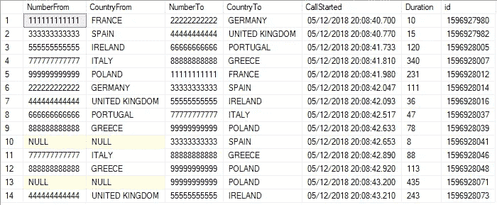
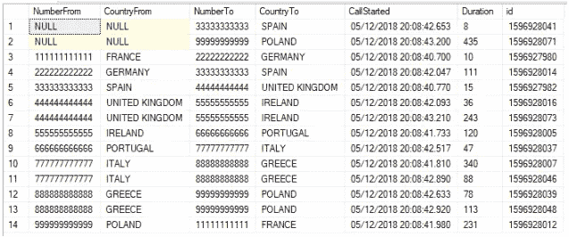
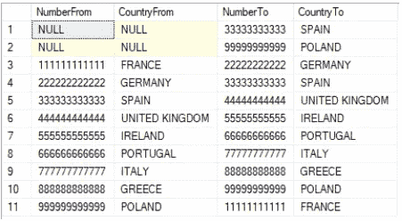
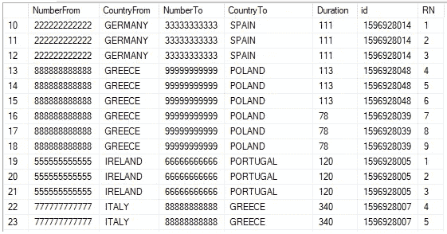
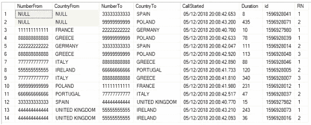
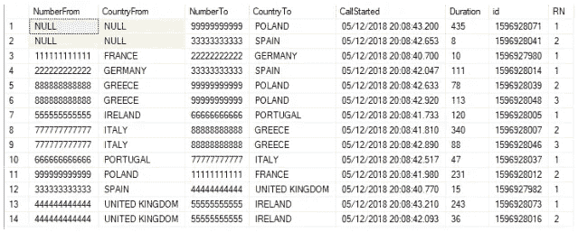

# 使用 SQL 进行高级查询，节省您的时间

> 原文：<https://towardsdatascience.com/advanced-queries-with-sql-that-will-save-your-time-48a45b7ca2e3?source=collection_archive---------8----------------------->


Photo by [Kalen Emsley](https://unsplash.com/photos/Bkci_8qcdvQ?utm_source=unsplash&utm_medium=referral&utm_content=creditCopyText) on [Unsplash](https://unsplash.com/search/photos/mountains?utm_source=unsplash&utm_medium=referral&utm_content=creditCopyText)

## 是的，SQL 仍然存在

在处理电信数据的这些年里，我的代码片段文件夹收集了很多可重用的例子。它不是关于“从表 1 中选择”,我说的是查找和处理或删除重复值，从同一表内的每组数据中选择前 N 个值，在组内重排记录，但保持组排序，查找最长的左匹配，将数字扩展 N 位等等。

今天，我想分享这些片段，并解释它是如何工作的。我使用 Microsoft SQL Server，并在查询中使用 T-SQL，但我确信有可能找到其他 DBMS 的替代方案。如果没有，请联系我，我们会一起努力找到它🙂

在这篇文章中，我准备了一张表格，上面是用假号码和真实国家打来的假电话，所以如果你试图重复同样的交易，那是行不通的😀(好吧，除了英国，他们真的有+44 国家代码，但我不确定我用的号码是否存在)



# 处理重复

从表中只选择唯一值的最快、最简单的方法是使用 DISTINCT 关键字

```
SELECT DISTINCT *
FROM [test].[dbo].[12162018_FakeCalls]
```



通过指示我们想要检索的列，我们可以只根据数字和国家选择唯一的值。

```
SELECT DISTINCT NumberFrom, CountryFrom, NumberTo, CountryTo
FROM [test].[dbo].[12162018_FakeCalls]
```



但是我们丢失了来自其他列的信息。

我们还可以通过 GROUP BY、HAVING 和 COUNT(*)找到重复项

```
SELECT NumberFrom, CountryFrom, NumberTo, CountryTo, count(*) as dups
FROM [test].[dbo].[12162018_FakeCalls]
GROUP BY NumberFrom, CountryFrom, NumberTo, CountryTo
HAVING COUNT(*) > 1
ORDER BY dups desc
```


我知道，在 SQL 数据库中不应该出现重复，你应该使用唯一的 id，约束和索引。但是有时候你只是执行一些测试，或者第一次做一些计算，做一些实验——副本就出现了。或者您的记录有不同的 id，尽管您知道应该删除其中的一个。在这些情况下你会怎么做？很久以前，我在 stackoverflow 上发现了这个解决方案，保存了下来，从那时起，我每天至少使用它几次(重复是很常见的，具体取决于工作)。WITH statement 和 ROW_NUMBER()是我的救星。

```
WITH CTE AS
( 
SELECT NumberFrom, CountryFrom, NumberTo, CountryTo, Duration, id, RN = ROW_NUMBER()OVER(PARTITION BY NumberFrom, CountryFrom, NumberTo, CountryTo ORDER BY CountryFrom) 
FROM #t
)
SELECT * 
FROM CTE WHERE RN > 1
```


我已经将原始数据复制到临时表#t 中，因为删除后“撤销”不起作用，呵🙂我们看到了与 GROUP BY 相同的结果，尽管所有列都是如此。现在，我们可以在这里执行删除，并根据我们对重复的定义删除所有重复值。

```
WITH CTE AS
( 
SELECT NumberFrom, CountryFrom, NumberTo, CountryTo, Duration, id, RN = ROW_NUMBER()OVER(PARTITION BY NumberFrom, CountryFrom, NumberTo, CountryTo ORDER BY CountryFrom) 
FROM #t
)
DELETE FROM CTE 
WHERE RN > 1;SELECT *
FROM #t
```

在这种情况下，PARTITION BY 将作为重复定义，例如，通过 ORDER BY，我们可以删除持续时间较短/较长的呼叫，或开始时间较早/较晚的呼叫，或者您在其他列中可能发现的任何情况。请注意，ORDER BY 子句在这里是必须的，所以如果您没有任何特定的排序条件，只需在那里输入任何字段。

# 选择组内的前 N 条记录

我相信你已经知道怎么做了:d .是的，再用 ROW_NUMBER()。该函数将对我们的数据进行分区，并为一个组中的每条记录分配一个编号，因此我们只需指定我们想要选择前 N 名中的哪个范围:前 10 名？— RN = 3 且 RN

让我们只选择拨打电话的国家组(*‘country from’*)中名称以相同字母开头的前 2 名记录，并按组内持续时间对值进行排序。(我已经将相同的数据插入临时表 3 次，以便更好地查看差异)

```
WITH CTE AS
( 
SELECT NumberFrom, CountryFrom, NumberTo, CountryTo, Duration, id, RN = ROW_NUMBER()OVER(PARTITION BY LEFT(CountryFrom,1) ORDER BY Duration ASC) 
FROM #t
)
SELECT *
FROM CTE;
```



看看德国和希腊是如何被归为一类，而爱尔兰和意大利又是如何被归为另一类。并仅选择每个组中第二个记录:

```
WITH CTE AS
( 
SELECT NumberFrom, CountryFrom, NumberTo, CountryTo, Duration, id, RN = ROW_NUMBER()OVER(PARTITION BY LEFT(CountryFrom,1) ORDER BY Duration ASC) 
FROM #t)
SELECT * 
FROM CTE
WHERE RN = 2;
```


# 在组内随机播放记录

实际上，这种技术在任何情况下都可以用来混洗记录，不仅是在组内，而且因为我们已经开始使用 groups、ROW_NUMBER 和语句，所以我决定让它稍微复杂一点。我不知道在你生命中的任何一个时期，你是否需要在一个团队中洗牌，但是如果出现这种情况，你知道如何去做。同样，这是我日常工作的一部分，我知道这是一项罕见的任务:)所以回到查询。我们将使用相同的分组条件，为了进行混排，将组合使用函数 ABS() —用于获取作为参数传递的数字的绝对值的函数，CHECKSUM() —返回通过表行或表达式列表计算的校验和值的函数，以及 NEWID() —创建 uniqueidentifier 类型的唯一值。阅读时，你可能会想——管它呢？但我告诉你，它起作用了。看:

```
WITH CTE AS
( 
SELECT NumberFrom, CountryFrom, NumberTo, CountryTo, CallStarted, Duration, id, RN = ROW_NUMBER()OVER(PARTITION BY LEFT(CountryFrom,1) ORDER BY ABS(CHECKSUM(NewId())) % 1000000 DESC) 
FROM [test].[dbo].[12162018_FakeCalls]
)
SELECT * 
FROM CTE;
```



对于少量数据来说，这可能不是那么明显，但是最令人兴奋的是，每次运行这个查询时，它都会重新排序。所以在第二次运行后:



你可能注意到了，波兰是第一个记录，西班牙是第二个。

今天到此为止。关于 ROW_NUMBER()的一些提示对我的工作很有帮助，我希望对其他人也有帮助。

尽管它不包括机器学习、人工智能、图像识别、模型调整、深度神经网络或数据科学领域出现的任何其他花哨术语，但使用 SQL 处理数据仍然是数据科学的一部分。仍然有许多数据专业人员使用这种语言和关系数据库。伙计们，别忘了我们的根。

感谢你的阅读，保持冷静，专业，祝你有美好的一天。

*原载于 2018 年 12 月 16 日*[*【sergilehkyi.com*](http://sergilehkyi.com/advanced-queries-with-sql-that-will-save-your-time/)*4 种不同语言(EN、es、UA、RU)*