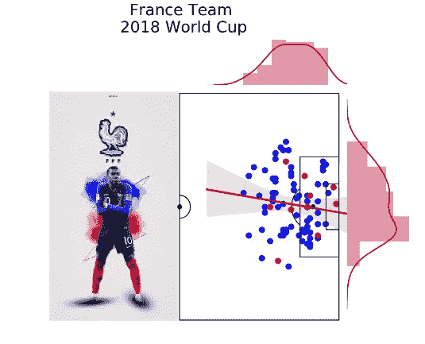
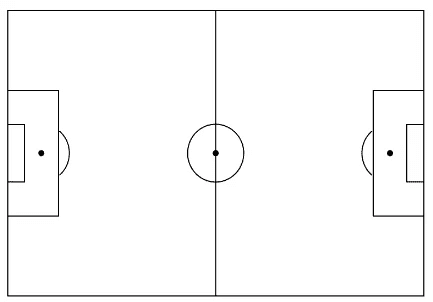
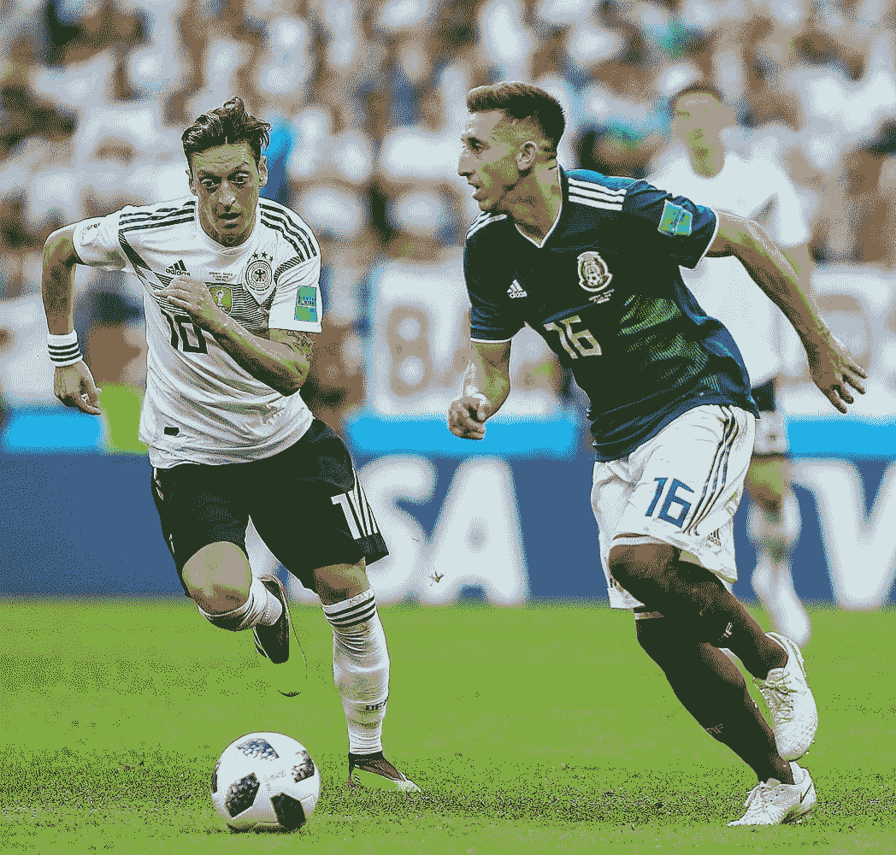
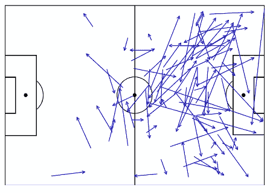
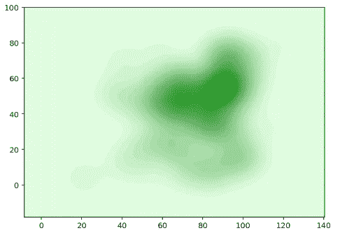
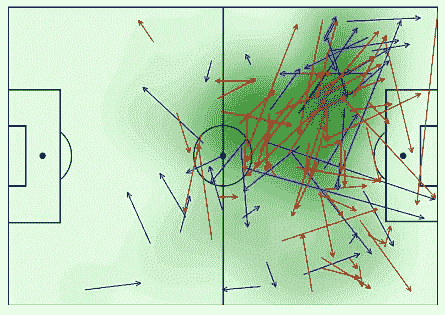
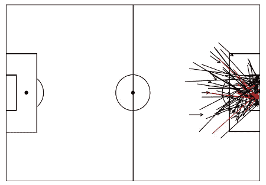
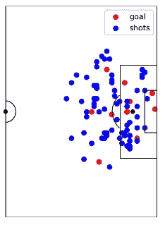
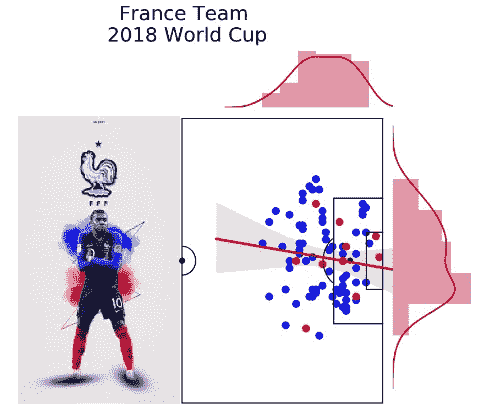

# 使用 Python、Matplotlib 和 Seaborn 实现高级体育可视化

> 原文：<https://towardsdatascience.com/advanced-sports-visualization-with-pandas-matplotlib-and-seaborn-9c16df80a81b?source=collection_archive---------7----------------------->

## 如何从最具竞争力的游戏中获得有价值的见解的详细教程

Photo by [Lukas Blazek](https://unsplash.com/@goumbik?utm_source=unsplash&utm_medium=referral&utm_content=creditCopyText) on [Unsplash](https://unsplash.com/s/photos/visualization?utm_source=unsplash&utm_medium=referral&utm_content=creditCopyText)

> “一张照片的最大价值在于它能迫使我们注意到我们从未想过会看到的东西。”

你已经在新闻中看到了这一切:媒体大肆宣传体育分析时代的到来，商业广告描绘了像袖珍计算器这样的大数据工具，专家使用多维相机收集体育运动员每一滴汗水的细节***输入你童年时代的英雄名字:L .梅西、勒布朗·詹姆斯、汤姆·布拉迪等* * *并将他们的表现提高 10 倍。

虽然显然我们还没有完全实现，但体育分析已经在帮助球队做出决策方面取得了很大进展，这些决策传统上是由“直觉”感觉或对过去传统的坚持做出的，如选择哪些球员、交易、发展、教练以及使用哪种系统。

在这篇博客文章中，我不会开发一种算法来预测[托特纳姆有多大可能(不太可能)进入英超前四](/o-jogo-bonito-predicting-the-premier-league-with-a-random-model-1b02fa3a7e5a)，或者如何为 2018 年建立一支完美的喷气机队。相反，我将介绍一些可视化技术，这将有助于我们准备引人注目和有见地的图表，以吸引你的体育爱好者同伴。

注意:

*   尽管我的例子只限于足球和 FIFA 世界杯，但这些技巧适用于任何运动和比赛。
*   你可以在这里找到这个教程[的所有源代码](https://github.com/tuangauss/Various-projects/blob/master/Python/football_visual.ipynb)。

Details of all shots France team attempted across their 7-match World Cup campaign. You will be able to create this visualization by the end of this tutorial. Original image of Mbappe is by [adi-149](https://www.deviantart.com/adi-149) via [DevianArt](https://www.deviantart.com/adi-149/art/Kylian-Mbappe-France-World-Cup-Wallpaper-752746671)

# 1.获取数据:

坏消息:这通常是最难的部分

虽然你可以毫无困难地收集体育赛事的统计数据(足球比赛中的进球，篮球比赛中的投球，等等。)，通常很难找到一场特定足球比赛或网球比赛的详细、详细的数据集。跟踪球场上的球员，尤其是像足球或篮球这样的高节奏、高强度的运动，是一项艰巨的任务，尽管利润非常丰厚。SportVu 或 Opta Sports 等公司通过向团队、体育咨询公司或研究中心出售这些备受追捧的信息来赚钱。

> “每场比赛，我们都有三个人使用[……]球场图形上的实时视频:一个人观看主队比赛，另一个人观看客场比赛，第三个人基本上是一名数据检查员。”

—西蒙·巴努布，Opta 营销总监

***我们的无名英雄***

最近，Statsbomb 宣布公开发布了最近三个足球联赛的每场比赛的详细比赛，第二精确的数据集:国家女子足球联盟(美国)，英国足球协会女子超级联赛(英格兰)，以及 2018 年国际足联世界杯。你可以免费访问他们的数据集[这里](https://github.com/statsbomb/open-data)。

数据集都是 json 格式的，所以您需要将原始数据集解析成一种关系格式，以便于检索和操作。

**json_normalize()** 是一个非常方便的工具，因为它可以自动将 json 结构“规范化”成扁平的关系结构。

在本教程中，我们将专注于 2018 年国际足联世界杯。我鼓励您在开始分析之前阅读数据集的文档。毕竟，理解你的数据是最重要的。

# **2。画足球场:**

首先，让我们用 Matplotlib 画一个简单的足球场。

这看起来很多，但是让我们一行一行地解开 **draw_pitch()** 函数。该函数接受一个 ax 参数，它是 Matplotlib 中 **add_subplot()** 函数的输出。然后，它添加几个具有预定义尺寸的对象来重新创建一个足球场的图像，包括中心圆、罚球区、6 码框和球场中的弧线。一旦我们定义了这个函数，我们调用与标准 Matplotlib 一起的图形函数如下:

A nice football pitch constructed with no more than rectangles, circles and arcs

# 3.使用通道图和热图提升您的可视化程度:

> 2018 FIFA 世界杯最震撼的瞬间是什么？

Image by Дмитрий Садовников via Wikipedia

有许多竞争者，但很少有人能打败当时的卫冕冠军德国队被韩国队淘汰出世界杯的那一刻。有痛苦，有眼泪，当然，也有批评。令人清醒的失败的后果是德国 10 号人物梅苏特·厄齐尔的离开，他承担了几乎所有的责任，既因为他的表现，也因为他在世界杯前与土耳其总统埃尔多安的会晤。听听拜仁主席乌利·赫内斯对厄齐尔说了些什么:

> “他多年来一直在玩 s***游戏，现在他和他的 s***表演隐藏在这张照片之外。”

> 但是，他有那么坏吗？

让我们看看他在广受批评的对阵韩国的比赛中的表现。我想绘制一张热图和传球图来捕捉他在 90 分钟内的表现，并评估他对德国队进攻端的影响(无论是积极的还是消极的)。

***先来一张过关图***

我们加载 json 文件，并在 Panda 中进行一些基本的数据清理，以获得一个只包含梅苏特·厄齐尔路过事件的数据集。

What our condensed dataset looks like. You can extract more information: pass_complete_status, etc.

这个数据集非常有意义，也就是说，人们可以发现厄齐尔在比赛中尝试了多达 95 次传球，其中有 7 次非常犀利，这对于一名攻击型中场来说是非常令人印象深刻的，或者说他在比赛中把球传给托尼·克罗斯(19 次)和马尔科·罗伊斯(18 次)。就通行证地图而言，我们只关心通行证的开始和结束位置

下面的代码允许我们将传球作为箭头覆盖到我们的球场上

Looks pretty good but we can do even better. I will come back to how a little tweak can make this plot a lot more informative

***用热图追踪活跃区***

俱乐部内部和媒体分析师使用足球热图来说明球员所在的区域。它们实际上是玩家位置的平滑散点图，可以很好地显示玩家在球场不同位置的效率。虽然可能会有一些关于它们有多大用处的争论(它们不会告诉你动作/运动是好是坏！)，它们通常非常具有美感和吸引力，因此很受欢迎。

现在，如果我们回到梅苏特·厄齐尔，他面临的一个主要批评是低覆盖率，因为我们很少看到他发起铲球或争抢控球权，因此，正如他们所说的，“低水平的工作率”。

> 但事实真的是这样吗？

让我们在 Matplotlib 上使用 Seaborn 绘制一个热图，以可视化梅苏特厄齐尔在德国与韩国比赛的 90 分钟内的参与。代码的语法非常简单。我们使用 kdeplot，它将绘制厄齐尔位置的散射点的核密度估计。

哇！！！那看起来非常…反气候。毕竟，图表想要告诉你什么？我看到了一些坐标，显然这些轮廓图似乎表明厄齐尔在颜色较深的区域更活跃。

> 我们还能做得更好吗？

是的，答案是我们可以结合(1)球场，(2)传球图和(3)热图，以便对厄齐尔在比赛中的表现有一个更全面的看法

Notice that I also color the passes differently, as the blue arrows indicate passes made in the first half, and the red arrows second half

现在我们可以更全面地了解梅苏特·厄齐尔在比赛中的表现。一些即时的观察结果:

*   他几乎只防守对手的半场，所以对他缺乏防守心态的批评不是完全没有根据的。但问题是，他是否有望以 1 比 1 获胜，并作为凸轮回收球？
*   他在下半场更多的向前和直接传球，与上半场更多的保守和向后传球形成对比。可能有两个原因:(1)下半场德国队内部有一种普遍的紧迫感(2)引进马里奥·戈麦斯作为中锋确实为厄齐尔的关键传球提供了一个出口，因为我们看到总共有 6 次传球直接传入禁区，是他在上半场的三倍。

我发现有趣的是蒂莫·韦尔纳的传球路线，他开始是德国队的单前锋，然后在下半场的大部分时间里与马里奥·戈麦斯搭档。

令人惊讶的是，他在两边花了很多时间，而你会认为中锋在 18 码区占据了更多的空间。这部分解释了德国进攻线在比赛中的无效性，因为他们的前锋线(Werner，Reus，Goretzka，然后是 Muller，Gómez)挤在边路，但未能在禁区内占据空间，从而为厄齐尔和 Kroos 等组织者提供了很少的出口将球送入 18 码禁区。

# **4。测试你的技能:法国远程努力的案例**

我的一个朋友非常确信，法国世界杯成功的关键是他们不懈地试图用远射打破防线。想想本杰明·帕瓦尔在四分之一决赛中对阿根廷的那个精彩进球

我们可以再次尝试想象法国队的所有射门，以确定他们的大多数进球是来自禁区外还是禁区内？

如果我只是按照到目前为止显示的方法，这就是我得到的

Shot taken by France team during the World Cup campaign

这很好。但是，我们可以做更多的工作，使可视化更有吸引力和洞察力。具体来说，我做了两个小调整:

(1)由于我们只关注镜头，这些镜头都是在球场的一侧记录的，所以我将只画出球场的右半边

(2)由于我们只关心射击的起点，我们可以扔掉箭头，只把射击想象成散点图，其中 **x，y** 是尝试射击的位置。

现在看起来好多了。我们可以马上看到，法国队在禁区内的射门次数和他们在禁区外的射门次数一样多。虽然在一定程度上，这确实支持了法国队比平时付出更多远射努力的论点，因为我们预计禁区外的射门密度会低得多。无论如何，看起来很有趣的是，短期和长期的努力看起来是一样的客观。

在[我的 Jupyter 笔记本](https://github.com/tuangauss/Various-projects/blob/master/Python/football_visual.ipynb)中，你还可以找到更多的技术，比如叠加密度图和将图像包含到你的可视化中。再多几行代码，您就可以轻松地生成这样的可视化效果:

你可以在这里找到本教程[的所有源代码](https://github.com/tuangauss/Various-projects/blob/master/Python/football_visual.ipynb)

本项目使用的数据由 Statsbomb 发布，并在此[向公众公开](https://github.com/statsbomb/open-data)