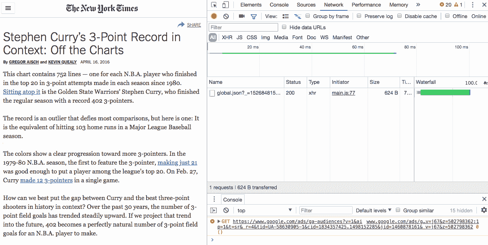
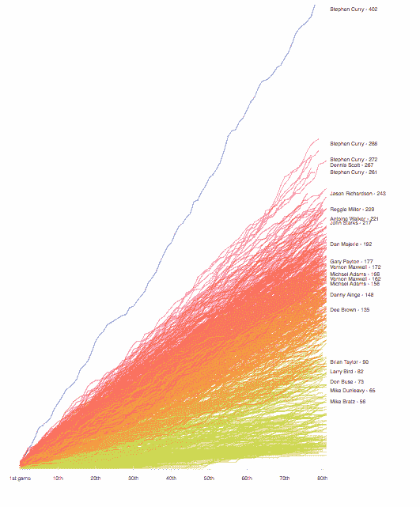
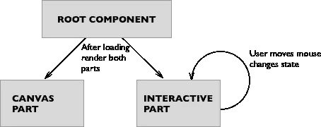
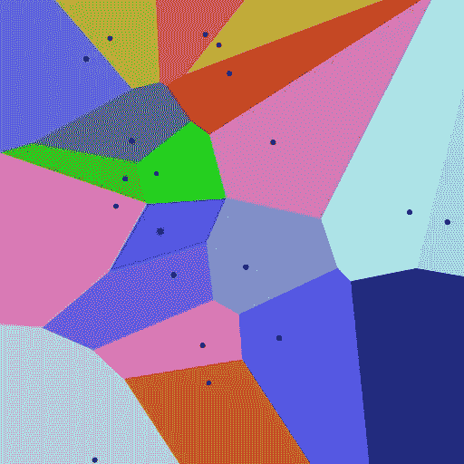
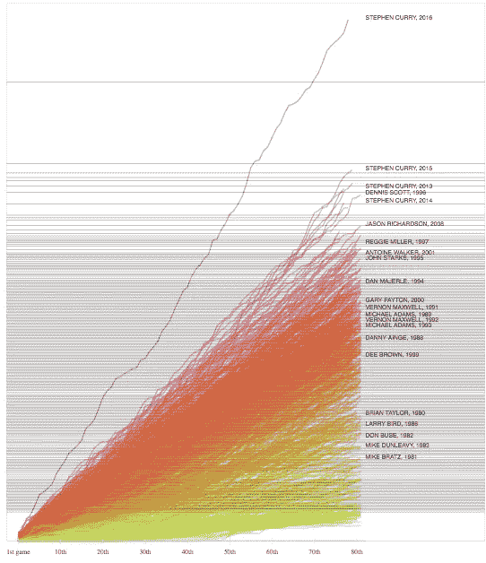
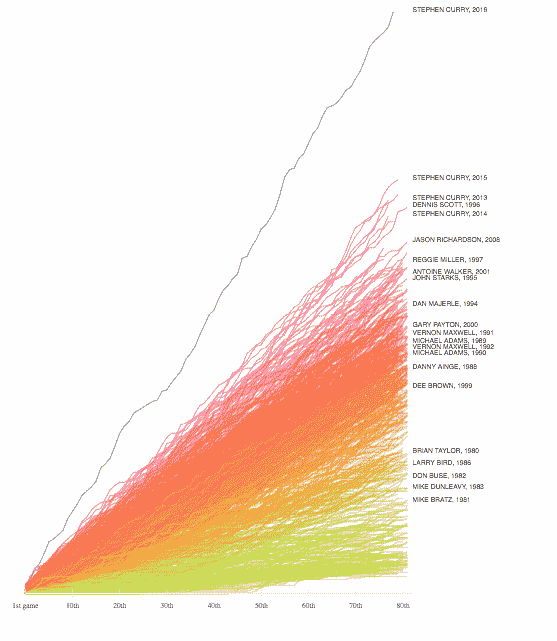
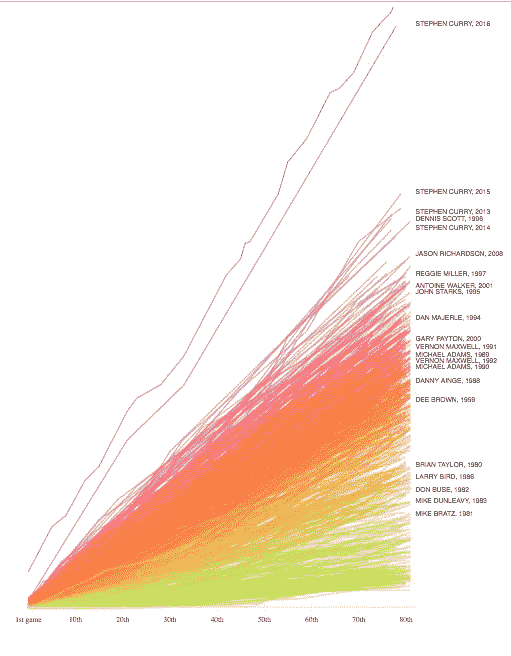
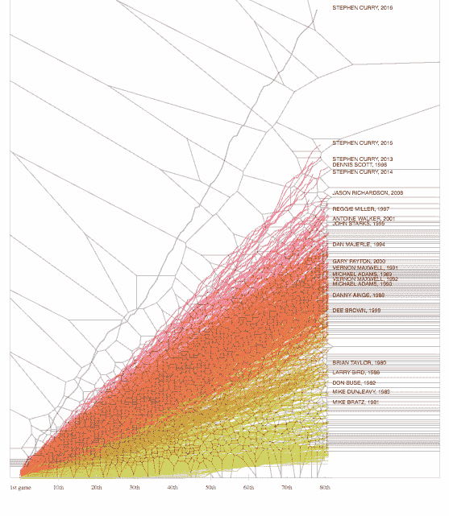

# 使用 react-vis 实现高级可视化

> 原文：<https://towardsdatascience.com/advanced-visualization-with-react-vis-efc5c6667b4?source=collection_archive---------4----------------------->

## 使用 Voronois、单程渲染和画布组件获得惊人的用户体验

所以你已经开始用 [react-vis](https://github.com/uber/react-vis) 做一些数据可视化，你已经建立了一些你自己的图表，也许你已经读过[shyanovska Nataliia](https://medium.com/u/792d0122c5bb?source=post_page-----efc5c6667b4--------------------------------)的精彩介绍[用 react-vis](https://medium.com/dailyjs/data-visualization-with-react-vis-bd2587fe1660) 做数据可视化，或者甚至可能建立了一个[仪表板](http://www.jeromecukier.net/?p=1700)。是时候学习一些处理更大数据量和更复杂 UI 交互的技术了。在这篇文章的过程中，我们将看到如何使用单程渲染，画布部件，去抖动状态更新，和 Voronois。系好安全带，这将是一次疯狂的旅程！

首先，您可以使用 [create-react-app](https://www.npmjs.com/package/create-react-app) 设置 scaffold a new app，然后在终端中运行

```
npm install react-vis --save
# we will also be using a few additional libraries 
# so install these too
npm install --save d3-fetch d3-scale d3-scale-chromatic debounce simplify-js
```

也就是说，我为我的应用程序使用了稍微不同的配置，你可以在这里[查看(以及整篇文章的代码)。](https://github.com/mcnuttandrew/advanced-react-vis-tutorial)

## 获取和准备数据

学习如何做任何事情的一个传统技巧是模仿大师，这篇文章也不例外。我们将探索纽约时报 2016 年的可视化“斯蒂芬库里的 3 分记录”。

[](https://www.nytimes.com/interactive/2016/04/16/upshot/stephen-curry-golden-state-warriors-3-pointers.html) [## 斯蒂芬·库里的 3 分记录:超出图表

### 这张图表有 752 行——每一行代表一名 NBA 球员，他们在每场比赛中的三分球命中率都排在前 20 位

www.nytimes.com](https://www.nytimes.com/interactive/2016/04/16/upshot/stephen-curry-golden-state-warriors-3-pointers.html) 

在这个可视化中有很多事情正在发生！每一行显示了一个特定的球员在特定的赛季中投中三分球的次数。这个信息可以通过一个动态的鼠标指针来访问，鼠标指针同时会突出显示特定的玩家年份，并提供一个工具提示来准确描述用户所停留的行。

我们的第一步将是获取数据。令人愉快的是，NYT 为这篇文章提供了 CSV 格式的数据，所以我们可以很容易地通过查看 chrome 中的网络选项卡来获取这些数据，如下所示。下载完数据文件后，将它放在应用程序中的某个地方，我将它放在一个名为 data 的文件夹下，并将其命名为“nyt-rip.csv”。



Capturing the CSV data that we will be using for our visualization by watching the network tab on Chrome. Refreshing the page triggers a lot of network calls, we then filter the network history to only CSV’s, and save the relevant file by double clicking it.

这个 csv 的格式有点不方便，它有球员 id、球员姓名、年份以及本赛季每场比赛的三次投掷次数等列。让我们把它整理成一种更容易使用的格式:

```
const nonNumericRows = {
  player: true,
  pname: true,
  year: true
};// reformats input csv so that each row 
// has details about the corresponding player
// and an array of points describing that players record
export function cleanData(data) {
  return data.map(row => {
    // extract all of the columns for 
    // this row that update that players score
    const gameData = Object.keys(row)
      .filter(key => !nonNumericRows[key] && row[key] !== 'NA')
      .map((key, x) => ({x, y: Number(row[key])})); // return a formatted object to manipulate
    return {
      player: row.player,
      pname: row.pname,
      year: row.year,
      height: gameData[gameData.length - 1],
      gameData
    };
  });
}
```

太好了，现在我们有了一种机制来以可用的方式格式化我们的数据。在我们编写实用函数的同时，让我们也编写一个来获取数据域:

```
export function getDataDomain(data) {
  const {min, max} = data.reduce((acc, player) => {
    return player.gameData.reduce((mem, row) => {
      return {
        min: Math.min(mem.min, row.y),
        max: Math.max(mem.max, row.y)
      };
    }, acc);}, {min: Infinity, max: -Infinity});
  return [min, max];
}
```

将这两个函数放入 utils.js 文件中，我们就可以开始比赛了。

## 第一种天真的方法

为了给我们随后的优化做好准备，我们先来看一个简单的方法。在我们的数据集中有 750 个球员年，所以我们只有 750 个系列。当我们悬停在它们上方时，让我们重新绘制线条并突出显示选中的线条。相当合理！这里有一个简单实现的完整过程，之后我将详细介绍并描述每个部分:

哦，一下子这么多！但是如果把它分成几块就很容易处理了。当我们的组件准备好挂载时，它做的第一件事是通过 [d3-fetch csv](https://github.com/d3/d3-fetch#csv) 函数调用数据，然后我们清理数据并将其保存到状态，以便在不久的将来接收。

```
componentWillMount() {
    csv('data/nyt-rip.csv')
      .then(data => this.setState({
        data: cleanData(data),
        loading: false
      }));
  }
```

如果数据还没有被加载，我们通过拒绝尝试渲染我们的组件来开始我们的渲染功能，而只是返回一个加载消息(尽管你可以很容易地给 show 一个旋转器或者使用像 [placeloader](https://github.com/balthazar/placeloader) 这样的花哨东西)。接下来，我们使用上一节中的 getDataDomain 函数构建一个由 [d3-scale-chromatic](https://github.com/d3/d3-scale-chromatic) 支持的色标。在本文中，我们主要感兴趣的是重建原始 NYT 可视化的感觉(而不是确切的外观)，所以这里我们使用了不同的色标，并放弃了一些额外的图表装饰。

```
const {loading, highlightSeries, data} = this.state;
if (loading) {
  return <div><h1>LOADING</h1></div>;
}const dataDomain = getDataDomain(data);
const domainScale = scaleLinear().domain(dataDomain).range([1, 0]);
const colorScale = val => interpolateWarm(domainScale(val));
```

最后，我们来看图表的实际渲染。我们首先查看所有的数据行，为每个数据行创建一个 LineSeries，并定义一个基本的交互技术。接下来，我们添加一个 LabelSeries 来突出显示沿 y 轴和 x 轴的某些点，并使用特殊格式来匹配 NYT 图形给出的标签。

```
<XYPlot {...layout}>
  {data.map((player, idx) => {
    const playerHighlightString = `${player.pname}-${player.year}`;
    return (
      <LineSeries
        key={idx}
        strokeWidth="4"
        curve="curveStepBefore"
        data={player.gameData}
        onSeriesMouseOver={() => 
            this.setState({highlightSeries: playerHighlightString})}
        onSeriesMouseOut={() => 
            this.setState({highlightSeries: null})}
        stroke={
          playerHighlightString === highlightSeries ? 'black' :
           colorScale(player.gameData[player.gameData.length - 1].y)
        }
        />);
  })}
  <LabelSeries
    data={data.filter(row => labelMap[`${row.pname}-${row.year}`])}
    style={{fontSize: '10px', fontFamily: 'sans-serif'}}
    getY={d => d.gameData[d.gameData.length - 1].y}
    getX={d => 82}
    labelAnchorX="start"
    getLabel={d => 
      `${d.pname} - ${d.gameData[d.gameData.length - 1].y}`}/>
  <XAxis
    style={{ticks: {fontSize: '10px', fontFamily: 'sans-serif'}}}
    tickFormat={d => 
       !d ? '1st game' : (!(d % 10) ? `${d}th` : '')}/>
</XYPlot>
```

敏锐的读者会注意到，我们使用了两个常量，它们是从一个单独的 constants.js 文件中导入的，为了逻辑上的方便，将它们提取出来:

```
export const desiredLabels = [
  {pname: 'Brian Taylor', year: 1980},
  {pname: 'Mike Bratz', year: 1981},
  {pname: 'Don Buse', year: 1982},
  {pname: 'Mike Dunleavy', year: 1983},
  {pname: 'Larry Bird', year: 1986},
  {pname: 'Danny Ainge', year: 1988},
  {pname: 'Michael Adams', year: 1989},
  {pname: 'Michael Adams', year: 1990},
  {pname: 'Vernon Maxwell', year: 1991},
  {pname: 'Vernon Maxwell', year: 1992},
  {pname: 'Dan Majerle', year: 1994},
  {pname: 'John Starks', year: 1995},
  {pname: 'Dennis Scott', year: 1996},
  {pname: 'Reggie Miller', year: 1997},
  {pname: 'Dee Brown', year: 1999},
  {pname: 'Gary Payton', year: 2000},
  {pname: 'Antoine Walker', year: 2001},
  {pname: 'Jason Richardson', year: 2008},
  {pname: 'Stephen Curry', year: 2013},
  {pname: 'Stephen Curry', year: 2014},
  {pname: 'Stephen Curry', year: 2015},
  {pname: 'Stephen Curry', year: 2016}
];export const layout = {
  height: 1000,
  width: 800,
  margin: {left: 20, right: 200, bottom: 100, top: 20}
};export const NUMBER_OF_GAMES = 82;
export const MAX_NUMBER_OF_THREE_POINTERS = 405;
```

综上所述，这看起来像是:



相当酷！然而，响应性不是很好，当我们接近它们时，线条不会突出显示，浏览器明显出现滞后。这种策略也阻止了我们在边上添加工具提示(虽然我们可以这样做，但是当我们悬停在不同的元素上时会有很多抖动)。一定有更好的办法！

## 更好的建筑

到目前为止，我们一直在使用 SVG 线渲染我们的系列。虽然这种方法很容易推断 UI 的状态，但每次都重新绘制所有的线条确实效率很低。这是因为每一行都被建模为一个非常详细的 DOM 节点，这对浏览器来说非常重要。为了减轻这一重量，我们可以使用内置的 react-vis 帆布系列 LineSeriesCanvas。Canvas 的渲染速度往往比 SVG 快得多，但在 DOM 中没有相同的详细表示，这意味着任何交互都必须手工完成。显然，将这个新的系列放到我们天真的解决方案中会使整个页面更快，但是我们会失去我们的动态交互性。

为了解决这个问题，我们将图表分成两个部分，一个处理交互性，另一个处理其他所有的事情。这是由 React 只为已经更新的组件执行渲染功能的想法所激发的。



The organization of our chart component after breaking out the interactive parts into a separate component

通过这个架构，我们将有一个组件来呈现画布线条，还有一个组件来呈现高亮线条和高亮工具提示。从而有效地将快速渲染的元素与昂贵或耗时渲染的元素分开。布局的一些伪代码:

```
<div className="relative">
  <NonInteractiveParts />
  <InteractiveParts />
</div>
```

我们希望这些组件看起来是一个漂亮的图表，所以我们给了交互部分 css 属性

```
position: absolute;
top: 0;
```

这允许交互部分“位于”非交互属性之上，从而完成外观。

## 静态部分

我们现在真的有所进展了。注意到图表的静态部分与我们在简单方法中的非常相似；只是一个装着一些系列的容器。为了简洁起见，我们可以将上面演示的根组件和画布部件合并成一个组件，因为它们中的每一个都只呈现一次。

这个新部件与我们的第一个非常相似。我们的 mounting 步骤做了一些额外的工作来促进交互组件的呈现——稍后会详细介绍——并调用我们即将成为交互组件的。但是除此之外，没有太大的变化！

## 互动部分

酷的东西来了。我们在上面看到，我们在 componentWillMount 步骤中额外准备了一些数据，以便为交互式组件做好准备，让我们看一下更详细的情况:

```
componentWillMount() {
    csv('data/nyt-rip.csv')
      .then(data => {
        const updatedData = cleanData(data);
        const playerYearMap = updatedData.reduce((acc, row) => {
          const {pname, year, gameData} = row;
          acc[`${pname}-${year}`] = gameData[gameData.length - 1].y;
          return acc;
        }, {}); const playerMap = updatedData.reduce((acc, row) => {
          acc[`${row.pname}-${row.year}`] = row;
          return acc;
        }, {});
        this.setState({
          data: updatedData,
          loading: false,
          allPoints: buildVoronoiPoints(updatedData),
          playerYearMap,
          playerMap
        });
      });
  }
```

我们清理的数据和以前一样，吱吱作响，很好用。接下来，我们引入一个名为 playerYearMap 的新变量，这个对象的键等于球员年唯一标识符，值等于每个球员达到的三分的最大分数。这将用于简化标签和工具提示的定位。类似地，我们引入一个 playerMap，它也有球员年份标识符作为键，但这次是整行作为值。这将允许当我们将鼠标放在事物上时快速/持续地查找行。

最后一个新变量称为 allPoints，由一个名为 buildVoronoiPoints 的函数生成。我想知道那会是什么？这是函数(它存在于 utils 中):

```
export function buildVoronoiPoints(data) {
  return data.reduce((acc, {player, pname, year, gameData}) => {
    return acc.concat({
      player,
      pname,
      year,
      x: 41,
      y: gameData[gameData.length - 1].y
    });
  }, []);
}
```

这将为每个球员在该球员最大三分点数的“高度”区域的中心创建一个单点。我们可以用它来创建一个 Voronoi 图。Voronoi 是空间平面分割，使得形成点的集合，其中每个点包含在其自己的单元内。我们保证每个点将与其他点隔离。这个属性对鼠标悬停有很大的影响，因此用户一次只能将鼠标悬停在一个点上。



A colored in voronoi diagram, source [wikipedia](https://en.wikipedia.org/wiki/Voronoi_diagram#/media/File:Euclidean_Voronoi_diagram.svg)

我们正在模仿在最初的 NYT 图形中发现的鼠标悬停设置，在那里飞机被分成带状，这样当你上下移动鼠标时，当前选择的玩家年份会改变，当你左右移动鼠标时，它保持不变。我们可以通过使用 Voronoi 和我们之前特别构建的所有点来重建这种行为。一旦实现，voronoi 单元的布局将如下所示:



(When we’re done we will remove the stroke attribute from the Voronoi cells shown here, that way our user is none the wiser about our mouse over technique 😉)

相当酷！现在我们已经准备好查看交互式组件的代码了。

就像我们天真的方法一样，让我们一次看一个有趣的部分。让我们从房间里的大象开始:

```
<Voronoi
            extent={[
              [0, y(MAX_NUMBER_OF_THREE_POINTERS)], 
              [width, height - margin.bottom]
            ]}
            nodes={allPoints}
            polygonStyle={{
              // UNCOMMENT BELOW TO SEE VORNOI
              stroke: 'rgba(0, 0, 0, .2)'
            }}
            onHover={row => {
              const player = playerMap[`${row.pname}-${row.year}`];
              if (!player) {
                this.setState({
                  highlightSeries: null,
                  highlightTip: null
                });
                return;
              }
              this.debouncedSetState({
                highlightSeries: player.gameData,
                highlightTip: {
                  y: player.gameData[player.gameData.length - 1].y,
                  name: row.pname
                }
              });
            }}
            x={d => x(d.x)}
            y={d => y(d.y)}
            />
```

这个无害的组件接受一个点列表，并直接在 dom 中构建一个 voronoi 图。与 react-vis 中的其他组件相比，它的属性签名有点不正常(您需要提供一个刻度，范围),所以要小心！在这个组件中值得注意的另一件事是使用了 debouncedSetState 函数，正如您从上面所注意到的，我们必须通过以下方式来定义它:

```
componentWillMount() {
    this.debouncedSetState = debounce(newState =>
      this.setState(newState), 40);
  }
```

该函数利用了称为去抖的 lodash 函数，该函数防止函数被调用超过特定频率(在本例中为每 40 ms 一次)。防止这种类型的超快速状态改变对我们是有利的，因为我们不希望每次用户做出很小的动作就导致状态改变。这将导致抖动和不必要的重绘！为了掩盖这一点点延迟，我们通过在 LineSeries 上包含动画道具来添加动画。

综上所述，我们得到:



Our pan-ultimate draft of the visualization

模一些小的造型触摸，就是这样！它运行平稳，准确地再现了在原始可视化中发现的交互。相当酷！

## 还有一点

我们已经很好地模拟了最初的 NYT 可视化的功能，但是现在我们想知道:我们能做得更好吗？他们展示的鼠标悬停功能是合理的，但是它有点笨拙，因为重叠，阻止你将鼠标悬停在每个玩家身上。如果我们能以一种明智的和有效的方式来简化它，我们会很高兴。这个问题的答案，而且，如果我们真的是诚实的，大多数问题，是使我们的 Voronoi 更加细致入微。

一个简单的膝跳是为每个数据点建模创建 Voronoi 单元。虽然这样做是完全可能的，但是会产生大量的细胞。如果在 750 名玩家的赛季中有 82 场比赛，那将是 61，500 个不同的单元！根据一般经验，浏览器最多只能处理几千个 SVG 元素，所以我们需要更加聪明。

一个强大的解决方案是通过简化我们的每一行来开发数据集的简化模型。令人愉快的是，有大量关于线条简化的工作，比如非常优秀的 Vladimir Agafonkin/monner 的 simplify-js 库。许多这类工作的出现是因为制图员对保存海岸线和其他不规则地理实体的粗糙边缘的简化形状感兴趣。但是我们会把它用在不同的地方。


mourner’s [simplify-js](http://mourner.github.io/simplify-js/) demo page, simplifying complex lines.

我们将简化每个球员的年线，这样我们就可以得到他们的线的要点，没有太多的细节。我们通过在 utils 文件中添加另一项内容来让 simplify-js 处理我们的数据，从而执行了这个想法:

```
const betterThanCurryLine = simplify(stephCurryRecord, 0.5)
    .map(({x, y}) =>
        ({x, y: y + 20, pname: 'Stephen Curry', year: 2016}));const SIMPLICATION = 3;
export function buildVoronoiPointsWithSimplification(data) {
  return data.reduce((acc, {player, pname, year, gameData}) => {
    return acc.concat(
      simplify(gameData, SIMPLICATION).map(({x, y}) => ({player, pname, year, x, y}))
    );
  }, betterThanCurryLine);
}
```

作为视觉化主义者，我们的第一个冲动是想看看这些简化是什么样子，瞧:



Visualization of the simplification of our model in preparation for a modest robust voronoi strategy (left) compared to the unsimplified data (right). On the left we that there is an (comparatively) jagged line above all of the others, this line is used to specially tune the character of the resulting voronoi. Curry’s record breaking trajectory plays a big role in the user’s experience of this chart, so it is necessary to provide some extra polish to make sure interactions with that line really shine.

有了所有这些东西，我们终于可以看到最终的 voronoi 图了。请看:



The user experience of using our line-simplified voronoi technique (left), and a visualization of what’s going on under the hood (right).

## 结论

在这篇文章中，我们看到了如何使用 react-vis 重建出版物质量的交互式数据图形。这涉及到使用各种各样的交互式可视化技术，包括画布渲染、单程渲染、去抖动、Voronois 和线简化，作为追踪线系列的机制。并不是每个可视化都需要这么多的优化和高级技术，但是我们知道很多关于我们的数据和目标行为，所以我们能够按照我们想要的方式进行调整。

在构建我们的可视化时，我们大量使用了 react-vis 的一些特性，但是本文中讨论的思想适用于任何基于 web 的可视化框架。你可以很容易地用普通的 [d3](https://d3js.org/) 、[符号](https://github.com/emeeks/semiotic)或者任何其他可用的可视化工具来实现这些技术。

如果你想看上下文中的代码，[看看这个报告](https://github.com/mcnuttandrew/advanced-react-vis-tutorial)。如需更多高级示例，请查看 react-vis 文档的[图表部分](https://uber.github.io/react-vis/examples/charts/streamgraph)或我的一些个人作品，比如这个的[，或者这个](http://www.mcnutt.in/home-graphs/)的[，或者甚至是这个](http://www.mcnutt.in/color-of-the-year/)[的](http://www.mcnutt.in/city-size/)。

快乐观想！