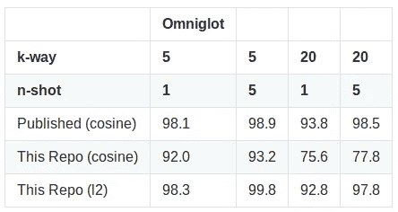
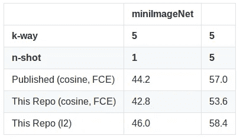
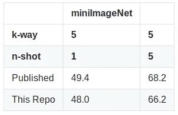
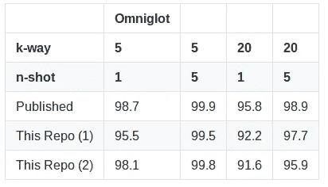

# 少数镜头学习的进展:在 PyTorch 中再现结果

> 原文：<https://towardsdatascience.com/advances-in-few-shot-learning-reproducing-results-in-pytorch-aba70dee541d?source=collection_archive---------5----------------------->


少镜头学习是机器学习的一个令人兴奋的领域，旨在缩小机器和人类在从少量样本中学习的挑战性任务中的差距。在我的[上一篇文章](https://medium.com/@oknagg/advances-in-few-shot-learning-a-guided-tour-36bc10a68b77)中，我提供了三篇前沿论文的高度概括——我假设你已经读过，已经熟悉这些论文，或者你自己正在复制它们。

在这篇文章中，我将向您介绍我在 Omniglot 和 miniImageNet 数据集上复制这些论文的结果的经验，包括路上的一些陷阱和绊脚石。每篇论文都有自己的章节，在其中我提供了一个 Github gist 和 PyTorch 代码来对论文描述的模型执行单个参数更新。要训练模型，只需将该函数放入训练数据的循环中。为了简洁起见，省略了数据集处理等不太有趣的细节。

再现性非常重要，它是任何声称是科学的领域的基础。这让我相信，机器学习中代码共享和开源的盛行确实令人钦佩。虽然仅发布代码是不可复制的(因为可能存在实现错误)，但它向公众开放了研究人员的方法，更重要的是加速了该领域其他人的研究。鉴于此，我要感谢这些论文的作者分享他们的代码，以及任何其他开源他们实现的人。

【https://github.com/oscarknagg/few-shot】请查看我在 [*的 Github 回购*](https://github.com/oscarknagg/few-shot)


Things don’t always go to plan. Just see this training curve of a failed MAML implementation for example!

# 数据集

有两个图像数据集用于评估少镜头学习算法。第一个是 Omniglot 数据集，它包含 20 张图片，每张图片包含来自 50 个字母表的大约 1600 个字符。这些影像通常为 28x28 灰度，这也是该数据集通常被称为 MNIST 转置的原因之一。


Samples from the Omniglot dataset.

第二个是 miniImageNet 数据集，它是 ImageNet 的一个子集，旨在成为一个更具挑战性的基准，而不像完整的 ImageNet 数据集那样繁琐。miniImageNet 由 60，000 张 84x84 的 RGB 图像组成，每类 600 张图像。


Samples from the miniImageNet dataset before taking center crop and resizing to 84x84

在这两种情况下，训练集和验证集中的类是不相交的。我没有使用与原始论文相同的培训和验证拆分，因为我的目标是不要将它们复制到最后一分钟的细节。

# 匹配网络

在[匹配网络](https://arxiv.org/pdf/1606.04080.pdf)中，Vinyals 等人引入了一种完全可微分的最近邻分类器的概念，这种分类器既经过训练又经过了少量任务的测试。

匹配网络算法可以总结如下:

1.  首先，使用编码器网络(本例中为 4 层 CNN)嵌入所有样本(查询和支持集)。这是由 model.encode()执行的(第 41 行)。
2.  可选地计算完整的上下文嵌入(FCE)。考虑到支持集，LSTM 将原始嵌入作为输入，并输出修改的嵌入。这是由 model.f()和 model.g()执行的(第 62 和 67 行)。
3.  计算查询样本和支持集之间的成对距离，并使用 softmax 进行归一化(第 69 到 77 行)
4.  通过用标准化的距离对支持集标签进行加权平均来计算预测(第 83–89 行)

一些需要注意的事项:

*   在这个例子中， *x* 张量首先包含支持集样本，然后是查询。对于 Omniglot，它将具有 shape (n_support + n_query，1，28，28)
*   前一篇文章中的数学是针对一个查询样本的，但实际上匹配网络是用一批大小为 *q_queries * k_way* 的查询样本训练的

我无法使用余弦距离复制这篇论文的结果，但当使用 l2 距离时却成功了。我相信这是因为余弦距离被限制在-1 和 1 之间，这就限制了注意力函数( *a(x^，x_i)* 下面)可以指向支持集中的特定样本的数量。由于余弦距离是有界的 *a(x^，x_i)* 永远不会接近 1！在 5 路分类的情况下， *a(x^，x_i)* 的最大可能值是*exp(1)/(exp(1)+4 * exp(-1))≈0.65*。当使用余弦距离时，这导致非常慢的收敛。


我认为有可能使用余弦距离来重现结果，或者使用更长的训练时间，更好的超参数，或者像余弦距离乘以常数因子这样的启发式方法。鉴于距离的选择不是论文的关键，使用 l2 距离的结果非常好，我决定省去调试工作。



# 原型网络

在[原型网络](https://arxiv.org/pdf/1703.05175.pdf)中，Snell 等人使用由 Bregman 发散理论激发的引人注目的归纳偏差来实现令人印象深刻的少数镜头性能。

原型网络算法可以总结如下:

1.  嵌入所有查询和支持示例(第 36 行)
2.  计算类原型，取每个类嵌入的平均值(第 48 行)
3.  预测是查询样本和类原型之间距离的软最大值(第 63 行)

我发现这篇论文非常容易复制，因为作者提供了全套的超参数。因此，在 Omniglot 基准测试中，我可以轻松地实现大约 0.2%的性能，在 miniImageNet 基准测试中，可以实现几%的性能，而不需要我自己进行任何调整。



# 元不可知元学习(MAML)

在[中，MAML](https://arxiv.org/pdf/1703.03400.pdf) 芬恩等人介绍了一种强大且广泛适用的元学习算法，来学习一种能够快速适应新任务的网络初始化。在本文的三篇文章中，这篇文章是最难也是最值得复制的。

MAML 算法可以总结如下:

1.  对于元批量任务中的每个 n-shot 任务，使用基本模型的权重创建一个新模型，也就是元学习者(第 79 行)
2.  通过随机梯度下降，使用任务中样本的损失更新新模型的权重(第 81–92 行)
3.  计算同一任务中更多数据的更新模型的损失(第 94-97 行)
4.  如果执行一阶 MAML，用来自第 3 部分的损失梯度更新元学习器权重。如果执行二阶 MAML，计算该损失相对于*原始权重*的导数(第 110+行)

PyTorch 最大的吸引力在于它的亲笔签名系统。这是一段神奇的代码，记录了对*火炬的操作。Tensor* 对象，动态构建这些操作的有向无环图。反向传播就像调用*一样简单。*在最终结果上倒退()。为了计算和应用元学习者的参数更新，我不得不学习更多关于这个系统的知识，现在我将与你分享。

## 一阶 MAML —梯度交换

通常，在 PyTorch 中训练模型时，您会创建一个与特定模型的参数相关联的优化器对象。

```
from torch.optim import Adam
opt = Adam(model.parameters(), lr=0.001)
```

当调用 *opt.step()* 时，优化器读取模型参数的梯度，并计算这些参数的更新。然而，在一阶 MAML 中，我们将使用一个模型(*快速权重)*计算梯度，并将更新应用于*不同的模型*，即元学习者。

对此的解决方案是以 *torch 的形式使用 PyTorch 的一个未充分利用的功能。Tensor.register_hook(钩子)*。注册一个钩子函数到一个张量，这个钩子函数将在计算这个张量的梯度时被调用。对于元学习器中的每个参数张量，我注册了一个钩子，该钩子简单地将梯度替换为快速权重上的相应梯度(gist 中的第 111–129 行)。这意味着当 *opt.step()* 被调用时，快速模型的梯度将用于根据需要更新元学习器权重。

## 二阶 MAML-亲笔签名的问题

当我第一次尝试实现 MAML 时，我实例化了一个新的模型对象(torch.nn.Module 的子类)并将它的权重值设置为元学习者的权重。然而，这使得不可能执行二阶 MAML，因为在*火炬的眼中，快速模型的权重与元学习者的权重是分离的。这意味着当我调用*optimizer . step()*(要点中的第 140 行)时，元学习者权重的自动签名图是空的，没有执行更新。*

```
# This didn't work, meta_learner weights remain unchanged
meta_learner = ModelClass()
opt = Adam(meta_learner.parameters(), lr=0.001)task_losses = []
for x, y in meta_batch:
    fast_model = ModelClass()
    # torch.autograd loses reference here!
    copy_weights(from=meta_learner, to=fast_model)
    task_losses.append(update_with_batch(x, y))meta_batch_loss = torch.stack(task_losses).mean()
meta_batch_loss.backward()
opt.step()
```

这个问题的解决方案是 *functional_forward()* (第 17 行)，这是一个有点笨拙的方法，它使用 *torch.nn.functional* 手动执行与模型类相同的操作(卷积、最大池等)。这也意味着我必须手动执行快速模型的参数更新。其结果是*torch . autograded*知道将梯度反向传播到元学习者的原始权重。这导致了一个惊人的大签名图。


PyTorch autograd graph for 1st order MAML (left) and 2nd order MAML (right) with one inner training step. You can probably see why 2nd order MAML has much higher memory requirements!

然而，二阶 MAML 是一个比这更棘手的野兽。当我第一次写我的二阶 MAML 实现时，我认为我第一次尝试就奇迹般地完成了所有的工作。至少没有例外，对吗？只有在运行了全套 Omniglot 和 miniImageNet 实验后，我才开始怀疑我的工作——结果与一阶 MAML 太相似了。这是一种典型的无声 ML 错误，它不会导致异常，只会在模型的最终表现中显现出来。

因此，我决定全力以赴，编写一个单元测试，以确认我确实在执行二阶更新。声明:本着真正的测试驱动开发的精神，我应该在运行任何实验之前编写这个测试。事实证明我并不完美😛。

我决定进行的测试是在一个虚拟模型上运行 *meta_gradient_step* 函数，并手动解析自动签名的图，计算两次反向操作的次数。这样，我可以绝对肯定，我正在执行二阶更新时，需要的。相反，我能够测试我的一阶 MAML 实现只执行一阶更新，没有双重反向操作。

我最终找到了没有在内部训练循环中应用 *create_graph* 参数的错误(第 86 行)。然而，我保留了查询样本上的损失的签名图(第 97 行),但是这不足以执行二阶更新，因为展开的训练图没有被创建。

训练时间相当长(5 路 5 次拍摄的 miniImageNet 实验超过 24 小时)，但最终我相当成功地再现了结果。



我希望你能从这次技术性的深潜中学到一些有用的东西。如果你有任何问题，请在评论中告诉我。

*如果您想深入了解，请查看在*[*【https://github.com/oscarknagg/few-shot】*](https://github.com/oscarknagg/few-shot)的完整实现