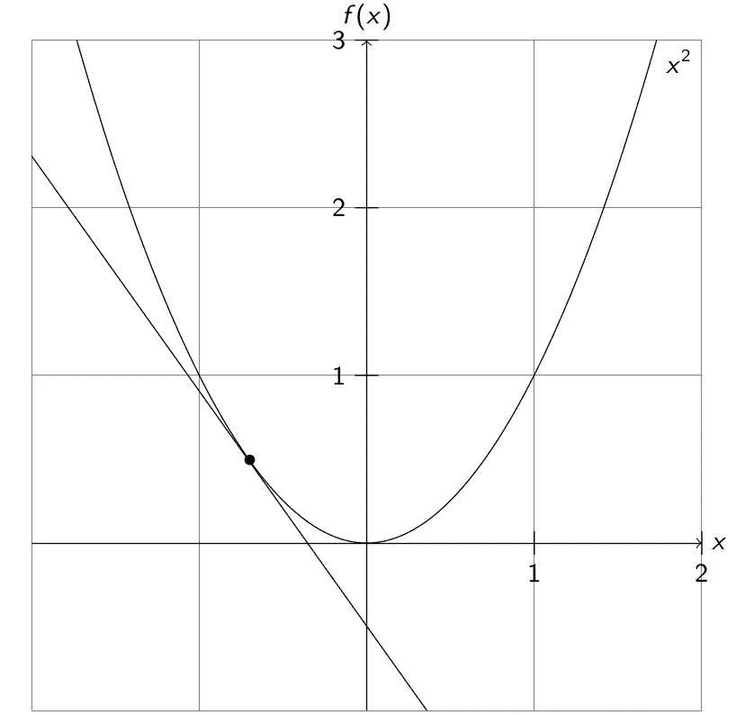
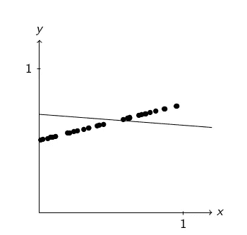
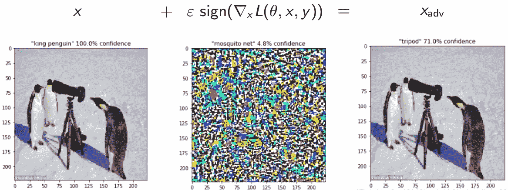

# 深度学习中的对立例子

> 原文：<https://towardsdatascience.com/adversarial-examples-in-deep-learning-be0b08a94953?source=collection_archive---------1----------------------->

这篇文章将包含与我在上次[深度学习会议](https://www.meetup.com/Deep-Learning-Paris-Meetup/)上的[演讲](https://github.com/rodgzilla/Deep-learning-presentation/blob/master/adversarial_samples/gchatel_adversarial_samples.pdf)基本相同的信息。我觉得随着越来越多的领域开始在关键系统中使用深度学习，让人们意识到神经网络如何被愚弄以产生奇怪和潜在危险的行为是很重要的。这篇文章的目标不是尽可能精确和详尽，而是让你对对立的例子有一个基本的了解，并希望让你对现代深度学习的一个问题敏感起来。

这篇博文和更多关于机器学习安全的信息可以在以下地址获得:【mlsecurity.ai/blog。

在开始这篇文章之前，我还想提一下，我不是做这项工作的研究人员的一部分。我只是一个非常好奇的人，来自 fast.ai MOOC，对深度学习充满热情。

首先，什么是对立的例子？

一个相反的例子是**输入数据**的样本，该样本已经被**非常轻微地**修改，其修改方式旨在导致机器学习对其进行错误分类。

一个例子应该有助于巩固这个想法。

An image classified as “suit” by the VGG16 neural network (left), a perturbation created specifically using the image on the left (middle) and the resulting perturbed image classified as a wig (right).

在这个图中，我们可以看到扰动图像(最右边)的分类显然是荒谬的。我们还可以注意到，原始图像和修改后的图像之间的差异**非常微小** *。*

有了像[“加州终于为真正的无人驾驶汽车做好准备了”](https://www.wired.com/2017/03/californias-finally-ready-truly-driverless-cars/)或[“五角大楼的‘终结者难题’:会自己杀人的机器人”](https://www.nytimes.com/2016/10/26/us/pentagon-artificial-intelligence-terminator.html)这样的文章，应用对抗性的例子并不难找到……

在这篇文章中，我将首先解释这些图像是如何被创造出来的，然后讨论已经发表的主要观点。更多细节和更严谨的信息，请参考参考的研究论文。

首先，快速提醒一下**梯度下降**。梯度下降是一种优化算法，用于寻找可微函数的局部最小值。

A curve and a tangent to this curve.

在左图中，你可以看到一条简单的曲线。假设我们想要找到一个局部最小值(一个 *x* 的值，其中 *f(x)* 是局部最小值)。

梯度下降包括以下步骤:首先为 *x，*选择一个初始值，然后根据 x 计算 *f* 的导数*f’*，并为我们的初始猜测进行评估。 *f'(x)* 是曲线在 *x 处切线的斜率*根据这个斜率的符号，我们就知道是要增加还是减少 *x* 才能使 *f(x)* 减少。在左边的例子中，斜率是负的，所以我们应该增加 *x* 的值，使 *f(x)* 减小。由于切线是曲线在微小邻域内的良好近似，应用于 x 的值变化非常小，以确保我们不会跳得太远。

现在，我们可以使用这种算法来训练机器学习模型。

A set of data points and a linear model initialized randomly.

假设我们有一组点，我们想找到一条线，它是这些值的合理近似值。

我们的机器学习模型将是直线 *y = ax + b* ，模型参数将是 *a* 和 *b* 。

现在使用梯度下降，我们要定义一个函数，我们要找到一个局部最小值。这是我们的**损失函数**。

这个损失取一个数据点 *x* ，它对应的值 *y* 和模型参数 *a* 和 *b* 。损失是真实值 *y* 和 *ax + b，*我们模型的预测的平方差。实际值和预测值之间的差异越大，损失函数值就越大。凭直觉，我们选择平方运算来惩罚真实值和预测值之间的大差异，而不是小差异。

现在我们根据模型 *a* 和 *b* 的参数计算我们的函数 *L* 的导数。

如前所述，我们可以用每个数据点 *(x，y)* 的 *a* 和 *b* 的当前值来评估该导数，这将给出损失函数切线的斜率，并使用这些斜率来更新 *a* 和 *b* ，以便最小化*l*

好的，这很酷，但这不是我们要如何产生对立的例子…

事实上，这正是我们要做的。假设现在模型是固定的(你不能改变 *a* 和 *b* ，你想增加损失的价值。唯一需要修改的是数据点 *(x，y)* 。由于修改 y s 实际上没有意义，我们将修改 x*s。*

我们可以用随机值代替 x，损失值会增加很多，但这并不微妙，特别是，对于绘制数据点的人来说，这是非常明显的。为了使我们的变化不被观察者明显察觉，我们将根据 *x.* 计算损失函数的导数

现在，就像以前一样，我们可以在我们的数据点上计算这个导数，获得切线的斜率，并相应地少量更新 *x* 值。损失将会增加，并且由于我们正在少量修改所有点，我们的扰动将很难被检测到。

嗯，这是一个非常简单的模型，我们刚刚弄乱了，深度学习要复杂得多…

你猜怎么着？不是的。我们刚刚做的一切在深度学习的世界里都有直接的对等物。当我们训练神经网络来分类图像时，损失函数通常是分类交叉熵，模型参数是网络的权重，输入是图像的像素值。

对抗样本生成的基本算法，称为**快速梯度符号法**(来自[本文](https://arxiv.org/abs/1412.6572))，正是我上面描述的。让我们解释一下，并在一个例子上运行它。

设 *x* 为原图像， *y* 为 *x* 的类， *θ* 为网络的权值， *L(θ，x，y)* 为用于训练网络的损失函数。

首先，我们根据输入像素计算损失函数的梯度。∇算子是一种简洁的数学方法，它根据函数的许多参数来计算函数的导数。你可以把它想象成一个形状矩阵*【宽度，高度，通道】*，包含切线的**斜率。**

和以前一样，我们只对斜率的符号感兴趣，以了解我们是想增加还是减少像素值。我们将这些符号乘以一个非常小的值 *ε* ，以确保我们不会在损失函数表面上走得太远，并且扰动是察觉不到的。这将是我们的**摄动**。

我们的最终图像就是我们添加了扰动 *η的原始图像。*

让我们在一个例子上运行它:

FGSM applied to an image. The original is classified as ‘king penguin’ with 100% confidence and the perturbed one is classified as ‘tripod’ with 71% confidence.

能够使用目标模型计算梯度的攻击系列被称为**白盒攻击**。

现在你可以告诉我，我刚才提出的攻击并不真实，因为你不太可能获得自动驾驶汽车上损失函数的梯度。研究人员想到了完全相同的事情，在[的这篇论文](https://arxiv.org/abs/1602.02697)中，他们找到了一种处理方法。

在更现实的情况下，您可能想要攻击只能访问其输出的系统。这样做的问题是，你将无法再应用 *FGSM* 算法，因为你将无法访问网络本身。

提出的解决方案是训练新的神经网络*M’*来解决与目标模型 *M* 相同的分类任务。然后，当*M’*被训练后，使用 *FGSM* 使用它来生成对立样本(我们现在可以这样做，因为它是我们自己的网络)，并要求 *M* 对它们进行分类。

**他们发现 *M* 会经常错误分类使用*M’***生成的对立样本。此外，如果我们无法获得针对*M’*的适当训练集，我们可以使用 *M* 预测作为真值来构建一个训练集。作者称之为合成输入。这是他们文章的节选，在文章中他们描述了他们对他们无法访问的 MetaMind 网络的攻击:

*“在标记了 6400 个合成输入来训练我们的替代品(比 MetaMind 使用的训练集小一个数量级)后，我们发现他们的 DNN 对用我们的替代品制作的敌对例子的错误分类率为 84.24%”。*

这种攻击被称为**黑盒攻击**，因为你把目标模型看成一个黑盒。

因此，即使攻击者没有访问模型内部的权限，他仍然可以产生对抗性的样本来欺骗它，但是这种攻击环境也是不现实的。在真实场景中，攻击者不被允许提供自己的图像文件，神经网络会将相机照片作为输入。这就是本文的作者试图解决的问题。

他们注意到，当你打印已经用足够高的 *ε* 生成的对立样本，然后对该打印进行拍照并分类时，神经网络仍然在相当大的时间里被愚弄。作者录制了一段视频来展示他们的成果:

Adversarial example in the physical world.

“我们使用手机摄像头拍摄的图像作为 Inception v3 图像分类神经网络的输入。我们表明，在这样的设置中，使用原始网络制作的敌对图像的很大一部分被错误分类为 ***，即使当通过摄像机*** *输入分类器时也是如此。”*

既然现实环境中的潜在攻击似乎是合理的，那么让我们回顾一些防御策略。

当试图为对立的例子辩护时，想到的第一个想法通常是生成大量的例子，并以这些图像和正确的类为目标在网络上运行更多的训练通道。这种策略被称为**对抗性训练**。

虽然这种策略提高了对 *FGSM* 攻击的鲁棒性，但它有多个缺点:

*   它无助于对抗更复杂的白盒攻击，如 [*RAND+FGSM*](https://arxiv.org/abs/1705.07204) ，正如文章中所解释的，我们不能用它来对抗训练网络。
*   它也无助于对抗黑盒攻击。

这最后一点很令人惊讶，但却是真实的，在许多情况下都观察到了。这种行为的原因在[本文](https://arxiv.org/abs/1705.07204)中探讨。正当我写这篇文章时，我们不知道如何完美地进行适当的白盒防御。正如作者指出的那样，经过对抗性训练的网络仍然容易受到黑盒攻击，这一事实在介绍新防御策略的文章中往往没有考虑到。

虽然白盒防御似乎是一个困难的问题，但攻击者可以访问模型权重的假设是很大的。在这篇论文中，研究人员试图创造出对黑盒攻击具有鲁棒性的网络。

由于经过对抗训练的网络仍然容易受到黑盒攻击，作者提出了**集合对抗训练**，这是一种策略，它包括使用来自其他模型集合(通常为 2 到 5 个)的修改样本来对抗训练一个模型。例如，他们训练一个模型，使用其他 5 个预训练模型制作的对立例子对 MNIST 数字进行分类。对于黑盒攻击，错误率从对抗训练模型的 15.5%到整体对抗训练模型的 3.9%。

这种算法是迄今为止黑盒防御中最好的。

作为对辩护部分的总结，我将引用 I. Goodfellow 和 N. Papernot 的一篇博文:

*“到目前为止，大多数针对对抗性例子的防御措施都没有很好地发挥作用，但那些发挥作用的措施却没有适应性。这意味着这就像他们在玩打地鼠游戏:他们关闭一些漏洞，但让其他漏洞保持开放。”*

我希望你喜欢阅读这篇博文。如果你注意到任何拼写或数学错误，不要犹豫留下评论。