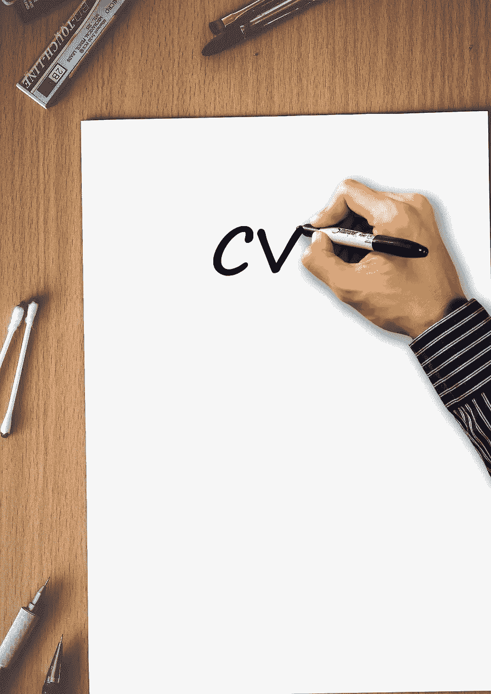

# 找数据科学工作的建议:简历

> 原文：<https://towardsdatascience.com/advice-for-getting-a-job-in-data-science-the-cv-c5b8ec6bebc?source=collection_archive---------5----------------------->

> 一份出色的简历可能会让你获得面试机会。一份不好的简历会被扔掉！

这就是简历的重要性。通常这是雇主对你的第一印象，所以不要想让它变好，你的目标是让它变得出众。

现在，我远不是写简历的专家。如果我说我的求职成功率高于平均水平，那我是在撒谎。此外，网上已经有几篇文章对如何写简历给出了很好的指导和建议。事实上，我读过的对数据科学简历提出建议的最好的文章之一是由皇家邮政高级分析和数据科学主管本·迪亚斯写的，题为[“招聘经理在数据科学家的简历中寻找什么？”](https://www.google.co.uk/url?sa=t&source=web&rct=j&url=https://www.linkedin.com/pulse/what-do-hiring-managers-look-data-scientists-cv-ben-dias&ved=0ahUKEwjhpqzzosnYAhVlLcAKHSSOARMQjjgILzAC&usg=AOvVaw1yoAP78efsFJ97Kcu-UZWB)

那么，我为什么要费心写一篇关于简历建议的帖子呢？

几个月前，我被要求浏览简历，并帮助筛选公司数据科学职位的面试候选人。这对我来说非常有见地。我看到了一些非常突出的东西，有正面的也有负面的。所以我想根据我从那次经历中学到的东西给你一些建议。

# 1.不要低估自己

记住，你是为了正确的理由而努力脱颖而出。当雇主看你的简历时，通常不是孤立的。他们看过很多简历，所以你会被拿来和其他人比较，有些人不怕夸大一点来让自己脱颖而出。雇主的任务是筛选出那些夸大事实的人。然而，如果要在一个简历夸大的候选人和一个简历低估自己的候选人之间做出选择，我可能会把赌注押在简历夸大的候选人身上。

让我们明确一点，我不是说你应该在简历上撒谎，但是不要使用让雇主有理由认为你没有实际上那么好的语言。

例如，假设你已经完成了一些在线数据科学课程，并且你已经用 Python 编程 6 个月了。你不太可能成为世界一流的 Python 程序员。但这并不意味着你应该在简历中注明你是“Python 初学者”。

Python 初学者是什么水平？是不知道如何编写 for 循环的人，还是对 Scikit-learn 中的机器学习知之甚少的人？我认为它们是不同程度的暴露。使用 Scikit-learn 的人可能可以浏览机器学习包生态系统，但 for-loop 初学者可能甚至没有见过终端/命令窗口。你永远不知道雇主会如何解释“初学者”。

所以请记住，你不必夸大你的技能，但是不要使用低于你的技能水平的语言。不要低估自己。

# 2.关注价值

作为一名数据科学家，很容易高估算法的重要性。关于如何实现各种 ML 模型和解决不同问题的新神经网络架构的教程不计其数，似乎每周都会出现。但事实是，模型只是造就优秀数据科学家的一小部分。最终，你必须表明你理解并关心商业价值。

我记得曾经看过一份候选人的简历，据说他有超过 10 年的数据科学经验。简历中充斥着数据科学术语。这位候选人使用了各种算法来完成工作项目，并获得了非常好的评估指标分数。太好了。但是在任何地方都没有提到商业附加值。这个项目产生了多少额外收入？对于 90%的分类准确率，效率提高了多少？我可以继续。

你简历上关于某个特定项目的分数应该是这样的:“我使用了 X 技术，获得了 Y 分数，并转化为 Z 值”。

如果你不能将模型性能的输出与附加的商业价值联系起来，那么你将失去巨大的印象分。

*注意*:如果你正在申请你的第一份工作，那么这不是一个很大的问题，但是如果你现在已经在工业界工作，那么你需要考虑你目前的项目如何提供商业价值，如何增加你的简历对未来雇主的吸引力。

记住**关注价值。**

# 3.展示自己

显然，简历应该是一个关于你和你的技能的光辉故事，但这是 2018 年的人！你可以超越你的简历。您可能有一个展示您的数据科学技能的博客，或者您可能有展示您进行精彩演示的视频。至少你应该在 GitHub 上有几个项目，以显示你有一个体面的技术能力的基础水平。你的简历中应该有所有这些东西的链接。不能保证雇主会看它，但是你给了他们选择权。谁知道呢，如果他们真的看了，你可能会给他们留下深刻印象。这就是我看过的一份简历的情况。

其中一个候选人链接了他们的博客，所以我决定去看看。我在那里看到了一些很棒的文章，其中一篇是关于我不熟悉的话题。我可以立即看出这位候选人有很好的技术知识和良好的书面沟通技巧，所以我建议这位候选人应该被选中参加面试(当然，简历的其他部分也必须很好)。

所以不要害怕，**展示自己**。

# **4。陈述你的相关技能…..早期**

当你看一份工作说明书时，他们几乎总会有一部分是关于*【期望技能】*或其他类似的内容。这听起来可能很明显，但这些技能应该与你在简历中写的技能相匹配(你不必匹配所有的技能，在许多情况下，即使 50%也可以)。所以确保你在简历中陈述了这些技能。

我个人喜欢简历中的“*技术技能*”部分，因为它很容易查看和浏览列表，以了解候选人拥有什么技能，而无需试图挖掘大量的项目工作。虽然有些人不同意这一点。挺主观的。

但是无论你决定做什么，确保这些技能能在你简历的第一部分找到。

大约 6 个月前，我看了一个朋友的简历，他是一名博士后研究员。我已经知道他们具备初级数据科学家所需的基本技能，但是，他们的简历并没有说明这一点。我不得不翻到简历的第二页，才找到相关的技能。雇主不可能有那么大的耐心。那份简历很可能在任何人接触到相关部分之前就已经被许多公司扔掉了。

所以记得在早期**陈述你的相关技能。**

# 5.让很多人阅读你的简历

让我这么说吧:

> 如果你是唯一看过你简历的人，那么这是一份糟糕的简历！

也许这种说法有点苛刻，但我这样说是有充分理由的。简历不是为你设计的，而是为别人设计的——雇主。所以，即使你喜欢你的简历，你需要喜欢的人也可能不喜欢。

从几个信任的人那里获得反馈。不要害怕听到批评。它发生了。你的简历在初稿中不太可能是完美的。在寄出之前展示给别人看将会改善它，最重要的是，增加你获得面试的机会。

我自己的简历被我的三个朋友评论过，那是从我找到现在的工作开始的。有些人对应该如何写有非常不同的意见(一个人认为应该是 1 页，另一个人说如果我溢出到 3 页也没关系)，所以我不得不管理我挑选的内容，但总的来说，反馈极大地改善了我的简历。

所以在你让很多人阅读你的简历之前，不要发出你的简历。

和往常一样，这并不是制作简历技巧的详尽清单，但这些是我在浏览候选人简历时注意到的。我希望这对你有所帮助。如果您有任何其他提示、意见或问题，请随时在下面留言。

感谢阅读。