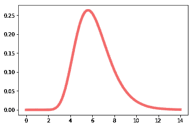
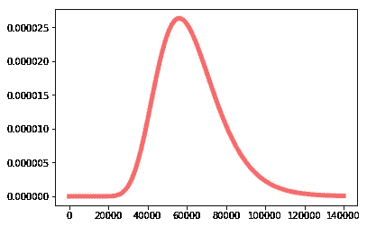

# 敏捷评估:错过的机会和错过的期限

> 原文：<https://towardsdatascience.com/agile-estimation-missed-opportunity-and-missed-deadlines-37f0097175db?source=collection_archive---------23----------------------->

为什么这些公司关心他们的开发项目何时完成？显然，为了更快地从项目中获益。这可能是销售或利润的增加，也可能是成本的降低。我们称之为错过的机会，它有美元的成本。

计算错过的机会比计算投资回报率更容易、更直接，更重要的是，误导性更小。想想看，软件项目的实际投资回报率比预计的要低多少倍？使用错过的机会计算也有助于您确定项目的优先级。

在这本笔记本中，我们将根据团队在一次迭代中可以完成的故事点数量，尝试估计单个项目错失机会的概率分布。正如在前面的故事中所讨论的，我们将使用对数正态分布来估计项目速度。

```
import numpy as np
from scipy.stats import lognorm
data=np.array([14, 12,  7, 14, 13])
shape, loc, scale = lognorm.fit(data, floc=0)
```

在这里，我们获取了关于团队过去迭代的信息(分别是 14、12、7、14、13 个故事点),并使其符合对数正态分布。我们感兴趣的问题是:给定数量的故事点(在这个例子中是 70 个)需要多少次迭代。同样，我们使用对数正态分布的奇妙性质，即逆也是对数正态的，具有相同的参数**和逆参数**

```
***num_points = 70
dist_iterations = lognorm(shape, loc, num_points/scale)
print(f'Mean: {dist_iterations.mean()}')
print(f'Median {dist_iterations.median()}')
print(f'Standard deviation {dist_iterations.std()}')Mean: 6.219638285087961
Median 6.011776848254893
Standard deviation 1.6496339740439272#We plot the distribution
%matplotlib inline
import matplotlib.pyplot as plt
def plot_dist(frozen, low=0, high=14):
    fig, ax = plt.subplots(1, 1)
    x = np.linspace(low, high, 100)
    ax.plot(x, frozen.pdf(x), 'r-', lw=5, alpha=0.6, label='lognorm pdf')
plot_dist(dist_iterations);***
```

******

***所以我们看到我们有很好的机会在 7 次迭代内完成它，但是也有可能需要 12 次迭代！让我们说，由于错过了机会，业务在每次迭代中损失了 10，000 美元。那么错过的机会分布如下:***

```
***missed_opportunity_per_iteration = 10000
missed_opportunity = lognorm(shape, loc, num_points/scale*missed_opportunity_per_iteration)
print(f'Mean: {missed_opportunity.mean()}')
print(f'Median {missed_opportunity.median()}')
print(f'Standard deviation {missed_opportunity.std()}')
plot_dist(missed_opportunity, 0, 140000);Mean: 62196.382850879614
Median 60117.768482548934
Standard deviation 16496.33974043927***
```

******

***正如我们所看到的，我们有各种动机来更快地完成项目，以使曲线向左移动。也许我们增加更多的开发人员来提高速度？我们可能还想缩小范围，以减少故事点的数量。***

***最后，不管一些敏捷理论家怎么说，企业设置最后期限是有原因的。当一个软件项目完成后，企业必须做 UAT，接触一些客户，请他们提供反馈，等等。企业也希望提前对此进行规划，因为关闭活动有固定成本，如果项目不能按时交付，这将增加项目成本。我们称之为延迟成本。***

***如果错过的机会成本为零，那么为了避免延迟成本，我们计划尽可能晚的结束活动。但是如果非零，那么两个成本之间就会有权衡。因此，如果 ***C*** 是结束成本， ***Co*** 是错过的机会成本， ***N*** 是实际迭代次数，*是计划迭代次数，那么总成本将是:****

******

***我们需要在 ***M 上最小化这个成本*** 我们可以对 **M** 求导。注意，那个***P*(*N*>*M*)**就是所谓的生存函数，或者说**1*CDF***，其中 **CDF** 是累积密度函数。生存函数的导数是负概率密度函数。因此， **M** 的最佳值由下式定义:***

****

**在这个例子中，我们猜测延迟成本是 95，000 美元**

```
**#We solve the equation numerically:
from scipy.optimize import *
delay_cost = 95000
def to_optimize(m):
    return missed_opportunity_per_iteration - delay_cost*dist_iterations.pdf(m)
roots = newton_krylov(to_optimize, 8.0)
float(roots)7.994986056462073**
```

**这向我们表明，即使团队很可能在六个迭代中完成项目，但是由于延迟的高成本，最好在八个迭代之后安排关闭活动。**

**在实践中，迭代中充满了所谓的“松弛”，即低优先级的故事，当所有高优先级的故事都完成时，团队就会这样做。如果团队确实在六个迭代中完成了，那么它就可以处理松弛的故事或者解决技术债务。**

**你可以在这里找到这篇文章[的笔记本。](https://github.com/mlarionov/machine_learning_POC/blob/master/agile_estimation/agile_estimation_3.ipynb)**