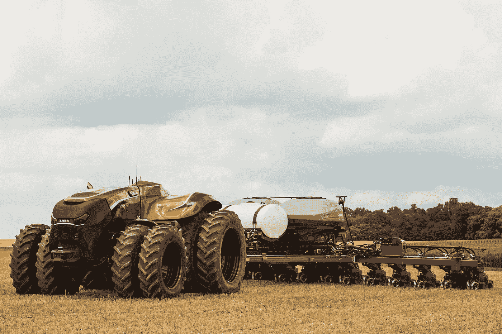

# 农业技术 2.0——机器的崛起

> 原文：<https://towardsdatascience.com/agtech-2-0-rise-of-the-machines-118aad57e778?source=collection_archive---------7----------------------->

Case IH Magnum Autonomous Concept Tractor

最近媒体上有很多关于自动驾驶汽车和人工智能(AI)等新技术的谈论。这让人想起阿诺德·施瓦辛格在《终结者》中的形象，“天网”扮演反派，因为它变得有自我意识，并命令机器反抗人类。

幸运的是，这些新兴技术的现实实际上比好莱坞暗示的要光明得多。农业是一个人工智能和自主设备可以增加巨大的经济和环境价值的行业，以帮助养活世界上不断增长的人口。

农业行业涌现出越来越多的颠覆性公司，它们正在开发传感器、机器自动化和数据科学等新技术。例子包括土壤湿度传感器，如提高灌溉效率的 CropX。使用无人驾驶飞行器(UAV)监测作物健康和生长阶段的能力，如 [AgEagle](http://ageagle.com/) 。最近，我们已经看到自动驾驶拖拉机的出现，如 [CNH Industrial](http://www.cnhindustrial.com/en-us/media/thedaythefarmchanged/Pages/default.aspx) 所展示的。

将所有这些颠覆性传感器和硬件技术结合在一起的粘合剂是数据科学。预测软件平台的一个全新的产品部分，如 [AgDNA](https://agdna.com/) 现在已经上市，并且正在快速发展。总的来说，这种新一代农业技术被称为农业技术 2.0，它们将共同改变粮食种植的方式。

# **问题**

> 耕作是艰难的。技术可以提供帮助。

大规模的商业农业就像经营一个大工厂——只是在户外！是的，这个作物生产“工厂”暴露在自然环境中，没有墙壁或屋顶，它有间歇性的电力供应(阳光、降雨)，劳动力短缺(农村地区)，收入波动(商品价格)，并且假设作物一直存活到成熟，每年只支付一次工资。

正是天气、土壤类型、产量和收入的这种程度的可变性，使得农业具有难以置信的风险。事实上，没有两个季节是相同的，这意味着从一个季节到下一个季节的决策充满了不确定性。

今天的技术及其产生的基础数据将改变未来农场决策的方式。从一个季节到下一个季节，高分辨率数据和有关种植系统所有方面的信息的可用性意味着农民将有能力根据对历史结果的深入分析做出计算决策。

# **数据科学**

在寒冷的气候下，世界上许多农民一年只能种植一种作物。因此，在他的职业生涯中，农民可能只有 40 次“做对”的机会。这给错误留下了很小的空间。

农业技术 2.0 将为种植者创造公平的竞争环境。田间传感器现在全天候向大数据算法传输数据，大数据算法不断处理信息，并提供实时见解，帮助种植者做出明智的决策。

> 展望未来，没有数据，这只是一种看法。

有几个关键因素将 AgTech 2.0 软件平台与传统的精准农业桌面工具区分开来。新一代软件平台包含以下属性，以便在 AgTech 2.0 级别上竞争:

-基于云的集中式数据

-与支持互联网的传感器实时连接

-与所有主要品牌设备的互操作性

-自动化大数据处理能力

-具有预测洞察力的算法

# **解决方案**

AgTech 2.0 正在将农业从依赖人类生成的数据转移到自动化机器生成的连续数据流。也就是说，农业从来不缺数据。自 20 世纪 90 年代中期以来，联合收割机一直在记录产量。然而，直到现在，土壤、气候、植物健康、灌溉和管理实践等其他关键输入才以数字形式随时可用并实时传输。

AgTech 2.0 下一代平台使用实时真实数据为预测模型提供信息，这些预测模型可以根据从历史结果中得出的模式和结果生成预测和见解。种植者或农学家仍将决定需要做什么。但有了这种新型工具，它就成为一个高度明智的决策，降低生产风险和增加经济回报的可能性更大。

# **真实世界的例子**

AgDNA 等公司的目标是在种植者知道该问什么问题之前提供答案。

目标是在小问题变成大问题之前解决它们。如前所述，农业中的误差幅度很小。这个季节早期的问题会限制植物的生长潜力，严重影响收获后的产量。

在 AgTech 2.0 硬件平台不断传输高分辨率数据的同时，其软件平台也在分析这种实时传输，以找到提高产量或降低运营成本的见解。

举个例子，一辆拖拉机穿过田野去种玉米。今天，这种拖拉机基本上是自动驾驶的，使用 GPS 定位在田间精确导航。

用于驾驶拖拉机的测量级 GPS 数据也可用于构建田地的 3d 高程模型。一旦知道了油田的地形，智能软件平台就可以识别出洼地。这些是田地中的低洼地区，在暴雨期间没有排水能力。

知道了这些低气压区的存在，软件就能计算出如果田地降雨量高于平均水平，某些疾病可能会发生的可能性。通过分析数十万英亩类似排水问题的历史结果，大数据软件可以确定整个田地或特定洼地中各种农艺问题的概率。

有了这些信息，系统可以向农民或农学家推荐一个处方进行评估。然后可以根据经济回报决定是否施用最佳量的杀真菌剂来防止疾病仅在低洼地区爆发还是在整个田地中爆发。

此外，当作物收获时，可以将所得的产量数据与 3d 高程图进行比较。如果排水不良和低产之间的关联概率很高，那么可以根据成本效益分析做出是否纠正问题的经济决策。这种级别的信息为种植者提供了商业案例和财务建议，因此他们可以确定是否愿意在未来的生长季节纠正排水问题，以增加利润。

这只是许多使用案例中的一个例子，在这些案例中，可以自动捕获和分析数据，以确定是否存在提高盈利能力和管理整个农业运营风险的经济机会。

# **农业科技 2.0 的未来**

农业科技 2.0 运动将快速加速。大量资本投资正从私人投资者、风险资本家和主要原始设备制造商和投入物制造商流入该部门。短期的挑战不是技术，而是[不同制造商之间缺乏数据标准和兼容性](https://medium.com/@paul_agdna/whats-the-number-one-dilemma-for-agtech-today-6c0ab6c43c7f)。

一些关键的颠覆性技术包括:

*无人机*

无人机目前面临的挑战包括发射所需的时间、有限的飞行时间和数据的自动化处理。随着时间的推移，这些问题将被克服，无人机将像一个超级本地卫星系统一样为每个农场提供高分辨率数据。

*传感器*

新的拖拉机、喷雾机和收割机已经包含数百个传感器，向云提供农艺和操作见解。未来，传感器将走出驾驶室，进入田间，提供针对每株植物的实时土壤和作物健康信息。

*机器自动化*

无人驾驶机械将成为常态。这并不是说每一项操作都将是自主的，而是像喷洒这样的低效率活动将是自动化的。此外，它们将由较小的电动车辆进行，这些车辆仅在杂草出现(或预测到)时喷洒，以确保最低的成本和最低的环境影响。

*数据科学*

与大多数行业一样，上述所有硬件解决方案都将商品化，价格是一个关键的购买因素。真正的价值在于从资本设备和最终数据中最大化经济价值的[底层算法。](https://medium.com/@paul_agdna/how-predictive-analytics-will-make-farming-more-sustainable-421b8f955661)

这是一个激动人心的农业时代。任何有前途的程序员、工程师或科学家都会被建议探索精准农业作为职业道路。对于我们这些已经在农业技术领域的人来说，我们有责任确保我们提供切实可行的解决方案，为种植者解决现实世界的问题。AgTech 2.0 是要遵循的路线图。

希望我们不会很快看到阿尼的天网战士占领农场。我们将看到新一代 AgTech 2.0 硬件和软件解决方案在农场中的应用，帮助种植者做出重要决策，并提高其运营的盈利能力和可持续性。