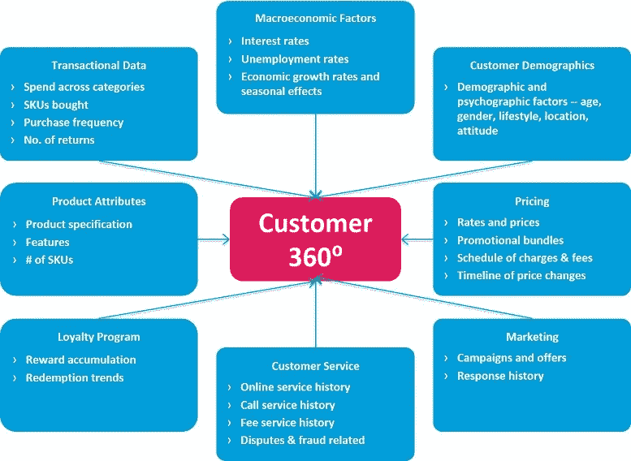
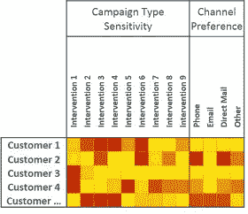
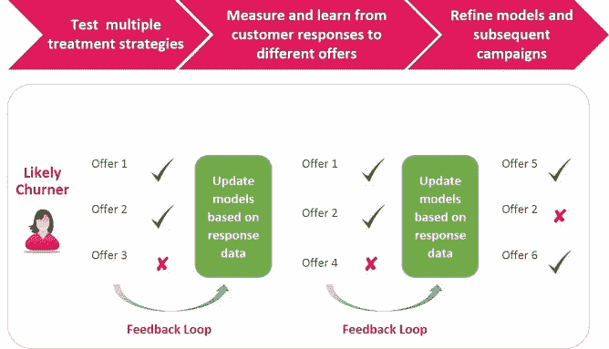

# AI 101:了解客户流失管理

> 原文：<https://towardsdatascience.com/ai-101-understanding-customer-churn-management-514416c17643?source=collection_archive---------1----------------------->

请考虑贝恩公司进行的一项研究中的以下事实:

> 获得一个新客户的成本可能比留住一个客户的成本高 700%。
> 
> 仅仅提高 5%的客户保持率就能增加 25%到 95%的利润。

这些是相当重要的数字。因此，客户维系是企业最重要的目标之一，这是显而易见的。保留下来的客户也更有可能参与进来，对追加销售和交叉销售更加开放。

从历史上看，客户流失通常只是一个利益衡量指标，企业对此无能为力。由于根据该指标的定义来衡量客户流失是被动的，而不是主动的，大多数企业能够做的就是试图确定是什么推动了客户流失数字，并调整这些因素。

然而，今天的情况大不相同。如今，公司有能力捕捉客户参与度多个属性的数据点。复杂的人工智能和数据分析技术的出现进一步帮助利用这些丰富的数据，以更加有效的方式解决客户流失问题。如今，大多数公司，尤其是 B2C 领域的公司，都设计了具体的计划来解决客户流失问题。因此，了解它的各个方面是很重要的。

## **什么是流失？**

流失——或客户流失——简单地定义为特定时期内客户流失的数量或百分比，扣除该时期内新获得的客户。换句话说，该指标跟踪您在吸引客户方面的成功与否。

对“流失客户”的解释有几个需要考虑的细微差别:

*   **“绝对”与“假定”客户流失**:在某些情况下，客户主动终止与您的关系(例如，银行账户持有人关闭账户)，而在其他情况下，他们可能只是停止与您合作，即使在纸面上他们的状态没有变化(例如，客户停止从她过去经常购买的零售商处购买)。
*   **客户流失定义的时间段因行业而异**:对于一家电信公司，如果一个客户一个月没有使用你的网络，你可能会认为她“流失”了。另一方面，对于航空公司来说——因为雇佣频率通常较低——定义自然减员的时间段可能是 6 个月或 12 个月。
*   **“反应性”与“预期性”客户流失**:客户流失有两种截然不同的方式。客户有时会对特定的负面事件或经历做出反应，导致他们离开你的企业，这通常被称为“反应性”流失。例如，信用卡客户可能会因为意外的费用、不满意的客户服务体验、经历冗长的争议解决过程等事件而却步。另一方面，有时脱离是逐渐的，并且不一定由任何特定的触发器驱动。这是“预期的”或“无声的”客户流失。由于显而易见的原因，后者更难管理。

## **机器或人工智能驱动的方法如何帮助管理客户流失？**

流失管理的核心在于能够识别潜在流失者的早期预警信号。如果我足够早地知道某个特定的客户可能会离开我的公司，我就可以采取积极的措施来阻止它的发生。这就是分析可以发挥变革作用的地方。让我们来看看其中的几个方面。

*   **确定已知负面触发因素及其影响之间的关系**:研究负面客户体验的历史数据以及不同类型的客户对这些负面体验的反应，有助于开发一个稳健的模型来预测反应性流失。然后，这可以用于跟踪当前客户正在经历的类似触发事件，以确定他们可能会如何反应。那些由于一次或多次负面经历而被确定为可能流失的人可以走上康复之路。*(注意:在包含内部触发器的同时也包含外部触发器，这一点很重要，尽管获取数据可能会更加困难。外部触发因素通常包括竞争对手的行为，如竞争对手的大幅降价、忠诚度计划的变化、收购动机等。)*
*   **根据过去了解衰落行为**:历史数据也可用于预测非触发驱动的损耗。根据对当前客户的 360 度评估，将当前客户与流失的历史客户进行对比，有助于预测高风险客户。换句话说，如果我表现出的参与行为类似于已经淡出的老客户，那么我很可能会走上类似的道路。这些行为可能是减少我购买的类别数量、减少我的购买频率、减少我的忠诚度积分兑换等。
*   **识别高风险群体**:还可以使用决策树模型等工具将客户群划分为不同的行为特征，从而识别具有高流失风险的细分或群体。让我们考虑一个电信行业案例来说明这一点——细分树可能会显示，加入不到一年且 70%以上的支出用于数据服务的客户的流失率比平均水平高十倍。或者年龄小于 25 岁并且在过去 12 个月中有超过 7 个月延迟支付账单的客户的流失率比平均值高 7 倍。然后，这些群体可以被挑选出来作为高风险群体，属于这些群体的客户可以得到适当的对待。

## **小心误报**

有效的流失管理的一个重要问题是流失预测模型中的高误报率。误报会对任何解决客户流失的计划产生严重的不利影响，因为它们会增加计划的成本。简而言之——你实际上是在花大价钱试图留住那些不会因为这些高风险的假阳性预测而真正面临离开你的风险的客户。在预期流失预测的情况下，这些假阳性通常会高于 50%。下图显示了使用逻辑模型进行流失预测的典型假阳性率曲线。

Image 1: False Positive Rate by Decile

一般来说，可以采取一些步骤来提高假阳性率。就数据类型而言，增加数据点的数量就是这样一个步骤(例如，用客户体验数据、营销活动数据等丰富交易数据。)和数据量(例如使用数据的月数)。解决假阳性的另一个潜在方法是利用模型异构性来提高性能。这可以通过选择对特定预测可能最有效的不同模型(例如，SVM、神经网络、RBM、协同过滤)并将它们组合在一起以优化整体性能来实现。

## **客户流失管理需要哪些数据？**

正如任何处理客户行为的用例一样，可以利用的数据越多，效果就越好。对客户与您的业务接触的所有方面有一个 360 度的视图将使您有一个整体的方法。下图提供了一些可以纳入的关键数据集。

Image 2: Potential Data-sets to Build a 360-Degree View of Customers

## **投资回报率最重要的问题**

仅仅识别高交易风险的客户是不够的。全面的客户流失管理需要在此基础上确定最佳行动方案，以解决单个客户层面的流失风险。幸运的是，人工智能和数据分析在这里也有巨大的价值。有三个关键步骤可以有效地处理可能的搅动者。

*   **确定客户吸引力**:每个客户对企业都有不同的价值。因此，第一步是找出每个客户对你有多重要，这样你就可以把你的治疗费用集中在对你有最高终身价值的客户身上。顾客吸引力可以建模为消费、收入、票价、钱包大小、频率和其他衍生消费模式的函数。
*   **确定顾客对治疗清单的敏感度**:下一步是确定对每个人最有效的治疗策略。治疗策略通常包括两个因素——他们对哪种运动或干预反应最好，以及他们对什么沟通渠道反应最好。

Image 3: Sample of Customer Sensitivity Matrix

*   **测试和学习反馈循环**:最后，即使在你弄清楚谁是你最有价值的处于风险中的客户，以及什么样的策略可能最有效地重新吸引他们之后，拥有一个灵活的操作流程也是至关重要的，它可以让你快速地从你给他们的报价和他们的反应中学习。这个反馈循环将不断地调整模型，以进一步提高性能。

Image 4: Customer Treatment Framework

识别和补救处于风险中的客户具有巨大的商业利益。有可能实施一系列解决方案来实现这一目标。

有现成的客户流失预测工具可以让企业以自助方式运营。这方面的挑战通常是这些模型的有效性，因为它们在很大程度上依赖于一种一刀切的方法。另一方面，企业可以选择构建内部专用的数据科学功能，用于多种用例，客户流失就是其中之一。这通常需要大量的前期投资和持续投资，并不总是对所有组织都可行。它通常也有更长的上市时间。

介于这两个极端之间的解决方案，将世界一流的外部专业知识与内部业务知识结合起来，往往是解决客户流失问题的最有效方式。