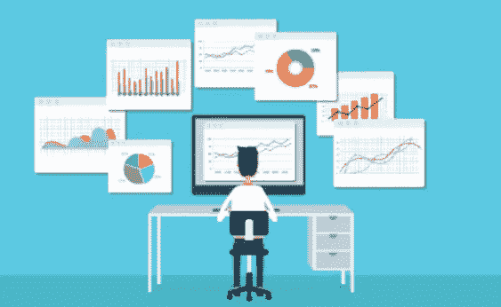
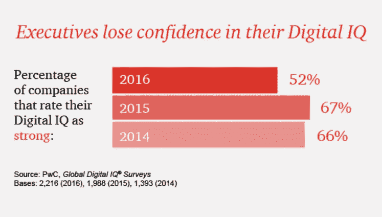
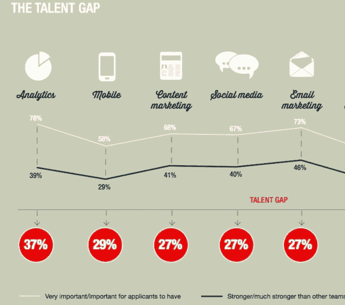
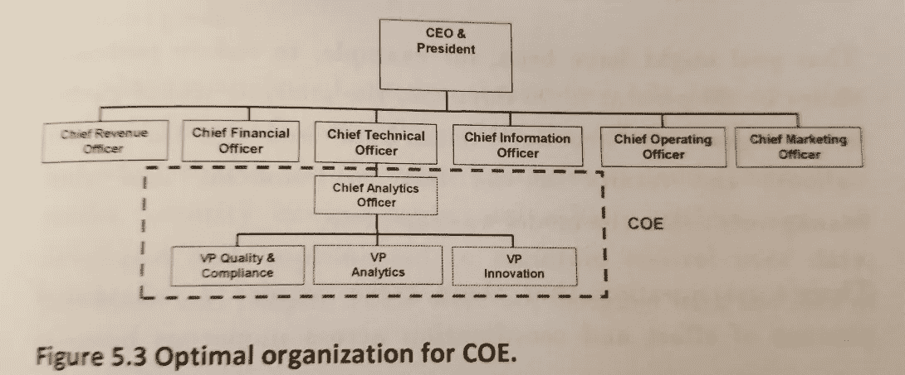

# 人工智能和预测分析:未来会怎样？

> 原文：<https://towardsdatascience.com/ai-and-predictive-analytics-what-does-the-future-hold-1806fd734c0f?source=collection_archive---------3----------------------->

人工智能和预测分析的进步将产生超越商业技术能力的影响。组织将在技能、实施等方面面临新的挑战。营销人员如何为变化做准备？

在这个系列中，我们已经看到了分析行业的进化过程如何自然地导致人工智能(AI)的集成，以创建准确的预测模型。

在第一篇文章中，我们探索了由技术进步驱动的[人工智能和预测分析作为营销工具的潜力](https://www.clickz.com/how-can-ai-allow-marketers-to-predict-the-future/112268/)，这些技术进步已经从基于规则的自动化转向更接近感知的东西。我们随处可见这样的例子，从谷歌的 Waze 这样的应用程序，到金融欺诈保护和亚马逊上的个性化推荐。

该系列的第二篇文章基于这项技术的[具体用例](https://www.clickz.com/5-businesses-using-ai-to-predict-the-future-and-profit/112336/)，展示了使用机器学习和人工智能来预测消费者行为和创造更好的业务成果的各种各样的业务。这些机会现在对所有公司开放，但抓住它们比仅仅购买一些新软件更复杂。

我们系列的第三篇也是最后一篇文章将关注预测分析的未来以及行业面临的挑战。

# 实施挑战

尽管如此强大的商业工具不可避免地会被大量采用，但现实要比这微妙得多。高管们希望做出更智能、更快速的决策，但在将业务转型为人工智能驱动的预测分析模型时，在数据、人员和技术的平衡方面存在某种高空绳索表演。

实施这一技术需要企业意识形态的转变，而不仅仅是资本投资，在数据分析方面从头开始的员工培训也是必不可少的。

此时，管理层对其组织的数字专业知识的信心似乎正在下降。普华永道最近的数字智商调查显示，高管们对团队能力的信心有所下降:

专业水平没有下降；这个行业变化太快，员工跟不上。

因此，如果人工智能驱动的预测分析要在首席信息官/CMO 的工具箱中占据核心位置，需要克服一些重大障碍。

在预测分析系列的最后一部分，我们将概述该行业未来面临的一些挑战，然后讨论企业现在可以开始实施的解决方案。

# 数据质量

在 Protoviti 最近对高管进行的一项调查中，数据被列为公司内广泛采用预测分析的最大障碍。质量是用来给“数据”这样模糊的术语增加特异性的最重要的修饰词之一。

在我们决定如何应对如此巨大的挑战之前，甚至“质量”也需要一些进一步的定义。

高质量的数据在格式上是一致的(即使是在大范围内)，反映了它所描述的真实世界的情况，并且能够进行可靠的、可重复的研究。

我们可以以 2010 年至 2014 年从滑铁卢出发的火车数据集为例，该数据集包含跨时间框架的间隙，并使用不一致的命名约定。人类在这样的数据集中挣扎，但是我们可以适应，甚至从其他地方获取数据。人工智能根本无法处理这样不完整的数据，因为它只能处理输入系统的数据。

世界上最好的人工智能技术只能利用我们提供的数据，因此企业意识到这些潜在的陷阱并知道如何避免它们至关重要。更多的数据通常意味着人工智能驱动的预测分析的结果更好，但它必须是正确的数据，才能回答你旨在解决的业务问题。

拥有合适的团队是开始这条道路的好方法。

# 招聘和培训合适的技能

预测分析技术越来越复杂，但行业内的知识水平不一定同步发展。

凯捷的一份报告发现，77%的公司认为缺乏合适的技能是成功数字化转型的最大障碍:

一份 ClickZ [报告](https://www.onlinemarketinginstitute.org/blog/2013/11/state-of-digital-marketing-talent-report/)更深入地确定了最需要的技能领域，与它们在组织内当前的复杂程度相比。

毫不奇怪，分析被列为最重要的技能，因为它在每个营销职能中都有潜在的用途。将分析视为技能差距最大的领域，这或许会更令人惊讶。

分析包括各种技术和数据调查类型。今天进行的大多数分析工作要么属于描述性的(发生了什么？)或者探索性的(为什么会发生？).

尽管操作未来预测分析系统背后的技术所需的技能水平可能会随着时间的推移而降低，但企业仍然需要确保其员工在投资一些新的、令人兴奋的人工智能系统之前，拥有数据分析的详细知识。

幸运的是，只要企业愿意投资，就有充足的资源和资格来帮助这种培训。理论和实践都应被视为这一培训的基本组成部分。

在[分析:如何用智慧取胜](https://www.amazon.com/Analytics-How-Intelligence-John-Thompson/dp/1634622375/)一文中，作者认为应该在大公司中建立卓越分析中心，由部门主管向首席技术官报告:

这种方法的目的是为分析提供一个明确定义的基础，其专家可以在此基础上教授组织内的其他人。

然而，我们可以从另一个角度来看这个问题。并非营销团队中的每个人都需要了解分析平台的内部运作才能从中受益。随着这些平台变得依赖机器学习来创建预测模型，这一点变得越来越真实。

> *不管怎样:广泛的知识基础仍然是必不可少的。如果不能提出正确的问题，或者不知道技术能够做什么(以及不能够做什么)，那么输出就不符合目的。*

因此，越来越多的人认为文科背景将成为统计学家和工程师越来越重要的补充。提出正确的问题作为假设的框架，然后调查结果的能力将是必不可少的，向高级利益相关者提出这些问题所需的软技能也是必不可少的。

本质上，如今需要一个村庄[来获得正确的分析](https://www.clickz.com/five-ways-to-maintain-data-quality-in-your-analytics/111635/)。但是，确保您的数据质量符合目的，并且您的分析团队拥有平衡的技能组合是一个很好的开始。

# 数据管理

当今时代不缺乏数据，随着物联网(IoT)设备继续进入世界各地的家庭，数据量只会增加。

每个公司都有潜在的利润丰厚的专有和第三方数据来源。基于云的解决方案可以远程存储大量数据，在一定程度上回答了数据应该保存在哪里的问题。

然而，即使企业使用像 Hadoop 这样的数据仓库，信息仍然需要转移到分析平台，并通过统计模型转化为见解。

对于许多企业来说，如何确保分析平台和人工智能系统跟上步伐仍然是一个难题。

数据管理还面临其他挑战，从数据挖掘到存储，最终将信息转化为有用的见解。

乔治·华盛顿大学和美利坚大学的科学家在 2013 年发表了一篇名为《大数据:前进中的问题和挑战》的论文，总结了这些潜在的问题:

随着欧盟 [GDPR 法规](https://www.clickz.com/is-it-time-to-rein-in-the-tech-giants-what-internet-regulation-could-mean-for-marketers/112122/)的即将出台，这些问题比以往任何时候都更加重要。企业有责任确保所有数据符合当地法律，并安全处置不符合法律的数据。

如果有一件事是肯定的，我们不能让 AI 来做这些决定。人工智能预测模型将评估提交给它们的任何历史数据，如果一家公司后来发现错误的数据被输入其人工智能分析平台，它得出的任何结论都将被裁定无效。

追溯如此复杂计算的步骤并调试任何不需要的变量将被证明是一项不可能的任务。因此，任何计划将大数据输入基于人工智能的预测模型的企业都应该谨慎对待他们的数据源。

# 有责任

这一类别是一系列次要但仍然重要的挑战的总称。

人工智能和预测分析在医疗保健等行业中有着明确定义的重要角色。 [80%](https://www.healthcatalyst.com/news/survey-8-10-hospital-leaders-say-predictive-analytics-important-future-yet-one-third-use/) 的医院领导认为这一领域“重要”，原因显而易见。任何能够发现与疾病相关的历史模式并预测其未来行为的工具在该领域都将被证明是非常宝贵的。

当应用于市场营销时，情况就不那么明朗了。毫无疑问，我们都可以从基于过去的准确预测中受益。事实上，这适用于整个社会。

然而，有一种观点认为，预测建模在一个依靠新想法蓬勃发展的行业中有一些局限性。复杂的人工智能系统和预测模型的诱惑是放弃控制，坚持我们知道将继续带来增长的东西。

此外，预测分析可以成为自我实现的预言。我们看到某个信息、产品或受众群预计会以更高的速度转化，因此我们转移预算以利用这一点。

如果预测成真了，那是因为预测准确，还是因为我们采取了行动使其准确？

最后，我们应该考虑人类创造力在这一过程中的作用。正如我们在关于人工智能驱动的内容创作的文章中所讨论的，人类创新和设计新的创造性解决方案的能力是人工智能还不能完全掌握的。因此，我们需要利用技术解放我们的团队，充分利用他们的能力来制定长期战略。

与任何人工智能技术一样，成功的最关键因素之一是人们在最大限度地利用他们所掌握的工具方面所扮演的角色。具体来看预测分析，这意味着确保高质量数据、最佳技术和有能力了解技术局限性的人之间的正确平衡。

*最初发表于*[T5【www.clickz.com】](https://www.clickz.com/ai-and-predictive-analytics-what-does-the-future-hold/112443/)*。*