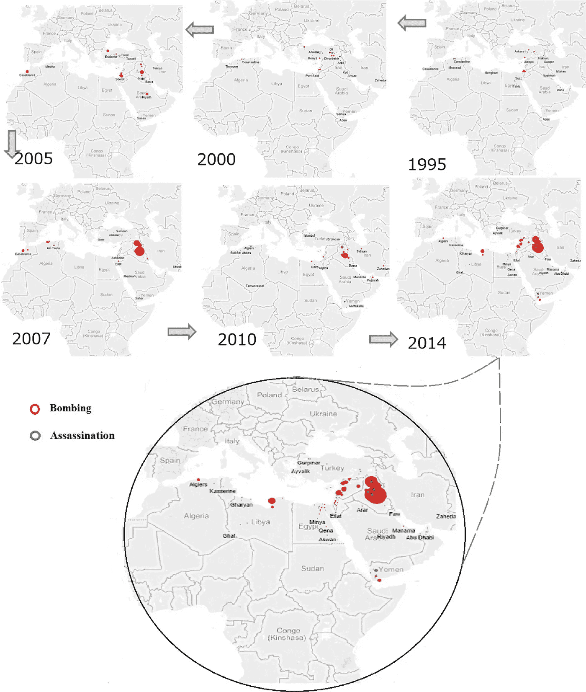
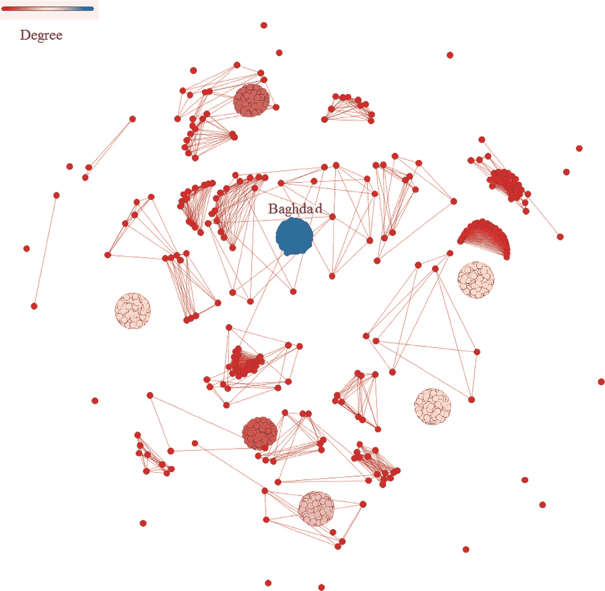
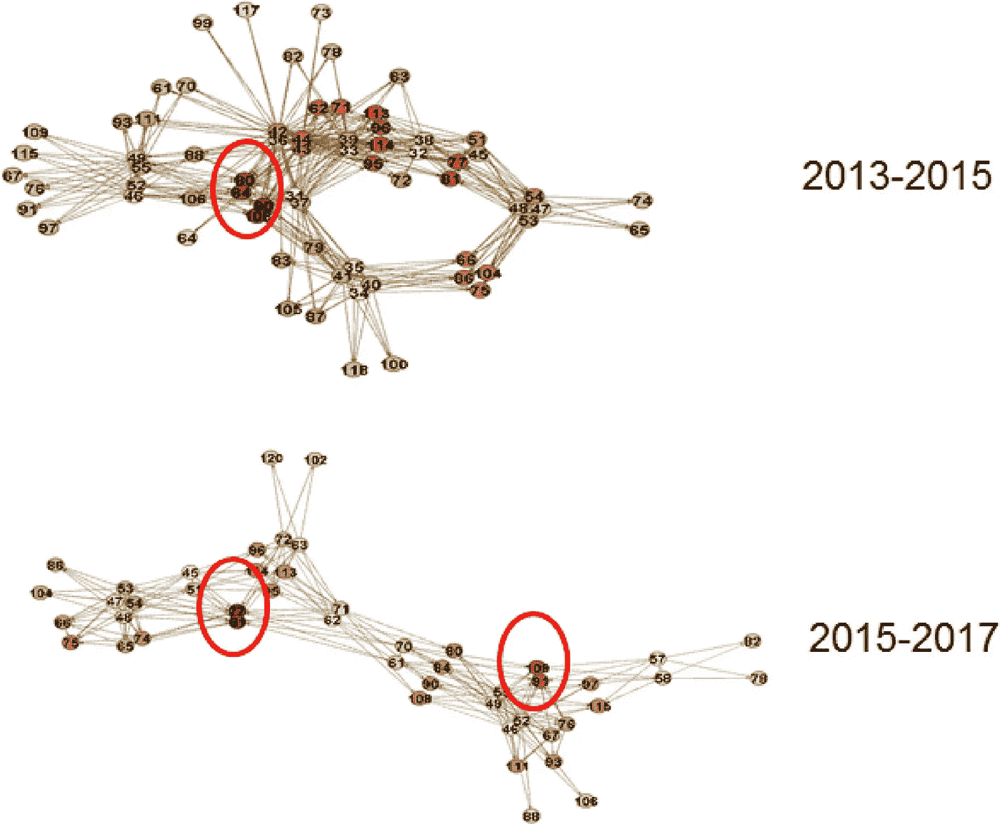

# 利用模式和关系理解恐怖行为的人工智能框架

> 原文：<https://towardsdatascience.com/ai-framework-by-using-patterns-and-relations-to-understand-terrorist-behaviors-5c8378b2cd88?source=collection_archive---------11----------------------->

Figure 1\. Data analysis for suicide attacks in the world. Note: Red circles are bombings, and green circles are assassinations. (For interpretation of the references to color in this figure legend, the reader is referred to the web version of this article.)

恐怖主义是一种复杂的现象，在用户策略上有很大的不确定性。恐怖主义的不确定性是设计反恐政策的主要挑战。政府机构(如中央情报局、联邦调查局、国家安全局等。)不能总是使用社交媒体和电信来捕捉恐怖分子的意图，因为恐怖分子在使用这些环境来计划和准备攻击时非常小心。为了解决这一问题，本研究旨在通过定义自杀式袭击的有用模式来提出一个新的框架，以分析恐怖活动模式和关系，理解行为及其未来行动，并最终防止潜在的恐怖袭击。在该框架中，形成新的网络模型，并且分析关系的结构以推断关于恐怖袭击的知识。

更具体地说，提出了一种进化模拟退火 Lasso 逻辑回归模型来选择相似性函数的关键特征。随后，提出了一种新的加权异构相似度函数来估计攻击之间的关系。此外，提出了基于图的爆发检测来定义暴力爆发的危险场所。实验结果表明，与 2014 年和 2015 年的实际恐怖事件相比，我们的框架具有较高的准确性(超过 90%的准确性)来发现模式。总之，通过使用这个智能框架，政府可以自动了解恐怖主义将如何影响未来的事件，政府可以控制恐怖分子的行为和策略，以减少未来事件的风险。

Figure 2\. Recent suicide bombing attacks in the world.

在这项研究中，通过使用收集的数据提取模式和关系(如图 4 和图 5 所示)。实验结果用收集的数据和提出的方法给出。我们的实验包括两部分。首先，选择关键特征及其权重作为相似度函数。此外，提出的相似性函数用于定义流行度和离群值，以了解恐怖组织在未来将如何攻击。其次，我们展示了发现模式(见下图 4 ),通过计算关系为未来的恐怖袭击做准备。在本节的讨论部分，展示了拟议的框架，以便政府可以用于情报分析。我们讨论这些结果如何被用来寻找预测未来恐怖袭击的模式。

Figure 3\. Outbreak detection to define dangerous areas in Iraq.

Figure 4\. Degree centrality for suicide attacks.

综上所述，如上面的图 3 和图 4 所示，我们定义了吸引人的恐怖战术分别从巴格达蔓延到整个伊拉克、中东和整个世界。当巴格达的袭击被阻止时，伊拉克的袭击也可以被阻止，我们可以在特定地点发生袭击之前了解恐怖组织的行为。之后，通过从过去的袭击中学习战术，最受欢迎的袭击被定义为理解恐怖组织将如何袭击。

Figure 5\. Finding patterns with networks analysis.

此外，通过使用总经验(入度)和个人经验(出度)，该框架了解巴格达附近的恐怖分子的行为。对于敏感性分析，我们比较了 2014 年和 2015 年的发现模式和实际攻击，如图 5 所示。最后，我们对大多数战术的准确率都超过了 90%。作为一个专家系统，当给定位置时，该框架给出了理解自杀式恐怖主义的策略，并提出了反恐怖主义的反应策略。

**结论和未来工作**

如今，防患于未然在反恐中极为重要。政府需要了解恐怖组织在恐怖袭击中的表现。此外，正如在伊拉克所证明的那样，恐怖分子使用炸弹的自杀式袭击非常成功，因为政府对恐怖主义缺乏必要的了解，也没有足够的准备。反恐官员需要指导政府制定更好的防御策略来打击恐怖分子的战术。

本文的主要结论是，伊拉克自杀式袭击的恐怖主义网络首先是为了防止未来的威胁而建立的。为了形成关系，所提出的 ESALLOR 模型去除了恐怖事件的不相关和冗余特征，并提出了一种新的加权异构相似度函数来形成自杀攻击之间的联系，其中包括最有害和最有效的攻击类型。为了发现伊拉克的危险区域，通过查看恐怖主义攻击的位置来模拟恐怖主义的爆发检测。根据到目前为止给出的结果和讨论，所提出的模型表明，由于使用了所提出的特征选择和相似性函数，这些结果在未来将是可行的。使用监督/非监督机器学习技术研究包括特征选择和相似性函数的新智能框架。提取模式和关系以改进反恐。我们证明了通过敏感性分析学习攻击的一般行为可以防止攻击。伊拉克恐怖主义数据的结果表明，我们可以通过寻找模式来理解自杀式袭击的行为。

总之，研究结果将使决策者能够制定精确的全球和/或地方反恐政策。政府可以通过使用这种智能框架来遏制恐怖主义威胁。政府可以理解恐怖主义将如何影响未来的事件，政府可以控制恐怖主义行为以降低未来事件的风险。此外，该信息对于执法机构提出反应策略是有用的。

更多阅读研究，请关注下面的文章。

[http://www . academia . edu/31595965/New _ Framework _ that _ Uses _ Patterns _ and _ Relations _ to _ Understand _ Terrorist _ Behaviors](http://www.academia.edu/31595965/New_Framework_that_Uses_Patterns_and_Relations_to_Understand_Terrorist_Behaviors)